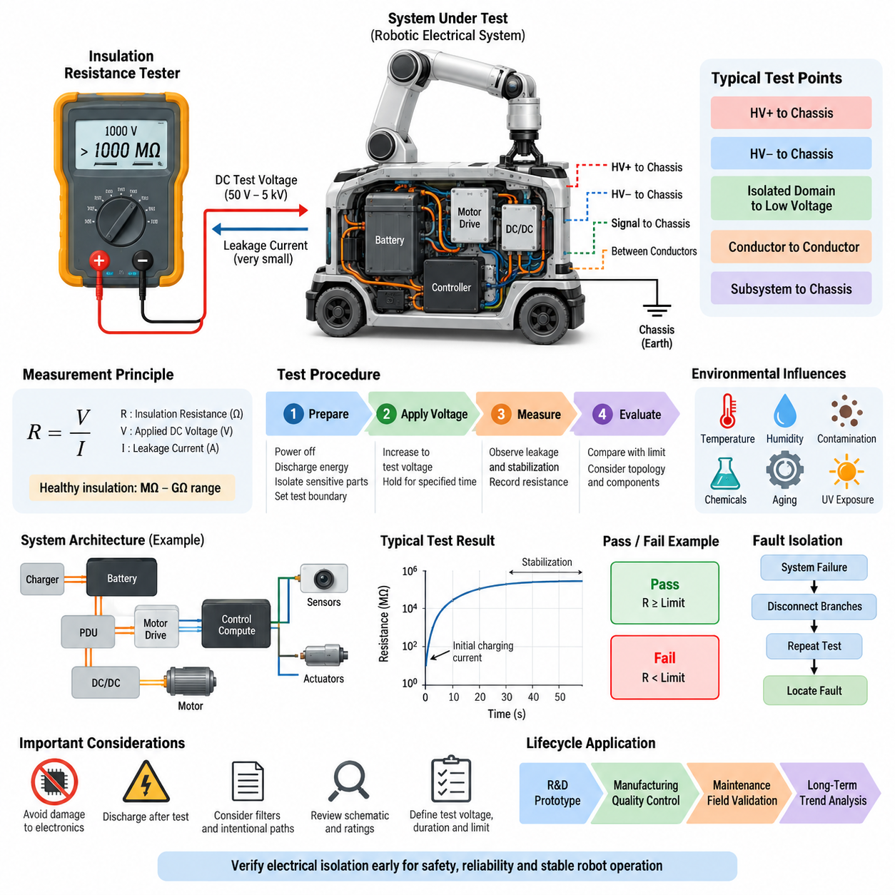
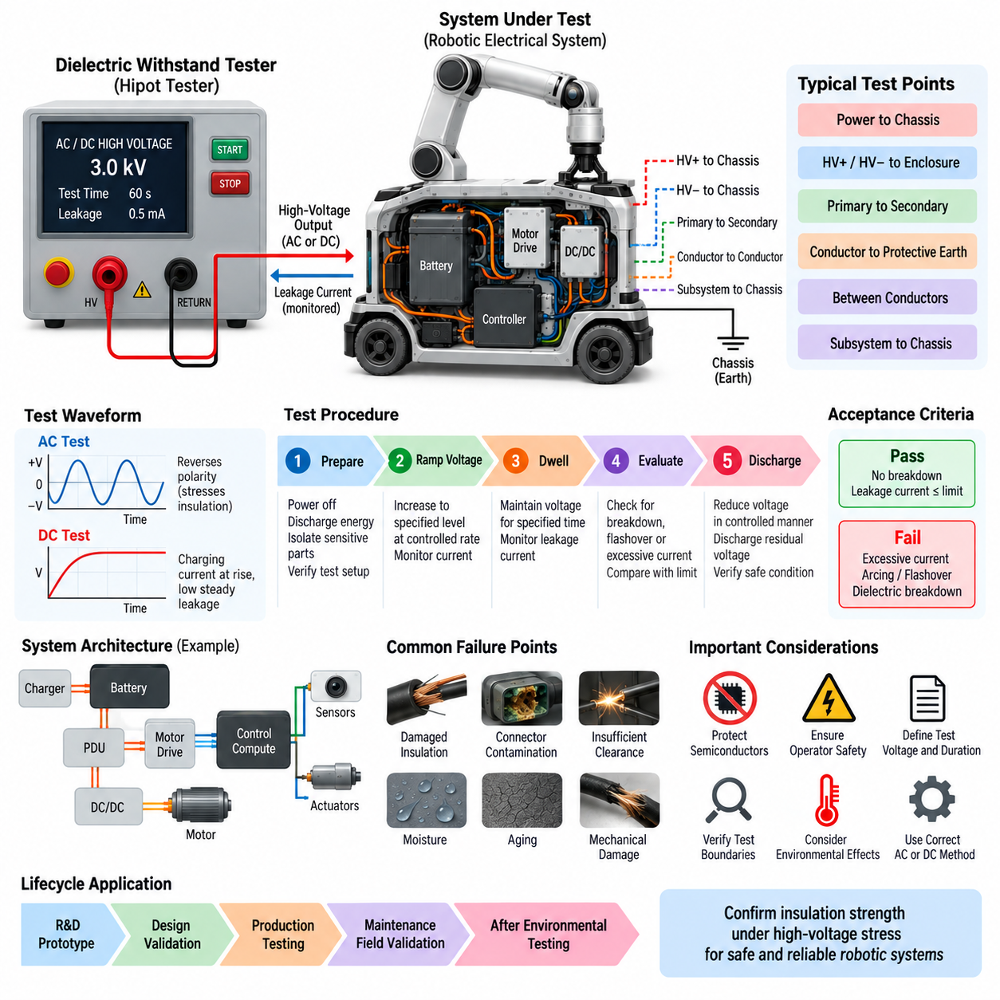
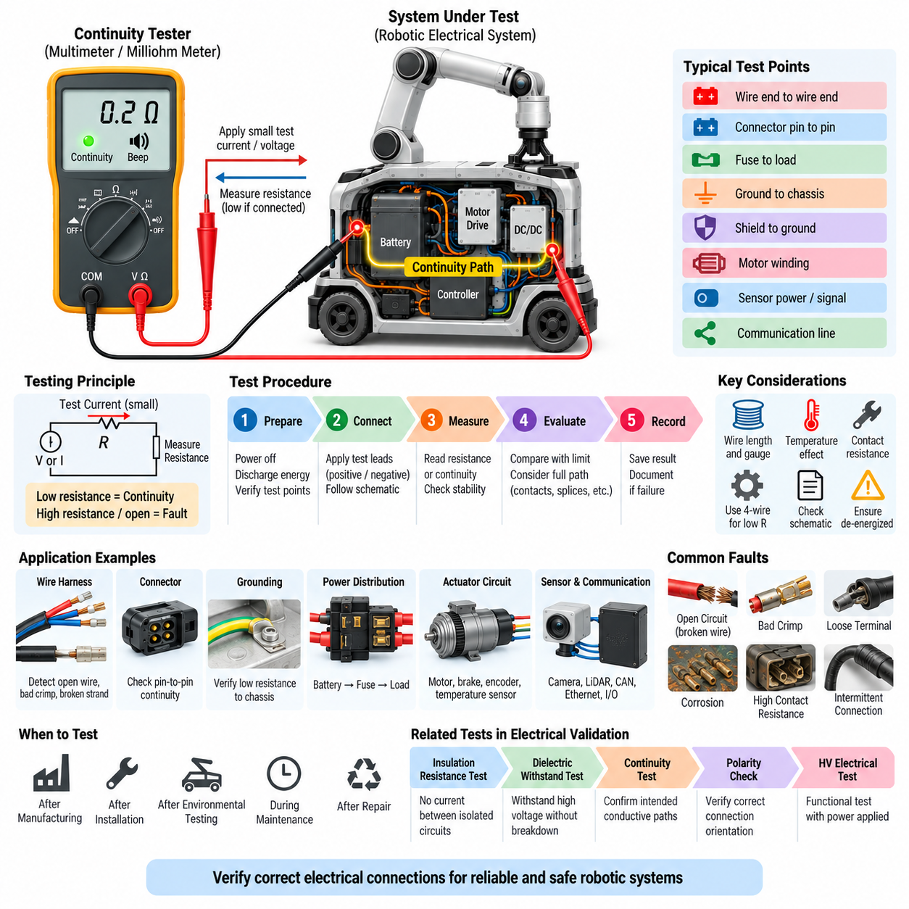
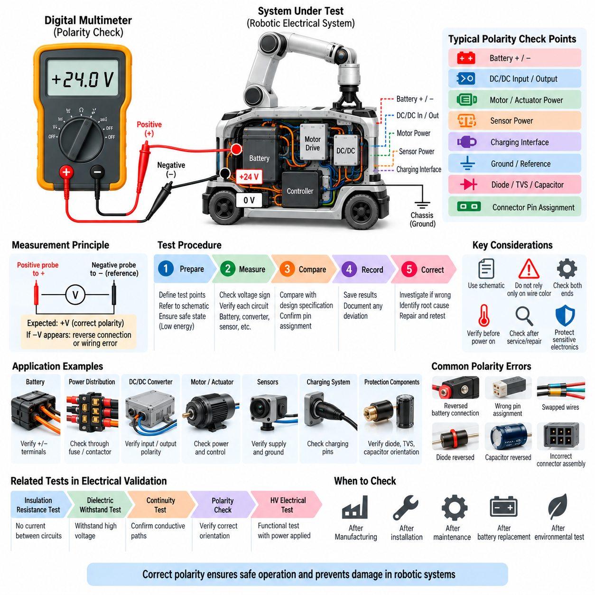
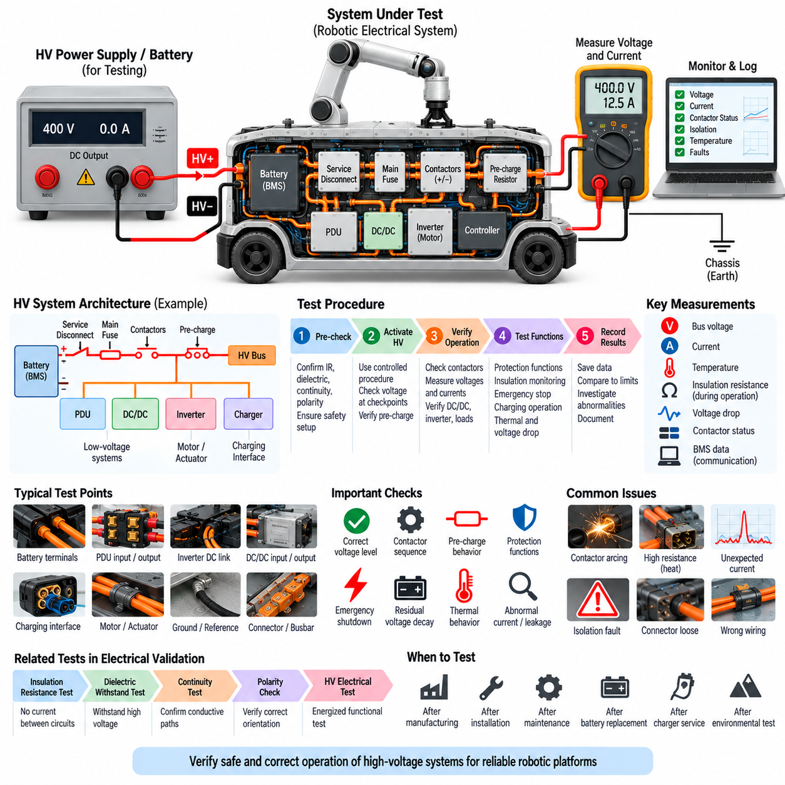

**Volume 19. Testing and Validation**


# Chapter 01. Electrical Test

##  

## 01.01. Insulation Resistance Test

{width="7.268055555555556in" height="7.268055555555556in"}

Insulation resistance testing is a fundamental electrical validation method used to determine whether conductors, power circuits, enclosures, and electrically isolated subsystems maintain adequate separation from one another. Within the electrical test structure of Volume 19, it forms the first verification activity before dielectric withstand, continuity, polarity, and high-voltage electrical testing.

The basic principle is to apply a controlled DC test voltage between two electrically isolated points and measure the extremely small leakage current that flows through or across the insulation. From the applied voltage and measured leakage current, the insulation resistance is determined according to Ohm's law. Healthy insulation normally produces resistance values in the megaohm or gigaohm range.

Unlike a normal continuity measurement, insulation resistance testing intentionally examines paths that should not conduct electricity. Typical measurement points include positive and negative power conductors to chassis, high-voltage circuits to protective earth, isolated power domains to low-voltage electronics, and individual conductors to adjacent conductors. The objective is to identify unintended electrical leakage before it becomes hazardous.

A typical insulation resistance tester, often called a megohmmeter, contains a regulated high-voltage DC source and a sensitive current-measurement circuit. Test voltages may range from tens of volts to several kilovolts depending on the equipment, insulation system, and applicable requirements. The selected voltage must stress the insulation sufficiently without exceeding the limits of connected electronic components.

Before testing, the equipment should be placed in a defined electrical state. Power sources are disconnected, stored energy is discharged, and sensitive electronic modules that cannot tolerate the test voltage are isolated when required. Contactors, switches, and connectors must be configured according to the intended test boundary so that the measurement represents the insulation path defined by the validation procedure.

The test voltage is normally increased in a controlled manner and maintained for a specified period while resistance or leakage current is observed. Initial readings can vary because cable capacitance and dielectric polarization produce transient charging currents. The measurement should therefore distinguish these temporary effects from steady leakage. Recording both resistance and stabilization behavior provides more information than a single instantaneous reading.

Insulation resistance is strongly influenced by temperature, humidity, contamination, and the physical condition of insulating materials. Moisture, conductive dust, coolant residue, damaged cable jackets, carbonized surfaces, and connector contamination can significantly reduce measured resistance. Test reports should therefore record environmental conditions so that measurements from different prototypes, production lots, or service periods can be compared meaningfully.

For robotic electrical systems, the test boundary should reflect the actual architecture rather than treating the robot as one undivided circuit. Battery systems, power distribution units, motor drives, DC/DC converters, charging interfaces, compute electronics, sensors, and actuator branches may require separate measurements. Segmenting the architecture helps locate insulation degradation and prevents one parallel leakage path from masking another defect.

High-voltage robotic platforms require particular attention because loss of insulation can create hazardous touch voltage or unintended current through the chassis. Measurements can be performed between the high-voltage positive bus and chassis, high-voltage negative bus and chassis, and other isolated domains defined by the system architecture. Both individual branch results and the assembled-system condition should be considered during validation.

Low-voltage systems also benefit from insulation resistance testing even when electric-shock risk is limited. Harness damage, pin contamination, trapped moisture, and manufacturing debris can create high-resistance leakage paths that later develop into intermittent faults. Such defects may disturb analog sensors, communication interfaces, safety inputs, or power-control circuits long before they become obvious short circuits.

Pass and fail criteria should be defined before the measurement begins. A test specification should identify the test voltage, application duration, measurement points, minimum acceptable resistance, environmental condition, equipment configuration, and required discharge procedure. Acceptance limits should be derived from the product requirements and applicable standards rather than using one universal resistance value for every robotic electrical subsystem.

The measured value should not be interpreted independently of the system topology. Filters, surge suppressors, electromagnetic compatibility components, monitoring circuits, and intentionally connected resistive paths can produce measurable leakage even when insulation is healthy. Engineers should review the schematic and component ratings before testing so that intentional circuit behavior is not incorrectly classified as insulation failure.

When an unexpectedly low resistance is detected, fault isolation should proceed by progressively separating branches and repeating the measurement. Harnesses, connectors, motor phases, power converters, batteries, charging circuits, and external interfaces can be disconnected in controlled stages. This divide-and-isolate approach converts a system-level failure into a smaller electrical region where contamination, damage, or assembly defects can be inspected directly.

Special care is necessary when testing equipment containing semiconductor devices. Applying an insulation-test voltage across an unintended electronic path can damage MOSFETs, gate drivers, communication transceivers, sensors, or protection components. The validation procedure must therefore define exactly which terminals may be connected together, which modules must be removed, and which chassis or reference points are used during each measurement.

After the test voltage is removed, capacitive energy can remain stored in cables, filters, motors, and power electronics. The circuit must be discharged through an appropriate path before connectors are touched or equipment is returned to normal operation. Verification of residual voltage is especially important for high-voltage battery systems and long harnesses, where stored charge can remain even after the tester indicates completion.

Insulation resistance testing can also be incorporated into manufacturing quality control. Automated fixtures can connect selected harness pins, power terminals, chassis points, and connector shells to a programmable insulation tester. Results can then be associated with product serial numbers and compared against manufacturing limits. Trending the measurements may reveal process degradation before individual units cross the formal rejection threshold.

For maintenance and field validation, historical measurements provide additional diagnostic value. A robot may still satisfy the minimum requirement while its insulation resistance gradually decreases over months of operation. Comparing measurements taken after production, environmental qualification, field deployment, repair, and scheduled maintenance can reveal aging caused by vibration, thermal cycling, moisture ingress, chemicals, or repeated connector servicing.

Insulation resistance testing is related to, but distinct from, dielectric withstanding testing. Insulation resistance testing primarily quantifies leakage behavior under a defined DC voltage, whereas dielectric withstand testing evaluates whether insulation can survive a higher electrical stress without breakdown. The Volume 19 structure appropriately treats these as separate electrical validation activities followed by continuity, polarity, and high-voltage system testing.

For autonomous mobile robots and Physical AI platforms, insulation integrity ultimately supports more than electrical reliability. Stable isolation protects compute systems, sensors, communication networks, motor controllers, and safety circuits from unintended electrical coupling. It also reduces the probability that mechanical damage or environmental exposure will propagate into system-level faults affecting perception, control, or safe motion.

A complete test record should preserve the equipment identification, test instrument, calibration status, test voltage, measurement duration, connection configuration, environmental conditions, measured resistance, acceptance criterion, and final disposition. Abnormal observations should be linked to corrective actions and retest results. This traceability allows insulation verification to become part of the engineering validation evidence rather than an isolated laboratory measurement.

When applied systematically from component and harness testing through subsystem integration and complete-robot validation, insulation resistance testing provides an early indicator of electrical integrity. Its greatest value comes from combining controlled measurement, architecture-aware test boundaries, environmental context, and historical trending, creating a repeatable foundation for subsequent electrical, functional, environmental, reliability, and field validation activities.

절연 저항 시험(Insulation Resistance Test)은 도체(Conductor), 전력 회로(Power Circuit), 외함(Enclosure), 전기적으로 절연된 서브시스템(Electrically Isolated Subsystem)이 서로 충분한 전기적 분리 상태를 유지하는지를 확인하는 기본적인 전기 검증(Electrical Validation) 방법이다. Volume 19의 전기 시험(Electrical Test) 체계에서는 내전압 시험(Dielectric Withstand Test), 도통 시험(Continuity Test), 극성 확인(Polarity Check), 고전압 전기 시험(HV Electrical Test)에 앞서 수행되는 첫 번째 검증 활동으로 구성된다.

기본 원리는 전기적으로 절연되어야 하는 두 지점 사이에 제어된 직류 시험 전압(DC Test Voltage)을 인가하고, 절연체를 통하거나 표면을 따라 흐르는 매우 작은 누설 전류(Leakage Current)를 측정하는 것이다. 인가 전압(Applied Voltage)과 측정된 누설 전류를 이용하면 옴의 법칙(Ohm's Law)에 따라 절연 저항을 계산할 수 있다. 정상적인 절연체는 일반적으로 메가옴(MΩ) 또는 기가옴(GΩ) 범위의 높은 저항값을 나타낸다.

일반적인 도통 측정(Continuity Measurement)과 달리 절연 저항 시험은 의도적으로 전류가 흐르지 않아야 하는 경로를 검사한다. 대표적인 측정 지점은 양극 및 음극 전원 도체와 섀시(Chassis) 사이, 고전압 회로(High-Voltage Circuit)와 보호 접지(Protective Earth) 사이, 절연된 전원 영역과 저전압 전자장치 사이, 개별 도체와 인접 도체 사이 등이다. 목적은 의도하지 않은 전기적 누설이 위험한 상태로 발전하기 전에 이를 식별하는 것이다.

일반적으로 메거(Megohmmeter)라고도 하는 절연 저항 시험기(Insulation Resistance Tester)는 안정화된 고전압 직류 전원(Regulated High-Voltage DC Source)과 민감한 전류 측정 회로(Current-Measurement Circuit)로 구성된다. 시험 전압은 장비, 절연 시스템 및 적용 요구사항에 따라 수십 볼트에서 수 킬로볼트까지 설정될 수 있다. 선택된 전압은 절연체에 충분한 전기적 스트레스(Electrical Stress)를 가하면서도 연결된 전자부품의 허용 한계를 초과하지 않아야 한다.

시험을 수행하기 전에 장비는 정의된 전기적 상태(Defined Electrical State)로 설정되어야 한다. 전원을 분리하고 저장된 에너지를 방전하며, 시험 전압을 견딜 수 없는 민감한 전자 모듈(Sensitive Electronic Module)은 필요한 경우 분리한다. 접촉기(Contactor), 스위치(Switch), 커넥터(Connector)는 검증 절차에서 정의된 절연 경로를 정확하게 측정할 수 있도록 의도된 시험 경계(Test Boundary)에 따라 구성되어야 한다.

시험 전압은 일반적으로 제어된 방식으로 상승시킨 후 지정된 시간 동안 유지하면서 저항 또는 누설 전류의 변화를 관찰한다. 초기 측정값은 케이블 정전용량(Cable Capacitance)과 유전체 분극(Dielectric Polarization)에 의해 발생하는 과도 충전 전류(Transient Charging Current) 때문에 변할 수 있다. 따라서 이러한 일시적인 현상과 정상 상태 누설(Steady Leakage)을 구분해야 한다. 저항값뿐 아니라 안정화 특성(Stabilization Behavior)을 함께 기록하면 단일 순간 측정값보다 많은 정보를 얻을 수 있다.

절연 저항은 온도(Temperature), 습도(Humidity), 오염(Contamination), 절연 재료의 물리적 상태에 큰 영향을 받는다. 수분(Moisture), 전도성 먼지(Conductive Dust), 냉각수 잔류물(Coolant Residue), 손상된 케이블 피복(Cable Jacket), 탄화된 표면(Carbonized Surface), 커넥터 오염은 측정 저항을 크게 감소시킬 수 있다. 따라서 서로 다른 시제품, 생산 로트(Production Lot), 운용 기간의 측정 결과를 의미 있게 비교하려면 시험 보고서에 환경 조건(Environmental Condition)을 함께 기록해야 한다.

로봇 전기 시스템(Robotic Electrical System)의 경우 전체 로봇을 하나의 회로로 간주하기보다 실제 전기 아키텍처(Electrical Architecture)를 반영하여 시험 경계를 설정해야 한다. 배터리 시스템(Battery System), 전력 분배 장치(PDU), 모터 드라이브(Motor Drive), DC/DC 컨버터(DC/DC Converter), 충전 인터페이스(Charging Interface), 컴퓨팅 전자장치(Compute Electronics), 센서 및 액추에이터 분기 회로(Actuator Branch)는 각각 별도의 측정이 필요할 수 있다. 아키텍처를 구간별로 분리하면 절연 열화 위치를 찾기 쉬우며 병렬 누설 경로가 다른 결함을 가리는 것도 방지할 수 있다.

고전압 로봇 플랫폼(High-Voltage Robotic Platform)은 절연 손실이 위험한 접촉 전압(Touch Voltage)이나 섀시를 통한 의도하지 않은 전류를 발생시킬 수 있기 때문에 특별한 주의가 필요하다. 고전압 양극 버스(HV Positive Bus)와 섀시, 고전압 음극 버스(HV Negative Bus)와 섀시 및 시스템 아키텍처에서 정의된 기타 절연 영역 사이를 측정할 수 있다. 검증 과정에서는 개별 분기 회로의 결과와 완전히 조립된 시스템 상태를 모두 고려해야 한다.

저전압 시스템(Low-Voltage System)에서도 감전 위험이 제한적이더라도 절연 저항 시험은 유용하다. 하네스 손상(Harness Damage), 핀 오염(Pin Contamination), 침투한 수분(Trapped Moisture), 제조 과정의 이물질(Manufacturing Debris)은 높은 저항을 갖는 누설 경로를 형성하고 이후 간헐적 고장(Intermittent Fault)으로 발전할 수 있다. 이러한 결함은 명확한 단락(Short Circuit)이 발생하기 훨씬 전부터 아날로그 센서, 통신 인터페이스, 안전 입력(Safety Input), 전력 제어 회로의 동작을 방해할 수 있다.

합격 및 불합격 기준(Pass/Fail Criteria)은 측정을 시작하기 전에 정의되어야 한다. 시험 규격(Test Specification)에는 시험 전압(Test Voltage), 인가 시간(Application Duration), 측정 지점(Measurement Point), 최소 허용 저항(Minimum Acceptable Resistance), 환경 조건, 장비 구성(Equipment Configuration), 필요한 방전 절차(Discharge Procedure)가 명확하게 정의되어야 한다. 허용 기준(Acceptance Limit)은 모든 로봇 전기 서브시스템에 하나의 보편적인 저항값을 적용하기보다 제품 요구사항(Product Requirement)과 관련 표준(Applicable Standard)을 기반으로 설정해야 한다.

측정값은 시스템 토폴로지(System Topology)와 분리하여 해석해서는 안 된다. 필터(Filter), 서지 억제기(Surge Suppressor), 전자기 적합성 부품(EMC Component), 모니터링 회로(Monitoring Circuit), 의도적으로 연결된 저항 경로는 절연 상태가 정상이어도 측정 가능한 누설 전류를 발생시킬 수 있다. 따라서 엔지니어는 시험 전에 회로도(Schematic)와 부품 정격(Component Rating)을 검토하여 정상적인 회로 동작이 절연 고장으로 잘못 판정되지 않도록 해야 한다.

예상보다 낮은 절연 저항이 검출되면 각 분기 회로를 단계적으로 분리하면서 측정을 반복하는 방식으로 고장 분리(Fault Isolation)를 수행해야 한다. 하네스, 커넥터, 모터 상(Motor Phase), 전력 변환기(Power Converter), 배터리, 충전 회로 및 외부 인터페이스를 통제된 순서로 분리할 수 있다. 이러한 분할 및 분리 접근법(Divide-and-Isolate Approach)을 사용하면 시스템 수준의 고장을 더 작은 전기적 영역으로 축소하여 오염, 손상 또는 조립 결함을 직접 검사할 수 있다.

반도체 소자(Semiconductor Device)를 포함하는 장비를 시험할 때는 특별한 주의가 필요하다. 의도하지 않은 전자 회로 경로에 절연 시험 전압을 인가하면 MOSFET, 게이트 드라이버(Gate Driver), 통신 트랜시버(Communication Transceiver), 센서 또는 보호 부품(Protection Component)이 손상될 수 있다. 따라서 검증 절차에는 어떤 단자를 함께 연결할 수 있는지, 어떤 모듈을 분리해야 하는지, 각 측정에서 어떤 섀시 또는 기준점(Reference Point)을 사용해야 하는지를 정확하게 정의해야 한다.

시험 전압을 제거한 후에도 케이블, 필터, 모터 및 전력 전자장치(Power Electronics)에 정전용량성 에너지(Capacitive Energy)가 남아 있을 수 있다. 따라서 커넥터를 만지거나 장비를 정상 동작 상태로 복귀시키기 전에 적절한 경로를 통해 회로를 방전해야 한다. 특히 고전압 배터리 시스템과 긴 하네스에서는 시험기가 완료 상태를 표시한 이후에도 저장 전하(Stored Charge)가 남아 있을 수 있으므로 잔류 전압(Residual Voltage)을 확인하는 것이 중요하다.

절연 저항 시험은 제조 품질 관리(Manufacturing Quality Control)에도 통합할 수 있다. 자동화 시험 지그(Automated Test Fixture)를 이용하여 선택된 하네스 핀, 전원 단자, 섀시 지점 및 커넥터 셸(Connector Shell)을 프로그래밍 가능한 절연 시험기(Programmable Insulation Tester)에 연결할 수 있다. 측정 결과는 제품 일련번호(Serial Number)와 연계하여 관리하고 제조 허용 기준과 비교할 수 있다. 측정값의 추세(Trend)를 분석하면 개별 제품이 공식적인 불합격 기준에 도달하기 전에 제조 공정의 열화를 발견할 수도 있다.

유지보수(Maintenance)와 현장 검증(Field Validation)에서는 과거 측정 데이터가 추가적인 진단 가치를 제공한다. 로봇이 여전히 최소 요구조건을 만족하더라도 절연 저항이 수개월에 걸쳐 점진적으로 감소할 수 있다. 생산 직후, 환경 적합성 시험(Environmental Qualification), 현장 배치(Field Deployment), 수리 및 정기 유지보수 이후의 측정값을 비교하면 진동, 열 사이클링(Thermal Cycling), 수분 침투(Moisture Ingress), 화학물질 또는 반복적인 커넥터 정비로 발생하는 노화를 식별할 수 있다.

절연 저항 시험(Insulation Resistance Test)은 내전압 시험(Dielectric Withstand Test)과 관련되어 있지만 서로 다른 시험이다. 절연 저항 시험은 주로 정의된 직류 전압에서 누설 특성을 정량적으로 측정하는 반면, 내전압 시험은 절연체가 더 높은 전기적 스트레스를 절연 파괴(Breakdown) 없이 견딜 수 있는지를 평가한다. Volume 19의 구조에서는 두 시험을 별도의 전기 검증 활동으로 구분하고 이후 도통, 극성 및 고전압 시스템 시험으로 이어지도록 구성되어 있다.

자율이동로봇(Autonomous Mobile Robot, AMR)과 피지컬 AI 플랫폼(Physical AI Platform)에서 절연 건전성(Insulation Integrity)은 단순한 전기적 신뢰성 이상의 의미를 갖는다. 안정적인 전기적 절연은 컴퓨팅 시스템, 센서, 통신 네트워크, 모터 컨트롤러(Motor Controller), 안전 회로(Safety Circuit)를 의도하지 않은 전기적 결합(Electrical Coupling)으로부터 보호한다. 또한 기계적 손상이나 환경 노출로 발생한 문제가 인지(Perception), 제어(Control), 안전 주행(Safe Motion)에 영향을 주는 시스템 수준의 고장으로 확산될 가능성을 줄인다.

완전한 시험 기록(Test Record)에는 시험 대상 장비의 식별 정보, 시험 장비(Test Instrument), 교정 상태(Calibration Status), 시험 전압, 측정 시간, 연결 구성(Connection Configuration), 환경 조건, 측정된 절연 저항, 허용 기준 및 최종 판정(Final Disposition)이 포함되어야 한다. 비정상적인 관찰 결과는 시정 조치(Corrective Action) 및 재시험 결과와 연계해야 한다. 이러한 추적성(Traceability)을 확보하면 절연 검증을 단순한 실험실 측정이 아니라 전체 엔지니어링 검증 증거(Engineering Validation Evidence)의 일부로 관리할 수 있다.

부품(Component)과 하네스 시험(Harness Test)에서 시작하여 서브시스템 통합(Subsystem Integration)과 완성 로봇 검증(Complete-Robot Validation)에 이르기까지 절연 저항 시험을 체계적으로 적용하면 전기적 건전성(Electrical Integrity)을 조기에 판단할 수 있다. 이 시험의 가장 큰 가치는 제어된 측정, 아키텍처를 고려한 시험 경계, 환경 조건, 장기간의 측정 추세를 결합하는 데 있으며, 이후 수행되는 전기, 기능, 환경, 신뢰성 및 현장 검증을 위한 반복 가능하고 추적 가능한 기반을 제공한다.

##  

## 01.02. Dielectric Withstanding Test

{width="7.268055555555556in" height="7.268055555555556in"}

Dielectric withstanding testing is an electrical safety and insulation validation method used to verify that an electrical system can tolerate a specified high-voltage stress without insulation breakdown, flashover, or excessive leakage current. Within the electrical test structure of Volume 19, it follows insulation resistance testing and precedes continuity, polarity, and high-voltage electrical testing.

The fundamental objective is not simply to measure the normal resistance of insulation, but to demonstrate that the insulation barrier possesses sufficient dielectric strength under an intentionally elevated electrical potential. A controlled test voltage is applied between normally isolated conductive regions while the test equipment monitors current flow and detects conditions indicating electrical breakdown.

Typical test boundaries include power conductors to chassis, high-voltage positive and negative circuits to conductive enclosures, isolated primary and secondary circuits, conductor groups to protective earth, and electrically separated subsystems. The selected boundaries should correspond to the actual insulation architecture so that each safety-critical barrier is subjected to the intended electrical stress.

A dielectric withstand tester, frequently referred to as a hipot tester, generates a controlled AC or DC high voltage and monitors the resulting current. Depending on the equipment and validation requirement, the test voltage can be substantially higher than the normal operating voltage. The instrument must provide controlled voltage ramping, current limiting, trip detection, timing, and safe discharge functions.

The required test voltage should be established from the rated operating voltage, insulation category, system architecture, component ratings, and applicable product requirements. Arbitrarily selecting an excessively high voltage can damage otherwise acceptable insulation, while an insufficient voltage may fail to expose weaknesses. The voltage, waveform, duration, and allowable leakage current must therefore be defined before testing.

Before voltage application, the system under test must be placed in a known and electrically safe configuration. Normal power sources should be disconnected, stored energy discharged, and test boundaries verified against electrical schematics. Sensitive electronics, surge-protection components, filters, communication interfaces, or semiconductor devices may require isolation when their ratings are incompatible with the specified test voltage.

The test commonly begins with the output at a low or zero voltage and then increases it toward the specified withstand level at a controlled rate. This voltage ramp reduces abrupt electrical stress and provides an opportunity to identify abnormal current behavior before full voltage is reached. After reaching the target voltage, the tester maintains it for the specified dwell time while continuously monitoring current.

During the dwell period, successful insulation prevents destructive conduction between the test points. A small current may still exist because of insulation leakage, cable capacitance, filters, suppression devices, and other intentional circuit elements. The acceptance criterion must distinguish these expected currents from abnormal leakage, arcing, flashover, or dielectric breakdown that represents failure of the insulation system.

AC and DC dielectric withstand tests produce different electrical stresses and measurement behavior. AC testing repeatedly reverses the electric field and continuously charges the capacitance of the system, whereas DC testing primarily produces charging current during voltage rise followed by lower steady leakage. The selected method should therefore match the validation requirement rather than treating AC and DC testing as interchangeable.

Robotic platforms require architecture-aware test planning because batteries, power distribution units, motor drives, DC/DC converters, chargers, compute systems, sensors, and communication electronics can contain different insulation technologies. Testing the complete robot without understanding these internal paths can produce misleading results or expose components to voltages for which they were never designed.

For high-voltage robotic systems, dielectric withstand testing is particularly important for verifying separation between energized circuits and accessible conductive structures. High-voltage battery buses, traction or actuator inverters, charging circuits, power distribution assemblies, and high-voltage harnesses should maintain the required isolation from chassis and low-voltage domains even when subjected to the specified validation stress.

Harnesses and connectors are also important test targets because insulation failures frequently originate at physical interfaces. Damaged wire jackets, insufficient creepage or clearance, displaced seals, conductive contamination, improperly terminated shielding, pin deformation, and assembly damage can reduce dielectric strength. Testing at component, harness, subsystem, and assembled-system levels improves localization of such defects.

Environmental conditions can significantly influence dielectric performance. Moisture and condensation can create surface leakage paths, while contamination can reduce effective creepage distance. Temperature, chemical exposure, vibration damage, aging, and mechanical abrasion can also weaken insulation. Dielectric withstand testing performed after environmental or durability exposure can therefore reveal degradation that was absent in the initial production condition.

A test failure may appear as excessive current, an instrument trip, visible or audible arcing, flashover across an insulating surface, or permanent dielectric breakdown through the insulation material. These failure modes should not be treated identically. Determining whether the event occurred through solid insulation, across a contaminated surface, inside a connector, or through an intentional electronic path is essential for corrective action.

When a complete system fails, fault isolation can be performed by dividing the electrical architecture into progressively smaller test regions. Disconnecting harness branches, power converters, motor drives, charging interfaces, batteries, and external equipment allows the test to be repeated on individual sections. This systematic isolation process helps distinguish a genuine insulation defect from a component or circuit configuration that was inappropriate for the test.

Semiconductor-based equipment requires particular caution during dielectric testing. MOSFETs, IGBTs, gate drivers, isolation amplifiers, communication transceivers, capacitors, transient suppressors, and electromagnetic compatibility components may create paths that alter the test result or suffer damage. Test procedures must specify which terminals are shorted together, disconnected, grounded, or excluded before high voltage is applied.

Operator safety is a fundamental part of dielectric withstand testing because the tester intentionally generates hazardous voltage. Test fixtures should prevent accidental access to energized conductors, and appropriate interlocks, warning indicators, emergency interruption, and discharge mechanisms should be used. The equipment must remain inaccessible until the high-voltage source is removed and residual voltage has been verified as safe.

After completion of the dwell period, the applied voltage should be reduced in a controlled manner and the system discharged. Capacitive elements, long harnesses, filters, motors, and power electronics can retain significant electrical charge after the source is removed. Residual voltage verification is therefore necessary before test leads are disconnected or the equipment is returned to normal operation.

Dielectric withstand testing and insulation resistance testing provide complementary information. Insulation resistance testing evaluates leakage behavior and resistance under a defined DC voltage, whereas dielectric withstand testing demonstrates survival under a higher electrical stress without breakdown. Passing one test does not automatically guarantee passing the other, so both are valuable elements of a comprehensive electrical validation strategy.

For production testing, automated hipot equipment can apply predefined voltage profiles, monitor leakage current, detect trips, and store results against individual product serial numbers. Consistent fixtures and controlled connection sequences improve repeatability. Statistical monitoring of leakage or trip behavior can also reveal manufacturing trends involving insulation materials, connector assembly, harness routing, or contamination control.

A complete dielectric withstand test record should identify the test object, electrical configuration, test boundaries, equipment and calibration status, AC or DC method, target voltage, ramp rate, dwell time, measured current, trip threshold, environmental condition, result, and post-test inspection. Any failure should be linked to fault analysis, corrective action, and documented retesting.

Applied systematically, dielectric withstand testing provides evidence that the electrical isolation architecture retains adequate strength beyond normal operating conditions. In autonomous mobile robots and Physical AI systems, this supports protection of users, service personnel, sensors, compute electronics, communication networks, and motion-control hardware while establishing a reliable foundation for subsequent electrical, functional, environmental, and field validation activities.

내전압 시험(Dielectric Withstanding Test)은 전기 시스템(Electrical System)이 지정된 고전압 스트레스(High-Voltage Stress)를 절연 파괴(Insulation Breakdown), 섬락(Flashover), 과도한 누설 전류(Excessive Leakage Current) 없이 견딜 수 있는지를 검증하는 전기 안전(Electrical Safety) 및 절연 검증(Insulation Validation) 방법이다. Volume 19의 전기 시험(Electrical Test) 구조에서는 절연 저항 시험(Insulation Resistance Test) 다음에 수행되며, 도통 시험(Continuity Test), 극성 확인(Polarity Check), 고전압 전기 시험(HV Electrical Test)에 앞서 배치된다.

이 시험의 기본 목적은 단순히 절연체의 정상적인 저항을 측정하는 것이 아니라, 의도적으로 상승시킨 전위(Electrical Potential)에서 절연 장벽(Insulation Barrier)이 충분한 유전 강도(Dielectric Strength)를 갖는지를 입증하는 것이다. 정상적으로 서로 절연되어야 하는 도전 영역(Conductive Region) 사이에 제어된 시험 전압(Test Voltage)을 인가하면서 시험 장비가 전류 흐름을 감시하고 전기적 절연 파괴를 나타내는 상태를 검출한다.

대표적인 시험 경계(Test Boundary)에는 전원 도체(Power Conductor)와 섀시(Chassis) 사이, 고전압 양극 및 음극 회로와 도전성 외함(Conductive Enclosure) 사이, 절연된 1차 회로(Primary Circuit)와 2차 회로(Secondary Circuit) 사이, 도체 그룹과 보호 접지(Protective Earth) 사이 및 전기적으로 분리된 서브시스템(Subsystem) 사이가 포함된다. 선택된 시험 경계는 실제 절연 아키텍처(Insulation Architecture)와 일치해야 하며, 각각의 안전 핵심 절연 장벽(Safety-Critical Insulation Barrier)에 의도된 전기적 스트레스가 가해지도록 해야 한다.

일반적으로 하이팟 시험기(Hipot Tester)라고 하는 내전압 시험기(Dielectric Withstand Tester)는 제어된 교류 또는 직류 고전압(AC or DC High Voltage)을 발생시키고 그에 따른 전류를 감시한다. 장비 및 검증 요구사항에 따라 시험 전압은 정상 동작 전압보다 상당히 높을 수 있다. 시험기는 제어된 전압 상승(Voltage Ramping), 전류 제한(Current Limiting), 트립 검출(Trip Detection), 시간 제어(Timing), 안전 방전(Safe Discharge) 기능을 제공해야 한다.

필요한 시험 전압은 정격 동작 전압(Rated Operating Voltage), 절연 범주(Insulation Category), 시스템 아키텍처(System Architecture), 부품 정격(Component Rating), 적용되는 제품 요구사항(Product Requirement)을 기반으로 설정해야 한다. 지나치게 높은 전압을 임의로 선택하면 정상적인 절연체도 손상시킬 수 있으며, 반대로 너무 낮은 전압은 잠재적인 취약점을 발견하지 못할 수 있다. 따라서 시험 전에 전압, 파형(Waveform), 시험 시간(Duration), 허용 누설 전류(Allowable Leakage Current)를 정의해야 한다.

전압을 인가하기 전에 시험 대상 시스템(System Under Test)은 알려진 전기적으로 안전한 상태로 설정되어야 한다. 정상 전원은 분리하고 저장된 에너지는 방전하며, 전기 회로도(Electrical Schematic)를 기준으로 시험 경계를 확인해야 한다. 민감한 전자장치(Sensitive Electronics), 서지 보호 부품(Surge-Protection Component), 필터(Filter), 통신 인터페이스(Communication Interface), 반도체 소자(Semiconductor Device)의 정격이 지정된 시험 전압과 호환되지 않는 경우에는 이들을 분리해야 할 수 있다.

시험은 일반적으로 출력 전압이 낮거나 0인 상태에서 시작하여 제어된 속도로 지정된 내전압 수준(Withstand Level)까지 상승시키는 방식으로 진행한다. 이러한 전압 램프(Voltage Ramp)는 갑작스러운 전기적 스트레스를 줄이고 최대 시험 전압에 도달하기 전에 비정상적인 전류 특성을 확인할 기회를 제공한다. 목표 전압에 도달하면 시험기는 지정된 유지 시간(Dwell Time) 동안 전압을 유지하면서 전류를 지속적으로 감시한다.

유지 시간 동안 정상적인 절연체는 시험 지점 사이에서 파괴적인 전도(Destructive Conduction)가 발생하지 않도록 해야 한다. 그러나 절연 누설(Insulation Leakage), 케이블 정전용량(Cable Capacitance), 필터, 억제 장치(Suppression Device), 기타 의도된 회로 요소로 인해 작은 전류가 존재할 수 있다. 합격 기준(Acceptance Criterion)은 이러한 정상적인 전류와 절연 시스템의 고장을 의미하는 비정상 누설, 아킹(Arcing), 섬락 또는 유전체 파괴(Dielectric Breakdown)를 구분할 수 있어야 한다.

교류 내전압 시험(AC Dielectric Withstand Test)과 직류 내전압 시험(DC Dielectric Withstand Test)은 서로 다른 전기적 스트레스와 측정 특성을 나타낸다. 교류 시험은 전기장(Electric Field)의 방향이 반복적으로 반전되고 시스템의 정전용량을 지속적으로 충전하는 반면, 직류 시험에서는 주로 전압 상승 과정에서 충전 전류(Charging Current)가 발생하고 이후에는 상대적으로 낮은 정상 상태 누설 전류가 흐른다. 따라서 교류와 직류 시험을 동일한 시험으로 간주하지 말고 검증 요구사항에 맞는 방법을 선택해야 한다.

로봇 플랫폼(Robotic Platform)은 배터리, 전력 분배 장치(Power Distribution Unit, PDU), 모터 드라이브(Motor Drive), DC/DC 컨버터(DC/DC Converter), 충전기(Charger), 컴퓨팅 시스템(Compute System), 센서 및 통신 전자장치가 서로 다른 절연 기술(Insulation Technology)을 사용할 수 있기 때문에 아키텍처를 고려한 시험 계획이 필요하다. 내부 전기 경로를 이해하지 않고 완성된 로봇 전체를 시험하면 잘못된 결과를 얻거나 해당 시험 전압을 견디도록 설계되지 않은 부품에 과도한 전압을 인가할 수 있다.

고전압 로봇 시스템(High-Voltage Robotic System)에서는 충전부(Energized Circuit)와 사람이 접촉할 수 있는 도전성 구조물(Accessible Conductive Structure) 사이의 분리를 검증하기 위해 내전압 시험이 특히 중요하다. 고전압 배터리 버스(HV Battery Bus), 구동 또는 액추에이터 인버터(Actuator Inverter), 충전 회로(Charging Circuit), 전력 분배 어셈블리(Power Distribution Assembly), 고전압 하네스(HV Harness)는 지정된 검증 스트레스를 받는 상황에서도 섀시와 저전압 영역(Low-Voltage Domain)으로부터 요구되는 절연 상태를 유지해야 한다.

하네스(Harness)와 커넥터(Connector) 역시 절연 고장이 물리적 인터페이스에서 자주 발생하기 때문에 중요한 시험 대상이다. 손상된 전선 피복(Wire Jacket), 부족한 연면거리(Creepage Distance) 또는 공간거리(Clearance), 이탈된 실(Displaced Seal), 도전성 오염(Conductive Contamination), 부적절하게 종단된 차폐(Shielding), 핀 변형(Pin Deformation), 조립 손상(Assembly Damage)은 유전 강도를 감소시킬 수 있다. 부품, 하네스, 서브시스템, 완성 시스템 단계에서 시험하면 이러한 결함의 위치를 더욱 효과적으로 식별할 수 있다.

환경 조건(Environmental Condition)은 유전체 성능(Dielectric Performance)에 큰 영향을 미칠 수 있다. 수분과 결로(Condensation)는 표면 누설 경로(Surface Leakage Path)를 형성할 수 있으며, 오염은 유효 연면거리를 감소시킬 수 있다. 온도, 화학물질 노출(Chemical Exposure), 진동 손상(Vibration Damage), 노화(Aging), 기계적 마모(Mechanical Abrasion) 역시 절연을 약화시킬 수 있다. 따라서 환경 시험 또는 내구 시험(Durability Exposure) 이후 수행하는 내전압 시험은 초기 생산 상태에서는 존재하지 않았던 절연 열화를 발견할 수 있다.

시험 실패(Test Failure)는 과도한 전류, 시험 장비의 트립(Instrument Trip), 눈에 보이거나 들리는 아킹, 절연 표면을 가로지르는 섬락 또는 절연 재료 내부의 영구적인 유전체 파괴 형태로 나타날 수 있다. 이러한 고장 모드를 동일하게 취급해서는 안 된다. 고장이 고체 절연체(Solid Insulation) 내부에서 발생했는지, 오염된 표면을 따라 발생했는지, 커넥터 내부인지 또는 의도된 전자 회로 경로를 통해 발생했는지를 판단하는 것은 시정 조치(Corrective Action)를 위해 중요하다.

완성 시스템이 시험에 실패하면 전기 아키텍처를 점진적으로 더 작은 시험 영역(Test Region)으로 분할하여 고장 분리(Fault Isolation)를 수행할 수 있다. 하네스 분기, 전력 변환기(Power Converter), 모터 드라이브, 충전 인터페이스, 배터리 및 외부 장비를 분리하면서 개별 영역에 대해 시험을 반복한다. 이러한 체계적인 분리 과정은 실제 절연 결함과 시험에 적합하지 않았던 부품 또는 회로 구성을 구분하는 데 도움이 된다.

반도체 기반 장비(Semiconductor-Based Equipment)는 내전압 시험 중 특히 주의해야 한다. MOSFET, IGBT, 게이트 드라이버(Gate Driver), 절연 증폭기(Isolation Amplifier), 통신 트랜시버(Communication Transceiver), 커패시터(Capacitor), 과도 전압 억제기(Transient Suppressor), 전자기 적합성 부품(EMC Component)은 시험 결과에 영향을 주는 경로를 형성하거나 시험 전압에 의해 손상될 수 있다. 따라서 시험 절차에는 고전압을 인가하기 전에 어떤 단자를 함께 단락하고, 분리하고, 접지하거나 시험 대상에서 제외해야 하는지를 명확하게 규정해야 한다.

시험기가 의도적으로 위험한 전압(Hazardous Voltage)을 발생시키기 때문에 작업자 안전(Operator Safety)은 내전압 시험의 핵심 요소이다. 시험 지그(Test Fixture)는 충전된 도체에 우발적으로 접근하지 못하도록 구성해야 하며 적절한 인터록(Interlock), 경고 표시(Warning Indicator), 비상 차단(Emergency Interruption), 방전 장치(Discharge Mechanism)를 사용해야 한다. 고전압 전원이 제거되고 잔류 전압이 안전한 수준임을 확인하기 전까지 시험 장비에 접근할 수 없어야 한다.

유지 시간이 완료되면 인가 전압을 제어된 방식으로 낮추고 시스템을 방전해야 한다. 정전용량성 부품(Capacitive Element), 긴 하네스, 필터, 모터 및 전력 전자장치(Power Electronics)는 전원이 제거된 이후에도 상당한 전하를 유지할 수 있다. 따라서 시험 리드(Test Lead)를 분리하거나 장비를 정상 동작 상태로 복귀시키기 전에 잔류 전압(Residual Voltage)을 확인해야 한다.

내전압 시험과 절연 저항 시험(Insulation Resistance Test)은 상호 보완적인 정보를 제공한다. 절연 저항 시험은 정의된 직류 전압에서 누설 특성과 저항을 평가하는 반면, 내전압 시험은 더 높은 전기적 스트레스에서 절연 파괴 없이 견딜 수 있는지를 검증한다. 한 시험의 합격이 다른 시험의 합격을 자동으로 보장하지 않으므로 두 시험 모두 종합적인 전기 검증 전략(Electrical Validation Strategy)의 중요한 요소이다.

생산 시험(Production Testing)에서는 자동화된 하이팟 시험 장비(Automated Hipot Equipment)를 사용하여 사전에 정의된 전압 프로파일(Voltage Profile)을 인가하고, 누설 전류를 감시하며, 트립을 검출하고, 개별 제품의 일련번호(Serial Number)에 따라 결과를 저장할 수 있다. 일관된 시험 지그와 제어된 연결 순서는 반복성(Repeatability)을 향상시킨다. 누설 전류나 트립 특성을 통계적으로 감시하면 절연 재료, 커넥터 조립, 하네스 라우팅 또는 오염 관리와 관련된 제조 공정의 변화도 발견할 수 있다.

완전한 내전압 시험 기록(Dielectric Withstand Test Record)에는 시험 대상, 전기적 구성(Electrical Configuration), 시험 경계, 시험 장비 및 교정 상태(Calibration Status), 교류 또는 직류 시험 방법, 목표 전압(Target Voltage), 전압 상승률(Ramp Rate), 유지 시간, 측정 전류(Measured Current), 트립 임계값(Trip Threshold), 환경 조건, 시험 결과 및 시험 후 검사(Post-Test Inspection)가 포함되어야 한다. 모든 실패는 고장 분석(Fault Analysis), 시정 조치 및 문서화된 재시험 결과와 연계되어야 한다.

내전압 시험을 체계적으로 적용하면 전기적 절연 아키텍처(Electrical Isolation Architecture)가 정상 동작 조건을 넘어서는 전기적 스트레스에서도 충분한 절연 강도를 유지한다는 검증 근거를 확보할 수 있다. 자율이동로봇(Autonomous Mobile Robot, AMR)과 피지컬 AI 시스템(Physical AI System)에서는 사용자, 정비 작업자, 센서, 컴퓨팅 전자장치, 통신 네트워크 및 모션 제어 하드웨어(Motion-Control Hardware)를 보호하며, 이후 수행되는 전기, 기능, 환경 및 현장 검증(Field Validation)을 위한 신뢰성 있는 기반을 제공한다.

##  

## 01.03. Continuity Test

{width="7.268055555555556in" height="7.268055555555556in"}

Continuity testing is a fundamental electrical verification method used to confirm that an intended conductive path exists between specified points in a circuit, harness, connector, grounding network, or electrical assembly. Within the electrical test sequence of Volume 19, it follows insulation resistance and dielectric withstand testing and precedes polarity checking and high-voltage electrical testing.

The basic principle is to apply a small test current or voltage across two points that should be electrically connected and measure the resulting resistance or voltage response. A correctly assembled conductive path normally exhibits very low resistance, whereas an open circuit, incomplete connection, damaged conductor, or improperly seated terminal produces a significantly higher resistance or no measurable conduction.

Continuity testing differs fundamentally from insulation resistance testing because the two methods examine opposite electrical conditions. Insulation testing verifies that current does not flow between circuits that should remain isolated, while continuity testing verifies that current can flow through paths that should be connected. Together, these tests establish both electrical separation and intentional electrical connectivity.

A digital multimeter, dedicated continuity tester, milliohm meter, or automated harness tester can be used depending on the required accuracy and complexity. Simple instruments may provide an audible indication when resistance falls below a threshold, while precision systems measure resistance directly. Low-resistance measurements may require four-wire Kelvin techniques to minimize errors caused by test leads and contact resistance.

Typical continuity test points include wire end to wire end, connector pin to connector pin, battery terminal to power distribution input, fuse output to downstream load, protective earth to chassis, shield termination to designated grounding point, and control output to actuator interface. Each measurement should correspond to a connection explicitly defined by the electrical schematic or harness documentation.

Before testing, the circuit should normally be de-energized and stored electrical energy safely discharged. Applying a continuity tester to an energized circuit can produce incorrect readings or damage the measuring instrument. Batteries, capacitors, DC/DC converters, motor drives, and other energy-storage or power-conversion devices should therefore be considered when establishing the safe electrical state of the system.

A continuity test procedure should define the source point, destination point, expected electrical path, maximum acceptable resistance, and test configuration. For complex robotic systems, identifying only connector numbers may be insufficient. Pin numbers, wire identifiers, circuit names, splice locations, grounding points, and intermediate components should be documented so that the measurement can be repeated consistently.

Measured resistance includes more than the resistance of the wire itself. Connector contacts, crimp joints, splices, terminals, switches, relays, fuses, and grounding interfaces can contribute to the total value. Engineers should therefore interpret the result according to the complete conductive path rather than assuming that every valid connection must produce an ideal resistance of zero ohms.

Wire length and conductor cross-sectional area also influence the expected resistance. A long, small-gauge wire naturally exhibits greater resistance than a short, large-gauge power conductor. Temperature further changes conductor resistance. Acceptance limits should consequently be based on the designed circuit characteristics, measurement accuracy, and intended function rather than on one universal continuity threshold.

For robotic wire harnesses, continuity testing is particularly effective for detecting open wires, incorrect crimps, partially inserted terminals, broken strands, defective splices, and connector assembly errors. Testing can be performed immediately after harness manufacturing and repeated after installation in the robot, because routing, bending, clamping, and mechanical integration can introduce defects that were absent during initial production.

Connector continuity requires attention to contact condition as well as simple electrical connection. A terminal may technically conduct while having excessive contact resistance caused by insufficient insertion, contamination, corrosion, weak contact force, or crimp degradation. Precision resistance measurements can therefore provide additional diagnostic information when a simple audible continuity indication is insufficient for power or safety-critical circuits.

Ground continuity is especially important because protective grounding, chassis bonding, shielding, and electrical reference networks depend on reliable low-resistance connections. Paint, anodized surfaces, loose fasteners, corrosion, contamination, or improper bonding hardware can increase resistance at mechanical interfaces. Testing should verify that intended grounding paths remain electrically effective after final mechanical assembly.

Continuity testing of power distribution circuits should include relevant fuses, contactors, relays, connectors, busbars, and harness sections according to the required test state. A circuit that appears open may simply contain a normally open switching device. The test procedure must therefore define contactor and relay states so that expected switching behavior is not incorrectly diagnosed as a wiring failure.

Robotic actuator circuits introduce additional considerations because motor windings, brakes, encoders, and temperature sensors may share the same connector while representing different electrical paths. Continuity measurements should distinguish motor phases from low-current signal circuits and verify each path independently. Unexpected cross-connections should be investigated through complementary insulation or short-circuit testing.

Sensor and communication circuits also require careful verification. Camera power, LiDAR interfaces, CAN networks, Ethernet connections, safety sensors, encoders, and discrete I/O may use multi-pin connectors containing power, ground, signal, and shield contacts. Pin-to-pin continuity testing helps confirm correct harness construction before electronic modules are energized and communication-level diagnostics are performed.

Intermittent continuity faults are more difficult to detect than permanent open circuits. A conductor with partially fractured strands or a poorly retained terminal may pass a stationary test but fail when the harness moves. Flexing, gently manipulating, or mechanically stressing selected harness regions while monitoring resistance can reveal unstable connections associated with vibration, articulation, steering, or repeated robot motion.

When a continuity failure is detected, fault isolation should divide the conductive path into smaller sections. Measurements can be repeated across individual connectors, splices, harness branches, protection devices, and terminal interfaces until the defective region is identified. This sectional approach is particularly useful in large robots where a single circuit may pass through several harness assemblies and distribution modules.

Automated harness testers significantly improve efficiency when hundreds of conductors must be verified. A test fixture can connect simultaneously to multiple harness connectors and automatically compare measured connectivity against a predefined netlist. The same equipment can often detect opens, shorts, miswires, and unexpected cross-connections, making continuity testing suitable for repeatable manufacturing quality control.

For safety-related circuits such as emergency-stop loops, safety relays, brake-control circuits, protective grounding, and power isolation paths, continuity verification should be traceable to the corresponding electrical requirement. A simple pass indication may not provide sufficient evidence. Measured values, test conditions, equipment identification, and acceptance limits should be retained when the connection contributes to a safety function.

Continuity testing should also be performed after environmental and durability exposure when mechanical degradation is possible. Vibration, shock, thermal cycling, moisture, corrosion, repeated connector mating, and cable flexing can gradually damage conductive interfaces. Comparing resistance before and after these tests helps identify degradation that may later develop into intermittent field failures.

A complete continuity test record should identify the system or harness, source and destination terminals, circuit identifier, test equipment, calibration status, measured resistance, acceptance limit, test condition, and final result. Failures should be linked to the physical defect, repair action, and subsequent retest so that manufacturing and engineering teams can identify recurring connection-quality problems.

When continuity testing is combined with insulation resistance, dielectric withstand, polarity, and high-voltage electrical testing, the electrical assembly can be evaluated from complementary perspectives. Continuity confirms intended conductive paths, insulation tests confirm separation between unintended paths, and subsequent polarity and energized tests verify that the completed electrical architecture behaves correctly when power is applied.

Applied systematically from individual wires and harnesses through power distribution, grounding, sensors, actuators, and complete robot integration, continuity testing provides a simple but powerful foundation for electrical validation. It prevents basic connection defects from propagating into communication failures, unstable control, power loss, safety faults, or difficult field problems in autonomous mobile robots and Physical AI systems.

도통 시험(Continuity Test)은 회로(Circuit), 하네스(Harness), 커넥터(Connector), 접지 네트워크(Grounding Network) 또는 전기 어셈블리(Electrical Assembly)의 지정된 두 지점 사이에 의도된 전도 경로(Conductive Path)가 존재하는지를 확인하는 기본적인 전기 검증(Electrical Verification) 방법이다. Volume 19의 전기 시험(Electrical Test) 순서에서는 절연 저항 시험(Insulation Resistance Test)과 내전압 시험(Dielectric Withstand Test) 이후에 수행되며, 극성 확인(Polarity Check)과 고전압 전기 시험(HV Electrical Test)에 앞서 수행된다.

기본 원리는 전기적으로 연결되어야 하는 두 지점 사이에 작은 시험 전류(Test Current) 또는 시험 전압(Test Voltage)을 인가하고 이에 따른 저항 또는 전압 응답을 측정하는 것이다. 올바르게 조립된 전도 경로는 일반적으로 매우 낮은 저항을 나타내지만, 개방 회로(Open Circuit), 불완전한 연결(Incomplete Connection), 손상된 도체(Damaged Conductor), 잘못 체결된 단자(Improperly Seated Terminal)는 훨씬 높은 저항 또는 측정 가능한 전도 상태가 없는 결과를 나타낸다.

도통 시험은 두 시험이 서로 반대되는 전기적 상태를 검사한다는 점에서 절연 저항 시험과 근본적으로 다르다. 절연 시험(Insulation Test)은 서로 절연되어야 하는 회로 사이에 전류가 흐르지 않는지를 검증하는 반면, 도통 시험은 연결되어야 하는 경로를 통해 전류가 흐를 수 있는지를 검증한다. 이 두 시험을 함께 수행함으로써 전기적 분리(Electrical Separation)와 의도된 전기적 연결성(Electrical Connectivity)을 모두 확인할 수 있다.

요구되는 정확도와 시스템의 복잡성에 따라 디지털 멀티미터(Digital Multimeter), 전용 도통 시험기(Dedicated Continuity Tester), 밀리옴 미터(Milliohm Meter) 또는 자동화 하네스 시험기(Automated Harness Tester)를 사용할 수 있다. 간단한 장비는 저항이 특정 임계값 이하로 떨어질 때 음향 신호를 제공하며, 정밀 장비는 저항을 직접 측정한다. 낮은 저항을 정밀하게 측정할 때는 시험 리드(Test Lead)와 접촉 저항(Contact Resistance)의 영향을 최소화하기 위해 4선식 켈빈 측정법(Four-Wire Kelvin Technique)을 사용할 수 있다.

대표적인 도통 시험 지점(Test Point)에는 전선 양단, 커넥터 핀과 커넥터 핀, 배터리 단자와 전력 분배 입력부, 퓨즈 출력과 하류 부하(Downstream Load), 보호 접지(Protective Earth)와 섀시(Chassis), 차폐 종단(Shield Termination)과 지정된 접지 지점, 제어 출력(Control Output)과 액추에이터 인터페이스(Actuator Interface) 사이가 포함된다. 각각의 측정은 전기 회로도(Electrical Schematic) 또는 하네스 문서에 명시적으로 정의된 연결과 일치해야 한다.

시험을 수행하기 전에 회로는 일반적으로 비활성 상태(De-Energized State)로 만들고 저장된 전기 에너지를 안전하게 방전해야 한다. 전원이 공급된 회로에 도통 시험기를 연결하면 잘못된 측정 결과가 발생하거나 측정 장비가 손상될 수 있다. 따라서 시스템의 안전한 전기 상태를 설정할 때 배터리, 커패시터(Capacitor), DC/DC 컨버터(DC/DC Converter), 모터 드라이브(Motor Drive), 기타 에너지 저장 또는 전력 변환 장치를 고려해야 한다.

도통 시험 절차(Continuity Test Procedure)에는 시작 지점(Source Point), 도착 지점(Destination Point), 예상되는 전기적 경로(Expected Electrical Path), 최대 허용 저항(Maximum Acceptable Resistance), 시험 구성이 정의되어야 한다. 복잡한 로봇 시스템에서는 커넥터 번호만 식별하는 것으로 충분하지 않을 수 있다. 측정을 일관되게 반복할 수 있도록 핀 번호, 전선 식별자(Wire Identifier), 회로명, 스플라이스 위치(Splice Location), 접지 지점 및 중간 부품을 문서화해야 한다.

측정된 저항에는 전선 자체의 저항뿐만 아니라 다양한 요소가 포함된다. 커넥터 접점(Connector Contact), 크림프 접합부(Crimp Joint), 스플라이스(Splice), 단자(Terminal), 스위치(Switch), 릴레이(Relay), 퓨즈(Fuse), 접지 인터페이스(Grounding Interface)가 전체 저항값에 영향을 줄 수 있다. 따라서 엔지니어는 모든 정상 연결이 이상적인 0옴(Zero Ohm)을 나타내야 한다고 가정하기보다 전체 전도 경로를 기준으로 결과를 해석해야 한다.

전선 길이(Wire Length)와 도체 단면적(Conductor Cross-Sectional Area) 역시 예상 저항에 영향을 준다. 길고 가는 전선은 짧고 굵은 전력 도체보다 자연스럽게 높은 저항을 갖는다. 온도(Temperature) 또한 도체 저항을 변화시킨다. 따라서 허용 기준(Acceptance Limit)은 하나의 보편적인 도통 임계값을 적용하기보다 설계된 회로 특성, 측정 정확도(Measurement Accuracy), 의도된 기능을 기반으로 설정해야 한다.

로봇 와이어 하네스(Robotic Wire Harness)에서 도통 시험은 단선(Open Wire), 잘못된 크림프(Incorrect Crimp), 불완전하게 삽입된 단자(Partially Inserted Terminal), 끊어진 소선(Broken Strand), 불량 스플라이스(Defective Splice), 커넥터 조립 오류를 검출하는 데 특히 효과적이다. 하네스 제조 직후 시험할 수 있으며 로봇 장착 후에도 반복할 수 있다. 배선, 굽힘, 클램핑(Clamping), 기계적 통합 과정에서 초기 생산 시 존재하지 않았던 결함이 발생할 수 있기 때문이다.

커넥터 도통(Connector Continuity)은 단순한 전기적 연결뿐만 아니라 접점 상태(Contact Condition)에도 주의를 기울여야 한다. 단자가 기술적으로는 전류를 전달하더라도 불충분한 삽입, 오염, 부식(Corrosion), 약한 접촉력(Contact Force), 크림프 열화(Crimp Degradation)로 인해 과도한 접촉 저항이 발생할 수 있다. 따라서 전력 회로나 안전 핵심 회로(Safety-Critical Circuit)에서는 단순한 음향식 도통 확인만으로 충분하지 않은 경우 정밀 저항 측정이 추가적인 진단 정보를 제공할 수 있다.

접지 도통(Ground Continuity)은 보호 접지, 섀시 본딩(Chassis Bonding), 차폐(Shielding), 전기적 기준 네트워크(Electrical Reference Network)가 신뢰성 있는 저저항 연결에 의존하기 때문에 특히 중요하다. 도장(Paint), 양극 산화 처리 표면(Anodized Surface), 느슨한 체결부, 부식, 오염 또는 부적절한 본딩 하드웨어(Bonding Hardware)는 기계적 인터페이스에서 저항을 증가시킬 수 있다. 따라서 최종 기계 조립 이후에도 의도된 접지 경로가 전기적으로 유효한지를 시험해야 한다.

전력 분배 회로(Power Distribution Circuit)의 도통 시험에는 요구되는 시험 상태에 따라 관련 퓨즈, 접촉기(Contactor), 릴레이, 커넥터, 버스바(Busbar), 하네스 구간이 포함되어야 한다. 개방된 것으로 보이는 회로가 실제로는 정상 개방 상태(Normally Open State)의 스위칭 장치를 포함하고 있을 수 있다. 따라서 정상적인 스위칭 동작이 배선 고장으로 잘못 판단되지 않도록 시험 절차에 접촉기와 릴레이의 상태를 정의해야 한다.

로봇 액추에이터 회로(Robotic Actuator Circuit)는 모터 권선(Motor Winding), 브레이크(Brake), 엔코더(Encoder), 온도 센서(Temperature Sensor)가 동일한 커넥터를 공유하면서도 서로 다른 전기적 경로를 구성할 수 있기 때문에 추가적인 고려가 필요하다. 도통 측정에서는 모터 상(Motor Phase)과 저전류 신호 회로(Low-Current Signal Circuit)를 구분하고 각각의 경로를 독립적으로 검증해야 한다. 예상하지 못한 교차 연결(Cross-Connection)은 추가적인 절연 시험 또는 단락 시험(Short-Circuit Test)을 통해 조사해야 한다.

센서 및 통신 회로(Sensor and Communication Circuit) 역시 세심한 검증이 필요하다. 카메라 전원, 라이다(LiDAR) 인터페이스, CAN 네트워크(CAN Network), 이더넷(Ethernet) 연결, 안전 센서(Safety Sensor), 엔코더 및 디지털 입출력(Discrete I/O)은 전원, 접지, 신호 및 차폐 접점이 포함된 다중 핀 커넥터(Multi-Pin Connector)를 사용할 수 있다. 핀 대 핀 도통 시험(Pin-to-Pin Continuity Test)은 전자 모듈에 전원을 공급하고 통신 수준의 진단을 수행하기 전에 하네스가 올바르게 제작되었는지를 확인하는 데 도움이 된다.

간헐적 도통 고장(Intermittent Continuity Fault)은 영구적인 개방 회로보다 검출하기 어렵다. 소선 일부가 파손된 도체나 고정 상태가 불량한 단자는 정지 상태의 시험에서는 합격하지만 하네스가 움직일 때 고장이 발생할 수 있다. 저항을 감시하면서 선택된 하네스 구간을 굽히거나 부드럽게 움직이거나 기계적 스트레스(Mechanical Stress)를 가하면 진동, 관절 운동(Articulation), 조향(Steering), 반복적인 로봇 움직임과 관련된 불안정한 연결을 발견할 수 있다.

도통 불량(Continuity Failure)이 검출되면 전도 경로를 더 작은 구간으로 분할하여 고장 분리(Fault Isolation)를 수행해야 한다. 개별 커넥터, 스플라이스, 하네스 분기(Harness Branch), 보호 장치(Protection Device), 단자 인터페이스에 대해 측정을 반복하면서 결함 영역을 식별할 수 있다. 이러한 구간별 접근법(Sectional Approach)은 하나의 회로가 여러 하네스 어셈블리와 전력 분배 모듈을 통과하는 대형 로봇 시스템에서 특히 유용하다.

자동화 하네스 시험기(Automated Harness Tester)는 수백 개의 도체를 검증해야 하는 경우 시험 효율을 크게 향상시킨다. 시험 지그(Test Fixture)는 여러 하네스 커넥터에 동시에 연결될 수 있으며 측정된 연결 상태를 사전에 정의된 넷리스트(Netlist)와 자동으로 비교할 수 있다. 동일한 장비를 이용하여 단선(Open), 단락(Short), 오배선(Miswire), 예상하지 못한 교차 연결을 검출할 수 있으므로 반복 가능한 제조 품질 관리(Manufacturing Quality Control)에 적합하다.

비상 정지 루프(Emergency-Stop Loop), 안전 릴레이(Safety Relay), 브레이크 제어 회로(Brake-Control Circuit), 보호 접지 및 전력 차단 경로(Power Isolation Path)와 같은 안전 관련 회로(Safety-Related Circuit)의 도통 검증은 해당 전기적 요구사항까지 추적 가능해야 한다. 단순한 합격 표시만으로는 충분한 검증 증거가 되지 않을 수 있다. 해당 연결이 안전 기능(Safety Function)에 기여한다면 측정값, 시험 조건, 장비 식별 정보 및 허용 기준을 기록하여 보존해야 한다.

기계적 열화(Mechanical Degradation)가 발생할 가능성이 있는 경우 환경 시험(Environmental Test)과 내구 시험(Durability Test) 이후에도 도통 시험을 수행해야 한다. 진동(Vibration), 충격(Shock), 열 사이클링(Thermal Cycling), 수분, 부식, 반복적인 커넥터 체결(Connector Mating), 케이블 굽힘(Cable Flexing)은 전도 인터페이스를 점진적으로 손상시킬 수 있다. 시험 전후의 저항값을 비교하면 이후 현장에서 간헐적 고장으로 발전할 가능성이 있는 열화를 식별하는 데 도움이 된다.

완전한 도통 시험 기록(Continuity Test Record)에는 시스템 또는 하네스, 시작 및 도착 단자, 회로 식별자(Circuit Identifier), 시험 장비, 교정 상태(Calibration Status), 측정 저항(Measured Resistance), 허용 한계, 시험 조건 및 최종 결과가 포함되어야 한다. 고장이 발생한 경우 물리적 결함(Physical Defect), 수리 조치(Repair Action), 이후의 재시험 결과를 서로 연계하여 제조 및 엔지니어링 조직이 반복적으로 발생하는 연결 품질 문제를 식별할 수 있도록 해야 한다.

도통 시험을 절연 저항 시험, 내전압 시험, 극성 확인 및 고전압 전기 시험과 결합하면 전기 어셈블리를 상호 보완적인 관점에서 평가할 수 있다. 도통 시험은 의도된 전도 경로를 확인하고, 절연 시험은 의도하지 않은 경로 사이의 전기적 분리를 확인하며, 이후의 극성 및 전원 인가 시험(Energized Test)은 완성된 전기 아키텍처가 실제 전원이 공급되었을 때 올바르게 동작하는지를 검증한다.

개별 전선과 하네스에서 시작하여 전력 분배(Power Distribution), 접지, 센서, 액추에이터 및 완성 로봇 통합(Complete Robot Integration)에 이르기까지 도통 시험을 체계적으로 적용하면 단순하지만 강력한 전기 검증 기반을 확보할 수 있다. 이를 통해 기본적인 연결 결함이 자율이동로봇(Autonomous Mobile Robot, AMR)과 피지컬 AI 시스템(Physical AI System)의 통신 장애, 불안정한 제어, 전력 손실, 안전 고장 또는 해결하기 어려운 현장 문제로 확산되는 것을 방지할 수 있다.

##  

## 01.04. Polarity Check

{width="7.268055555555556in" height="7.268055555555556in"}

Polarity checking is a fundamental electrical verification method used to confirm that positive, negative, supply, return, signal, and reference connections are oriented according to the intended electrical design. Within the electrical test sequence of Volume 19, it follows insulation resistance, dielectric withstand, and continuity testing and precedes high-voltage electrical testing.

The primary objective of a polarity check is to prevent electrical components from being energized with reversed or incorrectly assigned connections. A circuit may pass continuity testing because conductive paths exist, yet still be wired with opposite polarity. Polarity verification therefore confirms not only that connections are present, but also that each connection reaches the correct electrical terminal.

In a simple DC circuit, polarity identifies the relationship between positive and negative conductors. In complex robotic systems, however, the concept extends to battery terminals, DC power rails, converter inputs and outputs, actuator supplies, sensor power, grounding references, charging interfaces, and polarized protection devices. Each interface must preserve the orientation defined by the electrical architecture.

A digital multimeter is commonly used for polarity verification because it can directly indicate voltage magnitude and sign between two test points. When the positive probe is connected to the intended positive node and the reference probe to the intended return, the displayed voltage should have the expected sign. A negative indication can reveal reversed leads, incorrect wiring, or an unexpected reference relationship.

Polarity can also be verified before power is applied by tracing conductors through continuity measurements, connector pin assignments, harness drawings, and electrical schematics. This approach is particularly valuable during manufacturing because incorrect wiring can be detected before sensitive electronics are connected. Automated harness testers can perform polarity-related pin mapping across large multi-connector assemblies.

The test procedure should begin by defining the expected source, return, reference, connector pin, and voltage relationship for every circuit being examined. Wire colors alone should never be treated as sufficient evidence because manufacturing errors, repairs, substitutions, or documentation inconsistencies can occur. Connector identifiers, pin numbers, circuit names, and schematic references provide more reliable verification.

Battery connections are among the most critical polarity-check locations in mobile robotic systems. Reversing battery positive and negative terminals can damage power distribution units, DC/DC converters, motor drives, chargers, and electronic controllers. Before connecting or energizing a battery, the actual terminal polarity should therefore be confirmed against the intended system connection and connector assignment.

Power distribution circuits require polarity verification at multiple stages rather than only at the battery interface. The orientation should remain correct through disconnect devices, fuses, contactors, busbars, distribution modules, converters, and downstream loads. Testing at intermediate points can identify a reversed harness branch or incorrectly assembled connector before the fault propagates across the complete electrical system.

DC/DC converters deserve particular attention because their input and output sides may operate at different voltage levels while maintaining specific polarity requirements. Reversed input polarity can damage the converter, while incorrect output polarity can expose downstream controllers and sensors to destructive voltage orientation. Input and output terminals should therefore be verified independently before load connection.

Motor and actuator systems may contain power polarity as well as direction-related phase or control assignments. For brushed DC motors, reversing supply polarity can reverse rotation direction. In electronically controlled motors, incorrect phase, encoder, brake, or control connections can produce abnormal behavior even when basic continuity is correct. Polarity checking should therefore be coordinated with later functional direction verification.

Sensors and low-voltage electronics are particularly vulnerable to polarity errors because their internal circuits may tolerate only limited reverse voltage. Cameras, LiDAR units, encoders, IMUs, proximity sensors, communication modules, and embedded controllers often share connectors containing supply, ground, and signal contacts. Pin-level verification before energization reduces the risk of damaging expensive perception hardware.

Ground and reference connections also require careful interpretation. A conductor labeled ground does not always represent protective earth or chassis ground; it may be a signal return, isolated reference, power return, or shield connection. Polarity verification must therefore use the actual circuit architecture rather than assuming that all conductors identified as ground are electrically interchangeable.

Charging systems introduce additional polarity-sensitive interfaces between the robot, battery, charger, and charging station. Positive and negative charging conductors, protective earth, communication contacts, and detection signals must be correctly assigned. Incorrect polarity at a charging interface can create severe current faults, damage charging electronics, or prevent contactors and battery-management systems from operating safely.

Protection components may also depend on correct polarity. Diodes, transient-voltage suppressors, electrolytic capacitors, reverse-polarity protection circuits, and some semiconductor switching devices have defined electrical orientation. Incorrect assembly can cause immediate failure or latent reliability problems. Polarity checking should therefore include component orientation where manufacturing or service processes can affect installation.

For high-current circuits, polarity should preferably be verified before the main power path is closed. Pre-power checks can use low-energy measurement methods to establish correct orientation without exposing the system to full battery current. This is particularly important in robotic platforms where large batteries and low-resistance conductors can produce extremely high fault currents if positive and negative paths are accidentally reversed.

High-voltage robotic systems require additional controls because a polarity mistake can affect not only equipment functionality but also electrical safety. High-voltage positive and negative buses, contactors, pre-charge circuits, insulation monitoring devices, inverters, and charging connections must correspond exactly to the approved schematic. Verification should be completed before high-voltage activation and documented as part of the test record.

A polarity failure should trigger systematic fault isolation rather than immediate rewiring without diagnosis. Engineers should compare measured terminal relationships with schematics and trace the circuit through connectors, splices, harness branches, distribution devices, and intermediate modules. This approach identifies whether the root cause is a manufacturing error, incorrect pin assignment, documentation problem, or service modification.

Automated production testing can combine continuity and polarity verification using predefined connector maps or netlists. Test fixtures identify whether each source pin reaches the intended destination pin and whether power and return circuits occupy the correct positions. This approach reduces human error and is particularly effective for complex robotic harnesses containing hundreds of conductors and multiple connector families.

Polarity verification should be repeated after harness repair, connector replacement, power-system modification, battery replacement, or major service activity. A system that was correctly assembled during production can acquire reversed connections during maintenance. Rechecking critical interfaces before power restoration provides a low-cost safeguard against damage introduced during field servicing.

Test acceptance criteria should define the expected terminal relationship rather than merely stating that polarity must be correct. Documentation should specify expected positive and negative nodes, reference point, nominal voltage range, connector configuration, measurement method, and allowable deviations. Clear criteria make the test repeatable across prototypes, production units, and maintenance operations.

A complete polarity-check record should identify the system or harness, test points, expected polarity, measured voltage or connection relationship, test equipment, electrical state, acceptance criterion, result, and any corrective action. For safety-critical power circuits, traceable records demonstrate that polarity was independently verified before energized testing or final system commissioning.

Polarity checking complements the preceding electrical validation activities. Insulation resistance testing confirms separation between circuits, dielectric withstand testing confirms insulation strength, and continuity testing confirms that intended conductive paths exist. Polarity checking then verifies that those conductive paths are connected in the correct orientation before the system proceeds to energized high-voltage and functional testing.

Applied systematically across batteries, power distribution, converters, charging systems, actuators, sensors, grounding references, and communication interfaces, polarity checking prevents simple wiring errors from becoming destructive system failures. In autonomous mobile robots and Physical AI systems, this verification provides an essential transition from passive electrical inspection to safe power application and integrated system validation.

극성 확인(Polarity Check)은 양극(Positive), 음극(Negative), 전원(Supply), 리턴(Return), 신호(Signal), 기준(Reference) 연결이 의도된 전기 설계(Electrical Design)에 따라 올바른 방향으로 구성되어 있는지를 확인하는 기본적인 전기 검증(Electrical Verification) 방법이다. Volume 19의 전기 시험(Electrical Test) 순서에서는 절연 저항 시험(Insulation Resistance Test), 내전압 시험(Dielectric Withstand Test), 도통 시험(Continuity Test) 이후에 수행되며, 고전압 전기 시험(HV Electrical Test)에 앞서 수행된다.

극성 확인의 주요 목적은 전기 부품(Electrical Component)에 반대 방향 또는 잘못 지정된 연결을 통해 전원이 인가되는 것을 방지하는 것이다. 전도 경로가 존재하는 회로는 도통 시험을 통과할 수 있지만, 실제 배선은 반대 극성으로 연결되어 있을 수 있다. 따라서 극성 검증(Polarity Verification)은 연결이 존재하는지만 확인하는 것이 아니라 각각의 연결이 올바른 전기 단자(Electrical Terminal)에 도달하는지도 확인한다.

단순한 직류 회로(DC Circuit)에서 극성은 양극 도체(Positive Conductor)와 음극 도체(Negative Conductor) 사이의 관계를 의미한다. 그러나 복잡한 로봇 시스템에서는 배터리 단자(Battery Terminal), 직류 전원 레일(DC Power Rail), 컨버터 입력 및 출력, 액추에이터 전원(Actuator Supply), 센서 전원(Sensor Power), 접지 기준(Grounding Reference), 충전 인터페이스(Charging Interface), 극성을 갖는 보호 장치까지 그 개념이 확장된다. 각 인터페이스는 전기 아키텍처(Electrical Architecture)에 정의된 방향을 유지해야 한다.

디지털 멀티미터(Digital Multimeter)는 두 시험 지점 사이의 전압 크기와 부호를 직접 표시할 수 있기 때문에 극성 검증에 일반적으로 사용된다. 양극 프로브(Positive Probe)를 의도된 양극 노드에 연결하고 기준 프로브(Reference Probe)를 의도된 리턴에 연결하면 표시되는 전압은 예상된 부호를 가져야 한다. 음의 전압 표시는 프로브 반전, 잘못된 배선 또는 예상하지 못한 기준 관계를 나타낼 수 있다.

전원을 인가하기 전에도 도통 측정(Continuity Measurement), 커넥터 핀 할당(Connector Pin Assignment), 하네스 도면(Harness Drawing), 전기 회로도(Electrical Schematic)를 통해 도체 경로를 추적하여 극성을 검증할 수 있다. 이러한 접근법은 민감한 전자장치가 연결되기 전에 잘못된 배선을 발견할 수 있기 때문에 제조 단계에서 특히 유용하다. 자동화 하네스 시험기(Automated Harness Tester)를 이용하면 다수의 커넥터로 구성된 대형 어셈블리에서 극성과 관련된 핀 매핑(Pin Mapping)을 수행할 수 있다.

시험 절차(Test Procedure)는 검사할 각 회로의 예상 전원(Source), 리턴, 기준, 커넥터 핀 및 전압 관계를 정의하는 것에서 시작해야 한다. 제조 오류, 수리, 부품 대체 또는 문서 불일치가 발생할 수 있으므로 전선 색상(Wire Color)만을 충분한 검증 근거로 사용해서는 안 된다. 커넥터 식별자(Connector Identifier), 핀 번호, 회로명(Circuit Name), 회로도 참조(Schematic Reference)를 사용하는 것이 더욱 신뢰성 높은 검증 방법이다.

배터리 연결(Battery Connection)은 이동형 로봇 시스템에서 가장 중요한 극성 확인 위치 중 하나이다. 배터리 양극과 음극 단자를 반대로 연결하면 전력 분배 장치(Power Distribution Unit, PDU), DC/DC 컨버터(DC/DC Converter), 모터 드라이브(Motor Drive), 충전기(Charger), 전자 제어기(Electronic Controller)가 손상될 수 있다. 따라서 배터리를 연결하거나 전원을 인가하기 전에 실제 단자 극성을 의도된 시스템 연결 및 커넥터 할당과 비교하여 확인해야 한다.

전력 분배 회로(Power Distribution Circuit)는 배터리 인터페이스에서만 극성을 확인하는 것이 아니라 여러 단계에서 검증해야 한다. 차단 장치(Disconnect Device), 퓨즈(Fuse), 접촉기(Contactor), 버스바(Busbar), 분배 모듈(Distribution Module), 컨버터 및 하류 부하(Downstream Load)를 통과하는 동안 올바른 방향이 유지되어야 한다. 중간 지점에서 시험하면 반대로 연결된 하네스 분기나 잘못 조립된 커넥터를 결함이 전체 전기 시스템으로 확산되기 전에 발견할 수 있다.

DC/DC 컨버터는 입력측과 출력측이 서로 다른 전압 수준에서 동작하면서 각각 특정한 극성 요구사항(Polarity Requirement)을 갖기 때문에 특별한 주의가 필요하다. 입력 극성이 반대로 연결되면 컨버터가 손상될 수 있으며, 출력 극성이 잘못되면 하류 제어기와 센서에 파괴적인 역전압(Reverse Voltage)이 인가될 수 있다. 따라서 부하를 연결하기 전에 입력 단자와 출력 단자를 각각 독립적으로 검증해야 한다.

모터 및 액추에이터 시스템(Motor and Actuator System)은 전원 극성뿐만 아니라 방향과 관련된 상(Phase) 또는 제어 신호 할당(Control Assignment)을 포함할 수 있다. 브러시 직류 모터(Brushed DC Motor)는 전원 극성을 반대로 하면 회전 방향이 바뀔 수 있다. 전자적으로 제어되는 모터에서는 기본 도통 상태가 정상이어도 상, 엔코더(Encoder), 브레이크(Brake), 제어 연결이 잘못되면 비정상적인 동작이 발생할 수 있다. 따라서 극성 확인은 이후 수행되는 기능적 방향 검증(Functional Direction Verification)과 연계되어야 한다.

센서와 저전압 전자장치(Low-Voltage Electronics)는 내부 회로가 제한적인 역전압만 견딜 수 있기 때문에 극성 오류에 특히 취약하다. 카메라(Camera), 라이다(LiDAR), 엔코더, 관성 측정 장치(Inertial Measurement Unit, IMU), 근접 센서(Proximity Sensor), 통신 모듈(Communication Module), 임베디드 제어기(Embedded Controller)는 전원, 접지, 신호 접점이 하나의 커넥터에 포함될 수 있다. 전원을 인가하기 전에 핀 수준 검증(Pin-Level Verification)을 수행하면 고가의 인지 하드웨어(Perception Hardware)가 손상될 위험을 줄일 수 있다.

접지 및 기준 연결(Ground and Reference Connection) 역시 신중하게 해석해야 한다. 접지라고 표시된 도체가 항상 보호 접지(Protective Earth)나 섀시 접지(Chassis Ground)를 의미하는 것은 아니며, 신호 리턴(Signal Return), 절연 기준(Isolated Reference), 전력 리턴(Power Return), 차폐 연결(Shield Connection)을 의미할 수도 있다. 따라서 모든 접지 표시 도체가 전기적으로 동일하다고 가정하지 말고 실제 회로 아키텍처(Circuit Architecture)를 기준으로 극성을 검증해야 한다.

충전 시스템(Charging System)은 로봇, 배터리, 충전기 및 충전 스테이션(Charging Station) 사이에 추가적인 극성 민감 인터페이스(Polarity-Sensitive Interface)를 형성한다. 양극 및 음극 충전 도체, 보호 접지, 통신 접점(Communication Contact), 감지 신호(Detection Signal)가 정확하게 할당되어야 한다. 충전 인터페이스에서 극성이 잘못되면 심각한 전류 고장(Current Fault), 충전 전자장치 손상 또는 접촉기와 배터리 관리 시스템(Battery Management System, BMS)의 안전 동작 실패가 발생할 수 있다.

보호 부품(Protection Component) 역시 올바른 극성에 의존할 수 있다. 다이오드(Diode), 과도 전압 억제기(Transient-Voltage Suppressor), 전해 커패시터(Electrolytic Capacitor), 역극성 보호 회로(Reverse-Polarity Protection Circuit), 일부 반도체 스위칭 소자(Semiconductor Switching Device)는 정해진 전기적 방향을 갖는다. 잘못 조립되면 즉각적인 고장 또는 잠재적인 신뢰성 문제가 발생할 수 있으므로 제조 또는 정비 과정에서 설치 방향이 변경될 가능성이 있는 부품도 극성 확인에 포함해야 한다.

대전류 회로(High-Current Circuit)는 주 전력 경로(Main Power Path)를 연결하기 전에 극성을 확인하는 것이 바람직하다. 전원 인가 전 시험(Pre-Power Check)에서는 저에너지 측정 방법(Low-Energy Measurement Method)을 이용하여 시스템을 전체 배터리 전류에 노출하지 않고 올바른 방향을 확인할 수 있다. 대용량 배터리와 낮은 저항의 도체를 사용하는 로봇 플랫폼에서는 양극과 음극 경로가 실수로 반전될 경우 매우 높은 고장 전류(Fault Current)가 발생할 수 있으므로 특히 중요하다.

고전압 로봇 시스템(High-Voltage Robotic System)은 극성 오류가 장비 기능뿐 아니라 전기 안전(Electrical Safety)에도 영향을 미칠 수 있으므로 추가적인 관리가 필요하다. 고전압 양극 및 음극 버스(HV Positive and Negative Bus), 접촉기, 프리차지 회로(Pre-Charge Circuit), 절연 감시 장치(Insulation Monitoring Device), 인버터(Inverter), 충전 연결은 승인된 회로도와 정확하게 일치해야 한다. 고전압 활성화(HV Activation) 전에 검증을 완료하고 시험 기록(Test Record)의 일부로 문서화해야 한다.

극성 불량(Polarity Failure)이 발견되면 원인 분석 없이 즉시 배선을 변경하기보다 체계적인 고장 분리(Fault Isolation)를 수행해야 한다. 엔지니어는 측정된 단자 관계를 회로도와 비교하고 커넥터, 스플라이스(Splice), 하네스 분기(Harness Branch), 분배 장치 및 중간 모듈을 따라 회로를 추적해야 한다. 이를 통해 근본 원인(Root Cause)이 제조 오류, 잘못된 핀 할당, 문서 문제 또는 정비 과정의 변경인지 식별할 수 있다.

자동화 생산 시험(Automated Production Testing)은 사전에 정의된 커넥터 맵(Connector Map) 또는 넷리스트(Netlist)를 이용하여 도통 및 극성 검증을 결합할 수 있다. 시험 지그(Test Fixture)는 각 소스 핀(Source Pin)이 의도된 목적지 핀(Destination Pin)에 연결되는지, 전원 및 리턴 회로가 올바른 위치를 차지하는지를 식별한다. 이러한 방식은 작업자의 오류를 줄이며 수백 개의 도체와 여러 종류의 커넥터를 포함하는 복잡한 로봇 하네스에서 특히 효과적이다.

극성 검증은 하네스 수리, 커넥터 교체, 전력 시스템 변경, 배터리 교체 또는 주요 정비 작업 이후에도 반복해야 한다. 생산 단계에서 올바르게 조립된 시스템이라도 유지보수 과정에서 연결이 반대로 변경될 수 있다. 전원을 다시 인가하기 전에 중요 인터페이스를 재확인하면 현장 정비 과정에서 발생한 손상을 저비용으로 예방할 수 있다.

시험 합격 기준(Test Acceptance Criteria)은 단순히 극성이 올바르게 연결되어야 한다고 명시하는 것이 아니라 예상되는 단자 관계(Terminal Relationship)를 정의해야 한다. 문서에는 예상되는 양극 및 음극 노드(Node), 기준점(Reference Point), 공칭 전압 범위(Nominal Voltage Range), 커넥터 구성, 측정 방법 및 허용 편차(Allowable Deviation)를 명시해야 한다. 명확한 기준을 사용하면 시제품, 양산 제품 및 유지보수 작업에서 시험을 반복 가능하게 수행할 수 있다.

완전한 극성 확인 기록(Polarity-Check Record)에는 시스템 또는 하네스, 시험 지점, 예상 극성(Expected Polarity), 측정된 전압 또는 연결 관계, 시험 장비(Test Equipment), 전기적 상태(Electrical State), 합격 기준, 시험 결과 및 필요한 시정 조치(Corrective Action)가 포함되어야 한다. 안전 핵심 전력 회로(Safety-Critical Power Circuit)의 경우 추적 가능한 기록을 통해 전원 인가 시험(Energized Testing)이나 최종 시스템 시운전(System Commissioning) 전에 극성이 독립적으로 검증되었음을 입증할 수 있다.

극성 확인은 앞서 수행되는 전기 검증 활동(Electrical Validation Activity)을 보완한다. 절연 저항 시험은 회로 사이의 분리를 확인하고, 내전압 시험은 절연 강도(Insulation Strength)를 검증하며, 도통 시험은 의도된 전도 경로가 존재하는지를 확인한다. 이어지는 극성 확인에서는 이러한 전도 경로가 올바른 방향으로 연결되어 있는지를 검증한 후 시스템을 전원이 인가되는 고전압 및 기능 시험(Functional Test) 단계로 진행한다.

배터리, 전력 분배, 컨버터, 충전 시스템, 액추에이터, 센서, 접지 기준 및 통신 인터페이스 전반에 걸쳐 극성 확인을 체계적으로 적용하면 단순한 배선 오류가 파괴적인 시스템 고장(System Failure)으로 발전하는 것을 방지할 수 있다. 자율이동로봇(Autonomous Mobile Robot, AMR)과 피지컬 AI 시스템(Physical AI System)에서 이러한 검증은 수동적인 전기 검사(Passive Electrical Inspection) 단계에서 안전한 전원 인가(Safe Power Application) 및 통합 시스템 검증(Integrated System Validation) 단계로 전환하기 위한 필수적인 과정이다.

##  

## 01.05. HV Electrical Test

{width="7.268055555555556in" height="7.268055555555556in"}

High-voltage electrical testing is the energized verification stage used to confirm that a high-voltage power system operates correctly, safely, and predictably under controlled electrical conditions. Within the Volume 19 electrical test sequence, it follows insulation resistance, dielectric withstand, continuity, and polarity verification, completing Chapter 01 before the validation process advances to harness testing.

Unlike dielectric withstand testing, which intentionally applies elevated voltage to challenge insulation strength, HV electrical testing evaluates the actual high-voltage architecture under conditions representative of normal system operation. The objective is to verify voltage distribution, current flow, switching behavior, protection functions, isolation status, and interactions among high-voltage components after passive electrical checks have been completed.

A typical robotic HV architecture may include a traction or main battery, battery management system, service disconnect, main fuse, positive and negative contactors, pre-charge circuit, power distribution unit, DC/DC converters, motor inverters, actuator drives, charging interface, and insulation monitoring functions. Testing should examine these components as an integrated energy system rather than as unrelated individual devices.

Before energization, the preceding electrical verification results should be reviewed to confirm that the system is ready for HV activation. Insulation resistance should be acceptable, dielectric withstand testing should show no breakdown, required conductive paths should pass continuity checks, and polarity should be correct. Energizing a system before these conditions are established can convert a simple assembly defect into severe equipment damage.

The initial HV activation should normally be performed using a controlled procedure that limits available energy wherever practical. Current-limited supplies, staged battery connection, service disconnects, protected test fixtures, or other engineering controls can reduce risk during first power-up. Voltage should be measured at defined checkpoints before progressively enabling additional branches and high-power loads.

Pre-charge operation is a critical part of many HV systems containing large DC-link capacitors. Connecting the battery directly to an uncharged inverter or converter can produce excessive inrush current, contactor arcing, fuse stress, and component damage. The pre-charge circuit should raise the downstream bus voltage in a controlled manner before the main contactor closes and establishes the low-resistance power path.

During pre-charge testing, engineers should observe battery voltage, DC-link voltage, voltage rise time, pre-charge current, and contactor state. The downstream voltage should approach the expected fraction of battery voltage within the specified time window. Failure to reach the target may indicate excessive load, leakage, an open resistor path, incorrect contactor sequencing, or a fault within a connected power-electronic module.

Main contactor operation should be verified as both an electrical and control function. The positive and negative contactors must close and open according to the intended sequence, and auxiliary feedback signals should agree with the commanded state. Welded contacts, delayed operation, incorrect feedback, excessive contact resistance, or unintended closure can compromise both power control and system safety.

Once the HV bus is established, voltage should be measured at important distribution points such as battery output, PDU input and output, inverter DC links, DC/DC converter inputs, charging interfaces, and other high-voltage loads. Measurements should be compared with expected values while considering cable voltage drop, contact resistance, switching states, and the operating condition of connected equipment.

Current measurement provides another essential view of HV system behavior. Unexpected current during an idle state can indicate leakage, an incorrectly enabled load, converter malfunction, or wiring error. Under commanded operation, measured current should remain consistent with the expected load and operating mode. Excessive or unstable current should trigger investigation before higher-power testing continues.

DC/DC converters should be evaluated for correct HV input behavior and regulated low-voltage output. Engineers should confirm input voltage, output voltage, startup sequence, enable control, current demand, and shutdown response. Because these converters often supply controllers, sensors, communication equipment, and safety electronics, unstable conversion can propagate disturbances throughout the complete robotic electrical architecture.

Motor inverters and actuator drives should initially be evaluated without immediately demanding maximum mechanical output. The test can confirm DC-link voltage, inverter readiness, enable logic, fault status, low-power switching, and controlled actuator response. Gradually increasing operating demand helps identify abnormal current, overheating, incorrect control states, or power-distribution limitations before full-load validation.

The battery management system plays a central role in HV electrical testing because it supervises cell voltage, pack current, temperature, contactor control, state estimation, and fault conditions. Communication between the BMS and supervisory controller should be verified together with electrical behavior. A valid HV system requires agreement between physical measurements and the status information reported through the control network.

Insulation monitoring should remain active during energized operation where the architecture provides an insulation monitoring device. Isolation can change after contactors close and additional converters, inverters, chargers, or loads become connected to the HV bus. Monitoring insulation status during different switching configurations helps identify faults that may not be visible when the system is completely de-energized.

Protection functions should be verified using controlled and non-destructive methods appropriate to the system design. Engineers should confirm that overvoltage, undervoltage, overcurrent, abnormal isolation, overtemperature, communication faults, or other defined conditions lead to the expected protective response. Testing should focus on verifying detection and safe reaction without unnecessarily damaging components.

The emergency shutdown path is particularly important in mobile robots because HV energy must be removed when a safety-critical condition occurs. Activation of an emergency stop or equivalent safety command should produce the specified torque response, disable relevant power stages, open required contactors, and transition the system toward a safe electrical state according to the designed safety architecture.

Residual voltage after HV shutdown must be measured because DC-link capacitors and other energy-storage components can remain charged after contactors open. The voltage should decay through the designed discharge path to the required safe level within the specified time. A failed discharge resistor, disconnected circuit, or abnormal power-electronic condition can leave hazardous voltage present even when the battery is isolated.

Charging operation should be included when the robot contains an onboard or external HV charging interface. Verification should cover connector state, polarity, contactor sequencing, charger communication, voltage and current limits, BMS authorization, and termination behavior. Charging tests should also confirm that abnormal connection or system conditions prevent uncontrolled energy transfer.

Thermal behavior becomes increasingly important as electrical load rises. Battery terminals, contactors, busbars, fuses, connectors, cables, inverters, and converters can develop localized heating from excessive resistance or insufficient current capacity. Temperature measurements during controlled load testing can reveal connections that pass continuity testing but become problematic when significant operating current flows.

Voltage-drop measurements can similarly expose high-resistance interfaces that are difficult to identify during low-current checks. Measuring the voltage across contactors, connectors, fuses, busbars, and harness sections while current flows provides direct evidence of power-path quality. Unexpected voltage drop can indicate loose terminals, degraded contacts, inadequate conductor sizing, or defective assemblies.

HV electrical testing should progress from low-energy activation toward increasingly representative operating conditions. Functional loads can be introduced sequentially so that abnormal behavior remains easy to localize. Battery supply, control electronics, converters, individual actuators, charging functions, and complete motion operation can be validated progressively rather than applying maximum system demand during the first energized test.

All high-voltage measurements require appropriately rated instruments, probes, connectors, personal protective measures, and test procedures. Measurement equipment must be suitable for the maximum expected voltage and transient environment. Test points should be designed to minimize accidental contact, and personnel should avoid creating uncontrolled conductive paths while working around an energized robotic platform.

A complete HV electrical test record should capture system configuration, battery state, HV bus voltage, relevant currents, pre-charge behavior, contactor states, converter outputs, insulation status, protection responses, residual-voltage decay, environmental conditions, test equipment, acceptance criteria, observed anomalies, corrective actions, and final disposition. Traceable records are essential when HV functions contribute to safety.

HV electrical testing also provides an important transition from component-level electrical verification to functional system validation. Once power distribution, switching, protection, conversion, monitoring, and shutdown behavior have been demonstrated, later tests can evaluate the robot under increasingly realistic functional, environmental, reliability, and field conditions while relying on a verified electrical foundation.

Applied systematically, HV electrical testing demonstrates that the high-voltage architecture behaves as an integrated and controllable energy system rather than merely a collection of correctly wired components. For autonomous mobile robots and Physical AI platforms, this verification is essential for delivering power safely to computation, sensing, actuation, mobility, and charging functions while maintaining controlled fault response and electrical protection.

고전압 전기 시험(High-Voltage Electrical Test)은 고전압 전력 시스템(High-Voltage Power System)이 제어된 전기적 조건에서 정확하고 안전하며 예측 가능하게 동작하는지를 확인하기 위해 전원을 인가한 상태에서 수행하는 검증 단계(Energized Verification Stage)이다. Volume 19의 전기 시험(Electrical Test) 순서에서는 절연 저항 시험(Insulation Resistance Test), 내전압 시험(Dielectric Withstand Test), 도통 시험(Continuity Test), 극성 확인(Polarity Check) 이후에 수행되며, Chapter 01을 완료한 후 하네스 시험(Harness Test) 단계로 진행한다.

절연 강도(Insulation Strength)를 검증하기 위해 의도적으로 높은 전압을 인가하는 내전압 시험과 달리, 고전압 전기 시험은 실제 고전압 아키텍처(HV Architecture)를 정상적인 시스템 동작을 대표하는 조건에서 평가한다. 목적은 수동적인 전기 검사가 완료된 이후 고전압 부품 사이의 전압 분배(Voltage Distribution), 전류 흐름(Current Flow), 스위칭 동작(Switching Behavior), 보호 기능(Protection Function), 절연 상태(Isolation Status), 상호작용을 검증하는 것이다.

일반적인 로봇 고전압 아키텍처에는 구동용 또는 메인 배터리(Main Battery), 배터리 관리 시스템(Battery Management System, BMS), 서비스 차단 장치(Service Disconnect), 메인 퓨즈(Main Fuse), 양극 및 음극 접촉기(Positive and Negative Contactor), 프리차지 회로(Pre-Charge Circuit), 전력 분배 장치(Power Distribution Unit, PDU), DC/DC 컨버터(DC/DC Converter), 모터 인버터(Motor Inverter), 액추에이터 드라이브(Actuator Drive), 충전 인터페이스(Charging Interface), 절연 감시 기능(Insulation Monitoring Function)이 포함될 수 있다. 시험에서는 이러한 부품을 서로 독립적인 장치가 아니라 하나의 통합 에너지 시스템(Integrated Energy System)으로 평가해야 한다.

전원을 인가하기 전에 이전 단계의 전기 검증 결과를 검토하여 시스템이 고전압 활성화(HV Activation)를 수행할 준비가 되었는지 확인해야 한다. 절연 저항은 허용 범위에 있어야 하고, 내전압 시험에서는 절연 파괴가 없어야 하며, 필요한 전도 경로는 도통 시험을 통과하고, 극성은 올바르게 연결되어 있어야 한다. 이러한 조건이 확보되기 전에 시스템에 전원을 인가하면 단순한 조립 결함이 심각한 장비 손상으로 확대될 수 있다.

최초 고전압 활성화는 가능한 경우 사용 가능한 에너지(Available Energy)를 제한하는 제어된 절차를 통해 수행하는 것이 바람직하다. 전류 제한 전원(Current-Limited Supply), 단계적 배터리 연결(Staged Battery Connection), 서비스 차단 장치, 보호된 시험 지그(Protected Test Fixture) 또는 기타 엔지니어링 제어(Engineering Control)를 사용하면 최초 전원 인가 시 위험을 줄일 수 있다. 추가적인 분기와 고출력 부하를 단계적으로 활성화하기 전에 정의된 점검 지점에서 전압을 측정해야 한다.

프리차지 동작(Pre-Charge Operation)은 대용량 직류 링크 커패시터(DC-Link Capacitor)를 포함하는 많은 고전압 시스템에서 매우 중요하다. 배터리를 충전되지 않은 인버터나 컨버터에 직접 연결하면 과도한 돌입 전류(Inrush Current), 접촉기 아킹(Contactor Arcing), 퓨즈 스트레스(Fuse Stress), 부품 손상이 발생할 수 있다. 프리차지 회로는 메인 접촉기가 닫혀 저저항 전력 경로를 형성하기 전에 하류 버스 전압(Downstream Bus Voltage)을 제어된 방식으로 상승시켜야 한다.

프리차지 시험 중에는 배터리 전압(Battery Voltage), 직류 링크 전압(DC-Link Voltage), 전압 상승 시간(Voltage Rise Time), 프리차지 전류(Pre-Charge Current), 접촉기 상태(Contactor State)를 관찰해야 한다. 하류 전압은 지정된 시간 범위 내에서 배터리 전압의 예상 비율까지 상승해야 한다. 목표 전압에 도달하지 못하면 과도한 부하, 누설, 저항 경로 단선, 잘못된 접촉기 시퀀싱(Contactor Sequencing), 연결된 전력 전자 모듈(Power-Electronic Module)의 고장을 의심할 수 있다.

메인 접촉기(Main Contactor)의 동작은 전기적 기능과 제어 기능(Control Function)의 두 측면에서 검증해야 한다. 양극 및 음극 접촉기는 의도된 순서에 따라 닫히고 열려야 하며, 보조 피드백 신호(Auxiliary Feedback Signal)는 명령된 상태와 일치해야 한다. 접점 용착(Welded Contact), 동작 지연, 잘못된 피드백, 과도한 접촉 저항(Contact Resistance), 의도하지 않은 접점 폐쇄는 전력 제어와 시스템 안전 모두를 저해할 수 있다.

고전압 버스(HV Bus)가 형성된 이후에는 배터리 출력, PDU 입력 및 출력, 인버터 직류 링크, DC/DC 컨버터 입력, 충전 인터페이스 및 기타 고전압 부하와 같은 주요 전력 분배 지점에서 전압을 측정해야 한다. 측정값은 케이블 전압 강하(Cable Voltage Drop), 접촉 저항, 스위칭 상태(Switching State), 연결된 장비의 동작 조건을 고려하여 예상값과 비교해야 한다.

전류 측정(Current Measurement)은 고전압 시스템의 동작을 평가하는 또 하나의 핵심적인 방법이다. 유휴 상태(Idle State)에서 예상하지 못한 전류가 흐르면 누설, 잘못 활성화된 부하, 컨버터 오작동 또는 배선 오류를 나타낼 수 있다. 명령된 동작 상태에서는 측정 전류가 예상 부하와 동작 모드(Operating Mode)에 부합해야 한다. 과도하거나 불안정한 전류가 나타나면 더 높은 출력의 시험을 진행하기 전에 원인을 조사해야 한다.

DC/DC 컨버터는 올바른 고전압 입력 동작과 안정화된 저전압 출력(Regulated Low-Voltage Output)을 기준으로 평가해야 한다. 엔지니어는 입력 전압, 출력 전압, 기동 순서(Startup Sequence), 활성화 제어(Enable Control), 전류 요구량(Current Demand), 종료 응답(Shutdown Response)을 확인해야 한다. 이러한 컨버터는 제어기, 센서, 통신 장비, 안전 전자장치에 전원을 공급하는 경우가 많기 때문에 불안정한 전력 변환은 전체 로봇 전기 아키텍처로 문제를 확산시킬 수 있다.

모터 인버터와 액추에이터 드라이브는 처음부터 최대 기계 출력을 요구하지 않고 단계적으로 평가해야 한다. 시험을 통해 직류 링크 전압, 인버터 준비 상태(Inverter Readiness), 활성화 로직(Enable Logic), 고장 상태(Fault Status), 저출력 스위칭(Low-Power Switching), 제어된 액추에이터 응답을 확인할 수 있다. 동작 요구량을 점진적으로 증가시키면 최대 부하 검증 이전에 비정상 전류, 과열, 잘못된 제어 상태 또는 전력 분배 한계를 식별할 수 있다.

배터리 관리 시스템(BMS)은 셀 전압(Cell Voltage), 팩 전류(Pack Current), 온도, 접촉기 제어, 상태 추정(State Estimation), 고장 상태를 감독하기 때문에 고전압 전기 시험에서 핵심적인 역할을 수행한다. BMS와 상위 제어기(Supervisory Controller) 사이의 통신은 실제 전기적 동작과 함께 검증해야 한다. 정상적인 고전압 시스템에서는 물리적으로 측정된 값과 제어 네트워크(Control Network)를 통해 보고되는 상태 정보가 서로 일치해야 한다.

아키텍처에 절연 감시 장치(Insulation Monitoring Device, IMD)가 포함되어 있다면 전원이 인가된 상태에서도 절연 감시(Insulation Monitoring)를 활성 상태로 유지해야 한다. 접촉기가 닫히고 추가적인 컨버터, 인버터, 충전기 또는 부하가 고전압 버스에 연결되면 절연 상태가 달라질 수 있다. 서로 다른 스위칭 구성(Switching Configuration)에서 절연 상태를 감시하면 완전히 비활성화된 시스템에서는 나타나지 않는 고장을 식별하는 데 도움이 된다.

보호 기능은 시스템 설계에 적합한 제어되고 비파괴적인 방법(Non-Destructive Method)을 이용하여 검증해야 한다. 과전압(Overvoltage), 저전압(Undervoltage), 과전류(Overcurrent), 비정상 절연(Abnormal Isolation), 과열(Overtemperature), 통신 고장(Communication Fault) 또는 기타 정의된 조건이 발생했을 때 예상된 보호 응답(Protective Response)이 수행되는지를 확인해야 한다. 시험은 부품을 불필요하게 손상시키지 않으면서 고장 검출과 안전 반응을 검증하는 데 초점을 맞춰야 한다.

비상 정지 경로(Emergency Shutdown Path)는 안전 핵심 상황이 발생했을 때 고전압 에너지를 제거해야 하기 때문에 이동형 로봇에서 특히 중요하다. 비상 정지(Emergency Stop) 또는 이에 상응하는 안전 명령(Safety Command)이 활성화되면 설계된 안전 아키텍처(Safety Architecture)에 따라 지정된 토크 응답(Torque Response)을 수행하고, 관련 전력단(Power Stage)을 비활성화하며, 필요한 접촉기를 개방하고, 시스템을 안전한 전기적 상태(Safe Electrical State)로 전환해야 한다.

고전압 차단 이후에도 직류 링크 커패시터 및 기타 에너지 저장 부품(Energy-Storage Component)에 전하가 남아 있을 수 있으므로 잔류 전압(Residual Voltage)을 측정해야 한다. 전압은 설계된 방전 경로(Discharge Path)를 통해 지정된 시간 내에 요구되는 안전 수준까지 감소해야 한다. 방전 저항(Discharge Resistor)의 고장, 회로 단선 또는 비정상적인 전력 전자장치 상태가 발생하면 배터리가 분리되어 있어도 위험한 전압이 남아 있을 수 있다.

로봇에 내장형 또는 외부 고전압 충전 인터페이스가 포함된 경우 충전 동작(Charging Operation)도 시험 대상에 포함해야 한다. 검증 항목에는 커넥터 상태, 극성, 접촉기 시퀀싱, 충전기 통신(Charger Communication), 전압 및 전류 제한, BMS 승인(BMS Authorization), 충전 종료 동작(Termination Behavior)이 포함된다. 비정상적인 연결이나 시스템 상태에서 제어되지 않은 에너지 전달이 방지되는지도 확인해야 한다.

전기적 부하가 증가할수록 열적 거동(Thermal Behavior)은 더욱 중요해진다. 배터리 단자, 접촉기, 버스바, 퓨즈, 커넥터, 케이블, 인버터 및 컨버터에서는 과도한 저항이나 부족한 전류 용량(Current Capacity)으로 인해 국부적인 발열(Localized Heating)이 발생할 수 있다. 제어된 부하 시험 중 온도를 측정하면 도통 시험은 통과하지만 실제로 큰 동작 전류가 흐를 때 문제가 발생하는 연결부를 발견할 수 있다.

전압 강하 측정(Voltage-Drop Measurement) 역시 저전류 시험에서는 발견하기 어려운 고저항 인터페이스(High-Resistance Interface)를 식별하는 데 사용할 수 있다. 전류가 흐르는 동안 접촉기, 커넥터, 퓨즈, 버스바 및 하네스 구간 양단의 전압을 측정하면 전력 경로 품질(Power-Path Quality)을 직접 평가할 수 있다. 예상보다 큰 전압 강하는 느슨한 단자, 열화된 접점, 부족한 도체 크기 또는 불량 어셈블리를 나타낼 수 있다.

고전압 전기 시험은 저에너지 활성화(Low-Energy Activation)에서 시작하여 실제 운용 조건에 가까운 상태로 단계적으로 진행해야 한다. 기능 부하(Functional Load)를 순차적으로 추가하면 비정상 동작의 위치를 쉽게 식별할 수 있다. 최초 전원 인가 단계에서 최대 시스템 부하를 적용하기보다 배터리 전원, 제어 전자장치, 컨버터, 개별 액추에이터, 충전 기능 및 완전한 모션 동작(Complete Motion Operation)을 점진적으로 검증할 수 있다.

모든 고전압 측정에는 적절한 정격을 갖는 측정 장비(Measuring Instrument), 프로브(Probe), 커넥터, 개인 보호 수단(Personal Protective Measure), 시험 절차가 필요하다. 측정 장비는 예상되는 최대 전압과 과도 전압 환경(Transient Environment)에 적합해야 한다. 시험 지점(Test Point)은 우발적인 접촉을 최소화하도록 설계해야 하며, 전원이 인가된 로봇 플랫폼 주변에서 작업하는 동안 제어되지 않은 전도 경로가 형성되지 않도록 해야 한다.

완전한 고전압 전기 시험 기록(HV Electrical Test Record)에는 시스템 구성(System Configuration), 배터리 상태, 고전압 버스 전압, 관련 전류, 프리차지 동작, 접촉기 상태, 컨버터 출력, 절연 상태, 보호 응답, 잔류 전압 감소 특성, 환경 조건, 시험 장비, 합격 기준(Acceptance Criteria), 관찰된 이상 현상, 시정 조치(Corrective Action), 최종 판정(Final Disposition)이 포함되어야 한다. 고전압 기능이 안전과 관련되는 경우 추적 가능한 시험 기록(Traceable Test Record)은 필수적이다.

고전압 전기 시험은 부품 수준의 전기 검증(Component-Level Electrical Verification)에서 기능적 시스템 검증(Functional System Validation)으로 전환하는 중요한 단계이기도 하다. 전력 분배, 스위칭, 보호, 전력 변환(Power Conversion), 모니터링, 종료 동작(Shutdown Behavior)이 검증되면 이후 시험에서는 검증된 전기적 기반을 바탕으로 더욱 실제적인 기능, 환경, 신뢰성 및 현장 조건에서 로봇을 평가할 수 있다.

고전압 전기 시험을 체계적으로 적용하면 고전압 아키텍처가 단순히 올바르게 배선된 부품들의 집합이 아니라 통합되고 제어 가능한 에너지 시스템(Integrated and Controllable Energy System)으로 동작한다는 것을 입증할 수 있다. 자율이동로봇(Autonomous Mobile Robot, AMR)과 피지컬 AI 플랫폼(Physical AI Platform)에서 이러한 검증은 제어된 고장 응답(Controlled Fault Response)과 전기적 보호(Electrical Protection)를 유지하면서 컴퓨팅, 센싱, 액추에이션, 이동 및 충전 기능에 전력을 안전하게 공급하기 위해 필수적이다.
