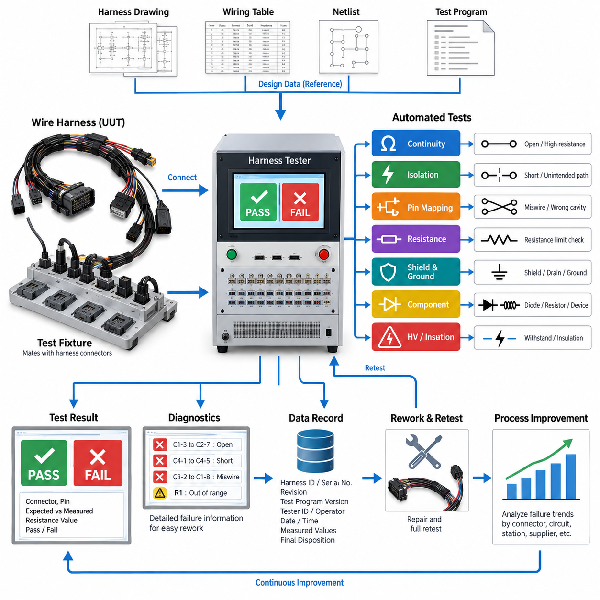
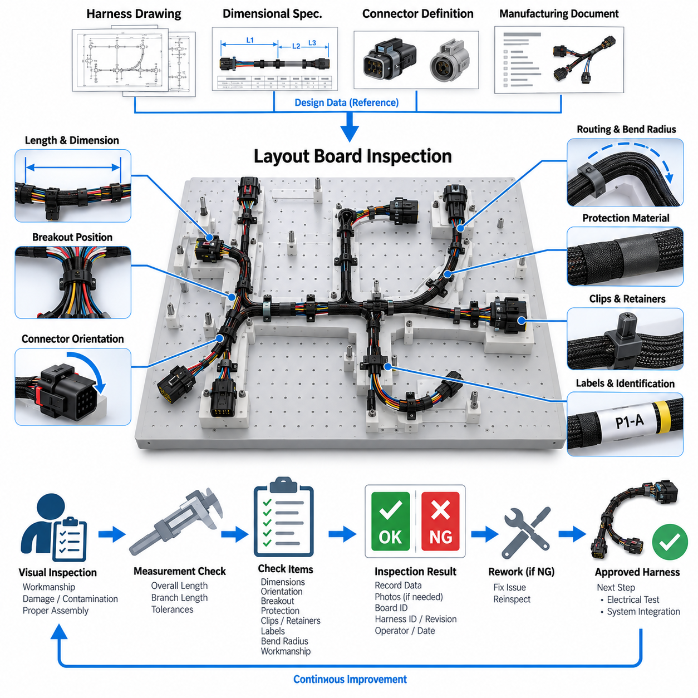
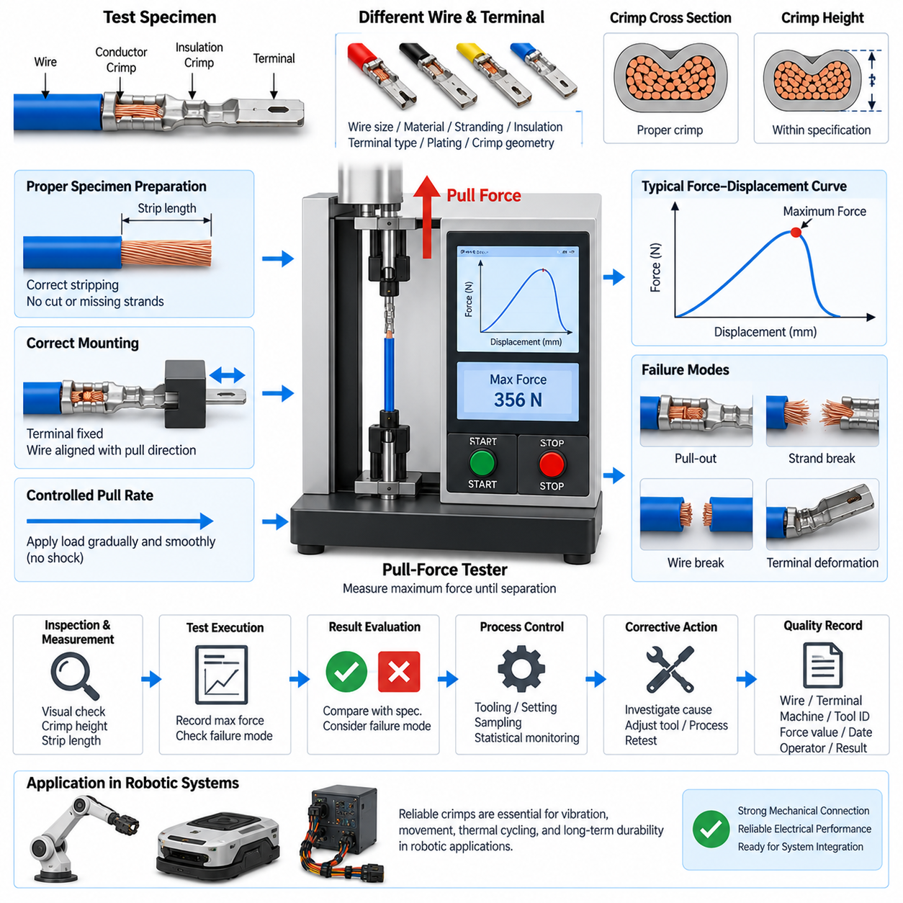
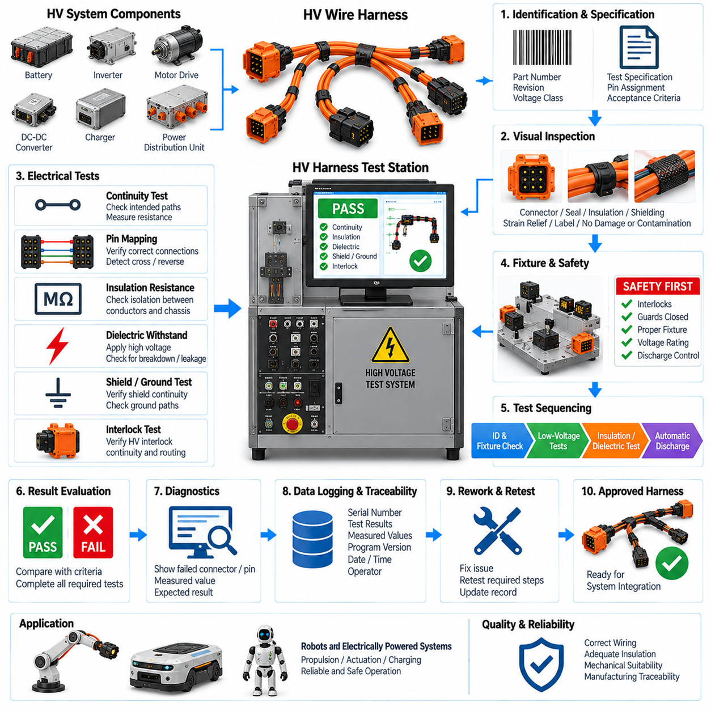
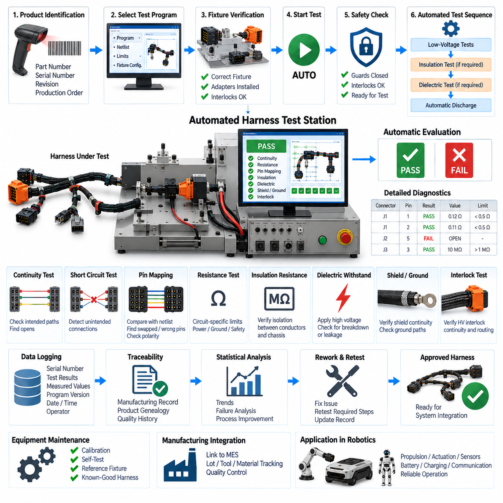

**Volume 19. Testing and Validation**

# Chapter 02. Harness Test

## 02.01. Dedicated Harness Tester

{width="7.268055555555556in" height="7.268055555555556in"}

A dedicated harness tester is a purpose-built verification system used to confirm that a completed wire harness matches its intended electrical design before installation into a robot, vehicle, machine, or subsystem. Unlike a simple continuity meter, the tester evaluates many circuits through predefined connector interfaces and a stored test program. It provides a repeatable method for detecting manufacturing defects before the harness reaches system-level assembly.

The tester normally connects to the harness through dedicated mating fixtures or test adapters that reproduce the electrical interfaces of the target equipment. Each harness connector is attached to a corresponding tester interface, allowing individual pins to be addressed automatically. The tester then compares the measured connectivity against a reference netlist derived from the approved harness drawing, wiring table, or manufacturing definition.

Continuity verification is one of the primary functions of a dedicated harness tester. A controlled test signal is applied between expected endpoints, and the measured resistance is compared with an acceptance threshold. This process detects open circuits caused by missing wires, incomplete crimps, broken conductors, incorrectly seated terminals, or damaged connector contacts. Low-resistance measurement can also reveal connections that are electrically continuous but potentially degraded.

A complete harness test must verify more than expected connections. The tester should also identify unintended electrical paths between circuits that are required to remain isolated. Short circuits may result from damaged insulation, stray conductor strands, incorrect splices, terminal insertion errors, contamination, or manufacturing mistakes. Automated scanning across relevant pin combinations makes this verification substantially more reliable than manual point-to-point measurements.

Miswiring detection is especially important in harnesses containing connectors with many visually similar cavities. Two wires may individually have acceptable continuity while still being installed in exchanged terminal positions. A dedicated tester compares every tested source and destination against the defined connectivity matrix, enabling swapped wires, cross-connections, incorrect branches, and wrong connector cavity assignments to be detected before functional integration.

The test fixture is a critical part of the overall measurement system. Fixture connectors must mate reliably with production harness connectors without damaging seals, terminals, secondary locks, or polarization features. For high-volume testing, interface components should tolerate repeated mating cycles and permit replacement of wear items. Fixture wiring must also be controlled so that faults within the test equipment are not incorrectly reported as harness defects.

Test programs should be generated and maintained under configuration control because the expected electrical network changes whenever the harness design is revised. Harness part number, revision, connector configuration, pin assignment, optional branch content, and applicable acceptance criteria should correspond to the correct test recipe. Testing an updated harness against an obsolete reference can produce false failures or, more seriously, allow an incorrect configuration to pass.

A practical tester therefore requires positive identification of the unit under test. The operator may select or scan the harness part number, serial number, production order, or revision identifier before connecting the assembly. The system can then load the corresponding test configuration and prevent execution when an incompatible fixture or program is selected. This reduces dependence on operator memory and improves manufacturing traceability.

Dedicated harness testing can also incorporate resistance limits for specific circuits rather than treating connectivity as a purely binary condition. Power conductors, ground returns, safety circuits, and long cable runs may require tighter resistance control because excessive resistance can create voltage drop, localized heating, or unstable equipment operation. Measurement limits should account for conductor length, wire gauge, terminals, splices, fixture resistance, and measurement uncertainty.

Where the harness contains shields, drain wires, or dedicated chassis-ground paths, their connectivity should be included in the test definition. Shield termination errors can leave signal circuits functionally connected while reducing electromagnetic compatibility performance after installation. The tester can verify whether required shield endpoints and drain connections exist, although detailed EMC effectiveness remains the responsibility of the separate EMC validation activities defined elsewhere in the testing structure.

Harnesses containing diodes, resistors, suppression devices, or other embedded electrical components require test methods that distinguish component behavior from ordinary wiring. Polarity-sensitive elements may require measurements in both directions, while resistive components require defined value windows. The test program must therefore represent not only physical connectivity but also the expected electrical characteristics of components incorporated into the harness assembly.

For safety-related or higher-voltage harnesses, the dedicated tester may be integrated with additional insulation or dielectric test equipment, but these functions should remain clearly differentiated from ordinary low-voltage continuity testing. Switching architecture, fixtures, connectors, and operator protection must be appropriate for the applied test voltage. Automated interlocks can prevent access to energized interfaces and ensure that stored electrical energy is discharged before handling.

The test sequence should be designed so that failures provide useful diagnostic information rather than only a generic PASS or FAIL indication. A useful failure record identifies the affected connector, cavity, expected destination, measured condition, and applicable limit. For example, the tester may report an open circuit between two defined pins, an unexpected connection between unrelated circuits, or resistance exceeding the permitted value on a power conductor.

This diagnostic capability directly supports manufacturing rework. Instead of manually tracing an entire harness after a failure, the technician can inspect the specific connector, splice, branch, or conductor associated with the reported network. After repair, the complete test should normally be repeated rather than testing only the repaired circuit. A full retest helps ensure that handling or rework has not introduced an additional defect elsewhere in the assembly.

Production deployment also requires periodic verification of the tester itself. Known-good reference harnesses, loopback fixtures, calibrated resistance standards, or dedicated self-test adapters can be used to confirm channel operation and measurement accuracy. Tester verification should detect damaged fixture wiring, worn contacts, failed switching channels, or measurement drift before these conditions create false production results or allow defective harnesses to pass.

Measurement system integrity becomes increasingly important as harness complexity grows. Modern robotic electrical architectures may combine battery power, motor interfaces, safety circuits, sensors, CAN or CAN FD networks, Ethernet, serial communication, and auxiliary I/O within related harness assemblies. The dedicated tester should verify manufacturing connectivity without applying inappropriate signals to sensitive interfaces or confusing communication topology with ordinary point-to-point wiring.

Test results should be stored as manufacturing quality records whenever traceability is required. Typical records include harness identification, revision, tester identification, test-program version, operator or station information, execution time, measured values, failure details, rework status, and final disposition. Linking these records to serial-number or production-lot information enables later field failures to be correlated with manufacturing history.

Collected tester data can also support statistical process improvement. Repeated opens at one terminal position may indicate a crimping, insertion, or connector-handling problem, while recurring shorts within a specific branch may reveal an assembly-board or routing issue. Failure trends can therefore be analyzed by connector, circuit, workstation, harness revision, supplier lot, or production period to identify systematic causes rather than treating each defect independently.

The dedicated harness tester ultimately acts as a manufacturing gate between harness fabrication and higher-level electrical integration. Its purpose is not to prove every functional behavior of the completed robot, but to establish that the electrical interconnection structure has been manufactured according to the controlled definition. Reliable continuity, isolation, pin mapping, resistance verification, configuration control, diagnostics, and traceable records reduce integration faults and provide a dependable foundation for subsequent system validation.

## 02.02. Layout Board Inspection

{width="7.268055555555556in" height="7.268055555555556in"}

A layout board inspection is a structured manufacturing verification process used to confirm that a wire harness has been assembled according to its approved physical definition before it proceeds to electrical testing or installation. The harness is positioned on a dedicated layout board, form board, or assembly fixture that represents the intended routing, branch locations, connector positions, breakout points, and dimensional relationships defined by the harness design.

Unlike a dedicated harness tester, which primarily verifies electrical connectivity and resistance-related characteristics, layout board inspection focuses on the physical correctness of the manufactured harness. A harness can pass continuity testing while still containing incorrect branch lengths, misplaced connectors, inadequate protection, excessive twisting, or incorrect routing geometry. Physical inspection therefore complements electrical verification and provides an independent manufacturing quality gate.

The layout board is normally developed from controlled harness drawings, dimensional specifications, connector definitions, and manufacturing documentation. Fixtures, pins, connector holders, routing guides, and reference markings reproduce critical geometry so that the assembled harness can be compared directly with its nominal configuration. The board should represent dimensions that influence installation, connector accessibility, bend behavior, strain, and compatibility with the target robot or machine.

During inspection, the harness is placed into the defined routing path without excessive pulling, compression, or artificial deformation. Branches should naturally reach their specified fixture locations, and connectors should engage their holders without forcing the wire bundle. A harness that can match the board only when stretched may contain insufficient branch length, while excessive slack can indicate an oversized segment or an incorrectly positioned breakout.

Overall harness length and individual branch dimensions are important inspection parameters. Dimensional tolerances should account for manufacturing variation while remaining sufficiently controlled to guarantee installation into the final system. Measurements may include connector-to-connector distance, breakout position, branch length, exposed conductor length, protective covering termination, and other design-specific dimensions. Acceptance criteria should be defined by the applicable harness documentation rather than by operator judgment alone.

Connector orientation must also be verified because correct electrical pin mapping does not guarantee correct mechanical orientation. Connector clocking, polarization, latch direction, backshell orientation, strain-relief direction, and cable exit angle can determine whether the harness can be installed without twisting or interference. The layout board can provide mechanical references that allow these orientation characteristics to be inspected consistently before the harness leaves the manufacturing station.

Breakout points require particular attention because they determine how the main bundle separates into branches serving different devices. Incorrect breakout positions can create tension at connectors, interfere with nearby components, or force the harness into unintended bend radii during installation. Inspectors should confirm the breakout location, branch direction, bundle transition, and associated protection against the controlled manufacturing definition.

The inspection should verify that protective materials are present in the correct locations and applied with appropriate coverage. These materials may include corrugated tubing, braided sleeving, textile tape, heat-shrink tubing, conduit, edge protection, abrasion sleeves, or localized reinforcement. Their purpose can vary between mechanical protection, environmental resistance, bundle retention, noise reduction, and strain management, so incorrect placement can compromise harness durability even when electrical performance initially appears normal.

Clips, clamps, grommets, retainers, and other attachment components should be inspected for correct type, quantity, position, and orientation. These components define how the harness interfaces mechanically with the final product and often control vibration, movement, clearance, and load transfer. A misplaced clip can alter the installed routing significantly, while a missing grommet can expose wiring to abrasion where the harness passes through a panel or structural opening.

Minimum bend radius and local bundle deformation should be considered wherever the harness changes direction. Excessively tight bending can damage conductor strands, distort shielding, stress insulation, or create long-term fatigue near connectors and branch transitions. The layout board should therefore avoid encouraging unrealistic sharp bends and should provide sufficient geometric guidance to demonstrate that the manufactured harness can follow its intended routing without harmful mechanical stress.

Visual workmanship inspection is performed at the same time because the board exposes much of the harness in a controlled arrangement. Inspectors can identify damaged insulation, cuts, pinching, loose wrapping, exposed conductors, incomplete heat-shrink recovery, displaced seals, damaged connector housings, improperly retained terminals, contamination, or inconsistent bundle construction. Suspected defects should be recorded and evaluated against defined workmanship requirements.

Wire identification and labeling are another important part of the inspection. Harness labels, connector identifiers, branch markers, serial numbers, warning labels, and other identification features should match the applicable drawing and remain readable after installation. Their orientation and position should support assembly and service activities. Incorrect identification may not affect immediate electrical operation but can cause installation errors, maintenance mistakes, or configuration confusion later in the product life cycle.

For harnesses containing shielded cables, communication lines, high-current conductors, or safety-related circuits, the physical routing configuration may have additional significance. Separation between power and signal branches, shield treatment, grounding provisions, and protection near high-energy circuits should remain consistent with the design intent. Layout inspection does not replace EMC, insulation, or functional testing, but it verifies that the physical construction required to support those characteristics has been implemented.

The layout board itself must be controlled as production tooling. Fixture locations, connector holders, reference dimensions, and inspection markings should correspond to the current harness revision. Wear, mechanical damage, displaced fixtures, or unauthorized modifications can cause conforming harnesses to be rejected or defective harnesses to be accepted. Periodic verification of critical board dimensions is therefore necessary, particularly for high-volume or long-duration production programs.

Configuration management is especially important when several harness variants share similar geometry. Optional branches, different connector types, regional configurations, sensor options, or product revisions may create harnesses that appear nearly identical. The operator should positively identify the part number and revision before inspection, and the corresponding board configuration or inspection instruction should be selected to prevent acceptance against an incorrect physical reference.

Inspection results should provide more information than a simple visual approval. Relevant dimensional measurements, nonconforming locations, defect categories, harness identification, board or fixture identification, operator information, inspection date, and final disposition can be recorded as part of the manufacturing quality history. Photographs may also be used where permitted by the quality process to document unusual defects, rework conditions, or configuration-specific characteristics.

When a nonconformance is identified, the affected characteristic should be evaluated before rework is performed. Repositioning a clip or replacing a protective sleeve may be straightforward, while correcting an incorrect breakout length can require substantial harness reconstruction. After rework, the affected physical characteristics should be reinspected, and any electrical testing potentially influenced by the repair should be repeated according to the applicable manufacturing and validation procedure.

Layout board inspection can also provide valuable feedback to harness design and manufacturing engineering. Repeated difficulty fitting a nominally correct harness to the board may indicate unrealistic dimensional tolerances, poor breakout definitions, unsuitable routing assumptions, or excessive manufacturing variation. Recurring defects can therefore reveal opportunities to improve drawings, tooling, assembly instructions, component selection, and the physical architecture of the harness itself.

For robotic systems, physical harness accuracy is particularly important because wiring may pass through compact structures, moving assemblies, sensor mounts, motor regions, battery compartments, or service-access areas. An apparently minor dimensional error can interfere with moving mechanisms, obstruct maintenance, increase connector loading, or expose the harness to abrasion. Layout verification helps identify these manufacturing deviations before they become system-level integration problems.

The layout board inspection ultimately establishes that the manufactured harness possesses the physical geometry and workmanship required by its controlled design definition. Used together with dedicated harness testing, crimp verification, high-voltage testing where applicable, and automated inspection methods, it forms part of the broader harness validation process. Electrical correctness and physical correctness are complementary requirements, and both must be established before a harness can be considered ready for reliable system integration.

## 02.03. Crimp Pull Test

{width="7.268055555555556in" height="7.268055555555556in"}

A crimp pull test is a mechanical verification method used to evaluate the strength and consistency of the connection between an electrical conductor and a crimped terminal. Within wire harness manufacturing, it provides direct evidence that the crimping process has produced sufficient mechanical retention. The test complements electrical continuity and visual inspection because a connection may conduct electricity while still having inadequate mechanical strength.

The fundamental principle is to apply a controlled tensile force between the wire and the crimped terminal until a specified acceptance force is reached or the connection separates. The measured force represents the mechanical retention capability of the conductor crimp. Testing is normally performed using a dedicated pull-force tester that can apply force at a controlled rate while continuously measuring the tensile load.

A typical test specimen consists of the production wire, terminal, and crimp configuration being evaluated. Wire size, conductor material, strand construction, insulation type, terminal part number, plating, and crimp geometry can all influence the measured result. Consequently, acceptance criteria should correspond to the specific wire-terminal combination rather than applying one universal pull-force requirement to every harness connection.

Before testing, the specimen should be inspected to confirm that it represents the intended production configuration. The conductor must be properly stripped, strands should not be unintentionally cut or missing, and the terminal should show the expected conductor and insulation crimp geometry. Testing a specimen with obvious preparation damage can produce a misleading result that does not accurately represent the capability of the normal crimping process.

The specimen is mounted so that the terminal is securely retained by an appropriate fixture while the wire is aligned with the pulling direction. Misalignment can introduce bending, twisting, or side loading that changes the measured force and failure behavior. The fixture should hold the terminal without damaging the crimp region or creating an artificial mechanical advantage that would make the result unrepresentative.

The tensile load should be applied progressively and smoothly rather than by impact or sudden jerking. A controlled pull rate improves repeatability between specimens and enables meaningful comparison between production lots, tools, and process settings. The tester records the maximum force reached before separation or another defined failure condition, and this value is compared with the specified minimum pull-force requirement.

Failure mode is as important as the numerical force value. The conductor may pull out of the crimp barrel, individual strands may slip or break, the wire may fracture outside the crimp, or the terminal itself may deform. Recording how the specimen failed helps distinguish inadequate crimp compression from conductor weakness, incorrect stripping, terminal damage, material variation, or an unsuitable test setup.

A conductor that simply pulls out of the barrel at a low force commonly indicates insufficient mechanical engagement between the terminal and conductor. Possible causes include excessive crimp height, incorrect tooling, insufficient compression, incorrect terminal selection, or improper conductor positioning. The measured force should therefore be interpreted together with the physical condition of the failed specimen rather than as an isolated number.

Crimp height is closely related to pull-test performance and should normally be controlled as a separate process characteristic. Excessive crimp height can produce insufficient compression and poor retention, while an excessively small crimp height can damage conductor strands or overstress the terminal. Pull testing verifies mechanical performance, whereas dimensional inspection helps determine whether the crimping process remains within its intended forming window.

Wire stripping quality also has a major influence on the result. A strip length that is too short can prevent full conductor engagement, while excessive stripping can leave exposed conductor outside the intended barrel region. Nicked or cut strands reduce the effective conductor cross-section and can cause premature fracture. For this reason, strip length and strand condition should be examined whenever unexpected pull-test failures occur.

The insulation crimp should not be confused with the conductor crimp. Its primary purpose is normally to provide strain relief and support the insulated wire rather than establish the electrical connection. Depending on the applicable test method, the insulation support may need to be disabled or treated appropriately so that the measured force represents conductor-crimp retention rather than additional holding force provided by the insulation.

Crimp pull testing is generally destructive because the specimen is loaded to a defined limit or until failure. Production control therefore commonly relies on representative samples rather than testing every terminal in every harness. Sampling frequency should reflect production volume, process capability, tooling condition, terminal and wire changes, quality requirements, and the criticality of the electrical connection being manufactured.

Testing is particularly valuable when a crimping process is first established or changed. New applicators, dies, terminals, wire suppliers, conductor sizes, tooling adjustments, maintenance activities, or process parameter changes can alter crimp performance. Pull-force verification provides quantitative evidence that the revised manufacturing condition continues to produce mechanically acceptable connections before normal production is released.

For automated crimping equipment, pull-test results can form part of broader process monitoring that includes crimp height, crimp width, conductor position, tool setup, and equipment parameters. No single measurement completely characterizes crimp quality. Combining mechanical pull strength with dimensional and visual inspection provides a more reliable indication of whether the termination process remains stable and capable.

Test equipment must itself be maintained and verified. The load measurement system should have suitable range, resolution, and accuracy for the forces being evaluated, and its calibration status should remain controlled. Grips and terminal fixtures should also be inspected for wear or damage. A poorly maintained fixture can allow specimen slipping or introduce unintended loads, producing incorrect measurements even when the load sensor is functioning correctly.

Traceability is important when pull testing is used as a manufacturing quality control. Records can include wire type and size, terminal part number, crimping machine or applicator identification, tool setting, specimen identification, measured pull force, required minimum value, failure mode, operator, test equipment identification, date, and final disposition. These records make it possible to relate test results to specific production conditions.

Repeated measurements can be analyzed statistically to identify gradual process deterioration before individual samples fall below the acceptance limit. A downward trend in pull force may indicate tooling wear, changing crimp height, conductor variation, terminal variation, or equipment adjustment problems. Statistical monitoring therefore transforms the pull test from a simple pass-or-fail inspection into a useful indicator of manufacturing process stability.

When a sample fails the specified requirement, the response should extend beyond rejection of the individual specimen. The affected production range should be identified, the crimping process should be investigated, and relevant tooling, materials, setup parameters, and previous quality records should be reviewed. Corrective action may require tool adjustment, maintenance, material replacement, additional sampling, or containment of potentially affected harnesses.

After corrective action, representative specimens should be tested again to demonstrate that acceptable mechanical retention has been restored. Depending on the nature of the problem, additional crimp-height measurement, visual inspection, electrical resistance verification, or harness-level testing may also be appropriate. The objective is to establish that the underlying manufacturing process has returned to a controlled condition rather than merely obtaining one passing result.

In robotic systems, reliable crimps are especially important because harnesses can experience continuous vibration, repeated acceleration, mobile-platform shock, cable movement, thermal cycling, and service handling. Connections supplying motors, batteries, safety devices, sensors, controllers, and communication equipment must retain electrical and mechanical integrity throughout these conditions. Weak crimps can develop intermittent faults long after the harness initially passes continuity testing.

The crimp pull test therefore functions as a focused validation of termination workmanship within the broader harness test structure. Together with dedicated harness testing, layout board inspection, high-voltage harness testing where applicable, and harness test automation, it helps establish that the manufactured electrical interconnection is mechanically robust as well as electrically correct.

## 02.04. HV Harness Test

{width="7.268055555555556in" height="7.268055555555556in"}

High-voltage harness testing verifies that an HV wire harness has been manufactured with the electrical integrity, insulation performance, mechanical configuration, and safety characteristics required for reliable operation. Within the harness test structure, it extends ordinary continuity and workmanship inspection to circuits where insulation defects, incorrect connections, or insufficient separation can create hazardous voltage exposure, arcing, equipment damage, or system shutdown.

An HV harness typically connects batteries, power distribution units, contactors, inverters, motor drives, DC-DC converters, chargers, or other high-energy equipment. Because these circuits can carry significantly greater voltage and current than ordinary signal wiring, manufacturing defects require more rigorous detection. The test strategy therefore combines electrical connectivity verification with insulation-related measurements and controlled safety procedures.

Testing should begin with positive identification of the harness part number, revision, voltage class, connector configuration, and applicable test specification. The selected test program must correspond to the exact production configuration because different variants may use similar connectors while having different pin assignments or insulation requirements. Configuration control prevents an incorrect harness definition from producing misleading PASS results.

Visual inspection should precede application of high test voltage. The inspector should check connector housings, high-voltage terminals, seals, cable insulation, protective coverings, shielding, strain relief, branch transitions, labels, and interlock-related components where applicable. Cuts, crushed insulation, exposed conductors, incomplete connector assembly, contamination, or damaged seals should be corrected before energized testing is attempted.

Continuity testing confirms that each intended HV conductor connects the correct source and destination terminals. The measured resistance should remain within the specified acceptance range for the conductor length, cross-section, terminal system, and connection architecture. Excessive resistance can indicate incomplete crimping, damaged conductor strands, poorly seated terminals, defective joints, or other conditions capable of producing voltage drop and localized heating under load.

Correct pin mapping is equally important because an electrically continuous conductor can still be connected to the wrong terminal. The test system should compare the actual harness connectivity with the controlled wiring definition and detect crossed conductors, reversed connections, incorrect branch assignments, and unintended electrical paths. For DC power circuits, polarity errors can be particularly serious when the harness is connected to batteries or power electronics.

Insulation resistance testing evaluates whether electrically isolated conductors remain adequately separated from each other and from shield, chassis, or other defined reference points. A controlled DC test voltage is applied and the resulting leakage behavior is measured. Low insulation resistance can indicate damaged insulation, contamination, moisture, conductive debris, incorrect assembly, or insufficient separation between conductive elements.

A dielectric withstand test may be required when the applicable harness specification calls for verification at a voltage above normal operating conditions. The purpose is to demonstrate that the insulation system can tolerate the specified electrical stress without breakdown, flashover, or excessive leakage. Test voltage, duration, ramp behavior, current limit, and acceptance criteria must be defined by the applicable engineering or validation requirement rather than selected arbitrarily.

The dielectric test must be distinguished from insulation resistance measurement. Insulation resistance testing characterizes the resistance of the insulating system under a defined DC condition, whereas dielectric withstand testing challenges the insulation with a specified elevated voltage to verify that breakdown does not occur. Both may be relevant to HV harness validation, but they provide different information and require appropriately configured test equipment.

Shielding and grounding features should also be verified when they are part of the harness design. HV cables may incorporate braided shields, foil shields, drain paths, shield termination hardware, or conductive connector structures intended to control electromagnetic interference. The test should confirm required electrical continuity of these features without confusing shield connectivity with the isolation requirements of the HV conductors.

Where a high-voltage interlock loop is incorporated into the connector or harness architecture, its continuity and routing should be verified independently from the power conductors. The interlock circuit can support detection of disconnected or improperly engaged HV interfaces at the system level. Harness testing should therefore confirm that the interlock path corresponds to the intended connector configuration and has not been opened, bypassed, or incorrectly wired.

Mechanical condition remains important even when the principal test objectives are electrical. High-voltage cables often have larger conductor cross-sections, thicker insulation, shielding layers, and restricted bend requirements. Excessive bending, twisting, compression, or strain near connector exits can damage internal structures or reduce long-term durability. Layout and workmanship inspection should therefore complement the energized electrical tests.

Test fixtures and adapters require voltage ratings appropriate for the maximum applied test condition. Fixture connectors, switching devices, cables, insulation barriers, and measurement channels must not become the weakest insulation point in the test system. Fixture leakage or contamination can otherwise be mistaken for a harness failure, while inadequate fixture insulation can create a genuine electrical hazard during dielectric testing.

Operator protection is a fundamental requirement of HV testing. Access to energized terminals should be prevented through guarded fixtures, covers, enclosures, or interlocked test stations as appropriate to the equipment. The test sequence should prevent voltage application when protective conditions are not satisfied and should terminate the energized state automatically when an interlock is opened or an abnormal condition is detected.

Stored electrical energy must also be considered after the test voltage is removed. Cable capacitance, tester circuitry, filters, and connected components can retain charge for a period after testing. A controlled discharge function should reduce residual voltage to a safe condition before the fixture can be opened or the harness handled. Verification of discharge is particularly important when elevated dielectric test voltages are used.

Automated sequencing can improve both safety and repeatability. A controlled HV harness test station can identify the product, verify fixture status, perform low-voltage continuity checks, execute insulation-related measurements, evaluate acceptance limits, discharge the test circuit, and record the final result. Sequencing lower-risk checks before elevated-voltage testing can also identify obvious wiring defects before unnecessary HV stress is applied.

Failure information should identify the electrical path and the type of nonconformance rather than provide only a generic FAIL indication. Useful diagnostic information can include an open power conductor, excessive conductor resistance, unexpected cross-connection, polarity error, low insulation resistance, excessive leakage, dielectric breakdown, shield discontinuity, or interlock failure. Detailed diagnostics support efficient containment and rework.

A failed insulation or dielectric test should not automatically be treated as a simple wiring repair. The failure may originate from damaged cable insulation, contaminated connector cavities, incorrect seal installation, conductive debris, excessive mechanical stress, defective test fixtures, or inappropriate test setup. The failed assembly and test equipment should therefore be investigated systematically before the harness is returned to production flow.

Reworked HV harnesses should be retested according to the characteristics potentially affected by the repair. Replacement of a terminal may require continuity, resistance, sealing, and insulation verification, while repair involving cable insulation can require broader evaluation. A complete retest may be appropriate when the rework can influence multiple electrical or mechanical characteristics of the harness rather than only one isolated connection.

Test equipment should remain under calibration and periodic verification. Resistance measurement channels, insulation resistance functions, high-voltage sources, leakage-current measurement, voltage monitoring, interlocks, and discharge circuits should be checked according to the applicable equipment-control procedure. Reference devices or dedicated verification fixtures can help confirm correct operation before production harnesses are evaluated.

Traceability should connect each test result with the specific harness and test configuration. Records can include harness serial number, part number, revision, tester identification, fixture identification, test-program version, measured resistance, insulation values, dielectric test conditions, failure information, operator, date, rework status, and final disposition. These records provide evidence that each accepted harness satisfied the controlled manufacturing requirements.

Statistical analysis of production data can reveal developing problems that may not be obvious from individual PASS or FAIL decisions. Increasing conductor resistance may indicate terminal or crimp deterioration, while declining insulation resistance can suggest contamination, material damage, or fixture degradation. Trend analysis can therefore support preventive maintenance and process improvement before defects become widespread.

In robotic and autonomous platforms, HV harness reliability directly affects propulsion, actuation, charging, energy distribution, and system availability. Mobile robots and other electrically powered machines can expose harnesses to vibration, shock, repeated motion, temperature changes, contamination, and service handling. Manufacturing validation must therefore establish a robust electrical and mechanical baseline before the harness experiences these operational stresses.

HV harness testing ultimately serves as a safety-critical manufacturing gate within the broader harness validation process. Together with dedicated harness testing, layout board inspection, crimp pull testing, and subsequent test automation, it confirms that high-energy electrical interconnections are correctly wired, adequately insulated, mechanically suitable, and traceably verified before system integration.

## 02.05. Harness Test Automation

{width="7.268055555555556in" height="7.268055555555556in"}

Harness test automation integrates electrical verification, fixture control, test sequencing, data acquisition, result evaluation, and manufacturing traceability into a coordinated test process. Instead of requiring an operator to perform individual measurements manually, an automated station executes predefined procedures for each harness configuration. This improves repeatability, reduces human error, and enables consistent quality control across production volumes.

The automation process begins with positive identification of the unit under test. A harness part number, serial number, revision, production order, barcode, or other identifier can be entered or scanned before testing begins. The control software uses this information to select the corresponding test program, reference netlist, acceptance limits, and fixture configuration, preventing an incompatible test recipe from being applied to the wrong harness variant.

Fixture verification is an important prerequisite for automatic testing. The system should confirm that the required adapters, mating connectors, switching interfaces, and safety devices are correctly installed before measurements begin. Fixture identification can be incorporated into the station so that the controller verifies compatibility between the harness, test program, and physical interface. This reduces setup errors and protects both the harness and test equipment.

Automated continuity testing sequentially addresses the required connector pins and verifies that intended electrical paths are present. The switching system routes measurement channels between specified endpoints without requiring manual probe movement. Measured resistance can be compared automatically with circuit-specific limits, allowing the station to identify open circuits, excessive resistance, incomplete connections, and other abnormalities associated with conductor or termination defects.

Automation also enables systematic detection of unintended electrical connections. The test matrix can scan relevant combinations of pins to identify short circuits, crossed wires, incorrect splices, and other paths that are absent from the controlled harness definition. This capability is especially valuable for complex robotic harnesses containing many connectors and branches, where complete manual checking would be slow and vulnerable to operator oversight.

Pin mapping can be evaluated automatically by comparing measured connectivity with a reference netlist derived from the approved wiring definition. Each source pin should reach its intended destination and remain isolated from unrelated circuits. The software can report swapped conductors, wrong connector cavities, incorrect branch assignments, and polarity errors with specific connector and pin information, significantly reducing troubleshooting time after a failed test.

Circuit-specific resistance measurement can be integrated when simple continuity thresholds are insufficient. Power conductors, ground paths, safety circuits, and other critical connections may require tighter resistance limits because excessive resistance can create voltage drop, heating, or unstable operation. Automated evaluation ensures that the correct limit is applied to each circuit instead of relying on a single generic continuity criterion for the entire harness.

Where appropriate, the automated station can coordinate insulation resistance or high-voltage harness testing with ordinary low-voltage measurements. Such functions require suitable switching architecture, voltage-rated fixtures, guarded interfaces, interlocks, and discharge control. The automation sequence should clearly separate low-voltage continuity operations from elevated-voltage tests and prevent hazardous voltage application unless all required safety conditions are satisfied.

A well-designed sequence normally performs lower-risk checks before more demanding tests. Product identification, fixture confirmation, continuity, pin mapping, and basic resistance measurements can detect obvious manufacturing problems before insulation or dielectric tests are initiated. This sequencing avoids unnecessary electrical stress on a defective assembly and allows faults to be diagnosed at the earliest practical stage of the automated process.

Safety logic should operate independently of normal test-result processing where hazardous energy is involved. Protective covers, access doors, emergency controls, fixture interlocks, voltage monitoring, and discharge functions can be incorporated into the station architecture. The system should inhibit high-voltage generation when safety conditions are not satisfied and return the test interface to a defined safe state before the operator can remove the harness.

Automatic discharge verification is particularly important after elevated-voltage testing. Harness capacitance, test cables, filters, and internal measurement circuits can retain electrical charge after the source is switched off. The controller can command a controlled discharge, monitor residual voltage, and release the fixture interlock only after the measured condition falls below the defined safe threshold. This makes safety an explicit part of the test sequence rather than an operator-dependent action.

Automated result evaluation converts raw measurements into controlled manufacturing decisions. Each measured value is compared with the applicable acceptance criteria, and the software determines whether the corresponding test step passes or fails. The final harness disposition can be generated only after all mandatory checks have completed successfully, preventing an incomplete test sequence from being mistaken for a fully verified product.

Failure reporting should provide diagnostic information that directly supports rework. Instead of displaying only a general FAIL message, the station can identify the connector, pin, expected destination, measured condition, resistance value, isolation failure, or other relevant characteristic. Clear diagnostics allow technicians to focus on the suspected wire, terminal, splice, branch, or connector rather than manually tracing the complete harness.

Automated systems can support controlled rework and retest workflows. When a harness fails, its status can be retained in the manufacturing record until the defect is corrected. After repair, the station can require the affected test steps or a complete harness test to be repeated according to the applicable quality rule. This prevents a repaired assembly from bypassing required verification before returning to normal production flow.

Data logging is one of the major advantages of automation. The system can record harness identification, revision, test-program version, fixture identification, station identification, operator, date and time, individual measured values, acceptance limits, failure details, rework history, and final disposition. These records create a traceable relationship between the physical harness, the test configuration, and the evidence used to approve the product.

Test-program configuration must remain under formal revision control. Harness drawings, connector definitions, netlists, acceptance limits, and test sequences can change as the product evolves. The automated station should therefore use an approved program corresponding to the current manufacturing configuration and retain the program version within the test record. Unauthorized or obsolete recipes should not be allowed to determine production acceptance.

Automation does not eliminate the need to verify the test equipment itself. Switching matrices, resistance measurement channels, insulation functions, high-voltage sources, fixture wiring, interlocks, and communication interfaces can degrade or fail. Self-test routines, loopback fixtures, reference resistances, known-good harnesses, and scheduled calibration can be incorporated into the maintenance strategy to ensure that production decisions remain based on trustworthy measurements.

Statistical analysis becomes practical when large quantities of structured test data are collected automatically. Resistance distributions, failure frequencies, connector-specific defects, recurring open circuits, insulation trends, and rework rates can be monitored over time. Gradual changes may reveal tool wear, material variation, fixture deterioration, assembly problems, or process drift before the condition produces a significant increase in rejected harnesses.

Automated test data can also support broader manufacturing quality systems. Test results may be associated with production lots, workstations, crimping equipment, material batches, or assembly operators so that recurring defects can be traced to potential sources. Integration with manufacturing information systems can provide product genealogy and quality history, although the exact interfaces and database architecture depend on the production environment.

For robotic platforms, automation becomes increasingly valuable as harness complexity increases. A single robot may contain battery circuits, motor power, safety wiring, CAN or CAN FD, Ethernet, sensors, actuators, charging interfaces, and auxiliary I/O distributed across multiple harness branches. Automated testing allows these connections to be verified according to controlled circuit-specific rules without depending on repetitive manual probing and interpretation.

Harness test automation should nevertheless complement rather than replace physical workmanship inspection. Electrical automation cannot by itself prove that routing dimensions, bend radii, protective sleeves, clips, labels, seals, connector orientation, and mechanical strain relief are correct. Layout board inspection and crimp pull testing therefore remain important companion processes, while automation provides repeatable electrical verification and integrated manufacturing records.

The automated harness test station ultimately functions as a controlled manufacturing quality gate between harness assembly and system integration. By combining product identification, fixture verification, electrical testing, safety sequencing, automatic evaluation, diagnostics, traceability, retesting, and process data analysis, it transforms individual harness measurements into a repeatable validation workflow suitable for increasingly complex robotic electrical architectures.
