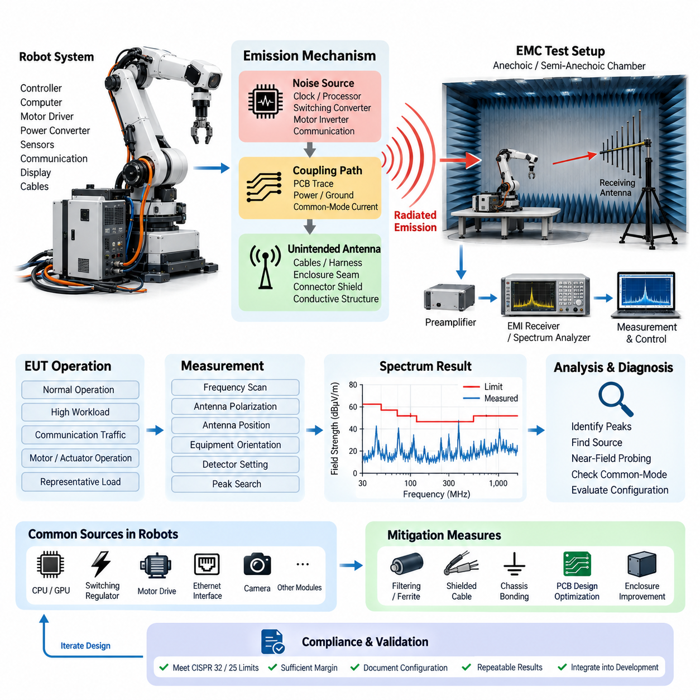
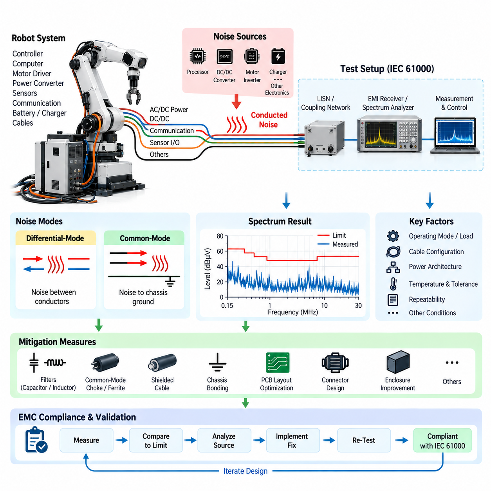
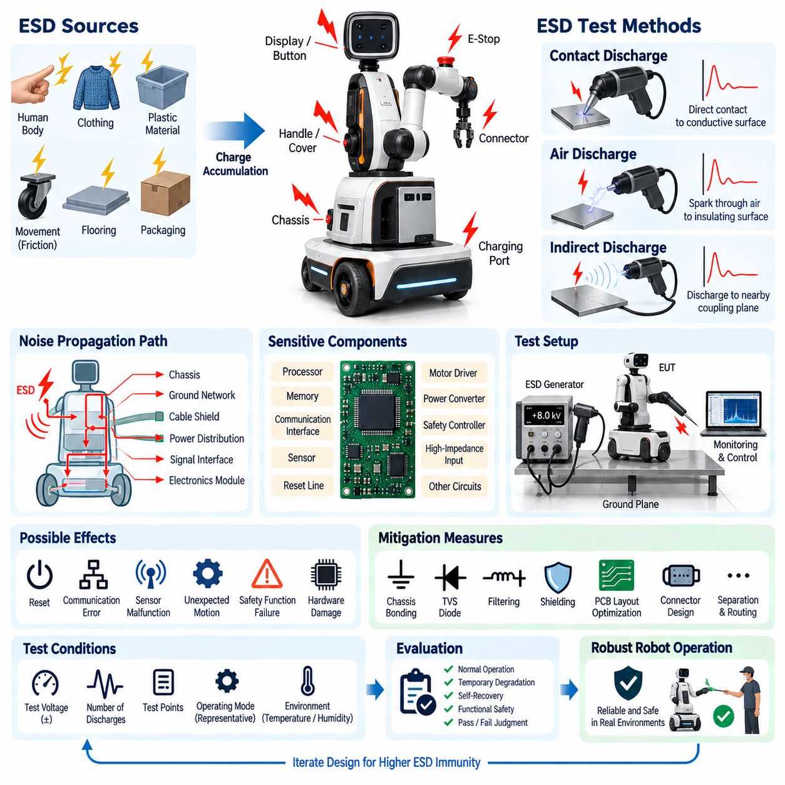
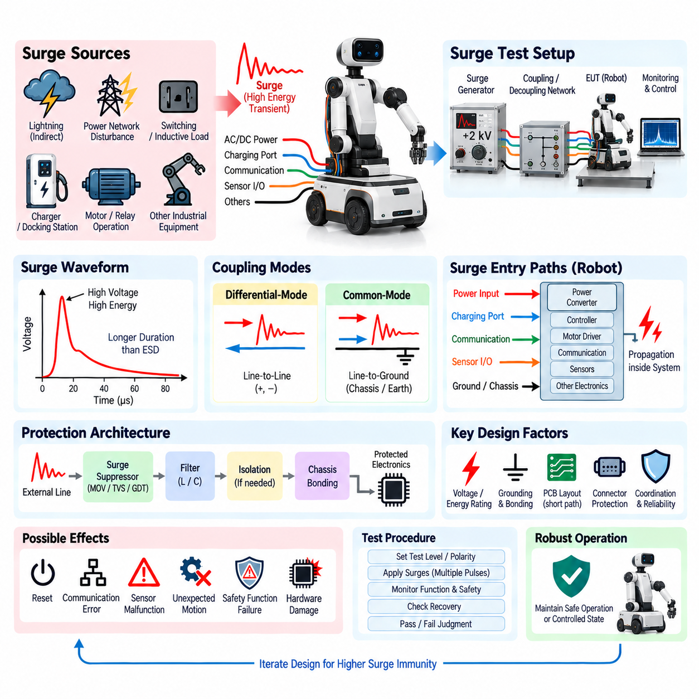
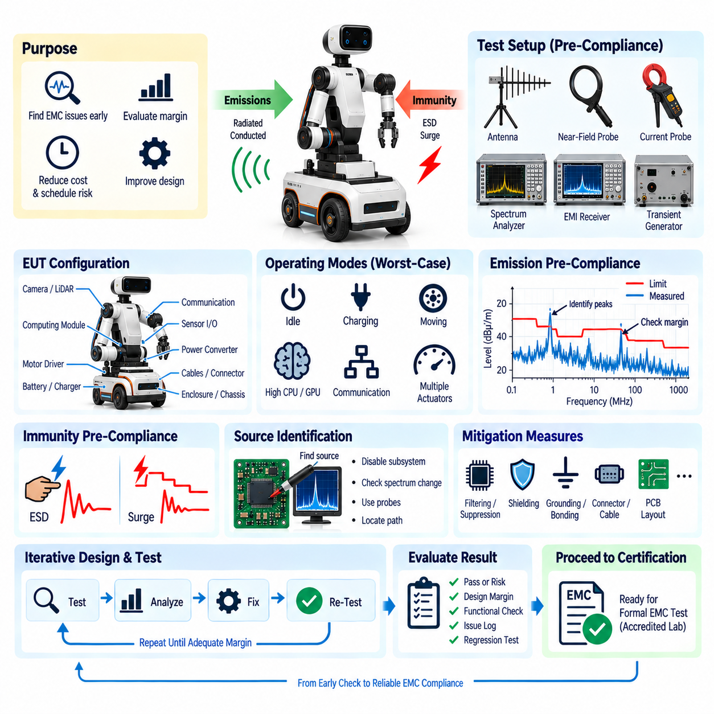

**Volume 19. Testing and Validation**

# Chapter 03. EMC Test

## 03.01. CISPR 32/25 Radiated Emission

{width="7.268055555555556in" height="7.268055555555556in"}

Radiated emission testing evaluates the electromagnetic energy unintentionally transmitted from electronic and electrical equipment through free space. Within the provided validation structure, this activity belongs to the EMC test domain and is identified as CISPR 32/25 radiated emission testing. It provides evidence that a robot, controller, computing platform, or electrical subsystem does not generate excessive electromagnetic disturbance during representative operation.

CISPR 32 and CISPR 25 address radiated electromagnetic disturbances from different application perspectives. CISPR 32 is commonly associated with multimedia and information technology equipment, while CISPR 25 is oriented toward components and equipment used in vehicles and related installations. Robotics systems may contain computing hardware, Ethernet interfaces, switching power converters, displays, cameras, communication modules, and motor-control electronics, making concepts from either environment relevant depending on the intended product and certification scope.

The fundamental objective is to determine electromagnetic field strength as a function of frequency and compare the measured values with applicable emission limits. Electronic circuits contain rapidly changing currents and voltages that can generate broadband or narrowband electromagnetic energy. Clock generators, processors, GPUs, switching regulators, motor inverters, communication transceivers, and high-speed digital buses can therefore become important sources of radiated noise even when their electrical functions operate correctly.

A radiated emission problem normally involves three elements: a noise source, a coupling path, and an unintended antenna structure. The source may be a switching converter or high-speed processor, while the coupling path can involve PCB traces, power conductors, grounding structures, or common-mode currents. Harnesses, cables, enclosure seams, connector shields, and large conductive structures can then behave as antennas and convert conducted disturbance into electromagnetic radiation.

Testing is performed in a controlled electromagnetic environment so that emissions originating from the equipment under test can be distinguished from external radio signals and ambient noise. Depending on the applicable procedure, an anechoic or semi-anechoic chamber may be used together with calibrated receiving antennas, EMI receivers, spectrum analyzers, cables, preamplifiers, and associated measurement equipment. The physical configuration must be controlled because geometry strongly influences the measured electromagnetic field.

Before formal measurement, the equipment under test should be configured to represent a defined and reproducible operating condition. For a robot this can include active computing modules, communication networks, sensors, DC/DC converters, motor drivers, and representative electrical loads. Operating modes that produce high processor activity, network traffic, switching activity, or actuator operation deserve particular attention because the maximum emission level may occur only under specific combinations of system activity.

Cable routing is especially important because cables can become efficient radiating structures when common-mode current flows along them. Power cables, Ethernet lines, camera interfaces, motor phase conductors, sensor cables, and external I/O connections should therefore be arranged according to the prescribed test configuration rather than positioned arbitrarily. Shield termination, connector bonding, cable length, grounding, and separation from conductive surfaces can significantly change measured emissions and must be documented.

During measurement, the receiving system scans the required frequency range while the antenna detects electromagnetic fields generated by the operating equipment. Antenna polarization, measurement distance, antenna position, equipment orientation, and detector settings are selected according to the applicable test method. The purpose is not simply to record one spectrum trace, but to identify the configuration and operating state that produces the highest relevant emissions under controlled and repeatable conditions.

Initial scans are often useful for identifying suspicious frequencies before detailed measurements are performed. Peaks associated with processor clocks, switching frequencies, communication interfaces, or their harmonics can provide valuable diagnostic information. A strong spectral line does not automatically reveal the physical source, however, because energy may propagate through several conductive paths before radiation occurs. Frequency correlation should therefore be combined with controlled engineering experiments.

When an emission exceeds or approaches a limit, systematic source isolation is more effective than immediately adding shielding materials. Engineers can selectively disable subsystems, change operating modes, disconnect nonessential interfaces, alter loads, or temporarily modify cable routing to observe changes in the spectrum. Near-field probing around PCBs, converters, connectors, processors, and cable exits can then help locate regions where electromagnetic energy is generated or coupled into larger radiating structures.

Common-mode current is frequently a critical mechanism in practical robotics systems. Even differential interfaces designed for good electromagnetic compatibility can radiate significantly if asymmetry converts part of the differential signal into common-mode energy. Imperfect shield termination, unequal return paths, connector discontinuities, PCB imbalance, and poor chassis bonding can increase this conversion. Consequently, solving radiated emission problems often requires controlling current return paths rather than merely reducing signal amplitude.

Motor-drive systems introduce additional challenges because high-current switching produces rapid voltage and current transitions. PWM edges, inverter switching nodes, motor phase cables, braking circuits, and DC-link structures can generate broadband disturbances that couple into the chassis and nearby wiring. Filtering, controlled switching transitions, short current loops, appropriate cable shielding, chassis bonding, and careful separation between noisy power circuits and sensitive communication wiring are important EMC design measures.

High-performance computing platforms create a different emission profile. CPUs, GPUs, memory interfaces, PCIe links, Ethernet interfaces, camera connections, and high-frequency voltage regulators can generate numerous harmonically related components over a broad spectrum. Metal enclosures may provide effective shielding only when seams, ventilation openings, cable penetrations, and connector interfaces maintain electromagnetic continuity. A well-shielded enclosure can still fail if an external cable carries common-mode current beyond the enclosure boundary.

Measurement results should be recorded with sufficient context to support engineering decisions and later compliance evidence. Useful records include frequency, measured level, applicable limit, margin to the limit, antenna polarization, equipment orientation, operating mode, cable configuration, detector type, and relevant test setup information. Photographs or controlled configuration records may also be maintained outside the measurement table so that the physical arrangement can be reconstructed during regression or certification testing.

Margin is important because a single passing measurement does not necessarily guarantee production robustness. Component tolerances, harness variations, software workloads, processor utilization, converter operating points, grounding differences, and manufacturing changes can alter emission behavior. Engineering validation should therefore distinguish a comfortable compliance margin from a result that barely remains below the limit. Marginal frequencies should be treated as design risks even when the measured prototype technically satisfies the acceptance criterion.

Corrective actions should address the dominant coupling mechanism identified during diagnosis. Possible measures include improved chassis bonding, optimized PCB return paths, common-mode filtering, ferrite components, feedthrough filtering, shielded cables, improved connector termination, reduced loop area, revised switching behavior, or enclosure modifications. Each countermeasure should be verified by measurement because an improvement at one frequency can have little effect, or occasionally an adverse effect, elsewhere in the spectrum.

Radiated emission testing should ultimately be integrated into the wider validation process rather than treated as a one-time certification activity. The supplied testing structure places it alongside conducted emission, ESD immunity, surge immunity, and EMC pre-compliance testing, indicating that electromagnetic validation should cover both emissions and immunity. Early pre-compliance measurements allow major problems to be discovered while PCB layout, harness routing, grounding, filtering, and enclosure design can still be modified efficiently.

For complex robots, EMC performance is a system-level property created by interactions among power distribution, computing, communication, sensors, actuators, grounding, shielding, and mechanical packaging. A subsystem that performs well independently may behave differently after integration because new cable lengths, return paths, enclosure connections, and switching loads are introduced. Radiated emission validation therefore provides not only a compliance measurement but also a practical method for assessing the electromagnetic integrity of the complete robotic electrical architecture.

## 03.02. IEC 61000 Conducted Emission

{width="7.268055555555556in" height="7.268055555555556in"}

Conducted emission testing evaluates unwanted radio-frequency electrical energy that leaves electronic equipment through power, signal, communication, or other conductive interfaces rather than propagating primarily through free space. Within the provided validation structure, this activity follows CISPR 32/25 radiated emission testing and is identified as IEC 61000 conducted emission testing, forming an important part of the overall EMC verification process for robotic electrical systems.

The IEC 61000 family provides a broad framework for electromagnetic compatibility, covering electromagnetic environments, emission and immunity phenomena, measurement techniques, and test methods. Conducted emission evaluation focuses on disturbances transferred along electrical conductors connected to equipment. In robotics, relevant paths can include AC or DC power inputs, DC/DC converter connections, external communication interfaces, charging circuits, sensor wiring, and cables connecting distributed electronic modules.

Conducted electromagnetic noise is generated whenever rapidly changing voltage or current produces high-frequency components that couple into connected wiring. Switching power supplies, DC/DC converters, motor inverters, processors, communication transceivers, battery chargers, and PWM-controlled loads are common examples. Although the intended operating frequency of a circuit may be relatively low, fast switching edges can contain harmonic energy extending far beyond the fundamental frequency and entering external cables.

A useful engineering model separates conducted disturbances into differential-mode and common-mode components. Differential-mode noise flows between two conductors belonging to the intended electrical circuit, such as positive and negative supply lines. Common-mode noise flows in the same direction on multiple conductors and returns through chassis, protective earth, parasitic capacitance, shields, or surrounding structures. Distinguishing these mechanisms is essential because the filtering and grounding solutions required for each can be substantially different.

Differential-mode disturbance is often associated with switching current drawn from a power source. A DC/DC converter or inverter can generate periodic current pulses that propagate toward the battery or upstream power distribution network. Input capacitors, differential inductors, appropriate power-plane design, and controlled switching loops can reduce this mechanism. Excessive wiring inductance or inadequate local energy storage may increase the disturbance reaching the external power interface.

Common-mode disturbance frequently originates from capacitive coupling between rapidly switching nodes and the chassis or surrounding conductive structures. Motor inverter switching nodes, transformer windings, switching regulators, processor assemblies, and heat sinks can couple high-frequency current through parasitic capacitance. This current may then travel along power cables, shields, or communication wiring. Common-mode chokes, controlled chassis bonding, filtering capacitors, shielding, and optimized return paths are typical mitigation techniques.

A conducted emission test requires a controlled electrical measurement configuration so that disturbance voltage or current can be measured reproducibly. Depending on the equipment and applicable method, stabilization networks, coupling networks, current probes, EMI receivers, or spectrum analyzers may be employed. The measurement network provides a defined impedance and isolates the measurement from uncontrolled characteristics of the external power source, improving comparison between different test laboratories and product configurations.

The equipment under test should operate in representative conditions during measurement. A robot may need its computing platform, motor controllers, sensors, Ethernet communication, DC/DC converters, cooling systems, and auxiliary electronics active simultaneously. Measurements should consider operating states that maximize switching activity or electrical loading, including processor-intensive computation, network traffic, charging, actuator operation, and high-current power conversion, because conducted emissions can vary substantially with system state.

Power architecture has a strong influence on conducted EMC performance. A robot commonly contains a battery, power distribution unit, protection devices, several DC/DC converters, motor drivers, computing modules, sensors, and communication equipment sharing interconnected power and ground networks. Noise generated by one subsystem can propagate through these networks and appear at another subsystem. Conducted emission testing therefore also helps reveal system-level coupling that may not be visible during isolated component testing.

Measurement typically involves scanning a specified frequency range and recording disturbance levels using detector characteristics appropriate to the applicable procedure. Engineers compare measured values with defined limits and identify frequencies where the margin becomes small. Repeated peaks can often be correlated with converter switching frequencies, PWM operation, processor clocks, communication activity, or harmonics. Broadband increases may indicate fast switching transitions, unstable grounding, or several overlapping noise sources.

Diagnostic testing should determine both the physical source and the propagation path of excessive disturbance. Temporarily disabling selected modules, changing converter loads, stopping motor operation, reducing network activity, or disconnecting nonessential interfaces can reveal which subsystem influences a particular spectral feature. Current probes and near-field probes can provide additional information about high-frequency currents flowing through cables, PCB regions, connectors, shields, and chassis connections.

Filtering must be designed according to the impedance and noise mode present in the actual system. Simply adding a larger capacitor does not guarantee lower emissions because component parasitics and wiring inductance become increasingly important at high frequencies. Filter capacitors, inductors, common-mode chokes, ferrites, and feedthrough components should be selected with their effective frequency range in mind. Physical placement is equally important, since a good filter positioned far from the noise entry or exit point can lose much of its effectiveness.

PCB layout strongly affects conducted emission because high-frequency current follows paths determined by impedance rather than only by DC resistance. Switching loops should be compact, return paths should remain continuous, and noisy switching nodes should be kept away from sensitive interfaces and external connectors. Decoupling components should be placed close to the circuits they support. Poor PCB geometry can create parasitic inductance and capacitance that allow noise to bypass otherwise correctly selected filtering components.

Harness and connector design also contribute directly to conducted EMC behavior. Long power conductors increase impedance and may interact with converter input filters, while shield termination and connector bonding influence common-mode current paths. Signal and power cables routed together can create unwanted coupling between subsystems. The production harness configuration should therefore be represented during validation whenever possible, because laboratory wiring that differs significantly from the final product may produce misleading results.

Motor drives deserve particular attention in mobile robots and manipulators. Rapid inverter switching produces high-frequency voltage transitions that can couple through motor windings, motor frames, phase cables, and parasitic capacitances. These currents can return through chassis structures or low-voltage electronics and contaminate shared power networks. Short motor connections, shielded phase cables, suitable grounding, controlled switching edges, local filtering, and careful separation of power and signal paths can substantially improve system EMC performance.

Conducted and radiated emissions should not be treated as independent phenomena. High-frequency current traveling along a cable may initially appear as a conducted disturbance but can subsequently cause the cable to behave as an antenna and produce radiated emissions. Conversely, electromagnetic fields generated inside an enclosure can couple onto wiring and become measurable conducted noise. Controlling common-mode current is therefore often beneficial for both conducted and radiated emission performance.

Test results should document the measured frequency, disturbance level, applicable limit, compliance margin, operating state, electrical load, cable configuration, measurement network, detector setting, and relevant hardware and software configuration. Repeatability is especially important for robotics because software workloads and actuator states can change electrical activity dynamically. Configuration records should make it possible to reproduce the same operating conditions during troubleshooting, design verification, regression testing, and final compliance evaluation.

A result slightly below the applicable limit should not automatically be regarded as a robust design. Production tolerances, component substitutions, cable length variation, battery voltage, converter loading, temperature, software updates, and manufacturing differences can alter the conducted noise spectrum. Engineering validation should therefore seek reasonable compliance margin and track frequencies that repeatedly approach the limit. Such frequencies are valuable indicators of potential EMC weakness even when the current prototype formally passes.

Corrective action should follow the identified source-path-receiver relationship. Depending on the dominant mechanism, improvement may require reducing switching-loop area, modifying converter operation, adding differential or common-mode filtering, improving chassis bonding, changing cable shielding, optimizing connector termination, or redesigning PCB return paths. Each modification should be measured again under equivalent operating conditions so that its effectiveness can be demonstrated rather than assumed.

Within the supplied testing hierarchy, conducted emission testing is positioned together with radiated emission, ESD immunity, surge immunity, and EMC pre-compliance testing under the EMC test chapter. This arrangement reflects a complete validation philosophy in which a robotic system must control the electromagnetic disturbances it generates while also maintaining reliable operation when exposed to external disturbances. Conducted emission testing therefore provides essential evidence of the electromagnetic integrity of the integrated electrical architecture.

## 03.03. ESD Immunity Test

{width="7.268055555555556in" height="7.268055555555556in"}

Electrostatic discharge immunity testing evaluates whether electrical and electronic equipment can continue operating safely and correctly when exposed to sudden electrostatic discharge events. Within the provided testing structure, ESD immunity testing is part of the EMC validation chapter together with radiated emission, conducted emission, surge immunity, and EMC pre-compliance testing. The objective is to verify system robustness against transient disturbances that can occur during normal handling and operation.

Electrostatic charge can accumulate when materials contact, separate, or move relative to each other. Human movement, synthetic clothing, plastic surfaces, wheels, flooring, packaging materials, and low-humidity environments can generate significant potential differences. When a charged person or object approaches conductive equipment, the stored energy may discharge within an extremely short time, producing a high-voltage transient with rapid current rise and substantial high-frequency electromagnetic content.

For robotic systems, ESD is particularly important because equipment frequently operates in environments where people directly touch displays, buttons, charging interfaces, connectors, emergency switches, covers, handles, and exposed mechanical structures. Mobile robots can also accumulate charge while moving across insulating flooring. A discharge occurring at an accessible point can propagate through the chassis, cable shields, grounding network, power distribution, or signal interfaces and disturb electronic modules located far from the original discharge point.

An ESD event should therefore be considered as a system-level electromagnetic disturbance rather than simply a local electrical spark. The discharge current can enter through a conductive surface, spread through the mechanical structure, and create rapid changes in local ground potential. Simultaneously, the fast transient generates electromagnetic fields that can couple capacitively or inductively into nearby circuits. Sensitive processors, communication interfaces, sensors, reset lines, and high-impedance inputs may consequently experience temporary or permanent disturbance.

A typical immunity evaluation uses a calibrated ESD generator that reproduces standardized discharge characteristics. The generator stores electrical energy and releases it through a defined discharge network so that tests can be performed consistently. The equipment under test is placed in a controlled configuration and operated in representative functional modes while discharges are applied to specified locations. Test voltage, polarity, number of discharges, application points, and environmental conditions are controlled and documented.

Contact discharge is normally applied to conductive surfaces where reliable electrical contact with the equipment can be established. The ESD generator tip contacts the selected point before the discharge is initiated, providing a relatively repeatable current waveform. Metallic enclosure areas, conductive controls, connector shells, exposed fasteners, charging contacts, and other accessible conductive structures may become relevant test locations depending on the product construction and applicable test plan.

Air discharge is used where direct contact discharge is unsuitable, particularly on insulating surfaces, gaps, seams, or other accessible locations where a natural spark may occur. The charged generator electrode approaches the test point until breakdown of the intervening air produces a discharge. Because air breakdown depends on factors such as approach speed, geometry, humidity, and surface condition, air discharge can exhibit greater variation than contact discharge and requires careful test execution.

Indirect discharge testing evaluates disturbances produced when ESD occurs near the equipment rather than directly onto it. Discharges may be applied to defined coupling structures positioned near the equipment under test, allowing the resulting electromagnetic fields and transient currents to interact with the system. This method is valuable because real products can malfunction when a person discharges to a nearby conductive object even though the discharge does not directly contact the electronic enclosure.

The equipment under test should remain in a representative operational state throughout the test. For a robot, this can include active computing modules, communication networks, sensors, motor-control electronics, safety controllers, displays, and power converters. Functional monitoring should detect not only complete shutdown but also transient resets, communication errors, corrupted sensor information, unexpected actuator commands, degraded perception, safety-state transitions, or loss of network synchronization.

Test points should be selected according to realistic human interaction and electrical coupling paths. Areas around displays, buttons, emergency-stop controls, charging connectors, communication ports, enclosure seams, exposed metal, sensor housings, and service interfaces deserve particular attention. Rather than applying discharges randomly, engineering analysis should consider where charge is most likely to enter and how discharge current could travel through the chassis, harness, grounding, and electronic architecture.

Grounding and chassis design strongly influence ESD immunity. A well-designed conductive chassis can provide a controlled low-impedance path that redirects discharge current away from sensitive electronics. Poor bonding between enclosure sections can instead create local voltage differences and force transient current through unintended paths. Mechanical joints, painted surfaces, anodized components, mounting hardware, cable shields, and connector shells should therefore be considered parts of the high-frequency current-return architecture.

PCB design is equally important because ESD contains very fast transient components. Continuous reference planes, short return paths, controlled interface routing, suitable separation, and careful connector placement can reduce coupling into sensitive circuits. External interfaces may require transient protection components located close to the entry point. If protection devices are positioned far from a connector, discharge current can travel through substantial PCB routing before reaching the protective element, reducing the effectiveness of the protection strategy.

Interface protection may include transient voltage suppression devices, filtering components, series impedance, shielding, and carefully controlled grounding structures. Selection should consider normal signal voltage, interface bandwidth, capacitance, clamping behavior, and expected transient energy. Protection that is suitable for a low-speed control input may be inappropriate for high-speed Ethernet, camera, or sensor interfaces because excessive capacitance can degrade signal integrity even while improving transient protection.

Software behavior must also be evaluated because immunity is not determined solely by hardware survival. An ESD event may cause a short communication interruption, corrupted packet, sensor timeout, processor exception, or temporary peripheral reset without damaging hardware. Robust software should detect abnormal conditions, reject invalid information, recover communication where appropriate, and transition the robot to a controlled state when continued operation cannot be guaranteed. Recovery behavior should therefore be included in functional acceptance criteria.

Safety-related functions require special attention during ESD testing. A disturbance should not cause uncontrolled motion, unexpected motor activation, loss of braking control, or unsafe bypass of protective functions. If the system temporarily loses perception or communication, its response should remain consistent with the intended safety architecture. ESD immunity testing should consequently monitor actuator commands and safety states in addition to ordinary user-interface or computing functions.

Environmental conditions influence electrostatic behavior, particularly during air-discharge testing. Humidity, temperature, insulating materials, and surface contamination can affect charge accumulation and breakdown characteristics. Test reports should therefore record relevant environmental conditions along with equipment configuration. Consistent environmental control improves repeatability and helps distinguish genuine design changes from variations caused by the test environment itself.

Failure diagnosis should focus on the complete disturbance path. If a robot resets after discharge to an enclosure seam, the immediate assumption should not necessarily be that the processor itself lacks immunity. The discharge may have entered through poor chassis bonding, coupled onto a cable shield, shifted a power reference, disturbed a reset signal, or propagated through a communication interface. Current-path analysis and controlled modification of suspected coupling points can identify the actual mechanism.

Corrective measures can include improved chassis bonding, revised shield termination, better connector grounding, optimized PCB return paths, transient protection devices, interface filtering, increased physical separation, or enclosure modifications. Cable routing may also need revision if discharge current couples strongly into communication or sensor wiring. Effective countermeasures should provide a preferred path for transient energy while preventing that energy from passing through sensitive electronics or critical reference circuits.

Each corrective action should be followed by repeat testing at the same discharge points, polarities, operating conditions, and functional states. Passing only one configuration is insufficient when the product contains multiple operating modes or cable arrangements. Regression testing is valuable after changes to enclosures, harnesses, connectors, PCB layouts, software, or grounding because modifications intended for mechanical, cost, or manufacturing reasons can unintentionally alter ESD current paths.

Test documentation should identify the equipment configuration, operating mode, discharge method, test points, polarity, applied levels, observed behavior, recovery characteristics, and final acceptance status. Functional anomalies should be recorded even when the system automatically recovers. Such information allows engineering teams to distinguish hardware damage, temporary degradation, self-recovering disturbances, and safety-relevant failures while providing traceability for later design revisions and compliance activities.

Within the supplied validation hierarchy, ESD immunity testing complements the preceding radiated and conducted emission evaluations by shifting attention from disturbances generated by the robot to disturbances imposed on it. Together with surge immunity and EMC pre-compliance testing, it establishes a broader EMC validation process covering both emission control and disturbance tolerance. For integrated robotic platforms, this ensures that electrical architecture, mechanical construction, grounding, interfaces, and software recovery contribute collectively to electromagnetic robustness.

## 03.04. Surge Immunity Test

{width="7.268055555555556in" height="7.268055555555556in"}

Surge immunity testing evaluates whether electrical and electronic equipment can withstand high-energy transient overvoltages and currents without unacceptable degradation, malfunction, or damage. Within the provided validation structure, surge immunity testing belongs to the EMC test chapter together with radiated emission, conducted emission, ESD immunity, and EMC pre-compliance testing. It addresses transient disturbances that contain substantially more energy than typical electrostatic discharge events.

Electrical surges can originate from switching operations, inductive load interruption, power-network disturbances, relay or contactor operation, charging equipment, and nearby lightning-related coupling. These events can produce short-duration but high-energy voltage and current transients on connected conductors. In robotic systems, the disturbance may enter through external power inputs, charging ports, long cables, communication interfaces, grounding connections, or wiring connected to distributed equipment.

A surge differs from ESD in its characteristic energy and time behavior. ESD typically involves extremely fast rise times and relatively limited stored energy, while surge phenomena generally persist longer and can transfer considerably greater energy into the equipment. This distinction affects protection design. Components that successfully clamp an ESD transient may not possess sufficient energy-handling capability to survive repeated surge events without degradation or catastrophic failure.

The basic surge immunity model consists of a disturbance source, a coupling path, the equipment under test, and the protection network between them. The transient enters through an external interface and propagates along conductors until it is diverted, absorbed, limited, or dissipated. If the protection architecture is inadequate, excessive voltage can reach power converters, communication transceivers, processors, sensors, motor controllers, or insulation structures and cause functional disruption or permanent damage.

A controlled surge test uses a standardized generator capable of producing defined voltage and current waveforms. The generator is connected to the equipment through an appropriate coupling and decoupling arrangement so that the transient can be applied reproducibly while limiting unintended propagation into auxiliary equipment. Test parameters include the applied voltage level, polarity, number of pulses, repetition interval, coupling mode, and the electrical interface receiving the disturbance.

The equipment under test should operate in a representative functional state during surge application whenever required by the test plan. For a robot, active elements may include the main computer, safety controller, DC/DC converters, communication networks, sensors, motor drivers, charging electronics, and auxiliary loads. Continuous monitoring is important because a surge may cause a brief reset, communication interruption, sensor fault, safety transition, or actuator shutdown even when no visible hardware damage occurs.

Power interfaces are among the most important surge entry points because they directly connect external energy sources to internal electronics. AC-powered equipment can receive disturbances from the supply network, while DC-powered robots may encounter transients through chargers, docking stations, external power supplies, long DC cables, or switching equipment. Battery-powered operation does not automatically eliminate surge risk because external charging and infrastructure connections can create conductive paths into the robot.

Differential-mode surges occur between conductors belonging to the same electrical circuit, such as line-to-line or positive-to-negative power connections. The resulting voltage appears directly across the input of connected equipment and can stress capacitors, semiconductor switches, converters, and protection devices. Effective mitigation may require transient suppressors, appropriate input filtering, controlled impedance, energy-absorbing components, and sufficient voltage ratings throughout the affected power path.

Common-mode surges appear between one or more active conductors and chassis, protective earth, or another reference structure. These disturbances can drive large transient currents through grounding and mechanical structures and may affect multiple subsystems simultaneously. Protection therefore depends not only on individual suppression components but also on chassis bonding, grounding topology, shield termination, insulation coordination, and the availability of short, low-impedance paths for transient current.

Coupling and decoupling networks are important elements of controlled surge testing. They introduce the transient into the intended conductors while reducing propagation toward external support equipment or the laboratory power source. The selected network must match the interface and test objective. Incorrect coupling can produce unrealistic stress or fail to represent the actual disturbance path, making configuration control an essential part of meaningful immunity evaluation.

Surge protection should be designed as an energy-management architecture rather than as a single protective component. The first protection stage may divert or absorb a large portion of the incoming transient, while subsequent stages reduce the residual voltage to levels tolerated by sensitive electronics. Coordinating protection stages prevents excessive stress on downstream components and helps distribute transient energy across devices with appropriate voltage, current, and energy-handling capabilities.

Transient voltage suppression devices are commonly used near vulnerable interfaces, but their effectiveness depends on more than nominal clamping voltage. Engineers must consider peak pulse current, energy capability, dynamic resistance, response behavior, leakage, capacitance, repetitive stress, and failure mode. The protected circuit must also tolerate the residual voltage remaining during conduction. Selecting a suppressor without considering the surrounding impedance and current path can produce inadequate protection.

Physical layout becomes critical during high-current transient events. Long PCB traces, wiring, and grounding connections introduce parasitic inductance, causing additional voltage according to the rapid change of current. A protection device located electrically close but physically far from the connector may therefore allow substantial transient voltage to develop before current reaches the suppressor. Short, wide current paths and direct connections to suitable reference structures improve protection effectiveness.

Grounding and chassis architecture determine where surge current flows after it enters the system. A robust design provides predictable current paths that prevent transient energy from crossing sensitive logic grounds or communication references. Poor bonding can create large potential differences between enclosure sections or electronic modules. In distributed robots, mechanical frames, battery enclosures, computing cabinets, motor housings, and connector shields should therefore be considered part of the transient-current architecture.

Motor drives and electromechanical equipment can both receive and generate transient disturbances. Contactors, relays, brakes, solenoids, motors, and inductive loads store magnetic energy that must be released when current is interrupted. Without appropriate suppression, this energy can produce significant voltage spikes within the robot itself. Flyback paths, snubbers, suppression devices, controlled switching, and local energy management can reduce internally generated transients before they propagate through shared power networks.

Charging and docking systems require particular attention because they connect the mobile robot to external infrastructure. Contact bounce, connector engagement, charger switching, grounding differences, and power conversion equipment can introduce transient stress during connection and disconnection. The interface should therefore combine suitable electrical ratings, sequencing, pre-charge where necessary, transient suppression, grounding strategy, and monitoring so that repeated docking does not gradually damage power electronics.

Communication and sensor interfaces may also require surge consideration when cables extend outside the protected enclosure or connect equipment separated by significant physical distance. Potential differences between grounded structures can drive transient currents through shields or signal references. Protection may require isolation, shield bonding, surge-rated interface components, controlled grounding, or dedicated protective networks while preserving the bandwidth and signal-integrity requirements of the communication system.

Functional acceptance criteria should distinguish permanent damage, temporary loss of function, automatic recovery, and behavior requiring operator intervention. For autonomous robots, a temporary disturbance can still be safety-critical if it causes uncontrolled motion or loss of braking, localization, perception, or safety communication. Surge immunity evaluation should therefore observe system-level behavior rather than merely checking whether electronic hardware remains powered after each pulse.

Safety functions should remain consistent with the intended safety architecture during and after the transient. If normal operation cannot be maintained, the robot should transition toward an appropriate controlled or safe state rather than issuing unintended actuator commands. Monitoring should include motor enable signals, braking status, safety controller state, emergency-stop functions, communication health, and recovery sequence where these functions are relevant to the tested configuration.

Failure diagnosis should identify the complete transient path rather than only the component that visibly failed. A damaged converter may be the final victim of excessive voltage originating from poor input protection, inadequate grounding, excessive wiring inductance, or incorrect coordination between suppression stages. Voltage and current measurements, controlled substitution of protection elements, and examination of current-return paths can help determine the actual root cause.

Corrective actions may include stronger transient suppressors, coordinated protection stages, improved filtering, shorter current paths, revised grounding, better chassis bonding, additional isolation, improved connector protection, or changes to power architecture. Component voltage ratings and insulation margins may also require revision. Any modification should be validated under equivalent surge conditions because changing the current path can transfer stress from one subsystem to another rather than eliminating it.

Test documentation should record equipment configuration, operating state, applied surge level, polarity, coupling method, application interface, number of pulses, environmental conditions, observed behavior, recovery characteristics, and acceptance result. Hardware and software revisions should also be traceable. Detailed records allow later regression tests to determine whether changes to power distribution, connectors, harnesses, enclosures, grounding, or electronics have altered system immunity.

Repeated testing is important because some protection devices can survive individual events while gradually degrading under cumulative stress. A product that functions after one pulse may not provide adequate lifetime robustness if realistic operation exposes it to repeated disturbances. Engineering validation should therefore consider not only immediate pass or fail behavior but also protection margin, component derating, repetitive capability, and the possibility of latent damage.

Within the supplied validation hierarchy, surge immunity testing follows ESD immunity and precedes EMC pre-compliance testing. Together with radiated and conducted emission evaluation, these activities establish a system-level EMC process covering both disturbances generated by the robot and disturbances imposed on it. Surge immunity testing specifically verifies that power architecture, grounding, protection, interfaces, hardware, software, and safety behavior collectively withstand high-energy transient events without unacceptable consequences.

## 03.05. EMC Pre-Compliance Test

{width="7.268055555555556in" height="7.268055555555556in"}

EMC pre-compliance testing is an engineering verification activity performed before formal electromagnetic compatibility certification. Within the provided testing structure, it follows radiated emission, conducted emission, ESD immunity, and surge immunity testing as the final activity of the EMC test chapter. Its purpose is to identify electromagnetic weaknesses early, evaluate design margin, and reduce the technical and schedule risk associated with entering an accredited compliance laboratory.

Formal EMC testing can require specialized chambers, calibrated equipment, qualified personnel, and significant laboratory time. Discovering a major emission or immunity problem only during certification can therefore cause expensive redesign and repeated laboratory bookings. Pre-compliance testing moves much of this investigation into the development process, where PCB layouts, filters, cables, grounding, shielding, enclosures, software operating modes, and subsystem configurations can still be modified efficiently.

Pre-compliance does not necessarily reproduce every detail of an accredited certification environment. Instead, it creates a sufficiently controlled and representative measurement environment to reveal likely compliance problems and estimate margin. Depending on the product and target requirements, the setup may include spectrum analyzers, EMI receivers, near-field probes, current probes, antennas, stabilization networks, transient generators, coupling networks, ground planes, and simplified shielded or semi-anechoic measurement areas.

A useful pre-compliance strategy begins by defining the intended product configuration and applicable EMC requirements. The equipment under test should represent the expected production architecture as closely as practical, including computing modules, power converters, motor drivers, communication interfaces, sensors, harnesses, connectors, grounding, shielding, and enclosure structures. Testing an unrealistically simplified prototype can hide system-level coupling paths that appear only after final integration.

Operating modes must also represent realistic worst-case electromagnetic conditions. A robot can generate very different emissions when idle, charging, moving, processing perception data, communicating with a fleet server, or operating multiple actuators simultaneously. High GPU and CPU utilization, heavy Ethernet traffic, PWM motor control, switching converters, camera streams, LiDAR operation, cooling fans, and charging electronics may therefore be activated in combinations intended to expose maximum electromagnetic activity.

Emission pre-compliance commonly includes both radiated and conducted measurements. Radiated measurements search for electromagnetic energy leaving the product through enclosures, cables, seams, and other unintended antennas, while conducted measurements evaluate noise propagating through power and external conductive interfaces. The objective is not only to determine whether a prototype appears below a limit but also to identify frequencies where compliance margin is insufficient.

A measured result close to the expected limit should be treated as an engineering warning even if it technically appears to pass the pre-compliance measurement. Differences between development and accredited laboratories, measurement uncertainty, cable placement, antenna geometry, production tolerances, component variation, and software workload can change the final result. Pre-compliance should therefore seek reasonable margin rather than simply demonstrating that individual peaks remain slightly below a reference line.

Immunity pre-compliance evaluates whether the system continues to perform acceptably when representative electromagnetic disturbances are intentionally applied. Depending on the validation scope, this can include electrostatic discharge and surge phenomena already represented within the EMC chapter. The purpose is to expose vulnerable interfaces, grounding paths, reset mechanisms, communication links, protection devices, and software recovery behavior before formal immunity testing begins.

Functional monitoring is essential during immunity evaluation because a robot may experience failures that are not visible from external appearance. Engineers should observe processor resets, communication errors, sensor corruption, localization degradation, safety-controller transitions, motor enable states, braking behavior, unexpected actuator commands, and recovery sequences. A system that remains powered but loses a critical safety or perception function cannot automatically be considered electromagnetically robust.

Pre-compliance testing is particularly valuable for source identification. When an emission peak is discovered, engineers can selectively disable subsystems, change processor workload, stop communication interfaces, modify converter loading, disconnect sensors, or change motor operation. If the spectral response changes, the responsible subsystem or coupling mechanism can be narrowed down. Near-field probes and current probes can then help locate PCB regions, cables, connectors, or chassis paths carrying high-frequency energy.

The same source-path-receiver concept can be applied to immunity problems. A disturbance entering through a charging connector may propagate through power distribution and disturb a processor reset line, while an ESD event applied to an enclosure seam may couple through the chassis into a communication interface. Identifying only the failed electronic component is insufficient. Effective corrective action requires understanding where the disturbance entered, how it propagated, and which circuit or function finally responded.

Temporary engineering countermeasures can accelerate diagnosis during pre-compliance work. Ferrites, additional filtering, temporary shielding, improved bonding straps, alternative cable routing, added grounding connections, or localized suppression components can be introduced experimentally. These modifications are not necessarily final production solutions. Their purpose is to determine which electromagnetic mechanism dominates the problem and to provide evidence for a more robust design change.

Once the dominant mechanism is understood, corrective measures should be incorporated into the actual design architecture. PCB return paths may be revised, switching loops reduced, common-mode filtering added, shield termination improved, connector bonding strengthened, transient protection relocated, or enclosure seams modified. Harness routing and separation may also require adjustment. Design changes should address the physical coupling mechanism rather than relying on unnecessary layers of shielding or filtering.

Robotic systems require particular attention to interactions between power electronics and digital electronics. Motor drives, DC/DC converters, chargers, processors, GPUs, Ethernet interfaces, cameras, and sensors can share power, grounding, chassis, and harness structures. Noise generated by one subsystem may therefore affect another subsystem through multiple paths. Pre-compliance testing performed after representative system integration provides information that isolated component-level EMC testing cannot fully reveal.

Mechanical configuration should remain controlled because enclosure panels, mounting structures, cable lengths, connector positions, and bonding points influence EMC behavior. Removing a cover for convenient debugging may significantly alter radiated emissions or immunity. Similarly, replacing a production cable with a short laboratory cable can change common-mode current paths. Configuration records should therefore identify physical arrangements precisely enough to reproduce important measurements later.

Software configuration must also be controlled. Modern robots are software-defined systems in which processor frequency, GPU workload, communication traffic, sensor activation, power-management states, and control algorithms can change electrical activity. A software update may consequently change the electromagnetic signature without any hardware modification. Pre-compliance regression testing should therefore be considered when software changes significantly alter computing, communication, or actuator workloads.

Measurement repeatability is more important than achieving laboratory perfection during early engineering work. A stable setup allows engineers to determine whether a design modification improves or worsens EMC performance. Antenna location, cable arrangement, grounding, equipment orientation, operating state, measurement bandwidth, detector settings, and instrument configuration should therefore remain controlled when comparing design iterations. Relative improvement can be extremely valuable even before formal certification accuracy is available.

Pre-compliance results should be organized around margin and risk rather than simple pass or fail labels. Frequencies or test conditions with large margin represent relatively low risk, while measurements close to expected limits require further attention. Immunity events that produce temporary degradation, automatic recovery, operator intervention, or unsafe behavior should likewise be differentiated. This approach allows engineering resources to focus on the most important electromagnetic weaknesses before certification.

A practical EMC issue log can connect each observed anomaly with its frequency or disturbance condition, operating mode, suspected source, coupling path, affected function, temporary countermeasure, permanent corrective action, and retest result. This creates traceability across design iterations and prevents previously solved problems from returning unnoticed. It also supports communication between electrical, mechanical, harness, software, safety, and system engineering teams.

Regression testing should follow changes that can alter electromagnetic behavior. PCB revisions, alternative components, new cable suppliers, harness routing changes, connector substitutions, enclosure modifications, grounding changes, software updates, motor-drive tuning, or charger modifications can all affect emissions or immunity. Repeating selected high-risk pre-compliance tests after such changes provides an efficient method for detecting regressions before the product reaches formal validation.

The decision to proceed to formal compliance testing should be based on evidence that major emission and immunity risks have been reduced and that adequate margin exists in representative configurations. The system should demonstrate repeatable behavior across relevant operating modes, and known anomalies should have documented dispositions. Pre-compliance cannot replace accredited certification where certification is required, but it can substantially improve the probability that formal testing succeeds without major redesign.

Pre-compliance testing also creates feedback for future product development. Repeated problems with particular converter topologies, connector shield terminations, cable arrangements, enclosure seams, or grounding structures can be converted into internal design rules. Over time, EMC knowledge moves from reactive troubleshooting toward architecture-level prevention, allowing later robotic platforms to begin development with better grounding, shielding, filtering, interface protection, and packaging practices.

Within the supplied validation hierarchy, EMC pre-compliance testing completes the EMC test sequence after radiated emission, conducted emission, ESD immunity, and surge immunity testing. It therefore serves as an integration gate that combines emission performance, disturbance tolerance, functional behavior, design margin, and regression evidence before formal qualification. For complex robotic platforms, this engineering step helps transform EMC from a late certification problem into a controlled part of electrical architecture development and system validation.
