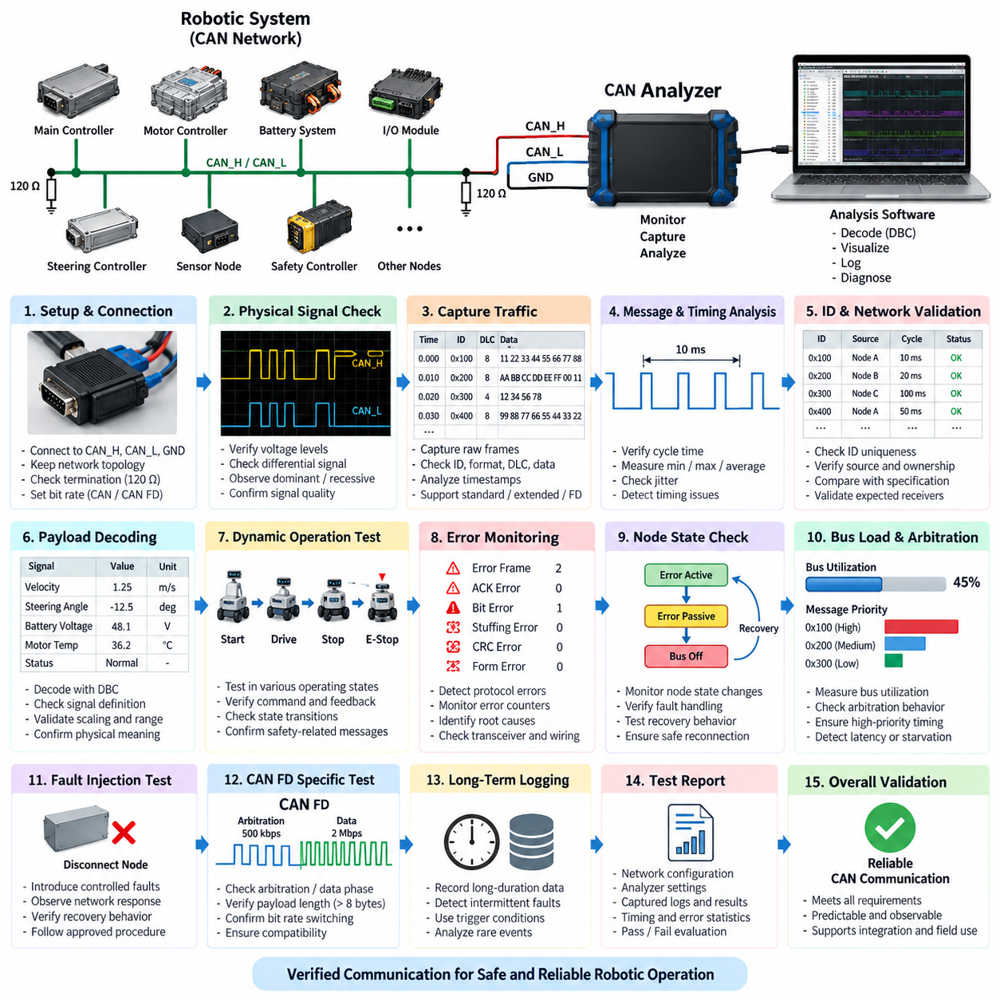
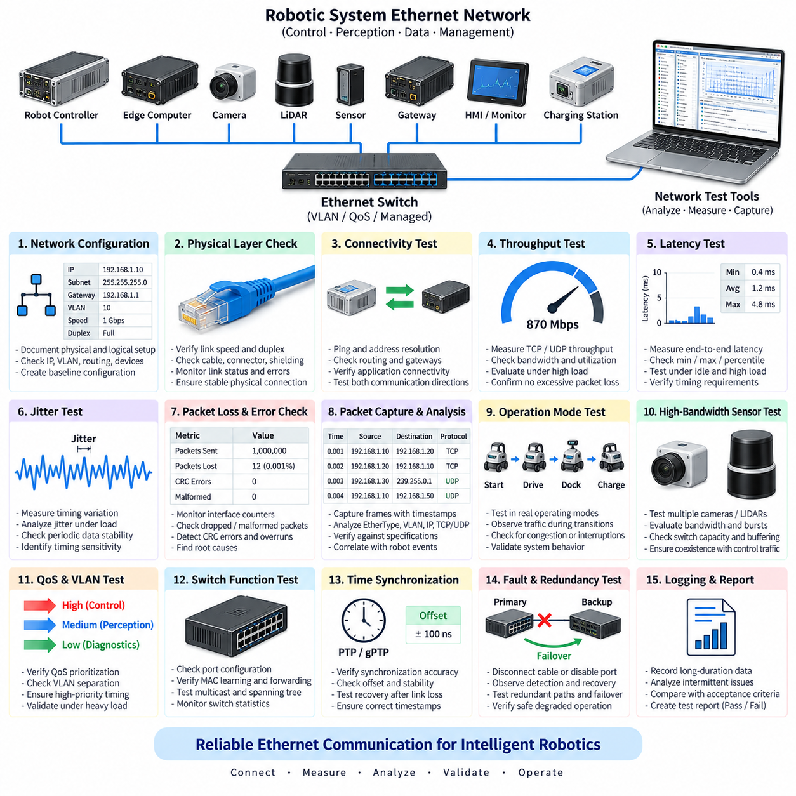
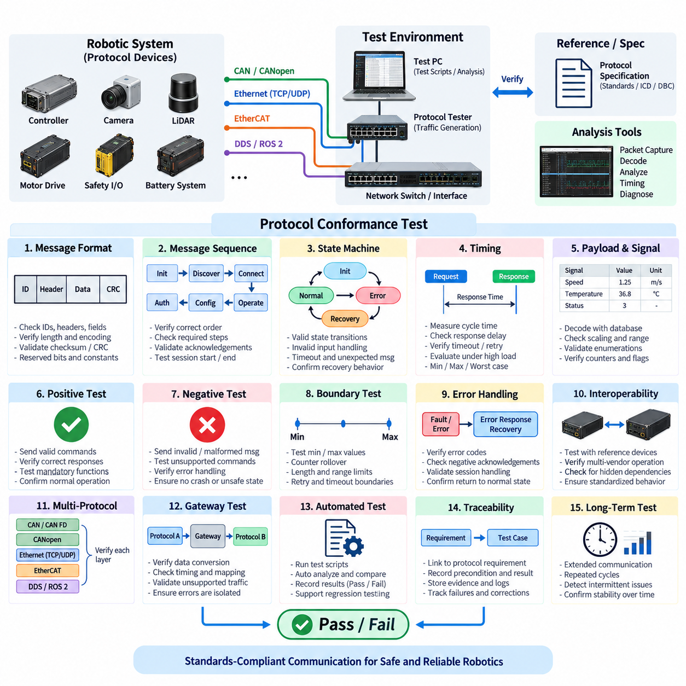
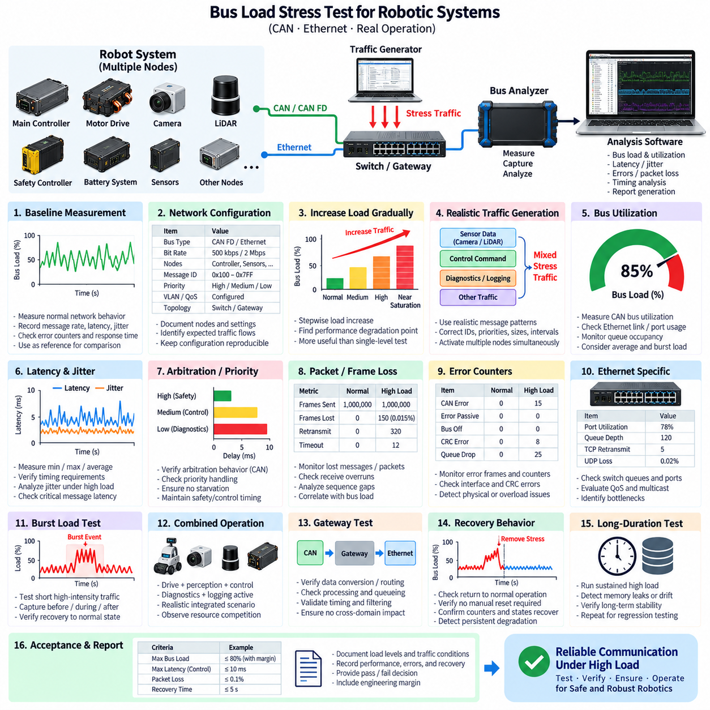
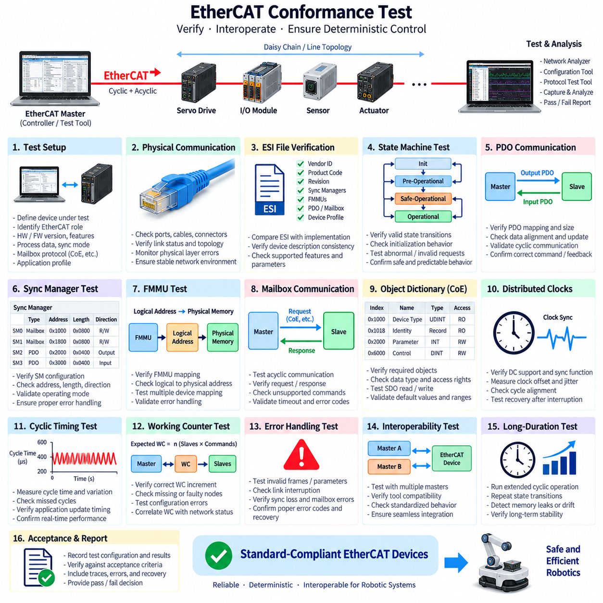

**Volume 19. Testing and Validation**


# Chapter 04. Communication Test

##  

## 04.01. CAN Bus Analyzer Test

{width="7.268055555555556in" height="7.268055555555556in"}

A CAN bus analyzer test verifies whether Controller Area Network communication operates correctly under the electrical, timing, protocol, and traffic conditions expected in the target robotic system. The analyzer observes communication without changing the intended behavior of the network and provides visibility into transmitted identifiers, data payloads, frame timing, bus utilization, error states, and node interactions.

The test begins by connecting a CAN analyzer to CAN_H, CAN_L, and the appropriate reference ground while maintaining the intended network topology. The analyzer interface must support the required CAN version, nominal bit rate, and, when applicable, CAN FD data-phase settings. Proper termination should be confirmed before detailed communication analysis because incorrect termination can create reflections and intermittent errors that resemble software or protocol faults.

Before active operation is evaluated, the physical bus should be observed for basic electrical integrity. CAN_H and CAN_L voltage behavior, differential signaling, dominant and recessive states, termination resistance, and waveform stability provide important evidence about network health. An oscilloscope may complement the analyzer when detailed signal quality must be examined, while the CAN analyzer concentrates on frame-level communication and protocol behavior.

After establishing a stable connection, the analyzer captures raw CAN traffic during representative robot operating states. Each captured frame is examined according to its identifier, frame format, data length, payload, transmission period, and timestamp. Standard and extended identifiers must be interpreted correctly, and remote, error, or CAN FD frames should be distinguished when they are supported by the architecture. This creates a communication-level record of actual system behavior.

Periodic messages are evaluated by measuring their transmission intervals and comparing them with the expected communication design. A message intended to be transmitted every 10 ms, for example, should maintain a sufficiently stable cycle time during normal operation and under increased processing load. Minimum, maximum, average, and jitter values help reveal scheduling problems, overloaded controllers, software timing variation, or arbitration delays that may not be visible from payload inspection alone.

Message identifiers should also be checked for uniqueness and correct ownership. Unexpected duplicate identifiers can cause multiple nodes to transmit frames with indistinguishable arbitration identifiers, potentially producing inconsistent data or difficult-to-diagnose behavior. The analyzer trace should therefore be compared with the communication database or interface specification so that each observed identifier, transmission source, cycle time, and expected receiver relationship can be validated systematically.

Payload validation determines whether the data contained in each frame represents the intended physical or logical information. Signal start bit, bit length, byte order, signedness, scaling factor, offset, range, and invalid-value definitions must correspond to the network specification. When a DBC or equivalent communication database is available, analyzer software can decode raw hexadecimal payloads into engineering values such as velocity, steering angle, battery voltage, motor temperature, or diagnostic status.

Dynamic testing is particularly important for robotic systems because CAN traffic changes with operating state. The analyzer should record communication while the robot is initialized, enabled, driven, stopped, placed into an emergency condition, charged, and transitioned between relevant operating modes. Correlating physical actions with CAN messages helps confirm that commands, acknowledgements, sensor values, state transitions, and safety-related status information propagate through the network as intended.

Error monitoring provides another major function of the CAN bus analyzer test. The test should identify error frames, acknowledgement errors, bit errors, stuffing errors, CRC errors, and other abnormal protocol events supported by the analyzer. Error counters and node state transitions should be monitored when accessible. Repeated errors can indicate defective termination, wiring problems, connector degradation, electromagnetic interference, incorrect bit timing, or malfunctioning CAN transceivers.

The CAN protocol includes mechanisms that prevent a defective node from continuously disrupting the network. A node may progress through error-active, error-passive, and bus-off behavior as its error counters increase. Testing should verify that communication faults are detected and that affected controllers respond according to the intended recovery strategy. Automatic recovery must be evaluated carefully because uncontrolled reconnection can repeatedly disturb a safety-relevant robotic network.

Bus utilization is measured to determine how much of the available communication capacity is consumed by normal traffic. Utilization should be observed not only during idle or nominal operation but also during demanding conditions in which diagnostic traffic, control commands, sensor updates, and status messages occur simultaneously. High utilization increases arbitration delay and can reduce timing margin, so the worst representative operating condition is more meaningful than an isolated average value.

Arbitration behavior should be examined because CAN assigns bus access according to message identifier priority. High-priority frames must obtain access without causing unacceptable starvation or latency for lower-priority traffic. Timestamp analysis can reveal whether control and safety messages meet their required timing while background, diagnostic, or monitoring traffic is present. This is especially important when motor controllers, battery systems, safety controllers, and supervisory computers share the same bus.

The analyzer can also support controlled fault investigation by comparing communication immediately before, during, and after an abnormal event. Disconnecting a permitted test node, interrupting a non-safety-critical message, changing traffic load in a controlled environment, or reproducing a known communication fault can expose recovery behavior. Such testing should follow an approved test procedure so that deliberate disturbances do not create uncontrolled actuator movement or damage connected equipment.

For AMRs and other Physical AI platforms, CAN often forms the deterministic lower-level communication path between edge computing and embedded devices such as motor controllers, steering controllers, battery management systems, power distribution units, and I/O controllers. Higher-level perception or planning may operate over Ethernet, while CAN transports compact commands and feedback close to actuators. Analyzer testing therefore helps verify the boundary between computational intelligence and physical execution.

CAN FD requires additional attention because arbitration and data phases may operate at different bit rates and payloads can exceed classical CAN limits. The analyzer must be configured with compatible nominal and data bit timing, and captured frames should be checked for correct format, payload length, bitrate switching, and error behavior. Mixed-network configurations require particular care because compatibility assumptions between classical CAN and CAN FD nodes can otherwise produce misleading results.

Long-duration logging is useful for detecting intermittent faults that may not appear during short laboratory tests. Timestamped traces can be collected during repeated missions, charging cycles, thermal changes, vibration exposure, or extended robot operation. Analysis can then identify rare missing messages, unusual latency, transient error bursts, unexpected resets, or gradual communication degradation. Trigger conditions reduce data volume by preserving traffic surrounding a selected event or error.

A complete CAN bus analyzer test should produce reproducible evidence rather than relying only on visual observation of live traffic. The test record should identify the network configuration, analyzer settings, bit rates, termination condition, software or firmware versions, operating scenarios, captured traces, detected errors, timing statistics, and acceptance criteria. Raw log files should be retained when practical so that communication behavior can be reanalyzed after software or hardware changes.

Pass or fail evaluation should be based on defined requirements for message presence, identifier correctness, payload validity, timing, jitter, error occurrence, bus utilization, fault handling, and recovery behavior. A network can appear operational while still containing timing or robustness defects, so successful transmission alone is insufficient. The analyzer test should demonstrate that communication remains predictable and diagnostically observable across the representative operating envelope.

CAN analyzer testing ultimately connects electrical validation, protocol verification, functional testing, and system-level debugging. Within the testing structure, it provides the first detailed communication test before broader Ethernet, protocol-conformance, bus-load, and EtherCAT evaluations. A disciplined CAN test process establishes trustworthy communication evidence that can support later integration, regression, reliability, and field validation of robotic electrical architectures.

CAN 버스 분석기 시험(CAN Bus Analyzer Test)은 대상 로봇 시스템에서 요구되는 전기적 조건, 타이밍 조건, 프로토콜 조건 및 통신 트래픽 조건에서 제어기 영역 네트워크(Controller Area Network) 통신이 올바르게 동작하는지를 검증한다. 분석기는 네트워크의 의도된 동작을 변경하지 않으면서 통신을 관찰하고, 전송 식별자(Identifier), 데이터 페이로드(Data Payload), 프레임 타이밍(Frame Timing), 버스 사용률(Bus Utilization), 오류 상태(Error State), 노드 간 상호작용(Node Interaction)을 확인할 수 있도록 한다.

시험은 의도된 네트워크 토폴로지(Network Topology)를 유지하면서 CAN 분석기(CAN Analyzer)를 CAN_H, CAN_L 및 적절한 기준 접지(Reference Ground)에 연결하는 것으로 시작한다. 분석기 인터페이스는 필요한 CAN 버전, 공칭 비트 전송률(Nominal Bit Rate), 필요한 경우 CAN FD 데이터 단계(Data Phase) 설정을 지원해야 한다. 부적절한 종단 처리는 소프트웨어나 프로토콜 결함처럼 보이는 반사(Reflection)와 간헐적 오류를 발생시킬 수 있으므로 상세 통신 분석 전에 올바른 종단(Termination) 상태를 확인해야 한다.

능동적인 시스템 동작을 평가하기 전에 기본적인 전기적 건전성(Electrical Integrity)을 확인하기 위해 물리 버스(Physical Bus)를 관찰해야 한다. CAN_H와 CAN_L의 전압 동작, 차동 신호(Differential Signaling), 우성 및 열성 상태(Dominant and Recessive States), 종단 저항(Termination Resistance), 파형 안정성(Waveform Stability)은 네트워크 상태를 판단하는 중요한 근거가 된다. 상세한 신호 품질을 조사해야 할 경우 오실로스코프(Oscilloscope)를 함께 사용할 수 있으며, CAN 분석기는 프레임 수준의 통신과 프로토콜 동작 분석에 집중한다.

안정적인 연결이 확보되면 분석기는 대표적인 로봇 운전 상태에서 원시 CAN 트래픽(Raw CAN Traffic)을 캡처한다. 캡처된 각 프레임은 식별자(Identifier), 프레임 형식(Frame Format), 데이터 길이(Data Length), 페이로드(Payload), 전송 주기(Transmission Period), 타임스탬프(Timestamp)를 기준으로 분석한다. 표준 및 확장 식별자(Standard and Extended Identifier)를 정확하게 해석해야 하며, 시스템 구조에서 지원되는 경우 원격 프레임(Remote Frame), 오류 프레임(Error Frame), CAN FD 프레임을 구분해야 한다.

주기 메시지(Periodic Message)는 전송 간격을 측정하고 이를 예상된 통신 설계와 비교하여 평가한다. 예를 들어 10 ms마다 전송하도록 설계된 메시지는 정상 운전뿐만 아니라 처리 부하가 증가한 조건에서도 충분히 안정적인 주기 시간을 유지해야 한다. 최소값, 최대값, 평균값 및 지터(Jitter)를 분석하면 페이로드 검사만으로는 발견하기 어려운 스케줄링 문제, 제어기 과부하, 소프트웨어 타이밍 변동 또는 중재 지연(Arbitration Delay)을 식별할 수 있다.

메시지 식별자(Message Identifier)는 고유성과 올바른 소유 관계도 확인해야 한다. 예상하지 못한 중복 식별자가 존재하면 여러 노드가 구분할 수 없는 동일한 중재 식별자(Arbitration Identifier)를 사용하여 프레임을 전송할 수 있으며, 이는 데이터 불일치 또는 진단하기 어려운 동작을 발생시킬 수 있다. 따라서 분석기 추적 데이터(Analyzer Trace)를 통신 데이터베이스 또는 인터페이스 사양과 비교하여 각 식별자, 전송 노드, 주기 시간 및 예상 수신 관계를 체계적으로 검증해야 한다.

페이로드 검증(Payload Validation)은 각 프레임에 포함된 데이터가 의도된 물리적 또는 논리적 정보를 나타내는지를 확인한다. 신호 시작 비트(Start Bit), 비트 길이(Bit Length), 바이트 순서(Byte Order), 부호 여부(Signedness), 스케일링 계수(Scaling Factor), 오프셋(Offset), 범위(Range), 무효값(Invalid Value)의 정의가 네트워크 사양과 일치해야 한다. DBC 또는 동등한 통신 데이터베이스가 제공되면 원시 16진수 페이로드를 속도, 조향각, 배터리 전압, 모터 온도, 진단 상태 등의 공학적 값(Engineering Value)으로 디코딩할 수 있다.

로봇 시스템에서는 운전 상태에 따라 CAN 트래픽이 변화하므로 동적 시험(Dynamic Testing)이 특히 중요하다. 로봇의 초기화, 활성화, 주행, 정지, 비상 상태 진입, 충전 및 주요 운전 모드 전환 과정에서 통신을 기록해야 한다. 물리적 동작과 CAN 메시지를 상호 연계하면 명령(Command), 응답(Acknowledgement), 센서 값, 상태 전환(State Transition), 안전 관련 상태 정보가 네트워크를 통해 의도한 방식으로 전달되는지를 확인할 수 있다.

오류 감시(Error Monitoring)는 CAN 버스 분석기 시험의 또 다른 핵심 기능이다. 분석기가 지원하는 범위에서 오류 프레임(Error Frame), 확인 응답 오류(Acknowledgement Error), 비트 오류(Bit Error), 스터핑 오류(Stuffing Error), 순환 중복 검사 오류(CRC Error) 및 기타 비정상적인 프로토콜 이벤트를 식별해야 한다. 반복적인 오류는 종단 결함, 배선 문제, 커넥터 열화, 전자기 간섭(EMI), 잘못된 비트 타이밍(Bit Timing), CAN 트랜시버(Transceiver) 이상 등을 나타낼 수 있다.

CAN 프로토콜은 결함이 발생한 노드가 지속적으로 네트워크를 방해하지 못하도록 하는 메커니즘을 포함한다. 오류 카운터(Error Counter)가 증가함에 따라 노드는 오류 활성(Error-Active), 오류 수동(Error-Passive), 버스 오프(Bus-Off) 상태로 전환될 수 있다. 시험에서는 통신 결함이 정상적으로 감지되고 해당 제어기가 의도된 복구 전략(Recovery Strategy)에 따라 대응하는지를 검증해야 한다. 제어되지 않은 자동 재접속은 안전 관련 로봇 네트워크를 반복적으로 방해할 수 있으므로 자동 복구 기능도 주의 깊게 평가해야 한다.

버스 사용률(Bus Utilization)은 정상 트래픽이 사용 가능한 통신 용량을 어느 정도 소비하는지를 평가하기 위해 측정한다. 유휴 또는 정상 운전 조건뿐만 아니라 진단 트래픽, 제어 명령, 센서 업데이트, 상태 메시지가 동시에 발생하는 높은 부하 조건에서도 사용률을 관찰해야 한다. 높은 버스 사용률은 중재 지연을 증가시키고 타이밍 여유(Timing Margin)를 감소시킬 수 있으므로 단순 평균값보다 대표적인 최악 운전 조건(Worst Representative Operating Condition)을 평가하는 것이 중요하다.

CAN은 메시지 식별자 우선순위(Message Identifier Priority)에 따라 버스 접근 권한을 결정하므로 중재 동작(Arbitration Behavior)도 분석해야 한다. 높은 우선순위 프레임은 필요한 시점에 버스 접근 권한을 획득해야 하지만 낮은 우선순위 트래픽에 허용할 수 없는 지연이나 기아 상태(Starvation)를 발생시켜서는 안 된다. 타임스탬프 분석(Timestamp Analysis)을 이용하면 모터 제어기, 배터리 시스템, 안전 제어기 및 상위 컴퓨터가 동일한 버스를 공유할 때 제어 및 안전 메시지의 요구 타이밍 충족 여부를 평가할 수 있다.

분석기는 비정상적인 이벤트의 발생 전, 발생 중, 발생 후 통신 상태를 비교함으로써 제어된 고장 조사(Controlled Fault Investigation)에도 활용할 수 있다. 허용된 시험 노드의 연결 해제, 비안전 핵심 메시지의 일시적 중단, 제어된 환경에서의 트래픽 부하 변화 또는 알려진 통신 결함의 재현을 통해 복구 동작을 확인할 수 있다. 이러한 시험은 의도하지 않은 액추에이터(Actuator) 동작이나 연결 장비의 손상을 방지하기 위해 승인된 시험 절차에 따라 수행해야 한다.

자율이동로봇(AMR)과 기타 피지컬 AI(Physical AI) 플랫폼에서 CAN은 엣지 컴퓨팅(Edge Computing)과 모터 제어기, 조향 제어기, 배터리 관리 시스템(BMS), 전력 분배 장치(PDU), 입출력 제어기(I/O Controller) 등의 임베디드 장치 사이를 연결하는 결정론적 하위 통신 경로(Deterministic Lower-Level Communication Path)로 사용되는 경우가 많다. 상위 인지와 계획은 이더넷(Ethernet)을 사용할 수 있는 반면 CAN은 액추에이터에 가까운 영역에서 간결한 명령과 피드백을 전달한다.

CAN FD는 중재 단계(Arbitration Phase)와 데이터 단계(Data Phase)가 서로 다른 비트 전송률로 동작할 수 있고 클래식 CAN(Classical CAN)보다 큰 페이로드를 지원하므로 추가적인 검증이 필요하다. 분석기는 호환되는 공칭 및 데이터 비트 타이밍으로 설정해야 하며, 캡처된 프레임의 형식, 페이로드 길이, 비트 전송률 전환(Bit Rate Switching), 오류 동작을 확인해야 한다. 혼합 네트워크에서는 클래식 CAN과 CAN FD 노드 사이의 호환성 가정을 특히 주의 깊게 검증해야 한다.

장시간 로깅(Long-Duration Logging)은 짧은 실험실 시험에서 나타나지 않는 간헐적 결함을 탐지하는 데 유용하다. 반복 임무, 충전 주기, 온도 변화, 진동 노출 또는 장시간 로봇 운전 중에 타임스탬프가 포함된 추적 데이터를 수집할 수 있다. 이를 분석하면 드물게 발생하는 메시지 누락, 비정상 지연, 일시적인 오류 집중, 예상하지 못한 리셋 또는 점진적인 통신 성능 저하를 식별할 수 있다. 트리거 조건(Trigger Condition)을 사용하면 특정 이벤트나 오류 전후의 트래픽을 선택적으로 보존할 수 있다.

완전한 CAN 버스 분석기 시험은 실시간 트래픽을 육안으로 관찰하는 수준을 넘어 재현 가능한 검증 근거(Reproducible Evidence)를 생성해야 한다. 시험 기록에는 네트워크 구성, 분석기 설정, 비트 전송률, 종단 상태, 소프트웨어 및 펌웨어 버전, 운전 시나리오, 캡처된 추적 데이터, 검출된 오류, 타이밍 통계 및 합격 기준(Acceptance Criteria)이 포함되어야 한다. 가능한 경우 원시 로그 파일(Raw Log File)을 보존하여 하드웨어나 소프트웨어 변경 이후에도 통신 동작을 다시 분석할 수 있도록 해야 한다.

합격 또는 불합격(Pass or Fail) 판정은 메시지 존재 여부, 식별자 정확성, 페이로드 유효성, 타이밍, 지터, 오류 발생, 버스 사용률, 고장 처리 및 복구 동작에 대해 정의된 요구사항을 기준으로 수행해야 한다. 네트워크가 외관상 정상적으로 동작하더라도 타이밍이나 강건성(Robustness) 결함이 존재할 수 있으므로 단순히 메시지가 성공적으로 전송된다는 사실만으로는 충분하지 않다. 대표적인 운전 범위 전체에서 통신의 예측 가능성과 진단 가능성을 입증해야 한다.

CAN 분석기 시험은 궁극적으로 전기적 검증(Electrical Validation), 프로토콜 검증(Protocol Verification), 기능 시험(Functional Testing), 시스템 수준 디버깅(System-Level Debugging)을 연결한다. 전체 시험 체계에서는 이더넷 네트워크 시험(Ethernet Network Test), 프로토콜 적합성 시험(Protocol Conformance Test), 버스 부하 스트레스 시험(Bus Load Stress Test), EtherCAT 적합성 시험(EtherCAT Conformance Test)으로 확장되기 전에 수행되는 상세 통신 시험의 출발점에 해당한다. 체계적인 CAN 시험 과정은 이후 로봇 전기 아키텍처의 통합, 회귀 시험(Regression Test), 신뢰성 검증(Reliability Validation), 현장 검증(Field Validation)을 지원하는 신뢰할 수 있는 통신 검증 근거를 제공한다.

##  

## 04.02. Ethernet Network Test

{width="7.268055555555556in" height="7.268055555555556in"}

Ethernet network testing verifies that wired communication between robotic controllers, edge computers, sensors, gateways, switches, and other networked devices operates with the required connectivity, bandwidth, latency, reliability, and fault tolerance. Unlike basic link confirmation, the test evaluates whether the Ethernet infrastructure can consistently support real-time control, perception data, diagnostics, and supervisory communication under representative operating conditions.

Testing begins by documenting the physical and logical network configuration. Device interfaces, switch ports, cable categories, connector types, negotiated link speeds, duplex modes, VLAN assignments, IP addresses, subnet masks, gateways, and routing rules should be identified. This baseline configuration allows unexpected behavior to be distinguished from intentional architecture and provides a reproducible reference for later regression and system-level validation.

Physical-layer verification confirms that every Ethernet connection establishes a stable link at the intended speed. Link indicators and interface statistics are checked for negotiation failures, link resets, packet errors, dropped frames, and abnormal retransmission behavior. Cable integrity, shielding, connector engagement, and grounding should also be considered because intermittent physical faults can appear as software, protocol, or application-level communication problems.

Basic connectivity is then verified between expected communication endpoints. ICMP echo testing, address resolution, routing checks, and direct application connections can confirm that devices are reachable through the intended network path. Connectivity should be tested in both directions where required, particularly when robots contain multiple subnets, managed switches, gateways, firewalls, or separated control and perception networks.

Throughput testing determines whether the network can transport the expected amount of data without excessive congestion or packet loss. TCP and UDP traffic should be evaluated because their behavior differs significantly under network stress. Measurements of sustained throughput, instantaneous bandwidth, packet rate, and utilization help determine whether high-volume sources such as cameras, LiDARs, logging systems, and edge computers can coexist with control communication.

Latency testing measures the time required for data to travel between network endpoints. Average latency alone is insufficient for robotic systems because occasional long delays may disrupt control or sensor processing even when the mean value appears acceptable. Minimum, maximum, percentile, and worst-case latency should therefore be examined under idle, nominal, and high-load conditions to determine whether communication remains within system timing requirements.

Jitter represents variation in packet delivery timing and is particularly important for periodic sensor streams and time-sensitive control traffic. Stable average latency with large jitter can still create inconsistent data arrival, buffer accumulation, synchronization errors, or control instability. Ethernet testing should therefore correlate jitter with traffic load, packet size, switch behavior, operating state, and competing network flows to identify timing sensitivity within the architecture.

Packet loss and error behavior should be monitored throughout testing. Interface counters, switch statistics, packet captures, and operating-system network diagnostics can reveal discarded packets, malformed frames, CRC errors, receive overruns, buffer exhaustion, or unexpected retransmissions. Persistent errors may indicate defective cables, connectors, transceivers, switch ports, electromagnetic interference, configuration mismatches, or excessive traffic concentration.

Packet capture provides detailed visibility into actual network communication. Tools such as protocol analyzers can record Ethernet frames and higher-layer traffic with timestamps for subsequent examination. Source and destination addresses, EtherType, VLAN tags, IP headers, TCP or UDP ports, packet lengths, sequence behavior, and application protocols can then be correlated with expected communication specifications and physical robot events.

Network traffic should be evaluated during representative robotic operating modes rather than only while the system is idle. Startup, sensor initialization, autonomous driving, mapping, perception processing, docking, charging, emergency stopping, diagnostics, data logging, and shutdown can produce significantly different traffic patterns. Capturing these transitions helps identify temporary congestion, communication interruptions, burst traffic, or dependencies that are hidden during steady operation.

For perception-intensive robots, camera and LiDAR traffic requires particular attention because these devices can consume a substantial portion of available Ethernet bandwidth. Multiple high-resolution sensors operating simultaneously may create bursts that compete with control or diagnostic communication. Testing should determine whether switch capacity, uplink bandwidth, buffering, and traffic prioritization remain sufficient when all intended sensors operate at their maximum representative data rates.

Quality of Service, traffic prioritization, and VLAN behavior should be verified when these mechanisms are included in the architecture. Safety-related, control, synchronization, perception, diagnostic, and background traffic may require different priorities or logical separation. Tests should confirm that VLAN boundaries are correctly maintained and that high-priority communication continues to satisfy latency requirements when lower-priority traffic generates substantial network load.

Managed switches should be examined as active components rather than treated as transparent wiring devices. Port configuration, forwarding behavior, MAC address learning, multicast handling, spanning-tree settings, VLAN configuration, traffic statistics, and diagnostic functions can directly affect robotic communication. Incorrect switch configuration may create intermittent failures that are difficult to reproduce unless switch state and packet traces are analyzed together.

Multicast and broadcast traffic require special evaluation in robotic networks using discovery mechanisms, middleware, or distributed sensor communication. Excessive multicast or broadcast traffic can unnecessarily consume bandwidth across multiple ports. Where protocols such as DDS or ROS 2 rely on discovery and distributed communication, testing should confirm that discovery occurs reliably and that switch configuration does not unintentionally block or amplify required traffic.

Time synchronization should be validated when distributed controllers and sensors depend on a common time reference. Precision Time Protocol, generalized PTP, hardware timestamping, or other synchronization mechanisms may be used depending on system requirements. Testing should measure synchronization accuracy, offset stability, delay variation, and recovery after link interruptions because inaccurate timestamps can degrade sensor fusion, localization, mapping, and coordinated control.

Fault testing evaluates how the network behaves when physical or logical communication is intentionally disturbed under controlled conditions. A cable may be disconnected, a switch port disabled, a device restarted, or selected traffic interrupted according to an approved test procedure. The resulting detection, timeout, degraded operation, reconnection, and recovery behavior should be observed to verify that communication failures do not produce uncontrolled robotic behavior.

Redundant Ethernet architectures require additional validation of failover behavior. When dual links, redundant switches, multiple interfaces, or alternative communication paths are provided, the primary path can be interrupted to determine whether traffic transfers correctly to the backup path. Failover time, packet loss during transition, application recovery, and restoration to normal operation should be measured rather than assuming redundancy guarantees uninterrupted communication.

Long-duration network logging is useful for detecting intermittent problems that short laboratory tests may miss. Interface statistics, switch counters, packet traces, latency measurements, and application communication status can be collected during extended missions or repeated operating cycles. Analysis can reveal rare link resets, progressive packet loss, traffic bursts, timing anomalies, or failures associated with temperature, vibration, processing load, or specific robot states.

For AMRs and Physical AI platforms, Ethernet often connects high-performance computing with perception sensors, gateways, fleet interfaces, and other bandwidth-intensive subsystems, while lower-level actuator control may use CAN, CANopen, EtherCAT, or dedicated interfaces. Ethernet network testing therefore verifies the communication backbone connecting perception, computation, coordination, diagnostics, and higher-level intelligence across the robotic architecture.

A complete test record should document the network topology, hardware configuration, cable and switch information, IP configuration, link speeds, software versions, test tools, traffic conditions, captured data, and measured performance. Throughput, latency, jitter, packet loss, synchronization accuracy, interface errors, and recovery times should be compared with defined acceptance criteria so that pass or fail decisions are based on measurable evidence.

Ethernet network testing provides the communication foundation for subsequent protocol conformance, bus-load stress, functional, reliability, and field validation. Within the communication-test structure, it complements CAN bus analyzer testing by addressing higher-bandwidth packet-based networking and prepares the system for more specialized protocol and deterministic-network evaluations. Reliable Ethernet operation is therefore essential for scalable, observable, and robust robotic system integration.

이더넷 네트워크 시험(Ethernet Network Test)은 로봇 제어기, 엣지 컴퓨터(Edge Computer), 센서, 게이트웨이(Gateway), 스위치 및 기타 네트워크 장치 사이의 유선 통신이 요구되는 연결성(Connectivity), 대역폭(Bandwidth), 지연시간(Latency), 신뢰성(Reliability), 고장 허용성(Fault Tolerance)을 만족하는지 검증한다. 단순한 링크 연결 확인을 넘어 실제 운용 조건에서 실시간 제어, 인지 데이터, 진단 및 상위 관리 통신을 지속적으로 지원할 수 있는지를 평가한다.

시험은 물리적 및 논리적 네트워크 구성(Physical and Logical Network Configuration)을 문서화하는 것에서 시작한다. 장치 인터페이스, 스위치 포트, 케이블 카테고리, 커넥터 종류, 협상된 링크 속도(Negotiated Link Speed), 듀플렉스 모드(Duplex Mode), VLAN 할당, IP 주소, 서브넷 마스크(Subnet Mask), 게이트웨이 및 라우팅 규칙(Routing Rule)을 식별해야 한다. 이러한 기준 구성(Baseline Configuration)은 비정상 동작과 의도된 아키텍처를 구분하고 이후 회귀 시험과 시스템 수준 검증을 위한 재현 가능한 기준을 제공한다.

물리 계층 검증(Physical-Layer Verification)은 모든 이더넷 연결이 의도된 속도로 안정적인 링크를 형성하는지 확인한다. 링크 표시 상태와 인터페이스 통계를 이용하여 협상 실패(Negotiation Failure), 링크 리셋(Link Reset), 패킷 오류(Packet Error), 프레임 손실(Dropped Frame), 비정상적인 재전송 동작을 검사한다. 간헐적인 물리적 결함은 소프트웨어, 프로토콜 또는 응용 계층의 통신 문제처럼 나타날 수 있으므로 케이블 건전성, 차폐(Shielding), 커넥터 체결 상태 및 접지(Grounding)도 함께 고려해야 한다.

그다음 예상되는 통신 종단점(Communication Endpoint) 사이의 기본 연결성을 검증한다. ICMP 에코 시험(ICMP Echo Test), 주소 해석(Address Resolution), 라우팅 확인 및 직접적인 응용 프로그램 연결을 통해 장치가 의도된 네트워크 경로를 통해 접근 가능한지 확인할 수 있다. 특히 로봇이 여러 서브넷, 관리형 스위치(Managed Switch), 게이트웨이, 방화벽(Firewall) 또는 분리된 제어 및 인지 네트워크를 사용하는 경우 필요한 통신에 대해 양방향 연결을 시험해야 한다.

처리량 시험(Throughput Test)은 네트워크가 과도한 혼잡이나 패킷 손실 없이 예상되는 데이터량을 전송할 수 있는지를 확인한다. TCP와 UDP 트래픽은 네트워크 부하 상황에서 동작 특성이 크게 다르므로 각각 평가해야 한다. 지속 처리량(Sustained Throughput), 순간 대역폭(Instantaneous Bandwidth), 패킷 전송률(Packet Rate), 네트워크 사용률(Utilization)을 측정하면 카메라, 라이다(LiDAR), 로깅 시스템 및 엣지 컴퓨터와 같은 대용량 데이터 발생 장치가 제어 통신과 함께 안정적으로 동작할 수 있는지를 판단할 수 있다.

지연시간 시험(Latency Test)은 데이터가 네트워크 종단점 사이를 이동하는 데 필요한 시간을 측정한다. 로봇 시스템에서는 평균 지연시간만으로 충분하지 않은데, 평균값이 허용 범위에 있더라도 간헐적으로 발생하는 긴 지연이 제어나 센서 처리를 방해할 수 있기 때문이다. 따라서 유휴 상태, 정상 상태 및 높은 네트워크 부하 조건에서 최소, 최대, 백분위수(Percentile), 최악 조건 지연시간(Worst-Case Latency)을 분석하여 통신이 시스템 타이밍 요구사항을 만족하는지 확인해야 한다.

지터(Jitter)는 패킷 전달 시간의 변동을 나타내며 주기적인 센서 스트림과 시간 민감형 제어 트래픽(Time-Sensitive Control Traffic)에서 특히 중요하다. 평균 지연시간이 안정적이더라도 큰 지터가 발생하면 데이터 도착 시점의 불규칙성, 버퍼 축적(Buffer Accumulation), 동기화 오류 또는 제어 불안정성이 발생할 수 있다. 따라서 이더넷 시험에서는 지터를 트래픽 부하, 패킷 크기, 스위치 동작, 운전 상태 및 경쟁 네트워크 흐름과 연계하여 분석해야 한다.

패킷 손실(Packet Loss)과 오류 동작은 시험 전체 과정에서 지속적으로 감시해야 한다. 인터페이스 카운터, 스위치 통계, 패킷 캡처(Packet Capture), 운영체제 네트워크 진단을 이용하면 폐기된 패킷, 비정상 프레임(Malformed Frame), CRC 오류, 수신 오버런(Receive Overrun), 버퍼 고갈(Buffer Exhaustion), 예상하지 못한 재전송을 확인할 수 있다. 지속적인 오류는 케이블, 커넥터, 트랜시버(Transceiver), 스위치 포트의 결함이나 전자기 간섭(EMI), 구성 불일치 또는 과도한 트래픽 집중을 의미할 수 있다.

패킷 캡처(Packet Capture)는 실제 네트워크 통신을 상세하게 관찰할 수 있도록 한다. 프로토콜 분석기(Protocol Analyzer)와 같은 도구를 이용하여 이더넷 프레임과 상위 계층 트래픽을 타임스탬프와 함께 기록하고 이후 분석할 수 있다. 송신 및 수신 주소, 이더타입(EtherType), VLAN 태그, IP 헤더, TCP 또는 UDP 포트, 패킷 길이, 시퀀스 동작 및 응용 프로토콜을 예상 통신 사양과 실제 로봇의 물리적 이벤트에 연계하여 분석할 수 있다.

네트워크 트래픽은 시스템이 유휴 상태일 때만 시험하는 것이 아니라 대표적인 로봇 운전 모드에서 평가해야 한다. 시작, 센서 초기화, 자율주행, 매핑(Mapping), 인지 처리(Perception Processing), 도킹(Docking), 충전, 비상 정지, 진단, 데이터 로깅 및 종료 과정에서는 서로 다른 트래픽 패턴이 발생할 수 있다. 이러한 상태 전환을 캡처하면 정상 운전 상태에서는 발견하기 어려운 일시적인 혼잡, 통신 중단, 버스트 트래픽(Burst Traffic) 또는 시스템 간 의존성을 확인할 수 있다.

인지 중심 로봇(Perception-Intensive Robot)에서는 카메라와 라이다 트래픽이 사용 가능한 이더넷 대역폭의 상당 부분을 소비할 수 있으므로 특별한 주의가 필요하다. 여러 고해상도 센서가 동시에 동작하면 제어 또는 진단 통신과 경쟁하는 순간적인 대용량 트래픽이 발생할 수 있다. 모든 센서가 대표적인 최대 데이터 전송률로 동시에 동작할 때에도 스위치 용량, 업링크 대역폭(Uplink Bandwidth), 버퍼링(Buffering), 트래픽 우선순위 지정(Traffic Prioritization)이 충분한지를 시험해야 한다.

서비스 품질(Quality of Service, QoS), 트래픽 우선순위 지정 및 VLAN 기능이 아키텍처에 포함되어 있다면 이들의 동작을 검증해야 한다. 안전 관련, 제어, 동기화, 인지, 진단 및 백그라운드 트래픽은 서로 다른 우선순위나 논리적 분리가 필요할 수 있다. 시험에서는 VLAN 경계가 올바르게 유지되는지 확인하고 낮은 우선순위 트래픽이 상당한 네트워크 부하를 발생시키는 상황에서도 높은 우선순위 통신이 요구되는 지연시간을 만족하는지 검증해야 한다.

관리형 스위치(Managed Switch)는 단순히 투명한 배선 장치로 간주하지 않고 능동적인 네트워크 구성요소(Active Network Component)로 평가해야 한다. 포트 구성, 전달 동작(Forwarding Behavior), MAC 주소 학습(MAC Address Learning), 멀티캐스트 처리(Multicast Handling), 스패닝 트리(Spanning Tree) 설정, VLAN 구성, 트래픽 통계 및 진단 기능은 로봇 통신에 직접적인 영향을 줄 수 있다. 잘못된 스위치 설정은 스위치 상태와 패킷 추적 데이터를 함께 분석하지 않으면 재현하기 어려운 간헐적 고장을 발생시킬 수 있다.

멀티캐스트(Multicast)와 브로드캐스트(Broadcast) 트래픽은 검색 메커니즘(Discovery Mechanism), 미들웨어(Middleware) 또는 분산 센서 통신을 사용하는 로봇 네트워크에서 별도로 평가해야 한다. 과도한 멀티캐스트 또는 브로드캐스트 트래픽은 여러 포트에서 불필요하게 대역폭을 소비할 수 있다. DDS 또는 ROS 2와 같은 프로토콜이 검색과 분산 통신에 사용되는 경우 검색 과정이 안정적으로 수행되고 스위치 구성이 필요한 트래픽을 의도하지 않게 차단하거나 증폭시키지 않는지 확인해야 한다.

분산 제어기와 센서가 공통 시간 기준(Common Time Reference)에 의존하는 경우 시간 동기화(Time Synchronization)를 검증해야 한다. 시스템 요구사항에 따라 정밀 시간 프로토콜(Precision Time Protocol, PTP), 일반화 정밀 시간 프로토콜(gPTP), 하드웨어 타임스탬핑(Hardware Timestamping) 또는 기타 동기화 메커니즘을 사용할 수 있다. 부정확한 타임스탬프는 센서 융합, 위치추정(Localization), 매핑 및 협조 제어(Coordinated Control)의 성능을 저하시킬 수 있으므로 동기화 정확도, 오프셋 안정성, 지연 변동 및 링크 중단 후 복구를 측정해야 한다.

고장 시험(Fault Testing)은 물리적 또는 논리적 통신을 통제된 조건에서 의도적으로 방해했을 때 네트워크가 어떻게 동작하는지를 평가한다. 승인된 시험 절차에 따라 케이블을 분리하거나, 스위치 포트를 비활성화하거나, 장치를 재시작하거나, 특정 트래픽을 중단할 수 있다. 이후 고장 감지, 타임아웃(Timeout), 성능 저하 운전(Degraded Operation), 재접속 및 복구 동작을 관찰하여 통신 장애가 제어되지 않은 로봇 동작으로 이어지지 않는지 확인해야 한다.

이중화 이더넷 아키텍처(Redundant Ethernet Architecture)는 장애 전환(Failover) 동작에 대한 추가적인 검증이 필요하다. 이중 링크, 이중화 스위치, 복수 네트워크 인터페이스 또는 대체 통신 경로가 제공되는 경우 기본 경로를 중단하여 트래픽이 백업 경로로 정상적으로 전환되는지 확인할 수 있다. 이중화가 통신의 무중단을 자동으로 보장한다고 가정해서는 안 되며 장애 전환 시간, 전환 중 패킷 손실, 응용 프로그램 복구 및 정상 경로 복원 과정을 측정해야 한다.

장시간 네트워크 로깅(Long-Duration Network Logging)은 짧은 실험실 시험에서 발견하기 어려운 간헐적 문제를 탐지하는 데 유용하다. 장시간 임무 또는 반복 운전 주기 동안 인터페이스 통계, 스위치 카운터, 패킷 추적 데이터, 지연시간 측정값 및 응용 프로그램 통신 상태를 수집할 수 있다. 이를 분석하면 드물게 발생하는 링크 리셋, 점진적인 패킷 손실, 트래픽 버스트, 타이밍 이상 또는 온도, 진동, 처리 부하 및 특정 로봇 상태와 관련된 고장을 확인할 수 있다.

자율이동로봇(AMR)과 피지컬 AI(Physical AI) 플랫폼에서 이더넷은 고성능 컴퓨팅(High-Performance Computing)을 인지 센서, 게이트웨이, 플릿 인터페이스(Fleet Interface) 및 기타 대역폭 집약형 하위 시스템과 연결하는 데 주로 사용되며, 하위 수준의 액추에이터 제어에는 CAN, CANopen, EtherCAT 또는 전용 인터페이스가 사용될 수 있다. 따라서 이더넷 네트워크 시험은 로봇 아키텍처 전반에서 인지, 연산, 협조, 진단 및 상위 지능을 연결하는 통신 백본(Communication Backbone)을 검증한다.

완전한 시험 기록(Test Record)은 네트워크 토폴로지, 하드웨어 구성, 케이블 및 스위치 정보, IP 구성, 링크 속도, 소프트웨어 버전, 시험 도구, 트래픽 조건, 캡처 데이터 및 측정된 성능을 문서화해야 한다. 처리량, 지연시간, 지터, 패킷 손실, 동기화 정확도, 인터페이스 오류 및 복구 시간을 정의된 합격 기준(Acceptance Criteria)과 비교하여 합격 또는 불합격(Pass or Fail) 판정이 측정 가능한 근거에 기반하도록 해야 한다.

이더넷 네트워크 시험(Ethernet Network Test)은 이후 수행되는 프로토콜 적합성 시험(Protocol Conformance Test), 버스 부하 스트레스 시험(Bus-Load Stress Test), 기능 시험(Functional Test), 신뢰성 시험(Reliability Test), 현장 검증(Field Validation)을 위한 통신 기반을 제공한다. 통신 시험 체계에서는 CAN 버스 분석기 시험(CAN Bus Analyzer Test)을 보완하여 고대역폭 패킷 기반 네트워크를 검증하고, 보다 전문적인 프로토콜 및 결정론적 네트워크(Deterministic Network) 평가를 위한 기반을 마련한다. 따라서 신뢰할 수 있는 이더넷 동작은 확장 가능하고 관찰 가능하며 강건한 로봇 시스템 통합을 위한 핵심 조건이다.

##  

## 04.03. Protocol Conformance Test

{width="7.268055555555556in" height="7.268055555555556in"}

Protocol conformance testing verifies that communication devices, controllers, gateways, sensors, and software components implement a defined protocol according to its specification and system interface requirements. The objective is not merely to confirm that two devices can exchange data, but to determine whether message formats, sequences, timing, states, error responses, and optional functions behave consistently with the expected protocol definition.

The test begins by defining the protocol implementation under test and establishing a reference specification. This may include an international standard, industry specification, vendor interface document, communication database, interface control document, or project-specific protocol definition. The supported protocol version, physical interface, transport mechanism, message set, device role, mandatory functions, and optional capabilities should be clearly identified before execution begins.

A conformance test environment typically includes the device under test, reference communication equipment, monitoring or analysis software, traffic generation tools, and controlled network infrastructure. The environment should allow valid messages, boundary conditions, malformed inputs, timing variations, and abnormal sequences to be introduced reproducibly. Accurate timestamps and complete communication traces are important because many protocol violations are associated with sequence or timing rather than individual data values.

Message-format validation confirms that transmitted frames or packets follow the required structural definition. Identifiers, headers, addresses, control fields, payload lengths, data encoding, counters, checksums, CRC fields, and reserved bits should be examined where applicable. Fields defined as constant or reserved must contain permitted values, while variable fields should remain within their specified ranges and follow the required byte order and encoding conventions.

Message sequence testing evaluates whether communication occurs in the correct procedural order. Many protocols require initialization, discovery, connection establishment, authentication, configuration, command exchange, acknowledgement, state transition, and termination to follow defined sequences. A device that generates individually valid messages can still violate the protocol if those messages are transmitted in an incorrect state or at an inappropriate point in the communication procedure.

State-machine behavior is therefore an important part of protocol conformance. The device should enter, remain in, and leave protocol states only when permitted conditions occur. Normal transitions are tested first, followed by invalid commands, unexpected messages, repeated requests, missing responses, timeouts, and interrupted communication. The resulting state should correspond to the defined protocol behavior rather than producing an undefined or uncontrolled operating condition.

Timing conformance verifies requirements such as message cycle time, response time, acknowledgement delay, timeout duration, retry interval, heartbeat period, and session timing. Measurements should include minimum, maximum, average, percentile, and worst representative values where appropriate. Timing should also be evaluated under increased processor and network load because a device may satisfy requirements during an idle laboratory test but violate them during realistic robotic operation.

Payload and signal validation confirms that transmitted data has the intended interpretation. Signal position, bit length, byte order, signedness, scaling, offset, physical range, enumerated states, invalid values, counters, and status flags should match the applicable communication definition. When databases or machine-readable interface descriptions are available, automated decoding can compare captured traffic directly with expected signal definitions and reduce manual interpretation errors.

Positive conformance testing applies valid protocol inputs and confirms that the device produces the required responses. Supported commands, requests, state changes, configuration operations, diagnostic functions, and normal data exchanges should execute successfully. This establishes that mandatory protocol capabilities are implemented and provides a baseline before more demanding negative, boundary, stress, and fault-oriented test cases are introduced.

Negative testing intentionally provides unsupported, malformed, incomplete, duplicated, out-of-order, or otherwise invalid communication. The purpose is to verify that the implementation rejects or handles abnormal inputs according to the protocol definition without crashing, entering an undefined state, or generating unsafe outputs. Invalid identifiers, lengths, values, sequences, checksums, commands, and timing conditions can be introduced when they are meaningful for the protocol being evaluated.

Boundary-value testing examines behavior near permitted limits. Minimum and maximum payload sizes, numeric ranges, counter rollover, timeout boundaries, maximum retry counts, address limits, sequence numbers, and resource-related limits should be exercised where defined. Boundary testing is particularly valuable because implementations that behave correctly during nominal communication may contain defects that appear only when counters wrap or parameters reach extreme values.

Error-handling conformance verifies the response to communication failures and protocol violations. Depending on the protocol, expected behavior may include an error response, negative acknowledgement, diagnostic code, retry, timeout, state transition, session termination, or controlled recovery. The test should verify both the externally visible response and the subsequent ability of the device to return to valid communication without requiring an unintended reset or manual intervention.

Interoperability should be distinguished from strict conformance even though the two are closely related. Two nonconforming implementations can sometimes communicate because they share the same undocumented assumption, while two conforming devices should communicate through standardized behavior. Testing with reference implementations, multiple vendors, or independent analysis tools can therefore reveal hidden dependencies that are not visible when only one pair of devices is tested together.

Protocol conformance in robotic systems often spans multiple communication layers. CAN or CAN FD may transport control and diagnostic messages, CANopen may define device profiles, Ethernet may carry TCP or UDP traffic, EtherCAT may support deterministic motion communication, and DDS or ROS 2 may provide distributed middleware communication. Each layer should be evaluated against the requirements that actually apply to its role rather than treating the complete network as a single protocol.

Gateway testing requires particular attention because gateways translate or route information between communication domains. A gateway may convert identifiers, signals, addressing, timing, diagnostic information, or protocol semantics while preserving the intended system meaning. Conformance testing should verify that required data is transferred correctly, unsupported traffic is handled as designed, timing remains acceptable, and errors on one network are not propagated incorrectly into another domain.

For AMRs and Physical AI platforms, protocol conformance directly affects the boundary between high-level intelligence and physical execution. Commands generated by planning or supervisory software eventually reach embedded controllers, motor drives, safety devices, sensors, battery systems, and other physical components through defined interfaces. A semantic or sequencing error at this boundary can produce incorrect behavior even when the electrical network and individual communication links remain healthy.

Automated conformance testing improves repeatability when the protocol contains many messages, states, and parameter combinations. Test scripts can generate predefined inputs, capture responses, evaluate timing, compare payloads, check state transitions, and automatically record pass or fail results. Automation is especially valuable for regression testing because firmware, middleware, gateway, or application changes can be evaluated against the same protocol requirements throughout system development.

Traceability should connect each conformance test case to a specific protocol requirement or interface requirement. The test record should identify the requirement, preconditions, input stimulus, expected response, measured result, captured evidence, and final verdict. This prevents a large collection of packet traces from being mistaken for systematic verification and allows failed requirements to be traced directly to implementation defects and corrective actions.

Long-duration and repeated testing can expose protocol defects that occur only after extensive communication. Counter rollover, resource leakage, session accumulation, repeated reconnection, intermittent timeout behavior, and gradual synchronization problems may remain hidden during short tests. Repeating protocol sequences while varying traffic load, operating state, and connection conditions provides stronger evidence that conformance is maintained throughout realistic robot operation.

Pass or fail evaluation should consider message structure, sequence, state behavior, timing, payload interpretation, error handling, mandatory functions, and recovery behavior. A device should not be considered conformant merely because normal communication appears functional. Any deviation from a mandatory requirement should be documented with the corresponding trace, operating condition, expected behavior, actual behavior, severity, and disposition for correction or approved exception.

Protocol conformance testing complements CAN bus analyzer and Ethernet network testing within the communication validation structure. CAN and Ethernet tests establish whether the underlying communication paths operate correctly, while conformance testing determines whether information exchanged across those paths follows the required communication rules. Together, these tests provide the foundation for subsequent bus-load stress, functional, reliability, regression, and field validation of robotic systems.

프로토콜 적합성 시험(Protocol Conformance Test)은 통신 장치, 제어기, 게이트웨이(Gateway), 센서 및 소프트웨어 구성요소가 정의된 프로토콜을 해당 사양과 시스템 인터페이스 요구사항에 따라 구현하고 있는지를 검증한다. 단순히 두 장치가 데이터를 교환할 수 있는지를 확인하는 것이 아니라 메시지 형식, 순서, 타이밍, 상태, 오류 응답 및 선택 기능이 예상된 프로토콜 정의와 일관되게 동작하는지를 판단하는 것이 목적이다.

시험은 시험 대상 프로토콜 구현(Protocol Implementation Under Test)을 정의하고 기준 사양(Reference Specification)을 설정하는 것에서 시작한다. 여기에는 국제 표준, 산업 표준, 공급업체 인터페이스 문서, 통신 데이터베이스, 인터페이스 제어 문서(Interface Control Document) 또는 프로젝트별 프로토콜 정의가 포함될 수 있다. 시험 전에 지원되는 프로토콜 버전, 물리 인터페이스, 전송 메커니즘, 메시지 집합, 장치 역할, 필수 기능 및 선택 기능을 명확하게 식별해야 한다.

적합성 시험 환경(Conformance Test Environment)은 일반적으로 시험 대상 장치(Device Under Test), 기준 통신 장비, 모니터링 또는 분석 소프트웨어, 트래픽 생성 도구 및 제어 가능한 네트워크 인프라로 구성된다. 정상 메시지, 경계 조건, 비정상 입력, 타이밍 변화 및 잘못된 순서를 재현 가능하게 입력할 수 있어야 한다. 많은 프로토콜 위반이 개별 데이터 값보다 메시지 순서나 타이밍과 관련되므로 정확한 타임스탬프(Timestamp)와 완전한 통신 추적 데이터가 중요하다.

메시지 형식 검증(Message-Format Validation)은 전송되는 프레임 또는 패킷이 요구되는 구조적 정의를 따르는지를 확인한다. 해당되는 경우 식별자, 헤더(Header), 주소, 제어 필드(Control Field), 페이로드 길이, 데이터 인코딩(Data Encoding), 카운터, 체크섬(Checksum), CRC 필드 및 예약 비트(Reserved Bit)를 검사해야 한다. 상수 또는 예약 영역으로 정의된 필드는 허용된 값을 가져야 하며 가변 필드는 지정된 범위와 바이트 순서 및 인코딩 규칙을 준수해야 한다.

메시지 순서 시험(Message Sequence Testing)은 통신이 올바른 절차적 순서에 따라 수행되는지를 평가한다. 많은 프로토콜에서는 초기화, 검색(Discovery), 연결 설정, 인증(Authentication), 구성, 명령 교환, 확인 응답(Acknowledgement), 상태 전환 및 종료가 정의된 순서에 따라 진행되어야 한다. 개별 메시지가 모두 유효하더라도 잘못된 상태나 부적절한 통신 단계에서 전송된다면 해당 장치는 프로토콜을 위반할 수 있다.

따라서 상태 머신 동작(State-Machine Behavior)은 프로토콜 적합성의 중요한 평가 항목이다. 장치는 허용된 조건이 발생하는 경우에만 프로토콜 상태에 진입하고, 해당 상태를 유지하거나 이탈해야 한다. 먼저 정상적인 상태 전환을 시험한 후 잘못된 명령, 예상하지 못한 메시지, 반복 요청, 응답 누락, 타임아웃(Timeout) 및 통신 중단을 시험한다. 그 결과 발생하는 상태는 정의되지 않거나 제어되지 않은 상태가 아니라 프로토콜에서 규정한 동작과 일치해야 한다.

타이밍 적합성(Timing Conformance)은 메시지 주기 시간, 응답 시간, 확인 응답 지연, 타임아웃 시간, 재시도 간격, 하트비트 주기(Heartbeat Period), 세션 타이밍(Session Timing) 등의 요구사항을 검증한다. 필요한 경우 최소값, 최대값, 평균값, 백분위수(Percentile), 대표적인 최악 조건 값을 측정해야 한다. 유휴 실험실 조건에서는 요구사항을 만족하지만 실제 로봇 운전에서는 위반할 수 있으므로 프로세서 및 네트워크 부하가 증가한 상태에서도 타이밍을 평가해야 한다.

페이로드 및 신호 검증(Payload and Signal Validation)은 전송된 데이터가 의도한 의미를 갖는지를 확인한다. 신호 위치, 비트 길이, 바이트 순서, 부호 여부(Signedness), 스케일링(Scaling), 오프셋(Offset), 물리적 범위, 열거형 상태(Enumerated State), 무효값, 카운터 및 상태 플래그(Status Flag)가 해당 통신 정의와 일치해야 한다. 데이터베이스 또는 기계 판독형 인터페이스 설명이 제공되는 경우 자동 디코딩을 통해 캡처된 트래픽을 예상 신호 정의와 직접 비교하여 수동 해석 오류를 줄일 수 있다.

정상 적합성 시험(Positive Conformance Testing)은 유효한 프로토콜 입력을 적용하고 장치가 요구되는 응답을 생성하는지 확인한다. 지원되는 명령, 요청, 상태 변경, 구성 작업, 진단 기능 및 정상적인 데이터 교환이 성공적으로 수행되어야 한다. 이를 통해 필수 프로토콜 기능이 구현되었음을 확인하고 이후 더 까다로운 비정상, 경계, 스트레스 및 고장 중심 시험을 수행하기 위한 기준 상태를 확보한다.

부정 시험(Negative Testing)은 지원되지 않거나 형식이 잘못되었거나 불완전하거나 중복되었거나 순서가 뒤바뀐 통신과 같은 비정상 입력을 의도적으로 제공한다. 구현체가 충돌하거나 정의되지 않은 상태에 진입하거나 안전하지 않은 출력을 생성하지 않으면서 프로토콜 정의에 따라 비정상 입력을 거부하거나 처리하는지를 검증하는 것이 목적이다. 프로토콜 특성에 따라 잘못된 식별자, 길이, 값, 순서, 체크섬, 명령 및 타이밍 조건을 입력할 수 있다.

경계값 시험(Boundary-Value Testing)은 허용된 한계 부근에서 시스템의 동작을 평가한다. 정의된 경우 최소 및 최대 페이로드 크기, 수치 범위, 카운터 롤오버(Counter Rollover), 타임아웃 경계, 최대 재시도 횟수, 주소 한계, 시퀀스 번호 및 자원 관련 한계를 시험해야 한다. 정상적인 통신에서는 올바르게 동작하는 구현체도 카운터가 순환하거나 매개변수가 극단값에 도달할 때 결함이 나타날 수 있으므로 경계값 시험은 특히 중요하다.

오류 처리 적합성(Error-Handling Conformance)은 통신 장애 및 프로토콜 위반에 대한 응답을 검증한다. 프로토콜에 따라 오류 응답, 부정 확인 응답(Negative Acknowledgement), 진단 코드, 재시도, 타임아웃, 상태 전환, 세션 종료 또는 제어된 복구가 요구될 수 있다. 시험에서는 외부에서 관찰되는 응답뿐만 아니라 의도하지 않은 리셋이나 수동 개입 없이 장치가 정상적인 통신 상태로 복귀할 수 있는지도 확인해야 한다.

상호운용성(Interoperability)은 엄격한 적합성(Conformance)과 밀접하게 관련되어 있지만 서로 구분해야 한다. 동일한 문서화되지 않은 가정을 공유하는 두 개의 비적합 구현체가 서로 통신할 수도 있지만, 적합한 장치들은 표준화된 동작을 통해 상호 통신할 수 있어야 한다. 따라서 기준 구현(Reference Implementation), 여러 공급업체 장치 또는 독립적인 분석 도구를 이용한 시험은 하나의 장치 조합만 시험할 경우 발견하기 어려운 숨겨진 의존성을 식별할 수 있다.

로봇 시스템의 프로토콜 적합성은 여러 통신 계층(Communication Layer)에 걸쳐 적용되는 경우가 많다. CAN 또는 CAN FD는 제어 및 진단 메시지를 전송할 수 있고, CANopen은 장치 프로파일(Device Profile)을 정의할 수 있으며, 이더넷은 TCP 또는 UDP 트래픽을 전달할 수 있다. EtherCAT은 결정론적 모션 통신을 지원하고 DDS 또는 ROS 2는 분산 미들웨어 통신을 제공할 수 있다. 전체 네트워크를 하나의 프로토콜로 취급하지 않고 각 계층의 역할에 실제로 적용되는 요구사항을 기준으로 평가해야 한다.

게이트웨이 시험(Gateway Testing)은 게이트웨이가 서로 다른 통신 도메인 사이에서 정보를 변환하거나 라우팅하기 때문에 특별한 주의가 필요하다. 게이트웨이는 의도된 시스템 의미를 유지하면서 식별자, 신호, 주소 지정, 타이밍, 진단 정보 또는 프로토콜 의미론(Protocol Semantics)을 변환할 수 있다. 필요한 데이터가 정확하게 전달되고 지원되지 않는 트래픽이 설계대로 처리되며 타이밍이 허용 범위를 유지하고 한 네트워크의 오류가 다른 도메인으로 잘못 전파되지 않는지 검증해야 한다.

자율이동로봇(AMR)과 피지컬 AI(Physical AI) 플랫폼에서 프로토콜 적합성은 상위 지능(High-Level Intelligence)과 물리적 실행(Physical Execution) 사이의 경계에 직접적인 영향을 미친다. 계획 또는 상위 관리 소프트웨어에서 생성된 명령은 정의된 인터페이스를 통해 최종적으로 임베디드 제어기, 모터 드라이브, 안전 장치, 센서, 배터리 시스템 및 기타 물리적 구성요소에 전달된다. 이 경계에서 의미적 또는 순서상의 오류가 발생하면 전기 네트워크와 개별 통신 링크가 정상이어도 잘못된 동작이 발생할 수 있다.

자동화된 적합성 시험(Automated Conformance Testing)은 프로토콜에 많은 메시지, 상태 및 매개변수 조합이 포함된 경우 시험의 반복성을 향상시킨다. 시험 스크립트는 사전에 정의된 입력을 생성하고, 응답을 캡처하며, 타이밍을 평가하고, 페이로드를 비교하며, 상태 전환을 검사하고 합격 또는 불합격 결과를 자동으로 기록할 수 있다. 특히 펌웨어, 미들웨어, 게이트웨이 또는 응용 프로그램 변경 사항을 개발 전 과정에서 동일한 프로토콜 요구사항을 기준으로 검증하는 회귀 시험(Regression Testing)에 효과적이다.

추적성(Traceability)은 각각의 적합성 시험 사례를 특정 프로토콜 요구사항 또는 인터페이스 요구사항과 연결해야 한다. 시험 기록에는 요구사항, 사전 조건(Precondition), 입력 자극(Input Stimulus), 예상 응답, 측정 결과, 캡처된 증거 및 최종 판정을 기록해야 한다. 이를 통해 단순히 많은 패킷 추적 데이터를 수집한 것을 체계적인 검증으로 오인하는 것을 방지하고 실패한 요구사항을 구현 결함 및 수정 조치와 직접 연결할 수 있다.

장시간 및 반복 시험(Long-Duration and Repeated Testing)은 광범위한 통신 이후에만 발생하는 프로토콜 결함을 발견할 수 있다. 카운터 롤오버, 자원 누수(Resource Leakage), 세션 누적, 반복적인 재접속, 간헐적인 타임아웃 동작 및 점진적인 동기화 문제는 짧은 시험에서는 나타나지 않을 수 있다. 트래픽 부하, 운전 상태 및 연결 조건을 변화시키면서 프로토콜 순서를 반복하면 실제 로봇 운전 전반에서 적합성이 유지된다는 더욱 강력한 검증 근거를 확보할 수 있다.

합격 또는 불합격(Pass or Fail) 평가는 메시지 구조, 순서, 상태 동작, 타이밍, 페이로드 해석, 오류 처리, 필수 기능 및 복구 동작을 고려해야 한다. 정상 통신이 기능적으로 동작한다는 이유만으로 장치를 적합하다고 판단해서는 안 된다. 필수 요구사항에서 벗어난 모든 사항은 해당 추적 데이터, 운전 조건, 예상 동작, 실제 동작, 심각도(Severity) 및 수정 또는 승인된 예외 처리를 위한 조치와 함께 문서화해야 한다.

프로토콜 적합성 시험(Protocol Conformance Test)은 통신 검증 체계에서 CAN 버스 분석기 시험(CAN Bus Analyzer Test)과 이더넷 네트워크 시험(Ethernet Network Test)을 보완한다. CAN과 이더넷 시험은 기반 통신 경로가 올바르게 동작하는지를 확인하는 반면, 적합성 시험은 해당 경로를 통해 교환되는 정보가 요구되는 통신 규칙을 준수하는지를 검증한다. 이러한 시험들은 함께 이후의 버스 부하 스트레스 시험(Bus-Load Stress Test), 기능 시험, 신뢰성 시험, 회귀 시험 및 로봇 시스템의 현장 검증(Field Validation)을 위한 기반을 제공한다.

##  

## 04.04. Bus Load Stress Test

{width="7.268055555555556in" height="7.268055555555556in"}

Bus load stress testing verifies whether a communication network can maintain required timing, data integrity, availability, and fault behavior when traffic approaches or exceeds demanding operating conditions. The objective is to expose weaknesses that remain hidden during nominal communication by deliberately increasing message frequency, payload volume, competing traffic, or simultaneous node activity while observing whether critical communication remains predictable.

The test begins by establishing a baseline of normal network behavior. Message rates, frame sizes, bus utilization, latency, jitter, error counters, retransmissions, and application response times are recorded during representative nominal operation. This baseline provides the reference against which stressed conditions can be compared and prevents naturally occurring traffic variations from being incorrectly interpreted as failures caused by the stress test.

The network configuration should be documented before stress traffic is introduced. Participating nodes, communication interfaces, nominal bit rates, CAN or CAN FD settings, Ethernet link speeds, message priorities, VLANs, QoS policies, switches, gateways, and expected traffic flows should be identified. The test configuration must remain reproducible because relatively small changes in topology or traffic distribution can significantly affect observed load and latency.

Bus utilization is a primary measurement during the test. For CAN-based networks, utilization represents the proportion of available bus time occupied by transmitted frames, including protocol overhead. Ethernet testing may evaluate link utilization, packet rate, throughput, switch-port loading, and queue occupancy. Measurements should distinguish average utilization from short traffic bursts because transient saturation can produce timing failures even when long-term average load appears acceptable.

Stress conditions should be increased progressively rather than applied only at a single maximum level. Testing may begin near normal utilization and then move through moderate, high, and near-saturation conditions. This approach reveals the point at which latency, jitter, packet loss, arbitration delay, queue depth, or application performance begins to degrade and provides more useful engineering information than a simple pass or fail result at one arbitrary traffic level.

Traffic generation must represent realistic communication behavior whenever possible. Artificial frames or packets can be introduced to increase load, but their identifiers, priorities, packet sizes, transmission intervals, and destinations should reflect plausible system traffic. Additional stress can also be produced by simultaneously activating cameras, LiDARs, diagnostic sessions, logging functions, motor controllers, gateways, or other devices that generate traffic during demanding robotic operating modes.

Message latency is monitored as network load increases. Critical messages should continue to reach their destinations within their specified timing limits even when lower-priority traffic occupies a substantial portion of available bandwidth. Minimum, maximum, average, percentile, and worst-case latency provide different views of performance. A small average delay does not guarantee acceptable behavior if occasional messages experience excessive arbitration or queueing delays.

Jitter should be evaluated together with latency because increasing network load often affects the consistency of message delivery before communication fails completely. Periodic control commands, sensor updates, synchronization traffic, and heartbeat messages can become irregular when arbitration, buffering, or scheduling delays increase. Excessive jitter may degrade motion control, sensor fusion, localization, or distributed state estimation even when every message eventually reaches its destination.

For CAN and CAN FD networks, arbitration behavior becomes increasingly important as utilization rises. Frames with numerically lower arbitration identifiers generally obtain access before lower-priority traffic, causing delays to accumulate for less urgent messages. Stress testing should verify that safety and control messages maintain required timing while also confirming that lower-priority diagnostic or status traffic does not experience unacceptable starvation during sustained high-load operation.

Ethernet stress testing focuses additionally on switch queues, port utilization, packet buffering, TCP behavior, UDP loss, multicast traffic, and QoS prioritization. High-bandwidth perception streams may generate large bursts while control and synchronization traffic require low latency. The test should determine whether the network infrastructure can isolate or prioritize critical flows and whether congestion at a single uplink or switch port creates a bottleneck for otherwise adequate network capacity.

Packet and frame loss must be measured throughout the stress sequence. CAN networks may exhibit delayed transmission rather than conventional packet loss until errors or application timeouts occur, whereas Ethernet devices may discard packets when queues or buffers are exhausted. Lost messages, receive overruns, dropped frames, retransmissions, sequence gaps, and application-level timeouts should therefore be correlated with measured network utilization and traffic conditions.

Error counters and communication health indicators provide evidence of how the network behaves near its operating limits. CAN error frames, error-active or error-passive transitions, bus-off events, Ethernet CRC errors, interface drops, queue discards, and protocol retries should be monitored where applicable. Increasing logical traffic should not normally create physical-layer errors, so such errors may indicate an underlying hardware or signal-integrity weakness exposed by sustained activity.

Priority inversion and starvation are important failure modes to investigate. A network may preserve high-priority traffic successfully while delaying low-priority messages indefinitely, or poorly configured scheduling may allow background traffic to interfere with critical communication. The test should therefore evaluate different message classes separately and determine whether each class receives the latency, bandwidth, and delivery characteristics defined by the communication architecture.

Burst-load testing complements sustained-load testing. Robotic networks frequently experience short periods of intense traffic during startup, sensor initialization, mapping transitions, diagnostic requests, emergency events, log uploads, or mode changes. These bursts can temporarily saturate links or buffers even when continuous traffic is moderate. Capturing traffic before, during, and after a burst reveals whether the network absorbs the event and returns cleanly to normal operation.

Combined operating scenarios provide a more realistic stress condition than synthetic traffic alone. An AMR can be commanded to drive while cameras and LiDARs stream data, motor controllers exchange feedback, the battery system reports status, diagnostics are active, and logs are transferred to an edge computer. Such scenarios test the communication architecture as an integrated system and expose resource competition between perception, control, diagnostics, and supervisory functions.

Gateways should be monitored carefully during high-load testing because traffic concentration or protocol conversion can create localized bottlenecks. A gateway may receive messages from several CAN networks and forward selected information over Ethernet, or perform the reverse operation. Processing capacity, queue behavior, conversion latency, message filtering, and overload recovery should be evaluated to ensure that gateway saturation does not propagate communication degradation across network domains.

Recovery behavior should be evaluated after the stress condition is removed. Message latency, utilization, queue depth, error counters, node states, and application communication should return to their expected normal condition without requiring an unintended reset. Persistent degradation after overload may indicate exhausted resources, blocked queues, lost sessions, memory leakage, synchronization problems, or software state machines that do not recover correctly from temporary congestion.

Long-duration stress testing can reveal failures that short peak-load experiments cannot detect. Sustained high utilization may expose memory leakage, buffer accumulation, counter rollover, thermal effects, timing drift, or progressive application degradation. Repeating the same traffic profile for extended periods also helps determine whether network performance remains statistically stable rather than merely surviving a brief period of elevated communication activity.

Safety-related communication requires special attention during bus load stress testing. Emergency-stop status, drive-enable information, watchdog or heartbeat messages, safety controller communication, and other critical signals should maintain their defined behavior under the highest permitted network load. Stress generation must itself be controlled so that the test does not create unintended actuator motion or compromise personnel and equipment safety while evaluating communication robustness.

Test limits and acceptance criteria should be defined before execution. These may specify maximum permitted bus utilization, message latency, jitter, packet loss, error counts, timeout frequency, recovery time, or minimum bandwidth for selected traffic classes. The practical operating limit should include sufficient engineering margin below the point where communication becomes unstable, rather than defining normal operation directly at the measured saturation boundary.

Automated tools can generate controlled traffic profiles while simultaneously capturing utilization, timestamps, errors, latency, and application responses. Automation allows identical load patterns to be repeated after firmware, network, gateway, or application changes and therefore supports regression testing. Results should preserve the exact traffic profile and configuration so that a later test can reproduce both the stress condition and the measured system response.

The final test record should correlate network load with communication performance rather than reporting utilization alone. Traffic conditions, message classes, load levels, latency distributions, jitter, losses, errors, node states, bottlenecks, recovery behavior, and acceptance results should be documented together. This provides evidence not only that the network survived the test, but also that its performance degradation characteristics and usable engineering margin are understood.

Bus load stress testing extends CAN bus analyzer, Ethernet network, and protocol conformance testing by evaluating communication behavior under demanding traffic conditions. Those preceding tests establish correct connectivity and protocol behavior, while stress testing determines whether these properties remain valid as network demand increases. The resulting evidence supports functional, reliability, regression, and field validation of robust communication architectures for AMRs and Physical AI systems.

버스 부하 스트레스 시험(Bus Load Stress Test)은 통신 트래픽이 높은 운전 조건에 근접하거나 이를 초과할 때에도 통신 네트워크가 요구되는 타이밍, 데이터 무결성(Data Integrity), 가용성(Availability), 고장 대응 동작을 유지할 수 있는지를 검증한다. 정상 통신에서는 드러나지 않는 취약점을 발견하기 위해 메시지 주기, 페이로드 양, 경쟁 트래픽 또는 동시 노드 활동을 의도적으로 증가시키면서 핵심 통신이 예측 가능한 상태로 유지되는지를 관찰한다.

시험은 정상적인 네트워크 동작에 대한 기준선(Baseline)을 설정하는 것에서 시작한다. 대표적인 정상 운전 조건에서 메시지 전송률, 프레임 크기, 버스 사용률(Bus Utilization), 지연시간(Latency), 지터(Jitter), 오류 카운터, 재전송 및 응용 프로그램 응답 시간을 기록한다. 이 기준선은 스트레스 조건과 비교하기 위한 기준을 제공하며 자연적으로 발생하는 트래픽 변화를 스트레스 시험으로 인한 고장으로 잘못 판단하는 것을 방지한다.

스트레스 트래픽을 발생시키기 전에 네트워크 구성(Network Configuration)을 문서화해야 한다. 참여 노드, 통신 인터페이스, 공칭 비트 전송률, CAN 또는 CAN FD 설정, 이더넷 링크 속도, 메시지 우선순위, VLAN, 서비스 품질(QoS) 정책, 스위치, 게이트웨이 및 예상 트래픽 흐름을 식별해야 한다. 토폴로지나 트래픽 분포의 작은 변화도 측정되는 부하와 지연시간에 큰 영향을 줄 수 있으므로 시험 구성은 재현 가능해야 한다.

버스 사용률(Bus Utilization)은 시험에서 가장 중요한 측정 항목 중 하나이다. CAN 기반 네트워크에서 사용률은 프로토콜 오버헤드(Protocol Overhead)를 포함하여 전송 프레임이 사용 가능한 버스 시간을 점유하는 비율을 의미한다. 이더넷 시험에서는 링크 사용률, 패킷 전송률, 처리량(Throughput), 스위치 포트 부하 및 큐 점유율(Queue Occupancy)을 평가할 수 있다. 장기 평균 부하가 허용 범위에 있더라도 순간적인 포화가 타이밍 고장을 발생시킬 수 있으므로 평균 사용률과 짧은 트래픽 버스트를 구분해야 한다.

스트레스 조건은 하나의 최대 부하만 적용하기보다 단계적으로 증가시켜야 한다. 시험은 정상 사용률 부근에서 시작하여 중간, 높은 부하 및 포화에 가까운 조건으로 점차 증가시킬 수 있다. 이러한 접근 방식은 지연시간, 지터, 패킷 손실, 중재 지연(Arbitration Delay), 큐 깊이(Queue Depth) 또는 응용 프로그램 성능이 저하되기 시작하는 지점을 확인할 수 있게 하며 임의의 단일 부하에서 단순 합격 또는 불합격을 판정하는 것보다 유용한 공학적 정보를 제공한다.

트래픽 생성(Traffic Generation)은 가능한 한 실제 통신 동작을 대표해야 한다. 부하를 증가시키기 위해 인공적인 프레임이나 패킷을 추가할 수 있지만 식별자, 우선순위, 패킷 크기, 전송 간격 및 목적지는 실제 시스템에서 발생할 수 있는 트래픽을 반영해야 한다. 카메라, 라이다(LiDAR), 진단 세션, 로깅 기능, 모터 제어기, 게이트웨이 또는 높은 부하의 로봇 운전 상태에서 트래픽을 생성하는 다른 장치를 동시에 활성화하여 추가적인 스트레스를 발생시킬 수도 있다.

네트워크 부하가 증가함에 따라 메시지 지연시간(Message Latency)을 지속적으로 감시한다. 낮은 우선순위 트래픽이 사용 가능한 대역폭의 상당 부분을 점유하더라도 핵심 메시지는 지정된 타이밍 한계 내에서 목적지에 도달해야 한다. 최소, 최대, 평균, 백분위수(Percentile) 및 최악 조건 지연시간(Worst-Case Latency)은 각각 서로 다른 성능 특성을 보여준다. 평균 지연이 작더라도 일부 메시지가 과도한 중재 또는 큐잉 지연(Queueing Delay)을 경험한다면 요구사항을 만족한다고 볼 수 없다.

네트워크 부하 증가는 통신이 완전히 실패하기 전에 메시지 전달의 일관성에 영향을 주는 경우가 많으므로 지터(Jitter)는 지연시간과 함께 평가해야 한다. 주기적인 제어 명령, 센서 업데이트, 동기화 트래픽 및 하트비트 메시지(Heartbeat Message)는 중재, 버퍼링 또는 스케줄링 지연이 증가하면 불규칙해질 수 있다. 모든 메시지가 최종적으로 목적지에 도달하더라도 과도한 지터는 모션 제어, 센서 융합, 위치추정(Localization) 또는 분산 상태 추정(Distributed State Estimation)의 성능을 저하시킬 수 있다.

CAN 및 CAN FD 네트워크에서는 사용률이 증가할수록 중재 동작(Arbitration Behavior)이 더욱 중요해진다. 일반적으로 수치적으로 낮은 중재 식별자(Arbitration Identifier)를 가진 프레임이 우선적으로 버스를 사용하므로 낮은 우선순위 트래픽에는 지연이 누적될 수 있다. 스트레스 시험에서는 안전 및 제어 메시지가 요구되는 타이밍을 유지하는 동시에 낮은 우선순위의 진단 또는 상태 트래픽도 지속적인 고부하 운전에서 허용할 수 없는 기아 상태(Starvation)에 빠지지 않는지 확인해야 한다.

이더넷 스트레스 시험(Ethernet Stress Test)은 추가적으로 스위치 큐, 포트 사용률, 패킷 버퍼링, TCP 동작, UDP 손실, 멀티캐스트(Multicast) 트래픽 및 서비스 품질(QoS) 우선순위 지정에 초점을 둔다. 고대역폭 인지 스트림은 대규모 버스트를 발생시킬 수 있는 반면 제어 및 동기화 트래픽은 낮은 지연시간을 요구한다. 네트워크 인프라가 핵심 트래픽 흐름을 분리하거나 우선 처리할 수 있는지, 특정 업링크 또는 스위치 포트의 혼잡이 병목(Bottleneck)을 발생시키는지를 확인해야 한다.

패킷 및 프레임 손실(Packet and Frame Loss)은 전체 스트레스 시험 과정에서 측정해야 한다. CAN 네트워크는 오류나 응용 프로그램 타임아웃이 발생하기 전까지 일반적인 패킷 손실보다는 전송 지연의 형태로 문제가 나타날 수 있지만, 이더넷 장치는 큐나 버퍼가 고갈되면 패킷을 폐기할 수 있다. 따라서 메시지 손실, 수신 오버런(Receive Overrun), 프레임 폐기, 재전송, 시퀀스 누락 및 응용 계층 타임아웃을 측정된 네트워크 사용률과 트래픽 조건에 연계하여 분석해야 한다.

오류 카운터(Error Counter)와 통신 건전성 지표(Communication Health Indicator)는 네트워크가 운전 한계에 가까워질 때 어떻게 동작하는지를 보여주는 근거를 제공한다. CAN 오류 프레임, 오류 활성(Error-Active) 또는 오류 수동(Error-Passive) 상태 전환, 버스 오프(Bus-Off), 이더넷 CRC 오류, 인터페이스 드롭(Interface Drop), 큐 폐기 및 프로토콜 재시도를 가능한 범위에서 감시해야 한다. 논리적 트래픽 증가 자체는 일반적으로 물리 계층 오류를 발생시키지 않으므로 이러한 오류는 지속적인 활동으로 드러난 하드웨어 또는 신호 무결성 문제를 나타낼 수 있다.

우선순위 역전(Priority Inversion)과 기아 상태(Starvation)는 반드시 조사해야 하는 중요한 고장 형태이다. 네트워크가 높은 우선순위 트래픽을 정상적으로 유지하면서 낮은 우선순위 메시지를 무기한 지연시킬 수도 있고, 잘못 구성된 스케줄링으로 인해 백그라운드 트래픽이 핵심 통신을 방해할 수도 있다. 따라서 서로 다른 메시지 클래스를 개별적으로 평가하고 각 클래스가 통신 아키텍처에서 정의된 지연시간, 대역폭 및 전달 특성을 확보하는지 확인해야 한다.

버스트 부하 시험(Burst-Load Testing)은 지속 부하 시험(Sustained-Load Testing)을 보완한다. 로봇 네트워크에서는 시작, 센서 초기화, 매핑 전환, 진단 요청, 비상 이벤트, 로그 업로드 또는 운전 모드 변경 과정에서 짧은 시간 동안 집중적인 트래픽이 발생할 수 있다. 지속적인 트래픽이 보통 수준이더라도 이러한 버스트는 일시적으로 링크나 버퍼를 포화시킬 수 있다. 버스트 발생 전, 발생 중, 발생 후의 트래픽을 캡처하면 네트워크가 이를 흡수하고 정상 상태로 복귀하는지를 확인할 수 있다.

복합 운전 시나리오(Combined Operating Scenario)는 인공적인 트래픽만 사용하는 것보다 현실적인 스트레스 조건을 제공한다. 자율이동로봇(AMR)이 주행하는 동시에 카메라와 라이다가 데이터를 스트리밍하고, 모터 제어기가 피드백을 교환하며, 배터리 시스템이 상태를 보고하고, 진단 기능이 활성화되고, 로그가 엣지 컴퓨터로 전송되는 조건을 구성할 수 있다. 이러한 시나리오는 통신 아키텍처를 통합 시스템으로 시험하고 인지, 제어, 진단 및 상위 관리 기능 사이의 자원 경쟁을 확인한다.

게이트웨이(Gateway)는 트래픽 집중이나 프로토콜 변환으로 인해 국부적인 병목을 발생시킬 수 있으므로 고부하 시험에서 주의 깊게 감시해야 한다. 게이트웨이는 여러 CAN 네트워크에서 메시지를 수신하여 선택된 정보를 이더넷으로 전달하거나 그 반대의 동작을 수행할 수 있다. 처리 용량, 큐 동작, 변환 지연, 메시지 필터링 및 과부하 복구를 평가하여 게이트웨이 포화가 여러 네트워크 도메인으로 통신 성능 저하를 전파하지 않는지 확인해야 한다.

스트레스 조건이 제거된 후에는 복구 동작(Recovery Behavior)을 평가해야 한다. 메시지 지연시간, 사용률, 큐 깊이, 오류 카운터, 노드 상태 및 응용 프로그램 통신은 의도하지 않은 리셋 없이 정상적인 상태로 복귀해야 한다. 과부하 이후에도 성능 저하가 지속된다면 자원 고갈(Resource Exhaustion), 차단된 큐, 세션 손실, 메모리 누수(Memory Leakage), 동기화 문제 또는 일시적인 혼잡 상태에서 정상적으로 복구되지 못하는 소프트웨어 상태 머신의 문제를 의미할 수 있다.

장시간 스트레스 시험(Long-Duration Stress Testing)은 짧은 최대 부하 시험에서는 발견할 수 없는 고장을 확인하는 데 유용하다. 지속적인 높은 사용률은 메모리 누수, 버퍼 누적, 카운터 롤오버(Counter Rollover), 열적 영향, 타이밍 드리프트(Timing Drift) 또는 점진적인 응용 프로그램 성능 저하를 드러낼 수 있다. 동일한 트래픽 프로파일을 장시간 반복하면 네트워크가 단순히 짧은 고부하 구간을 견디는 것이 아니라 통계적으로 안정된 성능을 유지하는지도 확인할 수 있다.

안전 관련 통신(Safety-Related Communication)은 버스 부하 스트레스 시험에서 특별히 주의해야 한다. 비상 정지 상태, 구동 활성화 정보, 워치독(Watchdog) 또는 하트비트 메시지, 안전 제어기 통신 및 기타 핵심 신호는 허용되는 최대 네트워크 부하에서도 정의된 동작을 유지해야 한다. 통신 강건성을 평가하는 과정에서 시험 자체가 의도하지 않은 액추에이터 동작을 발생시키거나 작업자 및 장비의 안전을 저해하지 않도록 스트레스 생성 과정도 통제되어야 한다.

시험 한계(Test Limit)와 합격 기준(Acceptance Criteria)은 시험 실행 전에 정의해야 한다. 여기에는 허용 가능한 최대 버스 사용률, 메시지 지연시간, 지터, 패킷 손실, 오류 횟수, 타임아웃 빈도, 복구 시간 또는 특정 트래픽 클래스에 필요한 최소 대역폭 등이 포함될 수 있다. 실질적인 운전 한계는 측정된 포화 경계에서 직접 정상 운전하도록 정의하는 것이 아니라 통신이 불안정해지는 지점보다 충분한 공학적 여유(Engineering Margin)를 확보해야 한다.

자동화 도구(Automated Tool)는 제어된 트래픽 프로파일을 생성하는 동시에 사용률, 타임스탬프, 오류, 지연시간 및 응용 프로그램 응답을 캡처할 수 있다. 자동화를 적용하면 펌웨어, 네트워크, 게이트웨이 또는 응용 프로그램 변경 이후에도 동일한 부하 패턴을 반복할 수 있으므로 회귀 시험(Regression Testing)을 지원할 수 있다. 이후 시험에서도 스트레스 조건과 측정된 시스템 응답을 모두 재현할 수 있도록 정확한 트래픽 프로파일과 구성을 결과와 함께 보존해야 한다.

최종 시험 기록(Final Test Record)은 단순히 네트워크 사용률만 보고하는 것이 아니라 네트워크 부하와 통신 성능의 관계를 연계하여 기록해야 한다. 트래픽 조건, 메시지 클래스, 부하 수준, 지연시간 분포, 지터, 손실, 오류, 노드 상태, 병목, 복구 동작 및 합격 판정 결과를 함께 문서화해야 한다. 이를 통해 네트워크가 시험을 견뎠다는 사실뿐만 아니라 성능 저하 특성과 실제 사용 가능한 공학적 여유가 어느 정도인지에 대한 검증 근거를 확보할 수 있다.

버스 부하 스트레스 시험(Bus Load Stress Test)은 CAN 버스 분석기 시험(CAN Bus Analyzer Test), 이더넷 네트워크 시험(Ethernet Network Test), 프로토콜 적합성 시험(Protocol Conformance Test)을 확장하여 높은 통신 부하에서의 네트워크 동작을 평가한다. 앞선 시험들이 올바른 연결성과 프로토콜 동작을 검증한다면 스트레스 시험은 네트워크 요구량이 증가하는 상황에서도 이러한 특성이 유지되는지를 확인한다. 그 결과는 자율이동로봇(AMR)과 피지컬 AI(Physical AI) 시스템의 강건한 통신 아키텍처를 위한 기능, 신뢰성, 회귀 및 현장 검증(Field Validation)을 지원한다.

##  

## 04.05. EtherCAT Conformance Test

{width="7.268055555555556in" height="7.268055555555556in"}

EtherCAT conformance testing verifies that an EtherCAT device implements the communication behavior, state transitions, object access, synchronization functions, and device-specific capabilities required by its applicable specification and implementation profile. The purpose is not simply to demonstrate successful cyclic communication, but to establish that the device behaves predictably and interoperably when integrated into a deterministic industrial or robotic EtherCAT network.

The test begins by defining the device under test and its intended EtherCAT role. Device identity, hardware revision, firmware version, supported features, process-data requirements, synchronization mode, mailbox protocols, and application profile should be documented. The corresponding EtherCAT Slave Information, or ESI, file becomes an important reference because it describes device characteristics that engineering and configuration tools use during network integration.

Physical communication should first be verified before protocol-level conclusions are made. Ethernet ports, cabling, connectors, link status, topology, and physical-layer error counters are inspected to establish a stable test environment. EtherCAT uses standard Ethernet physical technology but processes frames according to its own communication mechanism, so ordinary Ethernet connectivity alone does not demonstrate correct EtherCAT operation or deterministic performance.

The ESI description should be compared with the actual device implementation. Vendor identification, product code, revision information, supported Sync Managers, Fieldbus Memory Management Units, process-data objects, mailbox capabilities, and synchronization parameters should correspond to the implemented hardware and firmware. Incorrect device-description information can prevent configuration or create integration failures even when the underlying EtherCAT communication electronics operate normally.

EtherCAT state-machine behavior is a fundamental conformance area. The device normally progresses through Initialization, Pre-Operational, Safe-Operational, and Operational states according to defined conditions. Testing should verify permitted transitions, required initialization behavior, application readiness, process-data activation, and responses to invalid or interrupted transitions. The device should never enter an unintended operational condition merely because a master issues an inappropriate sequence.

Process Data Object communication should be validated after successful configuration. Input and output PDO mappings, data sizes, offsets, access directions, and update behavior must correspond to the device description and application requirements. For motor drives or robotic actuators, command and feedback values should remain correctly aligned during continuous cyclic operation because even a small mapping error can cause incorrect interpretation between the EtherCAT master and physical device.

Sync Manager configuration controls the exchange of process and mailbox data between the EtherCAT communication system and local application. Conformance testing should verify that supported Sync Managers are configured with valid addresses, lengths, directions, and operating modes. Invalid configurations should be rejected or handled according to the defined behavior rather than allowing memory overlap, inconsistent data exchange, or unpredictable application operation.

Fieldbus Memory Management Unit behavior should also be verified where applicable. FMMUs map logical EtherCAT address space to physical memory locations inside slave devices and enable efficient processing of distributed process data. Tests should confirm that supported mappings operate correctly, invalid mappings are handled appropriately, and logical addressing does not produce unexpected data corruption when several devices participate in the same cyclic EtherCAT frame.

Mailbox communication is evaluated when the device supports acyclic configuration or diagnostic services. Depending on the device, this may include protocols such as CAN application protocol over EtherCAT, commonly called CoE, or other supported mailbox mechanisms. Requests, responses, object access, unsupported commands, timeout handling, and error codes should follow the declared device capabilities so that commissioning and diagnostic tools can interact reliably with the slave.

For devices supporting CoE, object-dictionary access is an important part of testing. Required objects, data types, access permissions, default values, ranges, and read or write behavior should match the implementation definition. Service Data Object transfers should operate correctly for normal, boundary, and invalid requests. Incorrect object behavior can cause configuration failures that appear only when a master attempts parameterization rather than during basic cyclic communication.

Distributed Clocks are particularly important in robotic systems requiring tightly synchronized motion or sensor acquisition. Conformance testing should verify whether the device supports the declared synchronization functions and whether clock synchronization reaches the required stable condition. Clock offset, synchronization error, cycle alignment, and recovery after communication interruption should be examined because deterministic frame delivery alone does not guarantee synchronized physical execution.

Cyclic timing should be evaluated under representative application conditions. The EtherCAT master transmits frames through the network while slave devices process relevant data as frames pass through them, enabling efficient deterministic communication. Cycle time, response behavior, timing variation, missed cycles, and application update timing should be measured to determine whether the complete device implementation maintains the required real-time characteristics rather than merely maintaining an active link.

Working Counter behavior provides important evidence about successful EtherCAT datagram processing. The expected Working Counter value depends on the commands and participating slave operations, allowing the master to detect missing or incorrectly processed communication. Testing should confirm that the device contributes correctly to the Working Counter and that communication faults, configuration errors, or unavailable nodes produce observable behavior consistent with the expected network response.

Error handling should include malformed or unsupported accesses, invalid configuration parameters, interrupted links, incorrect state requests, synchronization loss, mailbox failures, and process-data communication disturbances where applicable. The device should generate appropriate status or error information and transition to a controlled condition when required. Recovery should restore valid communication without leaving stale outputs, inconsistent process data, or an undefined application state.

Safe-Operational behavior deserves particular attention because it forms an important boundary between communication readiness and active output operation. Inputs may be available while outputs remain constrained according to the device implementation and EtherCAT state model. Testing should verify that output behavior during Safe-Operational and transitions to or from Operational state cannot unintentionally command actuators before the system is fully configured and ready.

Network topology changes and link interruptions can be used to evaluate robustness in a controlled environment. Disconnecting an approved link, restarting a slave, or temporarily interrupting master communication allows detection and recovery behavior to be observed. The test should record state transitions, Working Counter changes, synchronization recovery, process-data validity, and application response before, during, and after the disturbance.

Interoperability testing complements formal conformance by integrating the device with representative EtherCAT masters, configuration software, and neighboring slave devices. A device may appear functional in a vendor-specific environment while depending on undocumented assumptions. Using independent tools or alternative master implementations helps determine whether the device description, configuration behavior, state machine, mailbox access, and cyclic communication are sufficiently standardized for practical integration.

Robotic EtherCAT networks frequently connect servo drives, distributed I/O, force-torque sensors, actuators, and other time-sensitive devices to a real-time controller. Conformance therefore affects physical execution directly. A communication defect that changes PDO interpretation, synchronization, state transition, or output validity can propagate into motion behavior even when the higher-level planner, Ethernet backbone, and mechanical system are otherwise functioning correctly.

Automated test execution improves repeatability because EtherCAT conformance involves many configuration states, object accesses, timing conditions, and abnormal cases. Scripts and specialized test tools can apply predefined sequences, capture frames, evaluate state transitions, inspect errors, and compare observed behavior with expected results. The same cases can then be repeated after firmware or hardware changes as part of systematic regression testing.

Long-duration cyclic testing should verify that conformance is maintained over extended operation. Repeated state transitions, continuous PDO exchange, mailbox access, synchronization, and controlled communication interruptions can reveal intermittent failures, resource leakage, counter-related defects, timing drift, or recovery problems. Stable operation over time is especially important for AMRs and industrial robots expected to operate continuously for long production or mission periods.

Test evidence should connect configuration and communication results to defined acceptance criteria. The record should include device identification, ESI version, network topology, master configuration, cycle time, state transitions, PDO mappings, synchronization results, Working Counter behavior, mailbox tests, captured traces, errors, recovery results, and final verdicts. Failed cases should preserve sufficient evidence to reproduce the condition and identify the responsible implementation area.

EtherCAT conformance testing completes the communication-test sequence following CAN bus analysis, Ethernet network testing, general protocol conformance, and bus-load stress testing in the provided validation structure. Together, these activities move from basic communication observation toward deterministic protocol verification and system robustness, providing a foundation for later functional, reliability, regression, and field validation of robotic electrical architectures.

EtherCAT 적합성 시험(EtherCAT Conformance Test)은 EtherCAT 장치가 관련 사양 및 구현 프로파일(Implementation Profile)에서 요구하는 통신 동작, 상태 전환, 객체 접근(Object Access), 동기화 기능 및 장치별 기능을 올바르게 구현하는지를 검증한다. 단순히 주기 통신(Cyclic Communication)이 성공하는지를 확인하는 것이 아니라, 결정론적 산업 또는 로봇 EtherCAT 네트워크에 통합되었을 때 장치가 예측 가능하고 상호운용 가능한 방식으로 동작하는지를 입증하는 것이 목적이다.

시험은 시험 대상 장치(Device Under Test)와 해당 장치의 EtherCAT 역할을 정의하는 것에서 시작한다. 장치 식별 정보, 하드웨어 리비전(Hardware Revision), 펌웨어 버전, 지원 기능, 프로세스 데이터 요구사항, 동기화 모드, 메일박스 프로토콜(Mailbox Protocol), 응용 프로파일(Application Profile)을 문서화해야 한다. EtherCAT 슬레이브 정보(EtherCAT Slave Information, ESI) 파일은 네트워크 통합 과정에서 엔지니어링 및 구성 도구가 사용하는 장치 특성을 기술하므로 중요한 기준 정보가 된다.

프로토콜 수준의 결론을 내리기 전에 먼저 물리적 통신(Physical Communication)을 검증해야 한다. 안정적인 시험 환경을 구축하기 위해 이더넷 포트, 케이블, 커넥터, 링크 상태, 토폴로지(Topology), 물리 계층 오류 카운터를 검사한다. EtherCAT은 표준 이더넷 물리 기술을 사용하지만 자체 통신 메커니즘에 따라 프레임을 처리하므로 일반적인 이더넷 연결이 성공했다는 사실만으로 올바른 EtherCAT 동작이나 결정론적 성능(Deterministic Performance)이 입증되는 것은 아니다.

ESI 기술 정보(ESI Description)는 실제 장치 구현과 비교해야 한다. 공급업체 식별 정보(Vendor Identification), 제품 코드(Product Code), 리비전 정보, 지원되는 동기화 관리자(Sync Manager), 필드버스 메모리 관리 장치(Fieldbus Memory Management Unit, FMMU), 프로세스 데이터 객체(Process Data Object), 메일박스 기능 및 동기화 매개변수가 구현된 하드웨어와 펌웨어에 일치해야 한다. 잘못된 장치 기술 정보는 EtherCAT 통신 하드웨어가 정상적으로 동작하더라도 구성 실패나 시스템 통합 문제를 발생시킬 수 있다.

EtherCAT 상태 머신 동작(EtherCAT State-Machine Behavior)은 적합성 검증의 핵심 영역이다. 장치는 일반적으로 정의된 조건에 따라 초기화(Initialization), 사전 운전(Pre-Operational), 안전 운전(Safe-Operational), 운전(Operational) 상태를 순차적으로 진행한다. 시험에서는 허용된 상태 전환, 필요한 초기화 동작, 응용 프로그램 준비 상태, 프로세스 데이터 활성화 및 잘못되거나 중단된 상태 전환 요청에 대한 응답을 검증해야 한다. 마스터(Master)가 부적절한 순서를 요청했다는 이유만으로 장치가 의도하지 않은 운전 상태에 진입해서는 안 된다.

성공적인 구성 이후에는 프로세스 데이터 객체 통신(Process Data Object Communication)을 검증해야 한다. 입력 및 출력 PDO 매핑(PDO Mapping), 데이터 크기, 오프셋, 접근 방향 및 업데이트 동작이 장치 기술 정보와 응용 요구사항에 일치해야 한다. 모터 드라이브나 로봇 액추에이터의 경우 작은 매핑 오류도 EtherCAT 마스터와 물리 장치 사이에서 데이터를 잘못 해석하게 할 수 있으므로 연속적인 주기 운전 중에도 명령 및 피드백 값이 정확하게 정렬되어야 한다.

동기화 관리자(Sync Manager) 구성은 EtherCAT 통신 시스템과 로컬 응용 프로그램 사이의 프로세스 데이터 및 메일박스 데이터 교환을 제어한다. 적합성 시험에서는 지원되는 동기화 관리자가 유효한 주소, 길이, 방향 및 운전 모드로 구성되는지를 검증해야 한다. 잘못된 구성은 메모리 중첩, 일관되지 않은 데이터 교환 또는 예측 불가능한 응용 프로그램 동작을 허용하는 대신 정의된 방식에 따라 거부되거나 처리되어야 한다.

해당되는 경우 필드버스 메모리 관리 장치(Fieldbus Memory Management Unit, FMMU)의 동작도 검증해야 한다. FMMU는 논리적 EtherCAT 주소 공간(Logical EtherCAT Address Space)을 슬레이브 장치 내부의 물리적 메모리 위치에 매핑하여 분산 프로세스 데이터를 효율적으로 처리할 수 있도록 한다. 지원되는 매핑이 정확하게 동작하고 잘못된 매핑이 적절하게 처리되며 여러 장치가 동일한 주기 EtherCAT 프레임에 참여할 때 논리적 주소 지정으로 예상하지 못한 데이터 손상이 발생하지 않는지를 확인해야 한다.

장치가 비주기적 구성(Acyclic Configuration) 또는 진단 서비스를 지원하는 경우 메일박스 통신(Mailbox Communication)을 평가한다. 장치에 따라 일반적으로 CoE라고 하는 EtherCAT을 통한 CAN 응용 프로토콜(CAN Application Protocol over EtherCAT, CoE) 또는 기타 지원되는 메일박스 메커니즘을 사용할 수 있다. 요청, 응답, 객체 접근, 지원되지 않는 명령, 타임아웃 처리 및 오류 코드는 선언된 장치 기능에 따라 동작해야 하며, 이를 통해 시운전 및 진단 도구가 슬레이브 장치와 안정적으로 통신할 수 있어야 한다.

CoE를 지원하는 장치에서는 객체 사전 접근(Object-Dictionary Access)이 중요한 시험 항목이다. 필수 객체, 데이터 형식, 접근 권한, 기본값, 범위 및 읽기 또는 쓰기 동작이 구현 정의와 일치해야 한다. 서비스 데이터 객체(Service Data Object, SDO) 전송은 정상 요청뿐만 아니라 경계 조건 및 잘못된 요청에서도 올바르게 동작해야 한다. 잘못된 객체 동작은 기본적인 주기 통신에서는 나타나지 않고 마스터가 매개변수 설정(Parameterization)을 시도할 때만 구성 실패로 나타날 수 있다.

분산 클록(Distributed Clocks)은 정밀하게 동기화된 모션이나 센서 데이터 획득을 요구하는 로봇 시스템에서 특히 중요하다. 적합성 시험에서는 장치가 선언된 동기화 기능을 지원하는지와 클록 동기화가 요구되는 안정 상태에 도달하는지를 검증해야 한다. 결정론적인 프레임 전달만으로 물리적 실행의 동기화가 보장되는 것은 아니므로 클록 오프셋(Clock Offset), 동기화 오류, 주기 정렬(Cycle Alignment), 통신 중단 후 복구 동작을 확인해야 한다.

주기 타이밍(Cyclic Timing)은 대표적인 응용 조건에서 평가해야 한다. EtherCAT 마스터는 네트워크를 통해 프레임을 전송하고 슬레이브 장치는 프레임이 통과하는 동안 관련 데이터를 처리함으로써 효율적인 결정론적 통신을 구현한다. 주기 시간(Cycle Time), 응답 동작, 타이밍 변동, 누락된 주기(Missed Cycle), 응용 프로그램 업데이트 타이밍을 측정하여 전체 장치 구현이 단순히 활성 링크를 유지하는 수준이 아니라 요구되는 실시간 특성을 만족하는지 확인해야 한다.

워킹 카운터(Working Counter) 동작은 EtherCAT 데이터그램(Datagram)이 성공적으로 처리되었는지를 판단하는 중요한 근거를 제공한다. 예상 워킹 카운터 값은 명령과 참여하는 슬레이브의 처리 동작에 따라 결정되며, 이를 통해 마스터는 누락되거나 올바르게 처리되지 않은 통신을 감지할 수 있다. 장치가 워킹 카운터에 올바르게 기여하는지 확인하고 통신 고장, 구성 오류 또는 사용할 수 없는 노드가 예상되는 네트워크 응답과 일치하는 관찰 가능한 동작을 발생시키는지 검증해야 한다.

오류 처리(Error Handling) 시험에는 해당되는 경우 잘못된 형식 또는 지원되지 않는 접근, 유효하지 않은 구성 매개변수, 링크 중단, 잘못된 상태 요청, 동기화 손실, 메일박스 장애 및 프로세스 데이터 통신 장애가 포함되어야 한다. 장치는 적절한 상태 또는 오류 정보를 생성하고 필요한 경우 제어된 상태로 전환해야 한다. 복구 이후에는 오래된 출력(Stale Output), 불일치하는 프로세스 데이터 또는 정의되지 않은 응용 상태를 남기지 않고 정상적인 통신을 복원해야 한다.

안전 운전 상태(Safe-Operational Behavior)는 통신 준비 상태와 실제 출력 활성화 사이의 중요한 경계를 형성하므로 특별한 주의가 필요하다. 장치 구현 및 EtherCAT 상태 모델에 따라 입력은 사용할 수 있지만 출력은 제한된 상태로 유지될 수 있다. 안전 운전 상태와 운전 상태 사이의 전환 과정에서 시스템이 완전히 구성되고 준비되기 전에 출력이 의도하지 않게 액추에이터에 명령을 전달하지 않는지를 검증해야 한다.

네트워크 토폴로지 변경(Network Topology Change)과 링크 중단(Link Interruption)을 이용하여 통제된 환경에서 강건성(Robustness)을 평가할 수 있다. 승인된 링크를 분리하거나 슬레이브를 재시작하거나 마스터 통신을 일시적으로 중단함으로써 고장 감지와 복구 동작을 관찰할 수 있다. 시험에서는 장애 발생 전, 발생 중, 발생 후의 상태 전환, 워킹 카운터 변화, 동기화 복구, 프로세스 데이터 유효성 및 응용 프로그램 응답을 기록해야 한다.

상호운용성 시험(Interoperability Testing)은 장치를 대표적인 EtherCAT 마스터, 구성 소프트웨어 및 인접 슬레이브 장치와 통합함으로써 공식적인 적합성 시험을 보완한다. 장치가 특정 공급업체 환경에서는 정상적으로 동작하지만 문서화되지 않은 가정에 의존할 수 있다. 독립적인 도구 또는 다른 마스터 구현을 사용하면 장치 기술 정보, 구성 동작, 상태 머신, 메일박스 접근 및 주기 통신이 실제 통합에 충분할 정도로 표준화되어 있는지를 확인할 수 있다.

로봇 EtherCAT 네트워크는 서보 드라이브(Servo Drive), 분산 입출력(Distributed I/O), 힘-토크 센서(Force-Torque Sensor), 액추에이터 및 기타 시간 민감형 장치를 실시간 제어기(Real-Time Controller)에 연결하는 경우가 많다. 따라서 적합성은 물리적 실행에 직접적인 영향을 준다. PDO 해석, 동기화, 상태 전환 또는 출력 유효성을 변경하는 통신 결함은 상위 계획기, 이더넷 백본 및 기계 시스템이 정상적으로 동작하더라도 실제 모션 동작에 영향을 줄 수 있다.

자동화된 시험 실행(Automated Test Execution)은 EtherCAT 적합성 검증에 많은 구성 상태, 객체 접근, 타이밍 조건 및 비정상 사례가 포함되므로 시험 반복성을 향상시킨다. 스크립트와 전문 시험 도구는 사전에 정의된 순서를 적용하고 프레임을 캡처하며 상태 전환을 평가하고 오류를 검사하며 관찰된 동작을 예상 결과와 비교할 수 있다. 이후 동일한 시험 사례를 펌웨어 또는 하드웨어 변경 후 반복하여 체계적인 회귀 시험(Regression Testing)에 활용할 수 있다.

장시간 주기 시험(Long-Duration Cyclic Testing)은 장시간 운전에서도 적합성이 유지되는지를 검증해야 한다. 반복적인 상태 전환, 지속적인 PDO 교환, 메일박스 접근, 동기화 및 통제된 통신 중단은 간헐적인 고장, 자원 누수(Resource Leakage), 카운터 관련 결함, 타이밍 드리프트(Timing Drift) 또는 복구 문제를 발견할 수 있다. 장시간 생산 또는 임무 수행이 요구되는 자율이동로봇(AMR)과 산업용 로봇에서는 시간에 따른 안정적인 동작이 특히 중요하다.

시험 근거(Test Evidence)는 구성 및 통신 결과를 정의된 합격 기준(Acceptance Criteria)과 연결해야 한다. 시험 기록에는 장치 식별 정보, ESI 버전, 네트워크 토폴로지, 마스터 구성, 주기 시간, 상태 전환, PDO 매핑, 동기화 결과, 워킹 카운터 동작, 메일박스 시험, 캡처된 추적 데이터, 오류, 복구 결과 및 최종 판정을 포함해야 한다. 실패한 시험 사례는 해당 조건을 재현하고 원인이 되는 구현 영역을 식별할 수 있을 정도로 충분한 근거를 보존해야 한다.

EtherCAT 적합성 시험(EtherCAT Conformance Test)은 제공된 통신 시험 구조에서 CAN 버스 분석기 시험(CAN Bus Analyzer Test), 이더넷 네트워크 시험(Ethernet Network Test), 일반 프로토콜 적합성 시험(Protocol Conformance Test), 버스 부하 스트레스 시험(Bus Load Stress Test)에 이어 통신 시험 시퀀스를 완성한다. 이러한 시험들은 기본적인 통신 관찰에서 결정론적 프로토콜 검증 및 시스템 강건성 평가로 확장되며, 이후 로봇 전기 아키텍처의 기능, 신뢰성, 회귀 및 현장 검증(Field Validation)을 위한 기반을 제공한다.
