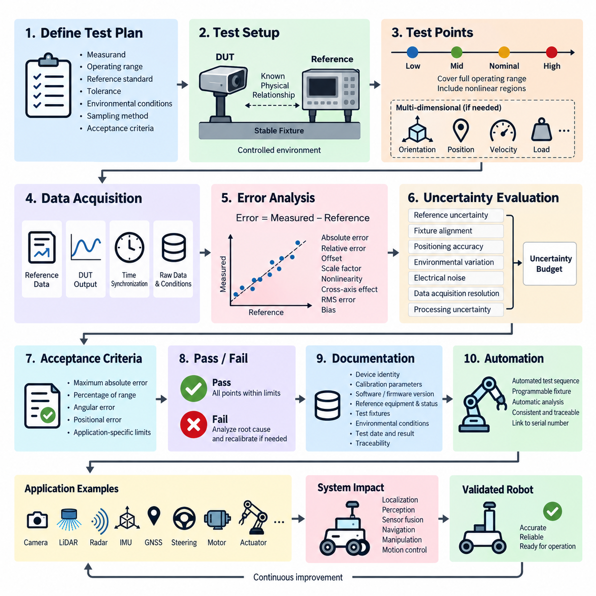
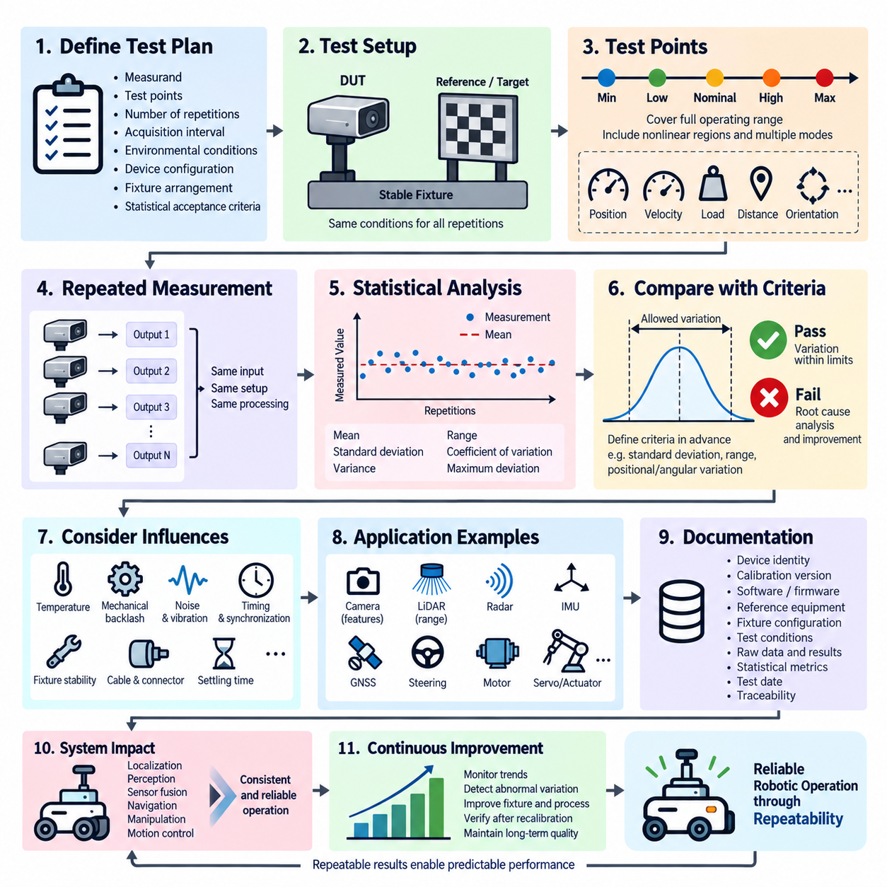
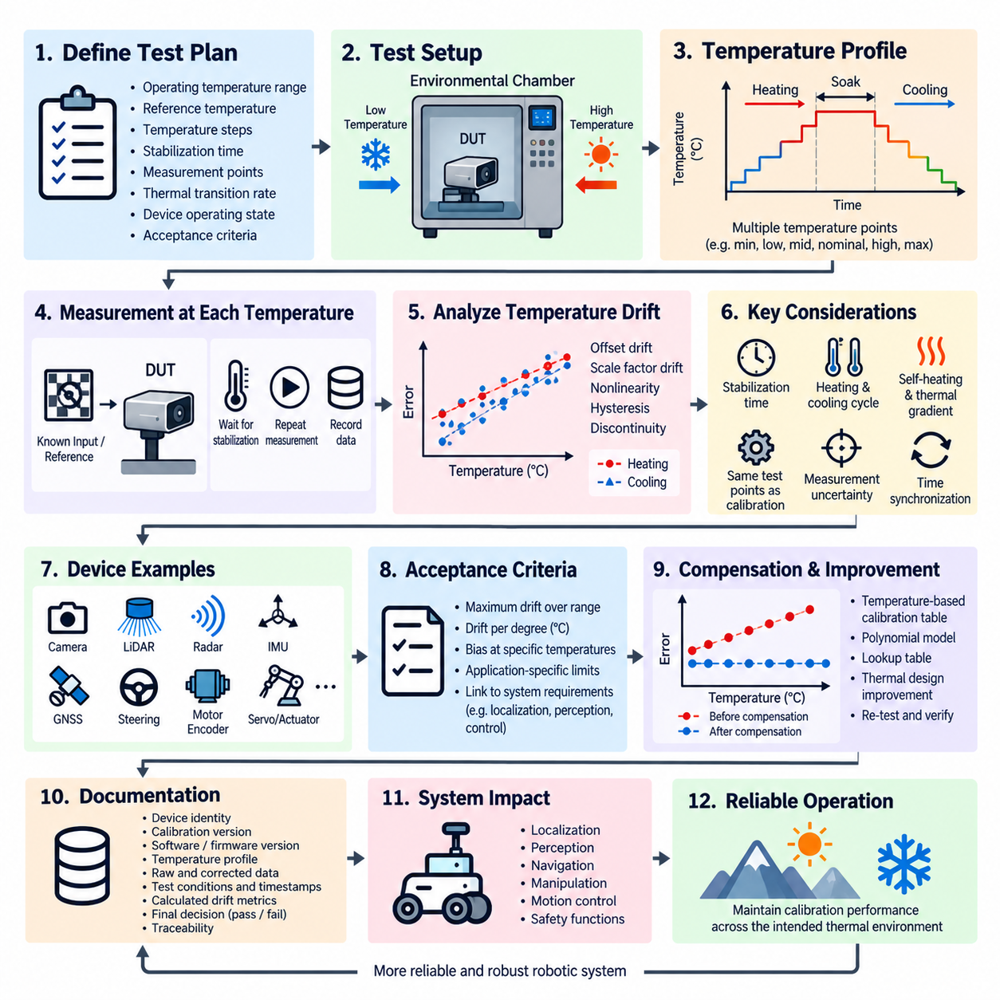
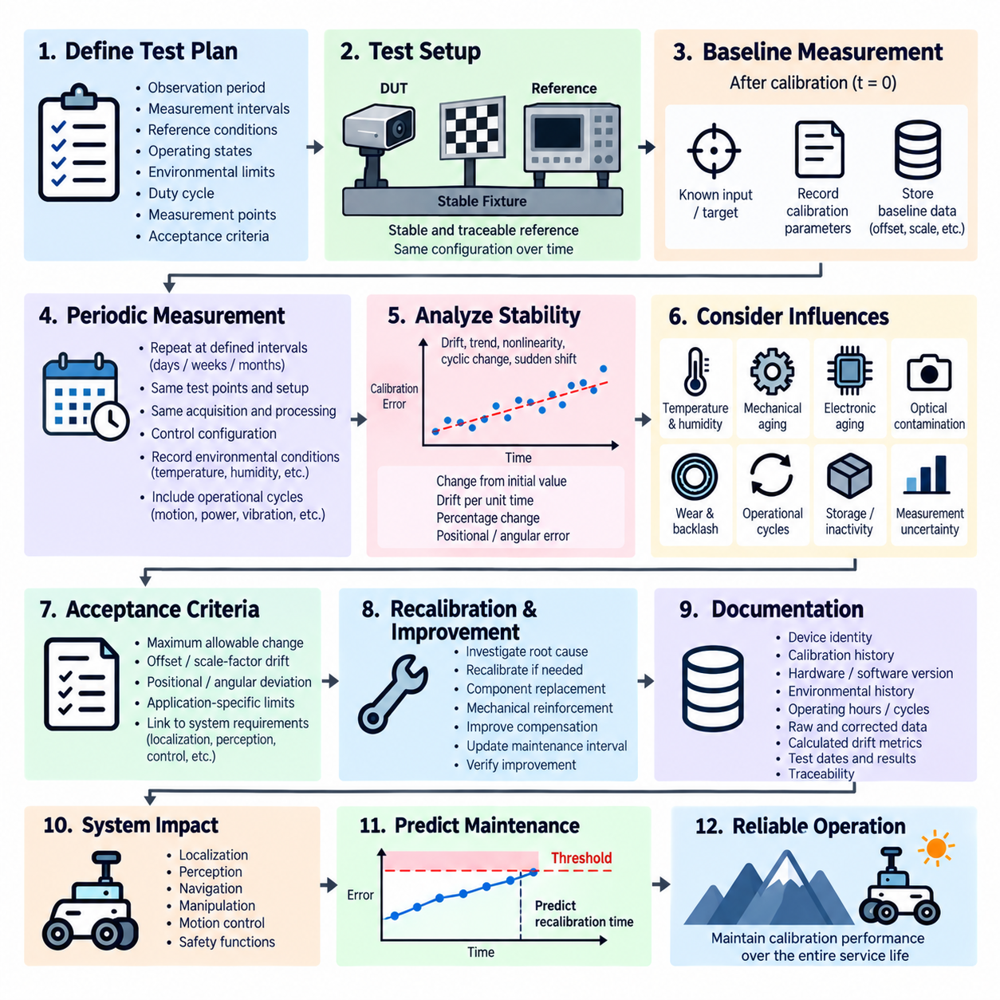
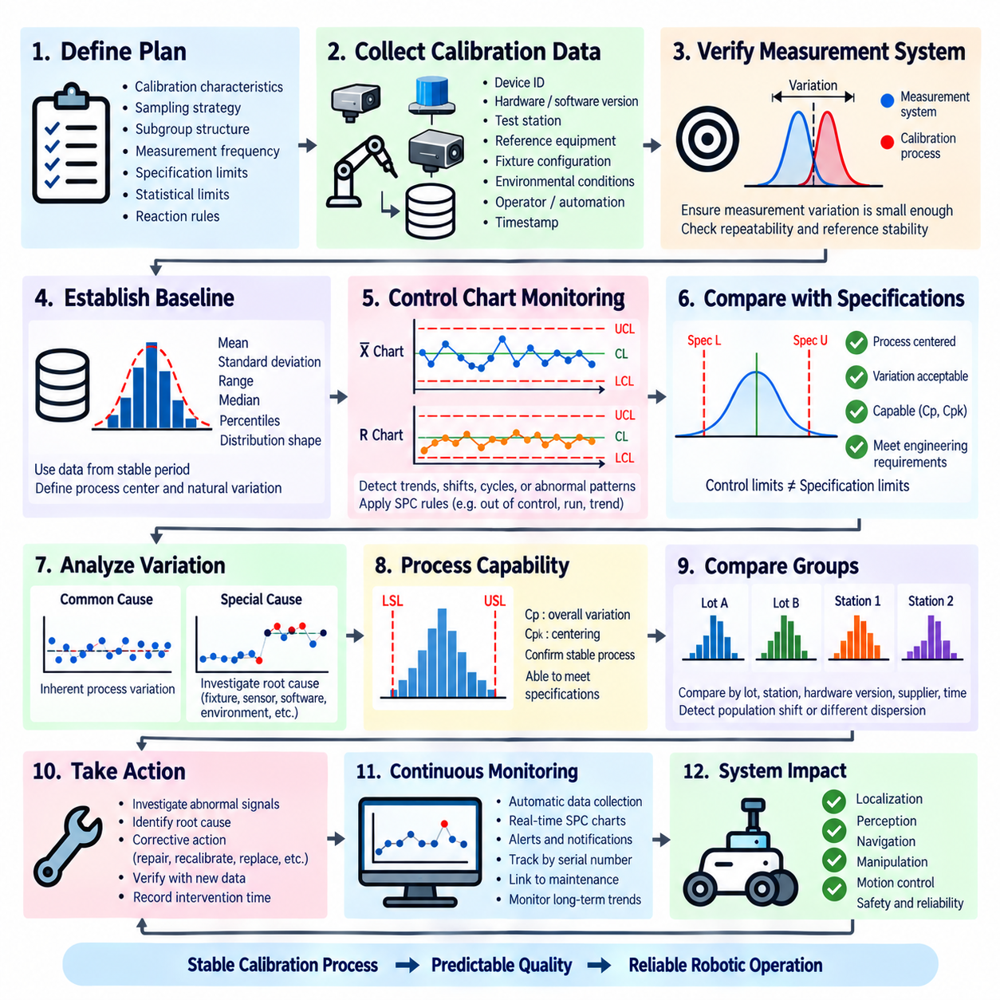

**Volume 19. Testing and Validation**

# Chapter 05. Calibration Test

## 05.01. Calibration Accuracy Validation

{width="7.268055555555556in" height="7.268055555555556in"}

교정 정확도 검증(Calibration Accuracy Validation)은 교정된 센서(sensor), 액추에이터(actuator), 측정 채널(measurement channel) 또는 로봇 하위 시스템(robotic subsystem)이 정의된 운용 조건에서 공인된 기준값(reference)에 충분히 가까운 값을 생성하는지를 확인하는 과정이다. 교정 시험(Calibration Test) 체계에서는 반복성(Repeatability), 온도 드리프트(Temperature Drift), 장기 안정성(Long-Term Stability), 통계적 공정 분석(Statistical Process Analysis)을 별도로 평가하기 전에 절대적인 측정 정확성을 검증하는 핵심 단계로 사용된다.

검증 과정은 측정량(measurand), 운용 범위(operating range), 기준 표준(reference standard), 요구 허용오차(required tolerance), 환경 조건(environmental conditions), 샘플링 방법(sampling method), 합격 기준(acceptance criteria)을 정의하는 것에서 시작한다. 시험 대상 장치(Device Under Test)의 허용오차보다 충분히 작은 불확도(uncertainty)를 가진 추적 가능한 기준(reference)이 없다면 정확도를 의미 있게 평가하기 어렵다. 따라서 기준 장비의 구성과 교정 상태(calibration status)도 공식 시험 증거(test evidence)의 일부가 된다.

대표적인 검증 지점(validation points)은 공칭 운용점(nominal operating point) 주변에만 집중하지 않고 실제 사용 가능한 측정 범위 전체를 포함해야 한다. 일반적으로 낮은 값, 중간값, 공칭값, 높은 값을 포함하며, 비선형 거동(nonlinear behavior)이나 운용 한계(operational limits)가 예상되는 영역에는 추가 지점을 설정할 수 있다. 다차원 센서(multidimensional sensor)의 경우 관련 운용 영역(operating envelope)을 평가하기 위해 여러 방향, 위치, 거리, 속도 또는 하중 조건이 필요할 수 있다.

각 검증 지점에서는 기준값(reference value)과 시험 대상 장치 출력(Device Under Test output)을 제어되고 동기화된 조건에서 취득한다. 측정 오차(measurement error)는 측정값과 기준값의 차이로 표현할 수 있으며, 넓은 동적 범위(dynamic range)에 걸쳐 비교해야 하는 경우 상대 오차(relative error) 또는 백분율 오차(percentage error)를 사용할 수 있다. 체계적인 양의 편향 또는 음의 편향(systematic positive or negative bias)은 중요한 진단 정보를 제공하므로 일반적으로 오차의 부호를 유지해야 한다.

정확도 평가(Accuracy Assessment)에서는 오프셋(offset), 스케일 계수 오차(scale-factor error), 비선형성(nonlinearity), 교차축 영향(cross-axis effects), 양자화(quantization), 정렬 오차(alignment error) 등 외관상 유사한 편차를 발생시킬 수 있는 여러 원인을 구분해야 한다. 센서가 특정 교정 지점에서는 작은 오차를 나타내더라도 측정 범위의 양 끝으로 갈수록 상당한 오차가 누적될 수 있다. 따라서 단일 평균 정확도만 보고하는 것보다 전체 오차 프로파일(error profile)을 평가하는 것이 훨씬 강력한 검증 근거를 제공한다.

검증 결과를 해석할 때는 측정 불확도(measurement uncertainty)를 고려해야 한다. 기준 장비의 불확도(reference uncertainty), 치구 정렬(fixture alignment), 위치 정확도(positioning accuracy), 동기화(synchronization), 환경 변화(environmental variation), 전기적 노이즈(electrical noise), 데이터 취득 분해능(data acquisition resolution), 수치 처리(numerical processing) 등이 관측된 편차에 영향을 줄 수 있다. 불확도 예산(uncertainty budget)을 사용하면 관측된 실패가 장치 자체에서 발생했는지 또는 검증 설정과 측정 체인(measurement chain)의 한계에서 발생했는지를 판단하는 데 도움이 된다.

카메라(camera), 라이다(LiDAR), 레이더(radar), 관성 측정 장치(IMU), 위성항법시스템(GNSS), 조향 장치(steering), 모터(motor), 서보 시스템(servo system)에서 정확도는 서로 다른 물리적 의미를 가지므로 응용 분야에 적합한 기준량(reference quantity)을 사용해야 한다. 카메라 교정에서는 재투영 오차(reprojection error)나 기하학적 오차(geometric error)를 평가할 수 있고, 라이다 검증에서는 거리 및 각도 정확도를 평가할 수 있으며, IMU는 제어된 각속도 또는 가속도 기준이 필요할 수 있다. 반면 액추에이터 교정은 명령 상태(commanded state)와 실제 측정된 물리적 운동 사이의 관계를 평가한다.

교정 정확도 검증은 개별 교정 오차가 상위 수준 기능(higher-level function)으로 전파되기 때문에 로봇 시스템에서 특히 중요하다. IMU의 각도 편향(angular bias)은 위치 추정(localization)에 영향을 줄 수 있고, 외부 파라미터 교정 오차(extrinsic calibration error)는 센서 융합(sensor fusion)을 저하시킬 수 있으며, 조향 오프셋(steering offset)은 궤적 편차(trajectory deviation)를 발생시킬 수 있다. 또한 잘못된 액추에이터 스케일링(actuator scaling)은 운동 제어 정밀도(motion-control precision)를 저하시킬 수 있다. 따라서 검증 한계(validation limits)는 부품 사양뿐 아니라 시스템 수준 성능 요구사항(system-level performance requirements)과도 연계되어야 한다.

시험 치구(test fixture)는 시험 대상 장치와 기준 장비 사이에 알려진 기하학적·기계적 관계를 유지해야 한다. 치구 변형(fixture deformation), 백래시(backlash), 진동(vibration), 장착 공차(mounting tolerance), 케이블 힘(cable forces), 열팽창(thermal expansion), 데이터 취득 중 움직임 등은 교정 오차로 잘못 판단될 수 있는 오차를 발생시킬 수 있다. 따라서 기준 위치(reference positions), 좌표계(coordinate frames), 장착 방향(mounting orientation), 관련 설치 치수와 함께 기계적 구성을 문서화해야 한다.

데이터 취득(Data Acquisition) 과정에서는 검증 결과를 독립적으로 재구성할 수 있도록 충분한 원시 정보(raw information)를 보존해야 한다. 해당되는 경우 기준 측정값(reference measurements), 장치 원시 출력(raw device outputs), 교정된 출력(calibrated outputs), 타임스탬프(timestamps), 교정 파라미터(calibration parameters), 환경 조건, 구성 버전(configuration versions), 시험 식별자(test identifiers)를 기록해야 한다. 이후 자동화된 처리(automated processing)를 통해 지점별 오차(point-wise error), 최대 절대 오차(maximum absolute error), 평균 오차(mean error), 제곱평균제곱근 오차(RMS error), 편향(bias) 및 엔지니어링 사양에서 요구하는 기타 지표를 계산할 수 있다.

움직이는 표적(moving target)이나 동적으로 변화하는 기준(dynamic reference)을 사용하여 교정 정확도를 평가할 때는 시간 동기화(Time Synchronization)가 매우 중요하다. 정확하게 교정된 센서라도 서로 다른 시점에 취득된 기준 데이터와 비교하면 부정확한 것으로 나타날 수 있다. 따라서 시간 불일치(temporal misalignment)가 측정 오차에 실질적인 영향을 줄 수 있는 경우 하드웨어 타임스탬프(hardware timestamp), 동기화된 클록(synchronized clock), 트리거 신호(trigger signal), 알려진 통신 지연(communication latency) 또는 시간 정렬 보정(time-alignment correction)을 적용해야 한다.

합격 기준(Acceptance Criteria)은 시험 결과를 확인하기 전에 설정해야 하며, 교정된 장치의 실제 엔지니어링 용도와 대응해야 한다. 일반적인 기준에는 최대 허용 절대 오차(maximum permissible absolute error), 측정 범위 대비 백분율 오차(percentage-of-range error), 각도 오차(angular error), 위치 오차(positional error) 또는 응용 분야별 성능 한계(application-specific performance boundary)가 포함될 수 있다. 운용 범위의 서로 다른 영역에서 정확도 요구사항이나 안전상의 영향이 다르다면 복수의 한계값을 설정할 필요가 있다.

성공적인 검증 결과는 기준 장비와 측정 불확도가 적절히 통제된 상태에서 요구되는 모든 검증 지점이 정의된 합격 한계(acceptance limits) 내에 있음을 입증해야 한다. 실패가 발생했다고 해서 즉시 임의로 재교정(recalibration)을 수행해서는 안 된다. 먼저 오차 패턴(error pattern)을 분석하여 원인이 오프셋(offset), 게인(gain), 비선형 응답(nonlinear response), 잘못된 좌표 변환(coordinate transformation), 기계적 설치(mechanical installation), 동기화 문제, 기준 불확도(reference uncertainty), 소프트웨어 구성 또는 실제 장치 결함(device defect)인지 판단해야 한다.

재교정(Recalibration)이 필요한 경우 수정된 교정 파라미터(calibration parameters)는 통제되는 구성 데이터(configuration data)로 관리해야 한다. 이후 동일하게 정의된 절차를 사용하여 전체 정확도 검증을 다시 수행함으로써 개선 효과를 정량적으로 입증해야 한다. 교정 전(pre-calibration)과 교정 후(post-calibration)의 오차 분포(error distribution)를 비교하면 교정 작업이 제한된 일부 시험 지점만 최적화한 것이 아니라 의도한 오차를 실제로 수정했는지를 확인할 수 있다.

교정 정확도 검증(Calibration Accuracy Validation)은 반복성 시험(Repeatability Test)과도 명확하게 구분되어야 한다. 정확도(accuracy)는 기준값에 얼마나 가까운지를 나타내는 반면, 반복성(repeatability)은 동일한 조건에서 동일한 결과를 얼마나 일관되게 재현할 수 있는지를 나타낸다. 장치가 매우 높은 반복성을 가지면서도 체계적으로 부정확할 수 있으며, 특정 지점에서는 정확하지만 반복성이 낮을 수도 있다. 따라서 두 특성은 상호 보완적이지만 독립적인 교정 특성으로 평가해야 한다.

생산용 로봇(production robotics)에서는 자동화된 검증(automated validation)을 통해 일관성과 추적성(traceability)을 크게 향상시킬 수 있다. 프로그래밍 가능한 치구(programmable fixture), 정밀 모션 스테이지(precision motion stage), 교정 타깃(calibration target), 기준 센서(reference sensor), 로봇 위치 결정 시스템(robotic positioning system), 자동 분석 소프트웨어(automated analysis software)를 사용하면 사전에 정의된 검증 시퀀스를 실행하고 결과를 저장된 한계값과 즉시 비교할 수 있다. 이러한 자동화는 작업자 의존 편차(operator-dependent variation)를 줄이고 교정 증거를 장치 일련번호(serial number)와 제조 기록에 직접 연결할 수 있게 한다.

정확도 검증 결과는 장치 식별 정보(device identity), 교정 파라미터 버전(calibration parameter version), 소프트웨어 및 펌웨어 구성(software and firmware configuration), 기준 장비(reference equipment), 기준 장비의 교정 상태(reference calibration status), 시험 치구(test fixture), 환경 조건, 작업자 또는 자동 시험 스테이션 식별자(automated station identifier), 시험 날짜 및 합격 판정(acceptance decision)과 함께 보관해야 한다. 이러한 정보는 물리적 제품과 통합, 출하, 유지보수 또는 현장 배치 전에 검증된 교정 상태 사이의 추적성을 형성한다.

시스템 수준(System Level)에서 교정 정확도는 독립적인 실험실 지표로만 취급하기보다 궁극적으로 기능 검증(functional validation)과 연결되어야 한다. 검증된 교정 파라미터는 위치 추정(localization), 인지(perception), 센서 융합(sensor fusion), 내비게이션(navigation), 조작(manipulation), 조향(steering), 운동 제어(motion control) 기능의 입력으로 사용된다. 이러한 관계 때문에 교정 시험은 단순한 센서 설정(sensor setup)이 아니라 전체 로봇 시험 및 검증(Testing and Validation) 아키텍처 내에서 독립적인 단계로 구성된다.

성숙한 교정 정확도 검증(Calibration Accuracy Validation) 프로세스는 추적 가능한 기준(traceable reference), 제어된 치구(controlled fixture), 대표적인 운용 지점(representative operating points), 동기화된 데이터 취득(synchronized acquisition), 불확도에 대한 고려(uncertainty awareness), 사전에 정의된 합격 한계(predefined acceptance limits), 구성 관리(configuration control), 재현 가능한 데이터 분석(reproducible data analysis)을 통합한다. 그 목적은 단순히 교정 소프트웨어가 정상적으로 완료되었음을 확인하는 것이 아니라, 그 결과로 얻어진 물리적 측정값과 명령된 동작이 의도된 로봇 기능을 수행하기에 충분한 정확도를 갖는다는 객관적인 증거를 제공하는 데 있다.

## 05.02. Repeatability Test

{width="7.268055555555556in" height="7.268055555555556in"}

반복성 시험(Repeatability Test)은 동일한 입력 또는 물리적 조건을 명목상 동일한 환경에서 반복적으로 적용했을 때, 교정된 센서(sensor), 액추에이터(actuator), 측정 채널(measurement channel) 또는 로봇 하위 시스템(robotic subsystem)이 일관된 결과를 재현할 수 있는지를 확인한다. 측정값을 기준값과 비교하는 교정 정확도 검증(Calibration Accuracy Validation)과 달리 반복성은 반복 관측값의 분산(dispersion)에 초점을 두며, 측정 또는 작동 과정의 안정성과 일관성을 평가한다.

반복성 시험은 측정량(measurand), 시험 지점(test point), 반복 횟수(number of repetitions), 취득 간격(acquisition interval), 환경 조건(environmental conditions), 장치 구성(device configuration), 치구 배치(fixture arrangement), 통계적 합격 기준(statistical acceptance criteria)을 정의하는 것에서 시작한다. 이러한 조건은 시험 전체에서 가능한 한 일정하게 유지되어야 한다. 온도, 작업자, 장비, 설치 상태 또는 경과 시간을 의도적으로 변경하면 순수한 반복성보다는 재현성(reproducibility)이나 안정성(stability)의 영향이 포함될 수 있다.

대표적인 시험 지점(test points)은 측정 크기, 액추에이터 위치, 속도, 하중, 거리, 방향 또는 신호 수준에 따라 반복성이 달라질 수 있으므로 운용 범위(operating range) 전체에서 선정해야 한다. 공칭 지점(nominal point)에서만 시험하면 최소 또는 최대 운용 한계 부근의 불안정성을 발견하지 못할 수 있다. 비선형 장치(nonlinear device)나 여러 운용 모드(operating modes)를 갖는 시스템에서는 감도, 제어 거동 또는 측정 특성의 변화가 예상되는 영역에 추가 시험 지점을 설정해야 한다.

선정된 각 조건에서는 설정을 의도적으로 변경하지 않은 상태에서 동일한 자극(stimulus) 또는 기준 상태(reference state)를 반복적으로 적용한다. 모든 반복 시험에서 동일한 데이터 취득 설정(acquisition settings)과 처리 파라미터(processing parameters)를 사용하여 장치 출력을 기록한다. 가능하면 소수의 관측값에 의존하기보다 분포(distribution)를 특성화할 수 있을 만큼 충분한 샘플을 수집해야 한다. 이렇게 얻은 데이터셋(dataset)은 반복된 운용 조건 주변에서 발생하는 단기 변동(short-term variation)을 평가하는 기반이 된다.

반복성(Repeatability)은 일반적으로 평균(mean), 표준편차(standard deviation), 분산(variance), 범위(range), 변동계수(coefficient of variation), 반복 평균으로부터의 최대 편차(maximum deviation)와 같은 통계적 지표를 사용하여 정량화한다. 특히 표준편차는 관측값이 평균 주변에 얼마나 분산되는지를 나타내므로 유용하다. 측정 크기가 크게 달라지는 응용에서는 정규화된 반복성 지표(normalized repeatability metric) 또는 백분율 기반 지표를 사용하면 운용 범위 전체의 성능을 보다 쉽게 비교할 수 있다.

반복성 결과는 체계적 편향(systematic bias)과 구분해야 한다. 센서가 거의 동일한 값을 반복적으로 출력하여 매우 우수한 반복성을 나타내더라도 모든 측정값이 실제 기준값(true reference)에서 일정하게 벗어나 있을 수 있다. 반대로 평균값은 기준값과 가까우면서 개별 관측값이 지나치게 변동할 수도 있다. 따라서 전체적인 교정 품질(calibration quality)을 평가하기 전에 정확도(accuracy)와 반복성(repeatability)을 각각 독립적으로 평가해야 한다.

시험 설정(test setup) 자체도 관측되는 반복성에 큰 영향을 줄 수 있다. 치구 움직임(fixture movement), 기계적 백래시(mechanical backlash), 커넥터 불안정성(connector instability), 케이블 힘(cable forces), 전기적 노이즈(electrical noise), 진동(vibration), 표적 움직임(target movement), 불일치한 트리거링(inconsistent triggering), 통신 지연(communication latency), 불충분한 안정화 시간(settling time)은 장치 자체가 안정적이더라도 측정 분산을 증가시킬 수 있다. 따라서 장치 변동과 시험 환경에서 발생하는 변동을 분리하기 위해 제어된 치구와 명확하게 정의된 안정화 시간이 필요하다.

기계 및 전기기계 시스템(mechanical and electromechanical systems)에서는 시험 지점에 접근하는 방향도 결과에 영향을 줄 수 있다. 조향 시스템(steering system), 서보 메커니즘(servo mechanism), 관절(joint), 선형 스테이지(linear stage) 및 기타 구동 장치는 백래시(backlash), 마찰(friction), 히스테리시스(hysteresis), 하중 의존 거동(load-dependent behavior)을 나타낼 수 있다. 따라서 반복성 시험 절차에서는 각 시험 지점에 동일한 방향에서 접근할지, 교대로 접근할지 또는 정의된 초기화 시퀀스(reset sequence) 후 접근할지를 규정하여 측정 조건을 재현 가능하게 유지해야 한다.

반복 측정에 동적 운동(dynamic motion)이나 여러 센서가 포함되는 경우 시간 동기화(Time Synchronization)가 중요하다. 타임스탬프 정렬(timestamp alignment)의 변화는 실제 센서 응답이 안정적인 경우에도 측정 변동처럼 나타날 수 있다. 하드웨어 트리거링(hardware triggering), 동기화된 클록(synchronized clocks), 결정론적 데이터 취득 시퀀스(deterministic acquisition sequences), 일관된 처리 지연(processing latency)을 적용하면 반복 관측값이 변화하는 과정의 서로 다른 순간이 아니라 동일한 물리적 상태를 나타내도록 할 수 있다.

카메라(camera), 라이다(LiDAR), 레이더(radar), 관성 측정 장치(IMU), 위성항법시스템(GNSS), 모터(motor), 조향 시스템(steering system), 서보 시스템(servo system)은 각각의 물리적 출력에 적합한 반복성 지표가 필요하다. 카메라 교정에서는 반복적인 특징점(feature) 또는 재투영 거동(reprojection behavior)을 평가할 수 있고, 라이다는 반복 거리 측정(range measurement)을 통해 평가할 수 있다. IMU 시험에서는 정지 또는 제어된 운동 상태의 출력 변화를 분석할 수 있으며, 조향 및 서보 시스템에서는 명령된 각도 또는 위치 목표를 반복적으로 달성하는 정도를 평가할 수 있다.

다중 센서 교정(Multi-Sensor Calibration)에서는 센서 간 상대 기하 관계(relative geometry)가 반복적인 교정 또는 측정 주기 동안 안정적으로 유지되어야 하므로 추가적인 반복성 고려가 필요하다. 카메라-라이다(Camera-to-LiDAR), 라이다-IMU(LiDAR-to-IMU) 또는 기타 외부 변환(extrinsic transformation)을 여러 차례 다시 계산하여 통계적으로 비교할 수 있다. 병진 및 회전 파라미터(translation and rotation parameters)의 변화는 표적 배치, 특징 추출(feature extraction), 최적화 초기화(optimization initialization), 장착 강성(mounting rigidity), 동기화 품질에 대한 민감성을 나타낼 수 있다.

합격 기준(Acceptance Criteria)은 반복 측정값을 분석하기 전에 정의해야 한다. 응용 분야에 따라 표준편차(standard deviation), 전체 범위(total range), 최대 편차(maximum deviation), 각도 변동(angular variation), 위치 변동(positional variation) 또는 기타 응용 분야별 지표(application-specific metric)에 대한 한계값을 지정할 수 있다. 요구 임계값(required threshold)은 후속 시스템 요구사항(downstream system requirement)을 반영해야 하는데, 작은 변동이라도 위치 추정(localization), 인지(perception), 센서 융합(sensor fusion), 조작(manipulation), 운동 제어(motion control)를 거치면서 중요한 영향을 미칠 수 있기 때문이다.

반복성이 허용된 변동 범위를 초과하는 경우 교정 파라미터를 변경하기 전에 장치와 측정 프로세스(measurement process)를 모두 대상으로 근본 원인 분석(root-cause analysis)을 수행해야 한다. 무작위 전기적 노이즈(random electrical noise), 불안정한 장착, 불충분한 예열(warm-up), 기계적 유격(mechanical play), 일관되지 않은 표적 검출(target detection), 소프트웨어 필터링(software filtering), 타이밍 변화(timing variation), 액추에이터 히스테리시스(actuator hysteresis), 통제되지 않은 환경 변화 등이 반복성 저하를 발생시킬 수 있다. 불안정한 물리적 또는 측정 프로세스에서 발생하는 변동은 단순한 재교정만으로 해결할 수 없다.

반복 시험에서는 통계 계산을 독립적으로 재구성할 수 있도록 처리된 결과와 함께 원시 관측값(raw observations)을 보존해야 한다. 시험 기록에는 장치 식별 정보(device identity), 교정 버전(calibration version), 소프트웨어 및 펌웨어 구성(software and firmware configuration), 기준 장비(reference equipment), 치구 구성(fixture configuration), 타임스탬프(timestamps), 환경 조건, 샘플 수(sample count), 데이터 취득 설정 및 계산된 반복성 지표를 포함해야 한다. 이러한 추적성(traceability)은 생산 장치 간 비교나 유지보수 이후의 변화를 조사할 때 특히 중요하다.

자동화된 반복성 시험(Automated Repeatability Testing)은 제어된 타이밍으로 동일한 시험 시퀀스를 실행하고 더 많은 반복 횟수를 확보함으로써 통계적 품질을 향상시킬 수 있다. 프로그래밍 가능한 모션 스테이지(programmable motion stage), 로봇 치구(robotic fixture), 자동화된 표적(automated target), 기준 계측기(reference instrument), 시험 소프트웨어(test software)를 사용하면 동일한 조건을 반복적으로 설정하면서 동기화된 데이터를 수집할 수 있다. 자동화는 작업자 의존 변동을 감소시키고 장치, 생산 배치, 소프트웨어 릴리스 및 교정 버전 간의 일관된 비교를 가능하게 한다.

반복성은 교정 전후에 평가하여 교정 절차(calibration procedure)가 측정 안정성에 영향을 주는지도 확인할 수 있다. 교정은 체계적 오차(systematic error)를 감소시키면서 무작위 분산(random dispersion)은 개선하지 못할 수 있으며, 지나치게 민감한 교정 알고리즘(calibration algorithm)은 반복 실행마다 불안정한 파라미터를 생성할 수도 있다. 따라서 반복 교정 결과를 비교하면 절대 정확도(absolute accuracy)의 향상과 교정 프로세스의 강건성(robustness) 및 일관성 향상을 구분할 수 있다.

생산 환경(production environment)에서 반복성 데이터는 개별 측정값이 절대 정확도 한계(absolute accuracy limits) 안에 있는 경우에도 비정상적인 변동을 조기에 나타낼 수 있다. 분산의 증가는 치구 마모(fixture wear), 커넥터 열화(connector degradation), 기계적 풀림(mechanical looseness), 센서 오염(sensor contamination), 불안정한 전자 장치 또는 제조 공정 변화(manufacturing process changes)를 의미할 수 있다. 따라서 반복성 시험은 기능적 한계를 위반할 정도로 문제가 커지기 전에 교정 검증뿐 아니라 전반적인 품질 모니터링(quality monitoring)을 지원할 수 있다.

시스템 수준(System Level)에서 반복성은 상위 로봇 기능(higher-level robotic functions)이 일관된 물리적 정보를 입력받고 일관된 물리적 응답을 생성할 수 있는지를 결정한다. 센서 측정의 변동은 위치 추정(localization)과 인지(perception)에 전파될 수 있으며, 액추에이터의 변동은 궤적 추종(trajectory tracking)과 조작 정밀도(manipulation precision)에 영향을 줄 수 있다. 따라서 평균적인 교정 정확도가 지정된 허용오차를 만족하더라도 예측 가능한 자율 동작(predictable autonomous behavior)을 위해서는 안정적인 반복성이 필수적이다.

성숙한 반복성 시험(Repeatability Test)은 제어된 운용 조건(controlled operating conditions), 대표적인 시험 지점(representative test points), 충분한 반복 관측값(repeated observations), 적절한 통계 지표(statistical metrics), 안정적인 치구(stable fixtures), 동기화된 데이터 취득(synchronized acquisition), 사전에 정의된 합격 기준(predefined acceptance criteria), 근본 원인 분석(root-cause analysis), 완전한 추적성(traceability)을 통합한다. 그 목적은 교정된 로봇 구성요소 또는 하위 시스템이 원하는 결과를 단 한 번 달성하는 데 그치지 않고, 의도된 기능 전체에서 신뢰성 있는 운용을 지원할 수 있을 정도로 해당 결과를 일관되게 재현할 수 있음을 입증하는 데 있다.

## 05.03. Temperature Drift Test

{width="7.268055555555556in" height="7.268055555555556in"}

온도 드리프트 시험(Temperature Drift Test)은 의도된 물리적 입력을 일정하게 제어하면서 온도가 변화할 때 교정된 센서(sensor), 측정 채널(measurement channel), 액추에이터(actuator) 또는 로봇 하위 시스템(robotic subsystem)의 출력이 어떻게 변화하는지를 확인한다. 교정 시험(Calibration Test) 과정에서 정확도(accuracy) 및 반복성(repeatability) 시험을 보완하며, 정상적인 실험실 온도에서만 교정을 평가할 경우 발견되지 않을 수 있는 온도 의존적 편향(temperature-dependent bias), 스케일 변화(scale changes), 비선형 효과(nonlinear effects) 및 기타 편차를 식별한다.

시험은 운용 온도 범위(operating temperature range), 기준 온도(reference temperature), 온도 단계(temperature steps), 안정화 시간(stabilization time), 측정 지점(measurement points), 온도 변화율(thermal transition rate), 장치 운용 상태(device operating state), 합격 기준(acceptance criteria)을 정의하는 것에서 시작한다. 이러한 조건은 최종 로봇 시스템의 예상 환경을 반영해야 한다. 실내 장비는 비교적 완만한 온도 변화를 경험하지만, 실외 로봇, 차량, 무인항공기(UAV), 외부 노출 센서는 실제 운용 중 훨씬 넓은 온도 조건에 노출될 수 있다.

정확하고 재현 가능한 온도 노출이 필요한 경우 일반적으로 제어된 열 챔버(thermal chamber)를 사용한다. 시험 대상 장치(Device Under Test)는 실제 사용 환경을 대표하는 구성으로 설치해야 하며, 기준 장비(reference equipment)는 적절하게 제어하거나 보상해야 한다. 챔버 내부 공기 온도만으로는 전자 장치, 광학 어셈블리(optical assemblies), 관성 센서(inertial sensors), 액추에이터 및 기계 구조물의 실제 온도를 정확하게 나타내지 못할 수 있으므로 핵심 구성요소 근처에 온도 센서를 설치하여 실제 열 상태(thermal state)를 기록할 수 있다.

측정은 최소, 공칭, 최대 온도 조건에서만 수행하지 않고 지정된 운용 범위 전체에 걸쳐 여러 온도에서 수행해야 한다. 추가 측정 지점은 비선형 거동(nonlinear behavior), 전이 영역(transition regions), 보상 성능(compensation performance)의 변화를 발견하는 데 도움이 된다. 가능한 경우 교정 정확도 검증(Calibration Accuracy Validation)에서 사용했던 동일한 측정 또는 명령 지점을 각 온도에서 반복하여 온도에 따른 편차를 기준 교정 결과(baseline calibration result)와 직접 비교해야 한다.

측정값을 정상 상태 거동(steady-state behavior)의 대표값으로 사용하기 전에 열적 안정화(Thermal Stabilization)가 반드시 이루어져야 한다. 주변 공기는 명령된 챔버 온도에 빠르게 도달할 수 있지만 내부 전자 장치, 하우징, 렌즈, 기계 구조물 및 센서 소자는 열평형(thermal equilibrium)에 도달하는 데 훨씬 긴 시간이 필요할 수 있다. 지나치게 일찍 측정하면 실제 온도 드리프트가 아니라 과도 열응답(transient thermal response)을 측정하게 되어 잘못된 결론을 내릴 수 있다.

각각의 안정화된 온도에서 알려진 물리적 입력(physical input) 또는 기준 조건(reference condition)을 적용하고 장치 출력을 기록한다. 이후 기준 온도에서 얻은 결과와의 편차를 온도의 함수(function of temperature)로 계산할 수 있다. 온도 드리프트는 섭씨 온도당 공학 단위(engineering units per degree Celsius), 섭씨 온도당 전체 스케일 백분율(percentage of full scale per degree Celsius), 온도당 각도 변화(angular change per degree), 온도당 위치 변화(positional change per degree) 또는 평가되는 물리량에 적합한 다른 지표로 표현할 수 있다.

온도-오차 관계(temperature-versus-error relationship)를 분석하여 오프셋 드리프트(offset drift), 감도 또는 스케일 계수 드리프트(sensitivity or scale-factor drift), 비선형 거동, 불연속성(discontinuities), 비정상적으로 급격한 변화가 발생하는 영역을 확인해야 한다. 단순한 장치는 온도 계수(temperature coefficient)로 표현할 수 있는 거의 선형적인 드리프트를 보일 수 있다. 복잡한 센서와 시스템은 단일 선형 계수로 충분히 표현할 수 없는 경우 다항식(polynomial), 룩업 테이블(lookup table), 구간별(piecewise) 또는 모델 기반 보상(model-based compensation)이 필요할 수 있다.

동일한 온도에서도 이전 열 상태(previous thermal state)에 따라 출력이 달라질 수 있으므로 가열 및 냉각 사이클(heating and cooling cycles)을 비교해야 한다. 열 히스테리시스(thermal hysteresis)는 기계적 팽창(mechanical expansion), 재료 특성(material properties), 센서 패키징(sensor packaging), 접착 계면(adhesive interfaces), 광학 정렬(optical alignment), 전자적 특성 또는 내부 보상 거동에 의해 발생할 수 있다. 온도가 상승하는 과정과 하강하는 과정을 모두 시험하면 가역적인 온도 계수와 히스테리시스 및 기타 이력 의존 효과(history-dependent effects)를 구분하는 데 도움이 된다.

장치 내부의 온도 구배(temperature gradients) 역시 교정에 영향을 줄 수 있다. 프로세서(processor), 그래픽처리장치(GPU), 모터 드라이버(motor driver), 전력 변환기(power converter), 배터리 또는 액추에이터 가까이에 설치된 센서는 주변 온도와 크게 다른 국부적인 발열(local heating)을 경험할 수 있다. 따라서 로봇 시스템에서는 챔버 온도뿐 아니라 연산 부하나 기계적 부하에 의한 자체 발열(self-heating)도 고려해야 한다. 대표적인 드리프트 특성을 얻기 위해 실제 운용 전력 상태(operational power states)를 재현해야 할 수도 있다.

카메라 시스템(camera system)은 온도에 따라 내부 파라미터(intrinsic parameters), 초점(focus), 렌즈 형상(lens geometry), 기계적 정렬(mechanical alignment)이 변할 수 있다. 라이다(LiDAR)와 레이더(radar)는 거리, 타이밍 또는 각도 특성이 변할 수 있으며, 관성 측정 장치(IMU)는 특히 온도에 따른 편향 및 스케일 계수 변화에 민감하다. 위성항법시스템(GNSS) 관련 전자 장치, 조향 센서(steering sensor), 힘 센서(force sensor), 모터 엔코더(motor encoder), 서보 시스템(servo system)도 상위 로봇 기능의 정확도에 영향을 주는 열적 효과를 나타낼 수 있다.

다중 센서 시스템(Multi-Sensor System)에서는 온도에 의해 발생하는 센서 간 상대 기하 관계(relative sensor geometry)의 변화에도 주의해야 한다. 브래킷(bracket), 프레임(frame), 하우징(housing), 장착 구조물(mounting structure)의 팽창이나 변형은 개별 센서 자체가 안정적이더라도 카메라-라이다(Camera-to-LiDAR), 라이다-IMU(LiDAR-to-IMU) 또는 기타 외부 파라미터 관계(extrinsic relationship)를 변화시킬 수 있다. 따라서 시스템 성능이 정밀한 센서 정렬에 의존한다면 센서 고유 거동뿐 아니라 기계적 변환 관계의 변화도 온도 드리프트 시험에서 고려해야 한다.

열 시험(Thermal Testing)에서도 시간 동기화(time synchronization)와 데이터 취득 일관성(acquisition consistency)은 중요하다. 긴 안정화 시간과 온도 전이 과정으로 인해 데이터 수집이 여러 시간 동안 지속될 수 있으며, 이에 따라 구성 변경(configuration changes), 클록 드리프트(clock drift), 기준 위치 이동(reference movement), 일관되지 않은 데이터 처리 등이 발생할 가능성이 커진다. 동기화된 타임스탬프와 제어된 구성을 사용하는 자동 데이터 취득은 관측된 변화가 측정 절차의 의도하지 않은 변화가 아니라 온도에 의해 발생했음을 확인하는 데 도움이 된다.

열 드리프트(thermal drift)를 평가할 때는 측정 불확도(measurement uncertainty)도 함께 분석해야 한다. 챔버 온도 정확도(chamber temperature accuracy), 온도 균일도(temperature uniformity), 기준 계측기 안정성(reference instrument stability), 치구 팽창(fixture expansion), 표적 이동(target movement), 전기적 노이즈(electrical noise), 기준 센서의 온도 계수(reference sensor temperature coefficient), 데이터 취득 분해능(acquisition resolution) 등이 측정 결과에 영향을 줄 수 있다. 의미 있는 합격 또는 불합격 판정을 위해 시험 시스템의 불확도는 허용되는 온도 의존 오차보다 충분히 작아야 한다.

합격 기준(Acceptance Criteria)은 전체 운용 온도 범위에서의 최대 드리프트(maximum drift), 온도당 최대 드리프트(maximum drift per degree), 특정 온도에서 허용되는 편향(permissible bias), 또는 응용 분야별 기능 한계(application-specific functional limits)로 정의할 수 있다. 작은 센서 수준의 열적 변화도 위치 추정(localization), 인지(perception), 내비게이션(navigation), 조작(manipulation), 운동 제어(motion control) 오차로 전파될 수 있으므로 기준은 후속 시스템 요구사항과 연계되어야 한다. 안전 관련 기능(safety-relevant functions)은 더욱 엄격한 한계나 추가적인 온도별 검증이 필요할 수 있다.

측정된 드리프트가 허용 한계를 초과하면 근본 원인 분석(root-cause analysis)을 통해 센서 자체의 특성과 장착 상태, 전자 장치, 소프트웨어 보상(software compensation), 온도 구배 및 시험 시스템의 영향을 구분해야 한다. 개선 방법에는 온도 보상(temperature compensation) 향상, 기계 설계 변경, 열 절연(thermal isolation), 열 확산(heat spreading), 장착 구조 변경, 교정 테이블(calibration table) 업데이트 또는 운용 제약 변경 등이 포함될 수 있다. 개선 조치 후에는 전체 열 시험을 다시 수행하여 효과를 검증해야 한다.

온도 보상(Temperature Compensation)은 측정된 온도를 추가적인 교정 입력(calibration input)으로 사용할 수 있다. 장치 특성에 따라 온도 의존적 오프셋 및 스케일 보정, 보간 테이블(interpolation table), 다항 함수(polynomial function) 또는 더욱 정교한 모델을 적용할 수 있다. 이후 보상 알고리즘(compensation algorithm) 자체도 전체 온도 범위에서 검증하여 특정 영역에서의 보정이 다른 운용 영역에 과도한 오차나 불연속성을 발생시키지 않는지 확인해야 한다.

열적 거동을 독립적으로 재구성할 수 있도록 원시 데이터(raw data)는 온도 이력(temperature histories)과 함께 보존해야 한다. 기록에는 장치 식별 정보(device identity), 교정 버전(calibration version), 소프트웨어 및 펌웨어 버전, 챔버 프로파일(chamber profile), 기준 장비, 치구 구성, 측정 타임스탬프, 국부 온도 측정값(local temperature measurements), 운용 상태, 안정화 시간, 원시 출력(raw outputs), 보정된 출력(corrected outputs), 계산된 드리프트 지표 및 최종 합격 판정(acceptance decision)이 포함되어야 한다.

자동화된 온도 드리프트 시험(Automated Temperature Drift Testing)은 열 챔버 명령, 안정화 상태 검출(stabilization detection), 기준 장비, 장치 통신, 동기화된 데이터 취득, 분석 및 보고 과정을 통합하여 제어할 수 있다. 완전한 가열 및 냉각 시퀀스는 여러 시간 또는 수일이 필요할 수 있으므로 자동화의 가치가 특히 크다. 일관된 자동 시험 절차는 작업자 의존 변동을 줄이고 장치, 생산 배치(production batches), 하드웨어 개정판(hardware revisions), 교정 알고리즘 간의 직접적인 비교를 가능하게 한다.

시스템 수준(System Level)에서 온도 드리프트 시험은 최초 교정이 수행된 실험실 환경을 벗어난 조건에서도 교정 상태가 유효하게 유지되는지를 검증한다. 실온(room temperature)에서는 정확하고 반복성이 우수한 로봇도 실외 환경, 발열 장비 주변 또는 지속적인 연산 및 액추에이터 부하 상태에서는 신뢰성이 저하될 수 있다. 따라서 열적 강건성(thermal robustness)은 신뢰할 수 있는 인지, 위치 추정, 내비게이션 및 제어 성능을 유지하기 위한 필수 조건이다.

성숙한 온도 드리프트 시험(Temperature Drift Test)은 제어된 온도 노출(controlled thermal exposure), 충분한 안정화(sufficient stabilization), 대표적인 측정 지점(representative measurement points), 가열 및 냉각 사이클(heating and cooling cycles), 국부 온도 모니터링(local temperature monitoring), 불확도 분석(uncertainty analysis), 사전에 정의된 한계(predefined limits), 보상 검증(compensation validation), 완전한 추적성(traceability)을 통합한다. 그 목적은 교정된 로봇 하드웨어가 하나의 교정 온도에서만 정확하게 동작하는 것이 아니라 의도된 전체 열 환경(intended thermal environment)에서 허용 가능한 측정 및 작동 성능을 유지한다는 것을 입증하는 데 있다.

## 05.04. Long Term Stability Test

{width="7.268055555555556in" height="7.268055555555556in"}

장기 안정성 시험(Long-Term Stability Test)은 교정된 센서(sensor), 액추에이터(actuator), 측정 채널(measurement channel) 또는 로봇 하위 시스템(robotic subsystem)이 장기간의 운용 또는 보관 동안 교정 특성(calibration characteristics)을 유지하는지를 확인한다. 단기적인 분산을 평가하는 반복성 시험(Repeatability Test)과 달리 장기 안정성은 수일, 수주, 수개월 또는 운용 사이클에 걸쳐 점진적으로 발생하여 결국 성능이 최초 교정 한계를 벗어나게 할 수 있는 변화를 평가하는 데 초점을 둔다.

시험은 관찰 기간(observation period), 측정 간격(measurement intervals), 기준 조건(reference conditions), 운용 상태(operating states), 환경 한계(environmental limits), 듀티 사이클(duty cycle), 측정 지점(measurement points), 합격 기준(acceptance criteria)을 정의하는 것에서 시작한다. 시험 기간은 장치의 예상 정비 주기(service interval)와 열화 메커니즘(degradation mechanisms)을 반영해야 한다. 전체 운용 수명을 현실적으로 재현하기 어려운 경우 대표 기간이나 가속 조건(accelerated conditions)을 주기적 측정과 결합하여 측정 가능한 추세를 식별할 수 있다.

시험 목적이 장기간에 걸쳐 발생하는 비교적 작은 변화를 검출하는 것이므로 안정적이고 추적 가능한 기준(stable and traceable reference)이 필수적이다. 따라서 기준 계측기(reference instruments), 치구(fixtures), 표적(targets), 측정 시스템은 평가 대상 장치에서 예상되는 변화보다 더 높은 안정성을 유지해야 한다. 기준 장비를 주기적으로 검증하면 기준 자체의 드리프트(reference drift)가 시험 대상 장치의 열화로 잘못 해석되는 것을 방지할 수 있다.

기준선 측정(Baseline Measurement)은 교정 직후 명확하게 정의된 기준 조건에서 수행해야 한다. 이러한 초기 측정값은 이후 관측 결과와 비교하는 초기 시점 기준(zero-time reference)이 된다. 기준선에는 오프셋(offset), 스케일 계수(scale factor), 감도(sensitivity), 위치 또는 각도 정확도(positional or angular accuracy), 기타 관련 교정 파라미터를 특성화하기에 충분한 정보가 포함되어야 하며, 이를 통해 서로 다른 형태의 장기 변화를 구분할 수 있다.

이후 사전에 정의된 간격으로 측정을 반복하며, 가능한 경우 동일한 시험 지점, 치구 구성(fixture configuration), 데이터 취득 설정(acquisition settings), 처리 방법(processing methods), 기준 조건을 유지해야 한다. 장비, 소프트웨어, 장착 상태, 작업자 또는 분석 방법의 변화가 장기 드리프트처럼 나타날 수 있기 때문에 측정 절차의 일관성이 매우 중요하다. 따라서 구성 관리(configuration control)는 안정성 시험의 중요한 요소가 된다.

장기 안정성(Long-Term Stability)은 최초 교정값으로부터의 변화, 단위 시간당 드리프트(drift per unit time), 관찰 기간 동안의 백분율 변화, 누적 위치 또는 각도 오차(accumulated positional or angular error), 기타 응용 분야별 지표로 표현할 수 있다. 경과 시간(elapsed time)에 대한 교정 오차를 그래프로 나타내면 점진적인 추세를 직접 식별할 수 있다. 추가적인 통계 분석(statistical analysis)을 통해 지속적인 드리프트와 정상적인 단기 측정 변동을 구분할 수도 있다.

관측되는 거동에는 거의 선형적인 드리프트(linear drift), 비선형 노화(nonlinear aging), 갑작스러운 파라미터 변화(sudden parameter shifts), 주기적 변동(cyclic variation), 일정 기간 안정된 후 가속되는 열화 등이 포함될 수 있다. 단순한 선형 추세는 드리프트율(drift rate)로 표현할 수 있지만, 복잡한 거동에는 구간별 모델(piecewise model)이나 추세 분석(trend analysis)이 필요할 수 있다. 갑작스러운 변화는 기계적 이동, 부품 손상, 펌웨어 변경 또는 간헐적 고장(intermittent fault)을 의미할 수 있으므로 별도로 조사해야 한다.

장기 안정성은 온도 드리프트(Temperature Drift)와 구분해야 한다. 온도 드리프트는 열적 조건과 연관된 변화를 의미하는 반면, 장기 드리프트(long-term drift)는 주로 경과 시간, 누적 사용, 노화(aging), 마모(wear) 또는 영구적인 물리적 변화와 관련된 변화를 의미한다. 따라서 안정성 시험 중 환경 조건을 모니터링하여 온도 또는 습도에 따른 변동이 비가역적인 노화(irreversible aging)로 잘못 분류되지 않도록 해야 한다.

기계적 노화(Mechanical Aging)는 로봇 시스템의 교정 변화를 발생시키는 중요한 원인이다. 체결부(fasteners)가 느슨해지고, 브래킷(brackets)이 변형되며, 베어링과 관절이 마모되고, 접착제(adhesives)가 크리프(creep)를 일으키며, 반복적인 진동이 센서 장착 기하(sensor mounting geometry)를 변화시킬 수 있다. 이러한 변화는 전자 센서 소자 자체가 안정적이더라도 카메라-라이다(Camera-to-LiDAR), 라이다-IMU(LiDAR-to-IMU), 액추에이터-관절(Actuator-to-Joint) 또는 기타 물리적 변환 관계를 변화시킬 수 있다.

전자 부품(electronic components) 역시 노화, 반복적인 열 사이클(thermal cycling), 전원 사이클(power cycling), 전기적 스트레스(electrical stress), 오염 또는 부품 파라미터 변화로 인해 점진적인 특성 변화를 나타낼 수 있다. 아날로그 측정 회로(analog measurement circuits), 발진기(oscillators), 전압 기준(voltage references), 관성 센서(inertial sensors), 엔코더(encoders), 전력 전자 장치(power electronics)는 시간이 지나면서 특성이 서서히 변화할 수 있다. 원시 출력(raw output)과 교정된 출력(calibrated output)을 함께 모니터링하면 드리프트가 하드웨어에서 발생하는지 또는 교정 및 보상 체인(calibration and compensation chain)에서 발생하는지를 판단하는 데 도움이 된다.

광학 및 인지 센서(optical and perception sensors)에는 추가적인 안정성 문제가 존재한다. 카메라 렌즈와 장착부가 이동할 수 있고, 보호창(protective windows)이 오염될 수 있으며, 라이다의 광학 경로(optical path)가 변화하거나 레이더 장착 구조가 점진적으로 움직일 수 있다. 일부 현상은 실제 교정 드리프트인 반면 다른 현상은 유지보수 또는 환경적 열화를 의미한다. 따라서 장기 시험에서는 재교정을 수정 조치로 선택하기 전에 이러한 메커니즘을 구분할 수 있도록 충분한 진단 정보를 보존해야 한다.

액추에이터(actuator), 조향 메커니즘(steering mechanism), 서보 관절(servo joint), 이동 로봇 구동 시스템(mobile robot drive system)은 마모, 백래시 증가(backlash growth), 마찰 변화, 엔코더 이동 또는 기계적 컴플라이언스(mechanical compliance)의 변화로 인해 장기적인 특성 변화를 경험할 수 있다. 처음에는 특정 물리적 위치나 각도를 생성했던 명령이 시간이 지나면서 다른 결과를 만들 수 있다. 따라서 교정이 폐루프 로봇 운동(closed-loop robotic motion)에 직접 영향을 주는 경우 안정성 시험에는 센싱 경로와 구동 경로를 모두 포함해야 한다.

경과 시간만으로 노화를 충분히 표현할 수 없는 경우 운용 사이클(operational cycling)을 시험에 포함할 수 있다. 반복적인 조향 동작, 관절 사이클(joint cycles), 모터 운전, 전원 사이클, 도킹 작업(docking operations), 진동 노출 또는 센서 활성화 사이클을 측정 간격 사이에 누적할 수 있다. 경과 시간과 누적 운용 사이클을 함께 기록하면 교정 열화가 주로 시간 의존적(time-dependent)인지 사용량 의존적(usage-dependent)인지를 식별하는 데 도움이 된다.

필요한 경우 보관 또는 비활성 기간(storage or inactivity)도 시험에서 고려해야 한다. 장기 보관은 습도, 재료 이완(material relaxation), 배터리 상태, 커넥터 산화(connector oxidation), 기계적 안정화(mechanical settling), 환경 노출 등의 영향을 발생시킬 수 있다. 보관 전, 보관 직후, 그리고 정의된 안정화 또는 예열 기간(warm-up period) 이후에 측정을 수행하면 교정 변화가 일시적인지, 회복 가능한지 또는 지속적인지를 확인할 수 있다.

예상되는 장기 드리프트가 시험 시스템의 정상적인 변동에 비해 작을 수 있으므로 측정 불확도(measurement uncertainty)는 계속해서 중요한 요소이다. 기준 안정성(reference stability), 치구 반복성(fixture repeatability), 환경 변화, 측정 노이즈, 소프트웨어 처리, 장비 교체 등이 모두 겉보기 추세(apparent trend)에 영향을 줄 수 있다. 불확도를 고려한 분석(uncertainty-aware analysis)을 통해 정상적인 시험 시스템 변동을 통계적 또는 기능적으로 중요한 열화로 잘못 판단하는 것을 방지할 수 있다.

합격 기준(Acceptance Criteria)은 지정된 기간 또는 운용 노출 동안 허용되는 최대 변화를 정의해야 한다. 한계는 최대 오프셋 드리프트(maximum offset drift), 스케일 계수 변화(scale-factor change), 위치 또는 각도 편차, 백분율 변화 또는 응용 분야별 기능 열화(application-specific functional degradation)로 표현할 수 있다. 이러한 한계는 허용 가능한 부품 수준의 드리프트가 위치 추정(localization), 인지(perception), 내비게이션(navigation), 조작(manipulation), 운동 제어(motion control) 성능과 양립할 수 있도록 시스템 요구사항과 연계되어야 한다.

추세 분석(Trend Analysis)은 단순한 최종 합격 또는 불합격 비교보다 더 많은 정보를 제공할 수 있다. 장치가 아직 사양 범위 안에 있더라도 합격 경계(acceptance boundary)를 향해 지속적으로 드리프트하는 추세를 나타낼 수 있다. 변화의 속도와 방향을 추정하면 언제 재교정 또는 유지보수가 필요할지를 예측하는 데 도움이 된다. 이러한 정보는 기능 성능에 영향을 미치기 전에 예방 정비 주기(preventive maintenance interval)와 교정 일정(calibration schedule)을 정의하는 데 활용할 수 있다.

과도한 드리프트가 발견되면 근본 원인 분석(root-cause analysis)을 통해 기계적 장착 상태, 센서 노화, 전자적 변화, 환경 이력(environmental history), 소프트웨어 또는 펌웨어 업데이트, 보상 파라미터(compensation parameters), 커넥터 상태, 누적 운용 사이클, 유지보수 이력 등을 조사해야 한다. 수정 조치에는 재교정(recalibration), 부품 교체, 기계적 보강, 환경 보호 개선, 보상 방식 수정 또는 검사 및 유지보수 주기의 변경 등이 포함될 수 있다.

재교정(Recalibration)을 수행하더라도 이전에 발생한 드리프트에 대한 증거를 삭제해서는 안 된다. 재교정 전 측정값과 교정 파라미터를 보존하여 장기 변화의 크기와 방향을 이후 엔지니어링 분석에 활용할 수 있도록 해야 한다. 여러 장치에서 연속적인 교정 이력(calibration histories)을 비교하면 공통적인 노화 메커니즘, 제조 편차(manufacturing variation), 설계 취약점(design weaknesses) 또는 특징적인 유지보수 주기를 발견할 수 있다.

자동화된 장기 안정성 모니터링(Automated Long-Term Stability Monitoring)은 기준 측정을 주기적으로 수행하고, 드리프트 지표를 계산하며, 추세 이력(trend history)을 갱신하고, 사전에 정의된 임계값에 접근할 때 경고를 생성할 수 있다. 연결된 로봇 시스템에서는 교정 상태 정보(calibration-health information)를 유지보수 진단(maintenance diagnostics)의 일부로 활용할 수 있다. 자동 모니터링은 여러 장치의 추세를 비교하여 교정 오차가 기능 고장을 발생시키기 전에 비정상적인 장치를 식별할 수 있으므로 로봇 플릿(robot fleet)에서 특히 유용하다.

완전한 추적성(Traceability)을 위해 장치 식별 정보(device identity), 교정 버전(calibration version), 하드웨어 개정판(hardware revision), 소프트웨어 및 펌웨어 버전, 기준 장비, 환경 이력, 운용 시간(operating hours), 사이클 횟수(cycle counts), 유지보수 이벤트, 측정 날짜, 원시 데이터(raw data), 보정된 데이터(corrected data), 계산된 드리프트 및 합격 판정을 기록해야 한다. 이러한 이력을 유지하면 장기 안정성 시험을 일회성 적합성 평가에서 수명주기 교정 관리(lifecycle calibration management)를 지원하는 지속적인 증거 체계로 발전시킬 수 있다.

시스템 수준(System Level)에서 장기 교정 안정성(Long-Term Calibration Stability)은 전체 사용 수명(service life) 동안 예측 가능한 로봇 성능을 유지하기 위해 필요하다. 점진적인 센서 또는 액추에이터 드리프트는 위치 추정 오차, 센서 융합(sensor fusion) 성능 저하, 부정확한 내비게이션, 조작 정밀도 감소 또는 일관되지 않은 운동 제어로 전파될 수 있다. 따라서 초기 배치(initial deployment) 시 교정 요구사항을 만족하는 시스템은 계획된 검사 및 유지보수 주기 사이에서도 교정 상태가 충분히 안정적으로 유지됨을 입증해야 한다.

성숙한 장기 안정성 시험(Long-Term Stability Test)은 명확하게 정의된 기준선(baseline), 안정적인 기준(stable references), 주기적 측정(periodic measurements), 구성 관리(configuration control), 환경 모니터링(environmental monitoring), 운용 사이클 추적(operational-cycle tracking), 불확도 분석(uncertainty analysis), 추세 평가(trend evaluation), 사전에 정의된 한계(predefined limits), 완전한 교정 이력(calibration history)을 통합한다. 그 목적은 교정된 로봇 하드웨어가 시간의 경과에도 허용 가능한 성능을 유지한다는 것을 입증하고, 언제 재교정, 유지보수 또는 설계 개선이 필요한지를 판단할 수 있는 객관적인 근거를 제공하는 데 있다.

## 05.05. Calibration SPC Analysis

{width="7.268055555555556in" height="7.268055555555556in"}

교정 통계적 공정 관리 분석(Calibration Statistical Process Control Analysis)은 반복 시험, 생산 장치, 생산 배치(batch), 시험 스테이션(station) 또는 운용 기간에 걸쳐 교정 결과가 통계적으로 안정된 상태를 유지하는지를 평가한다. 각각의 교정을 독립적인 합격 또는 불합격 사건으로만 판단하는 대신, 통계적 공정 관리(SPC)는 교정 파라미터와 오차의 분포 및 시간에 따른 변화를 분석한다. 이를 통해 개별 장치가 엔지니어링 합격 한계(engineering acceptance limits)를 초과하기 전에 새롭게 발생하는 공정 변동(process variation)을 탐지할 수 있다.

분석은 모니터링할 교정 특성(calibration characteristics), 샘플링 전략(sampling strategy), 부분군 구조(subgroup structure), 측정 빈도(measurement frequency), 규격 한계(specification limits), 통계적 한계(statistical limits), 요구되는 대응 규칙(reaction rules)을 정의하는 것에서 시작한다. 적합한 특성에는 오프셋(offset), 스케일 계수(scale factor), 위치 오차(positional error), 각도 오차(angular error), 센서 편향(sensor bias), 재투영 오차(reprojection error), 거리 오차(range error), 액추에이터 보정값(actuator correction value) 또는 교정 성능을 정량적으로 나타내는 기타 파라미터가 포함될 수 있다.

교정 데이터(calibration data)는 충분히 제어되고 서로 비교 가능한 조건에서 수집해야 한다. 각 결과에는 장치 식별 정보(device identity), 하드웨어 개정판(hardware revision), 교정 알고리즘(calibration algorithm), 소프트웨어 및 펌웨어 버전, 시험 스테이션, 기준 장비(reference equipment), 치구 구성(fixture configuration), 환경 조건(environmental conditions), 작업자 또는 자동화된 프로세스, 타임스탬프(timestamp)가 함께 기록되어야 한다. 이러한 맥락 정보가 없으면 구성 변경으로 발생한 통계적 변화가 물리적인 공정 변동으로 잘못 해석될 수 있다.

통계적 공정 관리(SPC) 방법을 적용하기 전에 측정 프로세스(measurement process) 자체가 충분히 안정적이어야 한다. 기준 불확도(reference uncertainty), 치구 반복성(fixture repeatability), 데이터 취득 노이즈(acquisition noise), 환경 변화(environmental variation), 교정 시험 반복성(calibration-test repeatability)이 관측된 분포에 영향을 줄 수 있다. 측정 시스템이 과도한 변동을 발생시키면 관리도(control chart)는 교정 공정보다 시험 장비의 특성을 주로 나타낼 수 있다. 따라서 SPC 결과를 해석할 때 측정 능력(measurement capability)을 고려해야 한다.

기준 데이터셋(baseline dataset)은 공정이 정상적으로 운용되고 있다고 판단되는 기간에 수집한 교정 결과를 이용하여 설정한다. 기준선(baseline)은 공정 중심(process center)과 자연 변동(natural variation)을 특성화하고 이후 모니터링을 위한 통계적 기반을 제공한다. 평균(mean), 표준편차(standard deviation), 범위(range), 중앙값(median), 백분위수(percentiles), 분포 형태(distribution shape)를 분석하여 교정 결과가 중심에 위치하는지, 얼마나 분산되는지, 편향되었는지, 다봉형(multimodal)인지 또는 비정상 관측값의 영향을 받는지를 파악할 수 있다.

관리도(Control Chart)는 시간에 따른 교정 거동을 모니터링하는 실용적인 방법을 제공한다. 샘플링 구조에 따라 개별 측정값(individual measurements), 이동 범위(moving ranges), 부분군 평균(subgroup means), 부분군 범위(subgroup ranges)를 위한 관리도를 사용할 수 있다. 중심선(center line)은 예상되는 공정 수준을 나타내며, 상한 및 하한 관리 한계(upper and lower control limits)는 통계적으로 예상되는 공정 변동 범위를 나타낸다. 이러한 관리 한계를 엔지니어링 규격 한계(engineering specification limits)와 동일하게 취급해서는 안 된다.

관리 한계(control limits)와 규격 한계(specification limits)의 구분은 매우 중요하다. 규격 한계는 엔지니어링 요구사항에서 허용하는 최대 교정 오차 또는 파라미터 범위를 나타내는 반면, 관리 한계는 실제 관측된 공정의 거동을 나타낸다. 교정 공정이 통계적으로 안정적이더라도 규격 경계에 지나치게 가까운 곳을 중심으로 형성될 수 있으며, 반대로 현재는 규격을 만족하더라도 통계적으로 비정상적인 변동을 나타내어 향후 공정 문제가 발생하고 있음을 보여줄 수도 있다.

따라서 SPC 분석에서는 단순히 관리 한계를 벗어난 개별 데이터 지점만을 탐색해서는 안 된다. 한 방향으로 지속적으로 이동하는 추세, 중심선 한쪽에 반복적으로 나타나는 관측값, 갑작스러운 수준 변화(level shift), 증가하는 분산(dispersion), 주기적 패턴(cyclic patterns), 군집(clusters) 등은 비무작위 거동(non-random behavior)을 의미할 수 있다. 이러한 패턴은 장치가 최종 합격 기준을 초과할 때까지 기다리는 것보다 훨씬 일찍 교정 성능 저하를 경고할 수 있다.

결과를 해석할 때 공통 원인 변동(common-cause variation)과 특별 원인 변동(special-cause variation)을 구분해야 한다. 공통 원인 변동은 안정된 교정 공정 자체에 내재된 변동성을 의미하며, 특별 원인 변동은 치구 이동, 센서 손상, 기준 장비 문제, 소프트웨어 변경, 잘못된 조립, 환경적 교란(environmental disturbance), 커넥터 불안정 또는 교정 절차 변경과 같이 식별 가능한 특정 사건에서 발생한다.

교정 공정이 통계적으로 안정된 경우 공정 능력 분석(process capability analysis)을 관리도 모니터링과 함께 사용할 수 있다. 공정 능력 지수(capability indices)는 공정 변동과 공정 중심을 엔지니어링 규격 한계와 비교하여 정상적인 교정 공정이 요구사항을 지속적으로 만족할 수 있는지를 판단하는 데 도움을 준다. 그러나 기본 공정이 불안정하거나 측정 시스템이 적절하지 않은 경우 수학적으로 양호한 능력 지수라도 의미가 없으므로 결과를 주의해서 해석해야 한다.

교정 통계적 공정 관리(Calibration SPC)는 명목상 동일한 많은 센서, 로봇, 액추에이터 또는 전자 모듈을 교정하는 생산 환경에서 특히 유용하다. 생산 로트(production lots), 하드웨어 개정판, 공급업체(suppliers), 조립 라인(assembly lines), 교정 스테이션 또는 기간별로 분포를 비교할 수 있다. 모든 개별 장치가 지정된 교정 한계를 만족하고 있더라도 모집단 전체의 점진적인 이동(population shift)을 통해 제조 또는 공정 변화를 발견할 수 있다.

여러 자동 교정 시스템(automated calibration systems)을 운용하는 경우 스테이션 간 비교(station-to-station comparison)가 중요하다. 두 시험 스테이션이 모두 합격 장치를 생산하더라도 서로 체계적으로 다른 오프셋이나 보정 파라미터를 생성할 수 있다. SPC는 공정 중심이나 분산의 변화를 통해 이러한 차이를 드러낼 수 있다. 이후 치구, 기준 장치, 정렬(alignment), 소프트웨어 구성, 환경 조건 또는 유지보수 상태의 차이를 조사하여 원인을 식별할 수 있다.

환경 변수(environmental variables)도 교정 SPC 해석에 포함할 수 있다. 온도, 습도, 진동, 예열 상태(warm-up state), 공급 전압(supply voltage), 연산 부하(computational load)는 교정 결과 변화와 상관관계를 가질 수 있다. 관련 운용 조건에 따라 데이터를 분리하면 관측된 변화가 실제 생산 변동인지, 아니면 보상(compensation)이나 보다 엄격한 시험 제어를 통해 관리해야 하는 예측 가능한 환경 영향인지를 판단하는 데 도움이 된다.

최종적으로 교정된 정확도가 허용 범위에 있더라도 교정 파라미터 자체는 중요한 진단 정보를 제공할 수 있다. 보정량(correction magnitude)이 지속적으로 증가한다면 교정되지 않은 하드웨어가 점차 공칭 상태(nominal condition)에서 벗어나고 있음을 의미할 수 있다. 따라서 교정 전 오차(pre-calibration error)와 교정 후 잔차 오차(post-calibration residual error)를 함께 모니터링하면 최종 합격 결과만 추적하는 것보다 더 높은 가시성을 확보할 수 있으며, 진행 중인 기계적·센서·제조 문제를 조기에 발견할 수 있다.

장기 안정성 데이터(long-term stability data)를 SPC에 통합하면 개별 장치의 노화(aging)를 모집단 수준의 거동과 연결할 수 있다. 여러 장치의 재교정 이력(recalibration histories)을 분석하면 오프셋, 스케일 계수, 정렬 또는 기타 파라미터가 운용 시간이나 누적 사이클에 따라 체계적으로 변화하는지를 파악할 수 있다. 이러한 정보는 교정 주기(calibration interval) 선정, 유지보수 계획, 부품 개선 및 로봇 플릿(robotic fleet)에서 비정상 장치를 식별하는 데 활용할 수 있다.

SPC 규칙이 비정상 상태를 나타낼 경우 즉시 교정 알고리즘을 조정하기보다는 사전에 정의된 조사 프로세스(investigation process)를 따라야 한다. 관련 증거에는 최근의 하드웨어 변경, 치구 유지보수, 기준 장비 교정 기록, 소프트웨어 릴리스(software releases), 환경 로그(environmental logs), 생산 로트, 원시 측정값(raw measurements), 교정 이력 등이 포함될 수 있다. 관측된 변화가 정상적인 통계 변동일 뿐인데 불필요하게 공정을 조정하면 오히려 전체 변동성을 증가시킬 수 있다.

시정 조치(Corrective Actions)는 식별된 변동 원인을 해결해야 하며, 이후 새로운 교정 데이터를 사용하여 효과를 검증해야 한다. 시정 조치에는 치구 수리, 기준 장비 재교정, 소프트웨어 수정, 조립 공정 개선, 센서 교체, 환경 제어, 보상 방식 수정 또는 공정 파라미터 조정 등이 포함될 수 있다. 이러한 조치가 이루어진 시점을 SPC 이력에 보존하면 개입 전후의 영향을 정량적으로 평가할 수 있다.

자동화된 SPC 시스템(Automated SPC System)은 시험 스테이션에서 교정 결과를 직접 수집하고, 통계 지표를 계산하며, 관리도를 갱신하고, 사전에 정의된 규칙을 탐지하여 모든 장치를 수동으로 분석하지 않고도 경고를 생성할 수 있다. 기록을 일련번호(serial numbers), 하드웨어 버전, 교정 스테이션, 소프트웨어 릴리스, 생산 배치와 연결하면 엔지니어가 비정상적인 통계 신호에서 관련 모집단과 구성으로 효율적으로 추적할 수 있다.

SPC는 과거 데이터와의 비교를 기반으로 하므로 데이터 무결성(data integrity)과 추적성(traceability)이 필수적이다. 원시 측정값, 교정 파라미터, 보정된 출력(corrected outputs), 합격 결과, 통계 계산값, 구성 메타데이터(configuration metadata), 관리 한계 개정 이력(control-limit revisions), 탐지된 이벤트, 시정 조치를 보존해야 한다. 분석 규칙이나 관리 한계의 변경 역시 버전 관리(version control)를 적용하여 과거의 판단을 재구성하고 감사(audit)할 수 있도록 해야 한다.

시스템 수준(System Level)에서 교정 SPC는 향후 위치 추정(localization), 인지(perception), 센서 융합(sensor fusion), 내비게이션(navigation), 조작(manipulation), 조향(steering), 운동 제어(motion control)에 영향을 줄 수 있는 성능 저하를 조기에 탐지하는 경고 메커니즘(early-warning mechanism)을 제공한다. 이를 통해 교정 관리는 고장 난 장치를 사후에 수정하는 방식에서 공정 상태(process health)를 지속적으로 관찰하는 방식으로 전환된다. 이러한 접근은 작은 체계적 변화가 동시에 많은 장치에 영향을 줄 수 있는 생산 로봇 및 플릿 환경에서 특히 중요하다.

교정 통계적 공정 관리(Calibration SPC)는 정확도 검증(Accuracy Validation), 반복성 시험(Repeatability Testing), 온도 드리프트 시험(Temperature Drift Testing), 장기 안정성 시험(Long-Term Stability Testing)과 함께 고려해야 한다. 정확도는 기준값과의 근접성을 확인하고, 반복성은 단기 변동을 특성화하며, 온도 시험은 열적 의존성을 식별하고, 장기 시험은 노화에 따른 변화를 평가한다. SPC는 이러한 반복적인 교정 결과를 통계적으로 통합하여 시간에 따라 변화하는 엔지니어링 공정으로서 지속적으로 모니터링할 수 있게 한다.

성숙한 교정 통계적 공정 관리 분석(Calibration SPC Analysis)은 제어된 측정(controlled measurement), 신뢰할 수 있는 기준 데이터(baseline data), 통계적 관리도(statistical control charts), 공정 능력 평가(capability evaluation), 추세 및 패턴 탐지(trend and pattern detection), 구성을 고려한 비교(configuration-aware comparison), 사전에 정의된 대응 규칙(predefined reaction rules), 시정 조치 검증(corrective-action verification), 완전한 추적성(traceability)을 통합한다. 그 목적은 단순히 통계 그래프를 생성하는 것이 아니라 의미 있는 교정 공정의 변화를 조기에 탐지하여 생산, 배치, 유지보수 및 로봇 시스템의 전체 수명주기(lifecycle)에 걸쳐 예측 가능한 교정 품질을 유지하는 데 있다.
