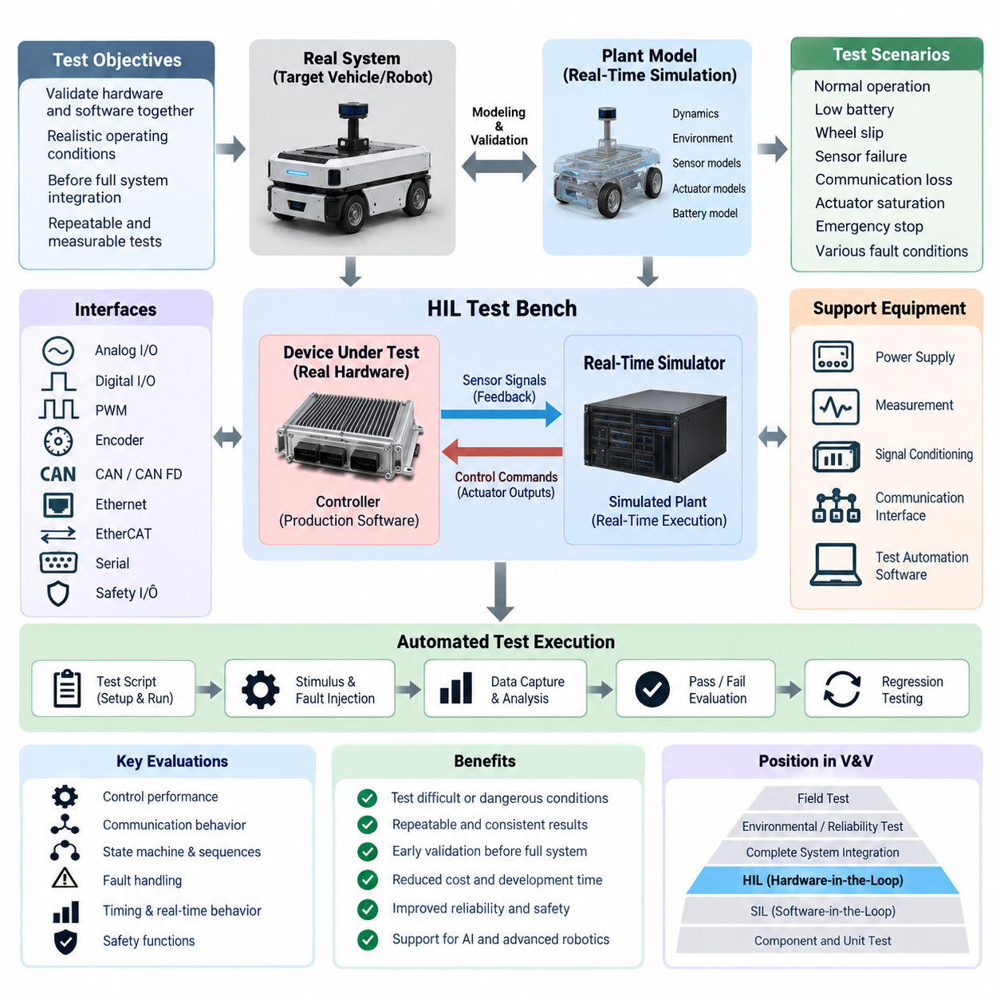
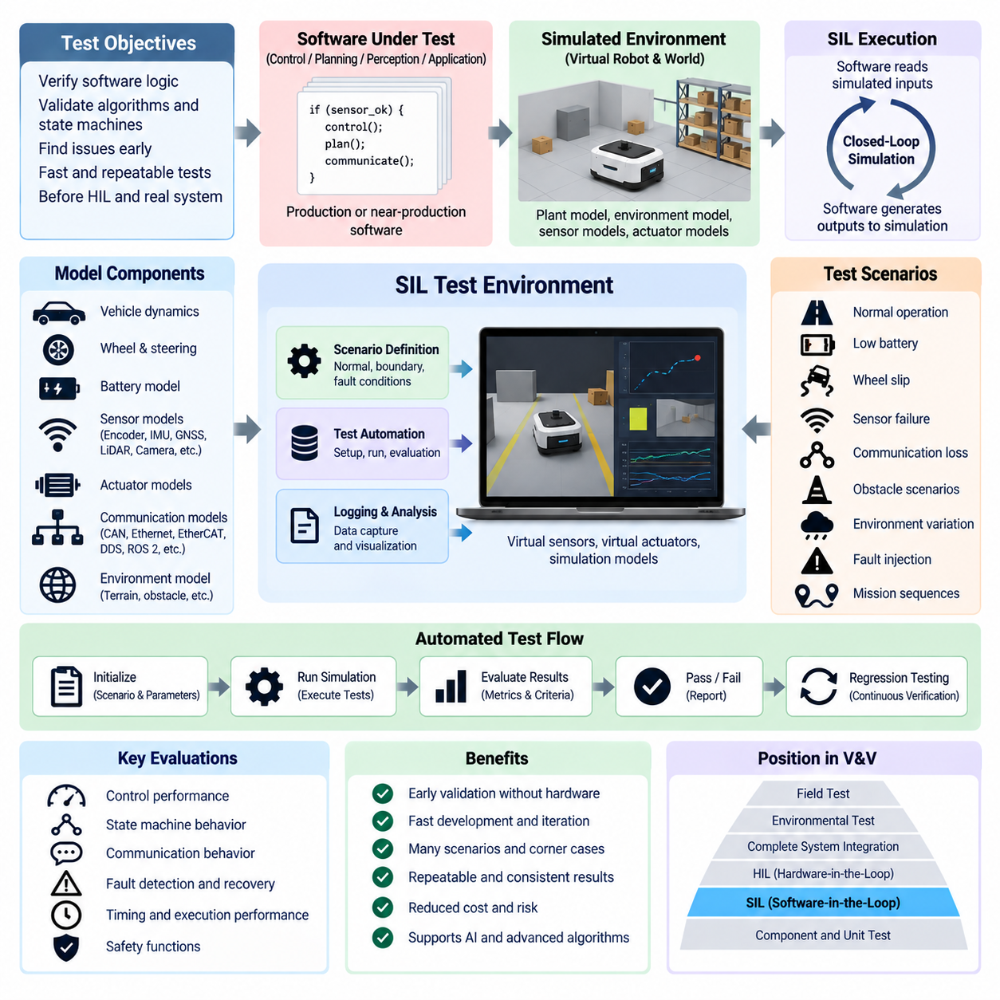
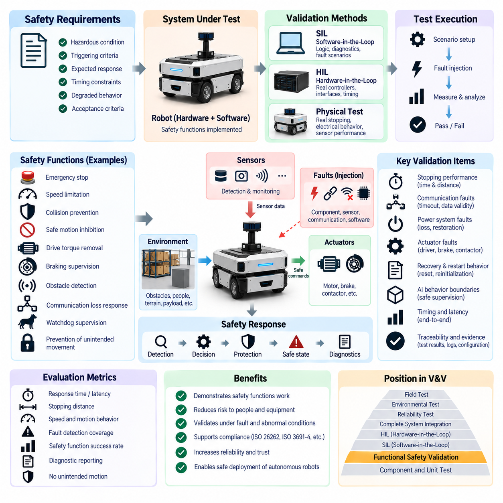
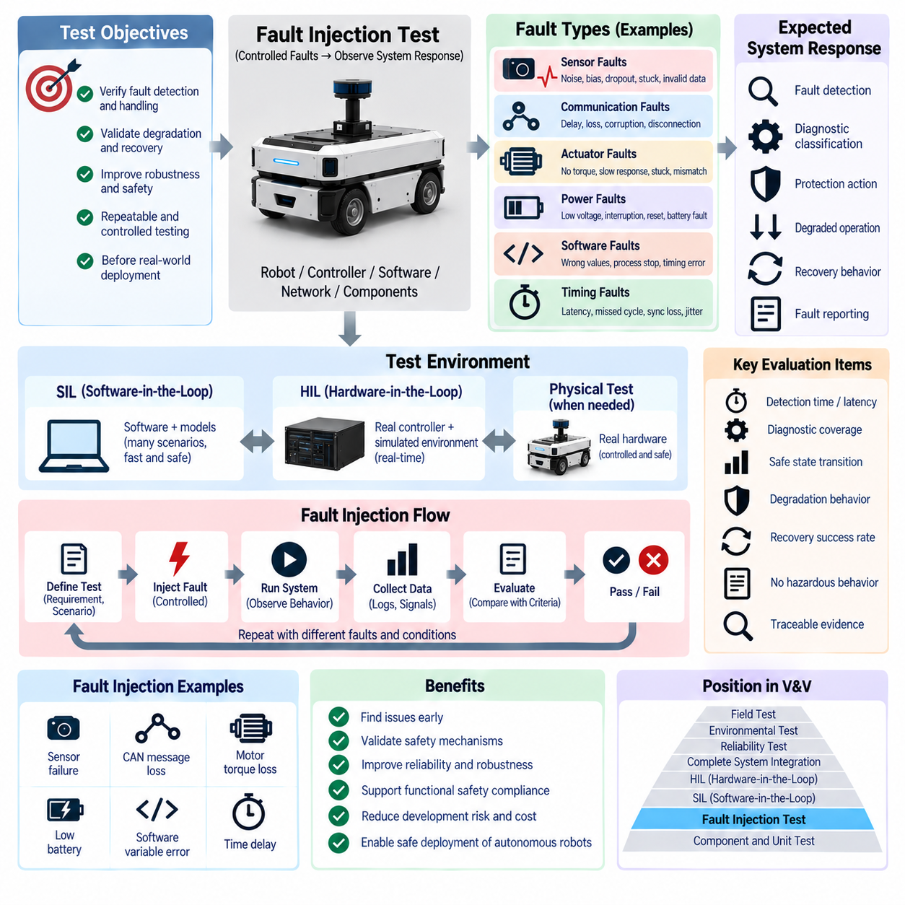
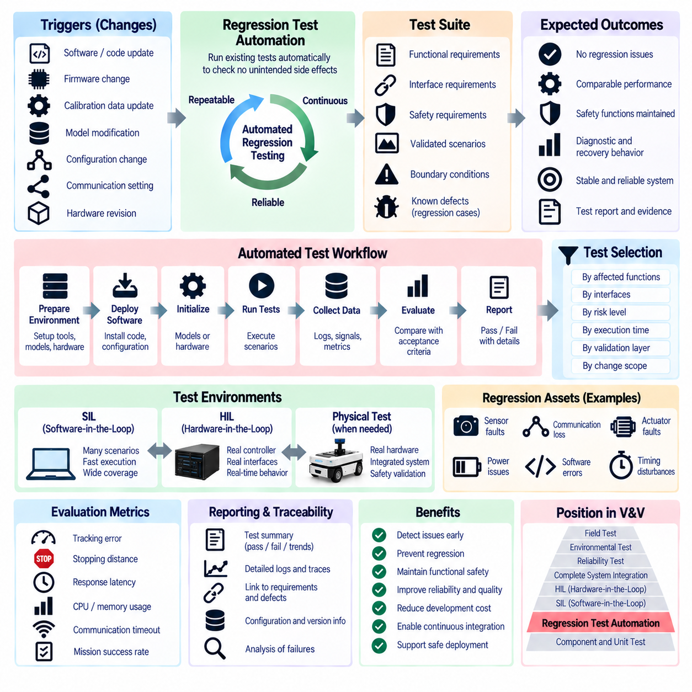

**Volume 19. Testing and Validation**


# Chapter 06. Functional Test

##  

## 06.01. HIL (Hardware in the Loop)

{width="7.268055555555556in" height="7.268055555555556in"}

Hardware-in-the-Loop (HIL) testing is a functional validation method in which a real electronic controller, embedded computer, motor controller, safety controller, or other hardware device is connected to a real-time simulation of the physical system that it is intended to control. Instead of operating the complete robot or vehicle, the test bench reproduces sensors, actuators, communication networks, environmental conditions, and plant dynamics while the actual hardware executes its production control software.

The fundamental purpose of HIL is to validate hardware and embedded software together under realistic operating conditions before full system integration. A real-time simulator calculates the behavior of the virtual plant at deterministic intervals and converts simulated states into electrical or network signals that the device under test can interpret. Commands generated by the controller are captured by the simulator and applied back to the plant model, creating a closed-loop interaction comparable to operation on the physical machine.

A typical HIL environment consists of the device under test, a real-time simulation computer, signal-conditioning interfaces, communication interfaces, power supplies, measurement equipment, and test automation software. Depending on the target system, interfaces may include analog voltage and current signals, digital I/O, PWM, encoder signals, CAN or CAN FD, Ethernet, EtherCAT, serial communication, and safety-related discrete signals. Accurate electrical behavior is important because HIL evaluates the controller through its actual interfaces rather than abstract software variables.

Real-time execution distinguishes HIL from ordinary offline simulation. The simulated plant must calculate its next state within a fixed execution period so that sensor feedback reaches the controller with realistic timing. Motor dynamics, wheel motion, steering response, battery behavior, inertial measurements, actuator loads, and vehicle motion may therefore be represented using models with different update rates. Timing jitter, communication latency, synchronization error, and missed deadlines must be controlled because they can alter closed-loop behavior.

For an autonomous mobile robot, the simulated plant can represent drivetrain dynamics, wheel encoders, steering mechanisms, battery states, proximity devices, IMU signals, and selected perception or localization inputs. The physical controller receives these simulated measurements as though they originated from the real robot and produces torque, velocity, steering, braking, or mode commands. Engineers can consequently examine navigation-related control behavior without exposing an unfinished platform to unnecessary mechanical risk.

HIL is particularly valuable for testing operating conditions that are difficult, expensive, or dangerous to reproduce repeatedly with physical equipment. Low battery voltage, wheel slip, encoder failure, communication interruption, sensor dropout, actuator saturation, excessive temperature indications, emergency-stop transitions, or inconsistent feedback can be introduced in a controlled manner. Each condition can be repeated with identical timing, allowing engineers to compare software versions and determine whether the controller responds according to defined requirements.

Communication behavior forms an important part of robotic HIL testing because modern systems distribute functions across multiple controllers and computing nodes. A test bench can reproduce CAN traffic, Ethernet communication, EtherCAT devices, gateway behavior, message delays, packet loss, corrupted data, or bus loading while monitoring the response of the hardware under test. This allows functional behavior to be evaluated together with communication timing and complements the dedicated communication tests defined elsewhere in the validation structure.

HIL also provides an effective environment for validating state machines and operating sequences. Startup, initialization, homing, standby, autonomous operation, manual control, charging, docking, shutdown, recovery, and emergency states can be executed automatically while the simulator supplies the required environmental responses. Engineers can verify transition conditions, timeout handling, interlocks, command priorities, and recovery logic across thousands of combinations that would be inefficient to reproduce manually on a complete robot.

Fault handling can be evaluated systematically by injecting abnormal signals at precise points during execution. An encoder may freeze while the drive command remains active, a communication message may disappear for a specified interval, or an analog sensor may exceed its valid range. The objective is not merely to determine whether the controller detects a fault, but also whether it enters the intended degraded or safe state, records appropriate diagnostic information, suppresses unsafe commands, and recovers correctly when recovery is permitted.

The fidelity of the plant model determines how closely HIL results represent real system behavior. A model that is too simple may verify basic logic but fail to reproduce transient responses, nonlinearities, delays, friction, saturation, or coupled dynamics. Model fidelity should therefore be selected according to the validation objective. Control-loop testing may require detailed dynamic models, whereas communication sequencing or diagnostic testing may need simpler plant behavior combined with highly accurate timing and interface reproduction.

Model validation is consequently an essential part of establishing a trustworthy HIL bench. Parameters should be derived from design information, component specifications, measurements, or physical-system identification where available. Representative responses from the simulated system should be compared with bench or vehicle measurements to determine whether relevant dynamics are reproduced adequately. HIL results should always be interpreted within the validated operating range of the models rather than assuming that every simulated condition represents physical reality equally well.

Test automation transforms HIL from an engineering experiment into a repeatable validation platform. Test scripts can configure initial conditions, execute operating sequences, stimulate interfaces, inject faults, capture signals, calculate performance metrics, and automatically determine pass or fail results. The same test suite can then be executed whenever controller hardware, firmware, calibration parameters, communication configuration, or application software changes, providing a strong foundation for regression testing later in the validation process.

A well-designed automated HIL test records both stimulus and response with synchronized timestamps. Important measurements may include command latency, tracking error, state-transition time, communication cycle time, fault-detection delay, recovery time, actuator limits, watchdog behavior, and safety-related outputs. Raw traces should be retained together with software version, hardware revision, calibration set, model version, test configuration, and execution results so that failures can be reproduced and compared across development iterations.

HIL should be considered part of a layered verification strategy rather than a replacement for Software-in-the-Loop (SIL), component testing, environmental testing, or field validation. SIL can evaluate algorithms and software logic rapidly without physical hardware, while HIL introduces real processors, interfaces, timing behavior, electrical characteristics, and communication hardware. Successful HIL testing increases confidence before tests progress toward complete robotic platforms, environmental qualification, reliability testing, and operational field evaluation.

For Physical AI and increasingly intelligent robotic systems, HIL can also provide a controlled boundary between nondeterministic high-level intelligence and deterministic embedded control. Perception, planning, or AI-generated commands may be supplied to the actual control hardware while the real-time plant verifies whether resulting actions remain within defined operational constraints. This makes it possible to evaluate how conventional control, safety mechanisms, communication networks, and AI-driven decisions interact before deployment on physical machines.

The final value of HIL lies in converting functional validation into a controlled, measurable, repeatable engineering process. A mature HIL platform allows developers to reproduce failures, test boundary conditions, evaluate software changes, verify interfaces, and accumulate regression evidence without continuously requiring the complete robot. When models, timing, interfaces, automation, and configuration management are carefully maintained, HIL becomes a central bridge between simulation-based development and validation of the real robotic system.

하드웨어 인 더 루프(Hardware-in-the-Loop, HIL) 시험은 실제 전자 제어기(Electronic Controller), 임베디드 컴퓨터(Embedded Computer), 모터 제어기(Motor Controller), 안전 제어기(Safety Controller) 또는 기타 하드웨어 장치(Hardware Device)를 제어 대상 물리 시스템(Physical System)의 실시간 시뮬레이션(Real-Time Simulation)에 연결하여 수행하는 기능 검증(Functional Validation) 방법이다. 완성된 로봇이나 차량 전체를 직접 운용하는 대신, 시험 벤치(Test Bench)가 센서(Sensor), 액추에이터(Actuator), 통신 네트워크(Communication Network), 환경 조건(Environmental Condition), 플랜트 동역학(Plant Dynamics)을 재현하며 실제 하드웨어는 양산용 제어 소프트웨어(Production Control Software)를 실행한다.

HIL의 기본 목적은 전체 시스템 통합(System Integration) 이전에 실제와 유사한 운용 조건에서 하드웨어(Hardware)와 임베디드 소프트웨어(Embedded Software)를 함께 검증하는 것이다. 실시간 시뮬레이터(Real-Time Simulator)는 결정론적 주기(Deterministic Interval)에 따라 가상 플랜트(Virtual Plant)의 동작을 계산하고, 시뮬레이션된 상태를 시험 대상 장치(Device Under Test, DUT)가 인식할 수 있는 전기 또는 네트워크 신호로 변환한다. 제어기가 생성한 명령은 다시 시뮬레이터로 전달되어 플랜트 모델(Plant Model)에 적용되며, 실제 물리 시스템과 유사한 폐루프 상호작용(Closed-Loop Interaction)을 형성한다.

일반적인 HIL 환경은 시험 대상 장치(Device Under Test), 실시간 시뮬레이션 컴퓨터(Real-Time Simulation Computer), 신호 조절 인터페이스(Signal-Conditioning Interface), 통신 인터페이스(Communication Interface), 전원 공급 장치(Power Supply), 계측 장비(Measurement Equipment), 시험 자동화 소프트웨어(Test Automation Software)로 구성된다. 대상 시스템에 따라 아날로그 전압 및 전류 신호(Analog Voltage and Current Signal), 디지털 입출력(Digital I/O), 펄스 폭 변조(PWM), 엔코더 신호(Encoder Signal), CAN 또는 CAN FD, 이더넷(Ethernet), EtherCAT, 직렬 통신(Serial Communication), 안전 관련 이산 신호(Safety-Related Discrete Signal) 등이 사용될 수 있다. HIL은 추상적인 소프트웨어 변수가 아니라 실제 인터페이스를 통해 제어기를 평가하므로 정확한 전기적 동작(Electrical Behavior)이 중요하다.

실시간 실행(Real-Time Execution)은 HIL을 일반적인 오프라인 시뮬레이션(Offline Simulation)과 구분하는 핵심 요소이다. 시뮬레이션 플랜트(Simulated Plant)는 고정된 실행 주기(Fixed Execution Period) 내에 다음 상태를 계산하여 센서 피드백(Sensor Feedback)이 실제와 유사한 타이밍으로 제어기에 전달되도록 해야 한다. 따라서 모터 동역학(Motor Dynamics), 휠 움직임(Wheel Motion), 조향 응답(Steering Response), 배터리 동작(Battery Behavior), 관성 측정(Inertial Measurement), 액추에이터 부하(Actuator Load), 차량 운동(Vehicle Motion) 등은 서로 다른 갱신 주기(Update Rate)를 갖는 모델로 표현될 수 있다. 타이밍 지터(Timing Jitter), 통신 지연(Communication Latency), 동기화 오차(Synchronization Error), 데드라인 누락(Missed Deadline)은 폐루프 동작에 영향을 줄 수 있으므로 반드시 관리되어야 한다.

자율 이동 로봇(Autonomous Mobile Robot, AMR)의 경우 시뮬레이션 플랜트는 구동계 동역학(Drivetrain Dynamics), 휠 엔코더(Wheel Encoder), 조향 메커니즘(Steering Mechanism), 배터리 상태(Battery State), 근접 감지 장치(Proximity Device), 관성 측정 장치(IMU) 신호, 그리고 선택된 인지 또는 위치추정 입력(Perception or Localization Input)을 표현할 수 있다. 실제 제어기는 이러한 시뮬레이션 측정값을 실제 로봇에서 발생한 신호처럼 수신하고 토크(Torque), 속도(Velocity), 조향(Steering), 제동(Braking), 운용 모드(Operating Mode) 명령을 생성한다. 이를 통해 엔지니어는 미완성 플랫폼을 불필요한 기계적 위험(Mechanical Risk)에 노출하지 않고도 주행 및 제어 동작을 검증할 수 있다.

HIL은 실제 장비에서 반복적으로 재현하기 어렵거나 비용이 많이 들고 위험할 수 있는 운용 조건을 시험하는 데 특히 유용하다. 낮은 배터리 전압(Low Battery Voltage), 휠 슬립(Wheel Slip), 엔코더 고장(Encoder Failure), 통신 중단(Communication Interruption), 센서 신호 손실(Sensor Dropout), 액추에이터 포화(Actuator Saturation), 과도한 온도 표시(Excessive Temperature Indication), 비상 정지 전환(Emergency-Stop Transition), 비정상 피드백(Inconsistent Feedback) 등을 통제된 방식으로 주입할 수 있다. 각각의 조건을 동일한 타이밍으로 반복할 수 있으므로 서로 다른 소프트웨어 버전을 비교하고 제어기가 정의된 요구사항에 따라 반응하는지 확인할 수 있다.

현대 로봇 시스템은 여러 제어기와 컴퓨팅 노드(Computing Node)에 기능이 분산되어 있으므로 통신 동작(Communication Behavior)은 로봇 HIL 시험의 중요한 부분을 구성한다. 시험 벤치는 CAN 트래픽(CAN Traffic), 이더넷 통신(Ethernet Communication), EtherCAT 장치, 게이트웨이 동작(Gateway Behavior), 메시지 지연(Message Delay), 패킷 손실(Packet Loss), 손상 데이터(Corrupted Data), 버스 부하(Bus Loading)를 재현하면서 시험 대상 하드웨어의 응답을 감시할 수 있다. 이를 통해 기능적 동작과 통신 타이밍을 함께 평가할 수 있으며 별도로 수행되는 전용 통신 시험(Communication Test)을 보완할 수 있다.

HIL은 상태 머신(State Machine)과 운용 시퀀스(Operating Sequence)를 검증하기 위한 효과적인 환경도 제공한다. 기동(Startup), 초기화(Initialization), 원점 복귀(Homing), 대기(Standby), 자율 운전(Autonomous Operation), 수동 제어(Manual Control), 충전(Charging), 도킹(Docking), 종료(Shutdown), 복구(Recovery), 비상 상태(Emergency State)를 자동으로 실행하면서 시뮬레이터가 필요한 환경 응답을 제공할 수 있다. 엔지니어는 완성된 로봇에서 수동으로 재현하기 어려운 수많은 조건 조합에 대해 상태 전환 조건(Transition Condition), 타임아웃 처리(Timeout Handling), 인터록(Interlock), 명령 우선순위(Command Priority), 복구 로직(Recovery Logic)을 검증할 수 있다.

고장 처리(Fault Handling)는 실행 중 정확한 시점에 비정상 신호를 주입하는 방식으로 체계적으로 평가할 수 있다. 예를 들어 구동 명령이 활성화된 상태에서 엔코더 값을 고정하거나, 특정 시간 동안 통신 메시지를 차단하거나, 아날로그 센서 값을 정상 범위 밖으로 변경할 수 있다. 시험 목적은 단순히 제어기가 고장을 감지하는지만 확인하는 것이 아니라, 의도된 성능 저하 상태(Degraded State) 또는 안전 상태(Safe State)로 전환하는지, 적절한 진단 정보(Diagnostic Information)를 기록하는지, 위험한 명령을 억제하는지, 그리고 복구가 허용되는 경우 정상적으로 복구하는지를 확인하는 데 있다.

플랜트 모델(Plant Model)의 충실도(Model Fidelity)는 HIL 결과가 실제 시스템 동작을 얼마나 정확하게 나타내는지를 결정한다. 지나치게 단순한 모델은 기본적인 로직을 검증할 수 있지만 과도 응답(Transient Response), 비선형성(Nonlinearity), 지연(Delay), 마찰(Friction), 포화(Saturation), 결합 동역학(Coupled Dynamics)을 충분히 재현하지 못할 수 있다. 따라서 모델 충실도는 검증 목적에 따라 선택해야 한다. 제어 루프(Control Loop) 시험에는 상세한 동적 모델(Dynamic Model)이 필요할 수 있지만, 통신 시퀀싱(Communication Sequencing)이나 진단 시험(Diagnostic Testing)은 단순한 플랜트 동작과 높은 정확도의 타이밍 및 인터페이스 재현을 조합하여 수행할 수 있다.

따라서 모델 검증(Model Validation)은 신뢰할 수 있는 HIL 시험 벤치를 구축하는 데 필수적인 과정이다. 모델 파라미터(Model Parameter)는 가능한 경우 설계 정보(Design Information), 부품 사양(Component Specification), 측정 데이터(Measurement Data), 물리 시스템 식별(System Identification)을 기반으로 설정해야 한다. 시뮬레이션 시스템의 대표적인 응답을 실제 벤치 또는 차량 측정 결과와 비교하여 관련 동역학이 충분히 재현되는지 확인해야 한다. HIL 결과는 모든 시뮬레이션 조건이 동일한 수준으로 물리적 현실을 표현한다고 가정하기보다 검증된 모델 운용 범위(Validated Operating Range) 내에서 해석해야 한다.

시험 자동화(Test Automation)는 HIL을 단순한 엔지니어링 실험에서 반복 가능한 검증 플랫폼(Validation Platform)으로 발전시킨다. 시험 스크립트(Test Script)는 초기 조건을 설정하고, 운용 시퀀스를 실행하며, 인터페이스에 자극을 입력하고, 고장을 주입하며, 신호를 기록하고, 성능 지표(Performance Metric)를 계산하여 합격 또는 불합격(Pass or Fail)을 자동 판정할 수 있다. 동일한 시험 스위트(Test Suite)는 제어기 하드웨어, 펌웨어(Firmware), 캘리브레이션 파라미터(Calibration Parameter), 통신 구성 또는 응용 소프트웨어가 변경될 때마다 반복 실행할 수 있으며 이후 회귀 시험(Regression Testing)을 위한 강력한 기반을 제공한다.

잘 설계된 자동 HIL 시험은 자극(Stimulus)과 응답(Response)을 동기화된 타임스탬프(Synchronized Timestamp)와 함께 기록한다. 주요 측정 항목에는 명령 지연(Command Latency), 추종 오차(Tracking Error), 상태 전환 시간(State-Transition Time), 통신 주기 시간(Communication Cycle Time), 고장 감지 지연(Fault-Detection Delay), 복구 시간(Recovery Time), 액추에이터 제한(Actuator Limit), 워치독 동작(Watchdog Behavior), 안전 관련 출력(Safety-Related Output) 등이 포함될 수 있다. 원시 데이터(Raw Trace)는 소프트웨어 버전, 하드웨어 리비전(Hardware Revision), 캘리브레이션 세트(Calibration Set), 모델 버전(Model Version), 시험 구성(Test Configuration), 실행 결과와 함께 보관하여 개발 단계 간 고장을 재현하고 비교할 수 있도록 해야 한다.

HIL은 소프트웨어 인 더 루프(Software-in-the-Loop, SIL), 부품 시험(Component Testing), 환경 시험(Environmental Testing), 필드 검증(Field Validation)을 대체하는 것이 아니라 계층화된 검증 전략(Layered Verification Strategy)의 일부로 이해해야 한다. SIL은 물리적 하드웨어 없이 알고리즘과 소프트웨어 로직을 빠르게 평가할 수 있는 반면, HIL은 실제 프로세서(Processor), 인터페이스, 타이밍 동작, 전기적 특성(Electrical Characteristic), 통신 하드웨어를 검증 과정에 포함한다. 성공적인 HIL 시험은 완성된 로봇 플랫폼, 환경 적합성 시험(Environmental Qualification), 신뢰성 시험(Reliability Testing), 실제 운용 환경에서의 필드 검증으로 진행하기 전에 시스템에 대한 신뢰도를 높여준다.

피지컬 AI(Physical AI)와 지능화된 로봇 시스템에서 HIL은 비결정론적 고수준 지능(Non-Deterministic High-Level Intelligence)과 결정론적 임베디드 제어(Deterministic Embedded Control) 사이에 통제된 검증 경계(Validation Boundary)를 제공할 수 있다. 인지(Perception), 계획(Planning), AI 생성 명령(AI-Generated Command)을 실제 제어 하드웨어에 제공하면서 실시간 플랜트가 결과 동작이 정의된 운용 제약(Operational Constraint) 내에 유지되는지 검증할 수 있다. 이를 통해 실제 장비에 배치하기 전에 기존 제어 시스템, 안전 메커니즘(Safety Mechanism), 통신 네트워크, AI 기반 의사결정(AI-Driven Decision)이 어떻게 상호작용하는지 평가할 수 있다.

HIL의 최종적인 가치는 기능 검증(Functional Validation)을 통제 가능하고 측정 가능하며 반복 가능한 엔지니어링 프로세스(Engineering Process)로 전환하는 데 있다. 성숙한 HIL 플랫폼은 완성된 로봇을 지속적으로 사용하지 않고도 개발자가 고장을 재현하고, 경계 조건(Boundary Condition)을 시험하며, 소프트웨어 변경을 평가하고, 인터페이스를 검증하며, 회귀 검증 증거(Regression Evidence)를 축적할 수 있도록 한다. 모델, 타이밍, 인터페이스, 자동화, 형상 관리(Configuration Management)가 체계적으로 유지된다면 HIL은 시뮬레이션 기반 개발(Simulation-Based Development)과 실제 로봇 시스템 검증(Real Robotic System Validation)을 연결하는 핵심적인 가교 역할을 수행한다.

##  

## 06.02. SIL (Software in the Loop)

{width="7.268055555555556in" height="7.268055555555556in"}

Software-in-the-Loop (SIL) testing is a functional validation method in which production or near-production software is executed against simulated models of the system, environment, sensors, actuators, and external interfaces without requiring the target electronic hardware. Within the functional-test structure, SIL provides an early verification layer before Hardware-in-the-Loop (HIL), complete system integration, environmental testing, and field validation.

The primary purpose of SIL is to determine whether control algorithms, application logic, state machines, diagnostics, communication behavior, and decision functions operate correctly before software is deployed to physical controllers. The software receives simulated inputs representing the operating system and generates outputs that are returned to the simulation. This closed-loop execution allows developers to evaluate functional behavior rapidly while avoiding hardware availability, damage, and configuration constraints.

A typical SIL environment contains the software under test, plant and environment models, virtual sensor and actuator interfaces, communication models, scenario definitions, test automation tools, logging functions, and result-analysis software. Depending on the implementation, individual algorithms, complete controller applications, middleware components, or multiple interacting software nodes can be executed together. Interfaces are represented through software abstractions rather than physical electrical connections.

The simulated plant represents the physical dynamics with which the software is expected to interact. For mobile robotics, this may include vehicle motion, wheel dynamics, steering response, drivetrain behavior, actuator limits, battery state, and environmental interaction. Virtual sensors can generate encoder, IMU, GNSS, LiDAR, camera, proximity, or other measurements according to the required test scope, while actuator commands modify the simulated system state for the next calculation cycle.

Unlike HIL, SIL does not fundamentally depend on the timing characteristics, electrical interfaces, processors, or communication transceivers of the final hardware. Execution may therefore run slower than real time for detailed analysis or substantially faster than real time for large regression campaigns. This flexibility enables thousands of scenarios to be evaluated efficiently, although hardware-dependent timing behavior must later be verified using HIL or physical-system testing.

SIL is especially useful during algorithm and control-software development because parameters and models can be modified rapidly without changing physical equipment. Engineers can evaluate velocity control, steering logic, trajectory tracking, docking sequences, energy-management logic, operating modes, and supervisory control under many simulated conditions. Failed cases can be reproduced from identical initial states, making debugging more systematic than testing directly on a moving robotic platform.

State-machine verification is another major application of SIL. Startup, initialization, standby, autonomous operation, manual operation, charging, docking, shutdown, degraded operation, recovery, and emergency transitions can be exercised automatically. Test scenarios can verify whether transition conditions, timers, interlocks, command priorities, initialization dependencies, and recovery rules produce the expected software states for both normal and abnormal operating sequences.

SIL also enables controlled fault simulation before hardware-based fault injection is attempted. Sensor values can become unavailable, frozen, noisy, delayed, biased, or outside their valid ranges. Communication messages can be delayed or removed, actuator responses can be limited, and simulated subsystem failures can occur at precisely defined times. The resulting software behavior can then be evaluated for fault detection, diagnostic reporting, fallback logic, safe-state transitions, and recovery.

Communication functions can be represented virtually so that distributed software behavior is tested before all physical network devices are available. Simulated CAN, Ethernet, EtherCAT, DDS, ROS 2 middleware, or other communication mechanisms can reproduce message exchange between software components according to the intended architecture. Engineers can examine sequencing, timeout logic, data validity, message dependencies, and application-level reactions before later validating physical network behavior with dedicated communication and HIL tests.

For autonomous and Physical AI systems, SIL can extend beyond conventional control logic to perception, localization, planning, prediction, and decision-making software. Simulated environments can provide structured sensor observations or synthetic sensor data while the software generates trajectories, commands, or behavioral decisions. This enables developers to investigate interactions among intelligent functions and deterministic control logic before allowing generated actions to influence a real robot.

Simulation fidelity must be selected according to the purpose of each SIL test. High-fidelity vehicle dynamics may be necessary for control-performance analysis, while simplified models may be sufficient for state-machine, communication, diagnostic, or supervisory-function verification. Excessive model complexity can reduce execution speed without improving the targeted validation, whereas insufficient fidelity may hide important software defects. Model assumptions and valid operating ranges should therefore be explicitly managed.

Scenario design is equally important because SIL effectiveness depends on the operating conditions presented to the software. Nominal cases should establish expected functionality, while boundary conditions, parameter variations, disturbances, and fault conditions expose weaknesses that normal operation may not reveal. Scenario libraries can progressively represent different payloads, friction conditions, battery states, sensor uncertainties, communication disturbances, obstacle configurations, and mission sequences relevant to the robotic system.

Test automation allows SIL to scale from interactive development into continuous verification. Automated scripts can initialize simulation conditions, configure software parameters, execute scenarios, inject events, capture signals, calculate metrics, and determine pass or fail results. Because physical hardware is not required, multiple SIL instances may be executed in parallel on workstation or server resources, allowing broad regression suites to be completed much faster than equivalent physical testing.

Useful SIL evaluation metrics depend on the tested function and may include tracking error, trajectory deviation, state-transition time, command response, fault-detection latency, recovery behavior, computational execution time, mission completion, collision occurrence, safety-rule violations, and communication timeout behavior. Results should be stored together with software version, model version, configuration parameters, scenario definition, random seed where applicable, and acceptance criteria to ensure reproducibility.

Regression testing is one of the strongest benefits of SIL. Every software modification can automatically trigger a defined collection of previously validated scenarios so that developers can determine whether new functionality has unintentionally affected existing behavior. A growing regression library converts discovered defects into permanent test cases, allowing the verification system to preserve engineering knowledge and detect recurrence of previously resolved failures throughout the development lifecycle.

SIL and HIL therefore perform complementary roles within the validation process. SIL emphasizes software logic, algorithms, scenarios, scalability, and rapid iteration without requiring target hardware, while HIL introduces the real controller, physical interfaces, processor behavior, communication hardware, and real-time execution constraints. Tests that pass in SIL can progressively migrate toward HIL, reducing the number of basic software defects encountered during more expensive hardware-based validation.

A mature SIL environment ultimately creates a reproducible bridge between software development and physical-system verification. By combining executable software, plant models, scenario libraries, fault simulation, automated evaluation, and regression testing, engineers can expose functional problems early and repeatedly. For increasingly software-defined robots and Physical AI systems, SIL becomes a fundamental validation layer that improves development speed while preparing software for subsequent HIL, integrated-system, and field testing.

소프트웨어 인 더 루프(Software-in-the-Loop, SIL) 시험은 대상 전자 하드웨어(Target Electronic Hardware)를 사용하지 않고, 양산용 또는 양산에 가까운 소프트웨어(Production or Near-Production Software)를 시스템, 환경, 센서, 액추에이터 및 외부 인터페이스의 시뮬레이션 모델(Simulated Model)과 연동하여 실행하는 기능 검증(Functional Validation) 방법이다. 기능 시험(Functional Test) 구조에서 SIL은 하드웨어 인 더 루프(Hardware-in-the-Loop, HIL), 전체 시스템 통합(Complete System Integration), 환경 시험(Environmental Testing), 필드 검증(Field Validation)에 앞서 수행되는 초기 검증 계층(Early Verification Layer)을 제공한다.

SIL의 주요 목적은 소프트웨어가 실제 제어기에 배포되기 전에 제어 알고리즘(Control Algorithm), 응용 로직(Application Logic), 상태 머신(State Machine), 진단 기능(Diagnostics), 통신 동작(Communication Behavior), 의사결정 기능(Decision Function)이 올바르게 동작하는지를 확인하는 것이다. 소프트웨어는 운용 시스템을 나타내는 시뮬레이션 입력(Simulated Input)을 수신하고 출력을 생성하여 다시 시뮬레이션으로 전달한다. 이러한 폐루프 실행(Closed-Loop Execution)을 통해 하드웨어 가용성, 손상 위험, 구성 제약 없이 기능 동작을 신속하게 평가할 수 있다.

일반적인 SIL 환경은 시험 대상 소프트웨어(Software Under Test), 플랜트 및 환경 모델(Plant and Environment Model), 가상 센서 및 액추에이터 인터페이스(Virtual Sensor and Actuator Interface), 통신 모델(Communication Model), 시나리오 정의(Scenario Definition), 시험 자동화 도구(Test Automation Tool), 로깅 기능(Logging Function), 결과 분석 소프트웨어(Result-Analysis Software)로 구성된다. 구현 방식에 따라 개별 알고리즘, 전체 제어기 애플리케이션(Controller Application), 미들웨어 구성요소(Middleware Component), 또는 서로 상호작용하는 여러 소프트웨어 노드를 함께 실행할 수 있다. 인터페이스는 실제 전기적 연결 대신 소프트웨어 추상화(Software Abstraction)를 통해 표현된다.

시뮬레이션 플랜트(Simulated Plant)는 소프트웨어가 상호작용할 것으로 예상되는 물리적 동역학(Physical Dynamics)을 표현한다. 이동 로봇(Mobile Robotics)의 경우 차량 운동(Vehicle Motion), 휠 동역학(Wheel Dynamics), 조향 응답(Steering Response), 구동계 동작(Drivetrain Behavior), 액추에이터 제한(Actuator Limit), 배터리 상태(Battery State), 환경과의 상호작용(Environmental Interaction) 등이 포함될 수 있다. 가상 센서(Virtual Sensor)는 요구되는 시험 범위에 따라 엔코더(Encoder), 관성 측정 장치(IMU), 위성항법시스템(GNSS), 라이다(LiDAR), 카메라(Camera), 근접 센서(Proximity Sensor) 등의 측정값을 생성하며, 액추에이터 명령은 다음 계산 주기의 시뮬레이션 시스템 상태를 변화시킨다.

HIL과 달리 SIL은 최종 하드웨어의 타이밍 특성(Timing Characteristic), 전기적 인터페이스(Electrical Interface), 프로세서(Processor), 통신 트랜시버(Communication Transceiver)에 본질적으로 의존하지 않는다. 따라서 상세한 분석이 필요한 경우 실제 시간보다 느리게 실행할 수 있으며, 대규모 회귀 시험(Regression Campaign)을 위해 실제 시간보다 훨씬 빠르게 실행할 수도 있다. 이러한 유연성을 통해 수천 개의 시나리오를 효율적으로 평가할 수 있지만, 하드웨어에 종속적인 타이밍 동작은 이후 HIL 또는 실제 물리 시스템 시험(Physical-System Testing)을 통해 검증해야 한다.

SIL은 물리 장비를 변경하지 않고도 파라미터(Parameter)와 모델을 신속하게 수정할 수 있기 때문에 알고리즘 및 제어 소프트웨어(Control Software) 개발 과정에서 특히 유용하다. 엔지니어는 다양한 시뮬레이션 조건에서 속도 제어(Velocity Control), 조향 로직(Steering Logic), 궤적 추종(Trajectory Tracking), 도킹 시퀀스(Docking Sequence), 에너지 관리 로직(Energy-Management Logic), 운용 모드(Operating Mode), 상위 제어(Supervisory Control)를 평가할 수 있다. 실패한 사례를 동일한 초기 상태(Initial State)에서 재현할 수 있으므로 실제 이동 로봇 플랫폼에서 직접 시험하는 것보다 체계적인 디버깅(Debugging)이 가능하다.

상태 머신 검증(State-Machine Verification)은 SIL의 또 다른 주요 적용 분야이다. 기동(Startup), 초기화(Initialization), 대기(Standby), 자율 운전(Autonomous Operation), 수동 운전(Manual Operation), 충전(Charging), 도킹(Docking), 종료(Shutdown), 성능 저하 운전(Degraded Operation), 복구(Recovery), 비상 전환(Emergency Transition)을 자동으로 실행할 수 있다. 시험 시나리오를 통해 정상 및 비정상 운용 시퀀스에서 전환 조건(Transition Condition), 타이머(Timer), 인터록(Interlock), 명령 우선순위(Command Priority), 초기화 종속성(Initialization Dependency), 복구 규칙(Recovery Rule)이 예상된 소프트웨어 상태를 생성하는지 검증할 수 있다.

SIL은 하드웨어 기반 고장 주입(Hardware-Based Fault Injection)을 수행하기 전에 통제된 고장 시뮬레이션(Fault Simulation)을 가능하게 한다. 센서 값은 사용 불가능한 상태가 되거나 고정되고, 노이즈가 발생하거나 지연되며, 바이어스(Bias)가 추가되거나 유효 범위를 벗어나도록 설정할 수 있다. 통신 메시지를 지연 또는 제거하거나 액추에이터 응답을 제한하고, 정확하게 정의된 시점에 가상 서브시스템 고장(Simulated Subsystem Failure)을 발생시킬 수도 있다. 이후 소프트웨어의 고장 감지(Fault Detection), 진단 보고(Diagnostic Reporting), 대체 로직(Fallback Logic), 안전 상태 전환(Safe-State Transition), 복구(Recovery) 동작을 평가할 수 있다.

통신 기능(Communication Function)은 가상으로 표현할 수 있으므로 모든 물리적 네트워크 장치가 준비되기 전에도 분산 소프트웨어 동작(Distributed Software Behavior)을 시험할 수 있다. 시뮬레이션된 CAN, 이더넷(Ethernet), EtherCAT, 데이터 분산 서비스(Data Distribution Service, DDS), ROS 2 미들웨어(Middleware) 또는 기타 통신 메커니즘은 의도된 아키텍처에 따라 소프트웨어 구성요소 사이의 메시지 교환을 재현할 수 있다. 엔지니어는 이후 전용 통신 시험과 HIL을 통해 물리 네트워크 동작을 검증하기 전에 시퀀싱(Sequencing), 타임아웃 로직(Timeout Logic), 데이터 유효성(Data Validity), 메시지 종속성(Message Dependency), 애플리케이션 수준 반응(Application-Level Reaction)을 확인할 수 있다.

자율 시스템(Autonomous System)과 피지컬 AI(Physical AI) 시스템에서 SIL은 기존 제어 로직을 넘어 인지(Perception), 위치추정(Localization), 계획(Planning), 예측(Prediction), 의사결정(Decision-Making) 소프트웨어까지 확장할 수 있다. 시뮬레이션 환경은 구조화된 센서 관측값(Structured Sensor Observation) 또는 합성 센서 데이터(Synthetic Sensor Data)를 제공하고, 소프트웨어는 궤적(Trajectory), 명령(Command), 행동 결정(Behavioral Decision)을 생성할 수 있다. 이를 통해 생성된 행동이 실제 로봇에 영향을 주기 전에 지능 기능(Intelligent Function)과 결정론적 제어 로직(Deterministic Control Logic) 사이의 상호작용을 검토할 수 있다.

시뮬레이션 충실도(Simulation Fidelity)는 각 SIL 시험의 목적에 따라 선택해야 한다. 제어 성능 분석(Control-Performance Analysis)에는 고충실도 차량 동역학(High-Fidelity Vehicle Dynamics)이 필요할 수 있지만, 상태 머신, 통신, 진단 또는 상위 기능(Supervisory Function)의 검증에는 단순화된 모델로도 충분할 수 있다. 지나치게 복잡한 모델은 목표 검증의 품질을 향상시키지 않으면서 실행 속도를 저하시킬 수 있으며, 반대로 충실도가 부족하면 중요한 소프트웨어 결함을 발견하지 못할 수 있다. 따라서 모델 가정(Model Assumption)과 유효 운용 범위(Valid Operating Range)를 명확하게 관리해야 한다.

시나리오 설계(Scenario Design) 역시 중요하다. SIL의 효과는 소프트웨어에 어떤 운용 조건이 제시되는지에 크게 좌우되기 때문이다. 정상 사례(Nominal Case)는 예상 기능을 확인하는 기준이 되며, 경계 조건(Boundary Condition), 파라미터 변화(Parameter Variation), 외란(Disturbance), 고장 조건(Fault Condition)은 정상 운전에서는 드러나지 않는 취약점을 발견하는 데 사용된다. 시나리오 라이브러리(Scenario Library)는 로봇 시스템과 관련된 다양한 페이로드(Payload), 마찰 조건(Friction Condition), 배터리 상태, 센서 불확실성(Sensor Uncertainty), 통신 장애(Communication Disturbance), 장애물 구성(Obstacle Configuration), 임무 시퀀스(Mission Sequence)를 단계적으로 표현할 수 있다.

시험 자동화(Test Automation)는 SIL을 대화형 개발(Interactive Development) 수준에서 지속적 검증(Continuous Verification) 체계로 확장한다. 자동화 스크립트(Automated Script)는 시뮬레이션 초기 조건을 설정하고, 소프트웨어 파라미터를 구성하며, 시나리오를 실행하고, 이벤트를 주입하며, 신호를 기록하고, 평가 지표를 계산하여 합격 또는 불합격(Pass or Fail)을 판정할 수 있다. 물리 하드웨어가 필요하지 않으므로 여러 SIL 인스턴스(Instance)를 워크스테이션(Workstation)이나 서버 자원(Server Resource)에서 병렬 실행할 수 있으며, 이를 통해 광범위한 회귀 시험을 동일한 물리 시험보다 훨씬 빠르게 수행할 수 있다.

유용한 SIL 평가 지표(Evaluation Metric)는 시험 대상 기능에 따라 달라지며 추종 오차(Tracking Error), 궤적 편차(Trajectory Deviation), 상태 전환 시간(State-Transition Time), 명령 응답(Command Response), 고장 감지 지연(Fault-Detection Latency), 복구 동작(Recovery Behavior), 계산 실행 시간(Computational Execution Time), 임무 완료(Mission Completion), 충돌 발생(Collision Occurrence), 안전 규칙 위반(Safety-Rule Violation), 통신 타임아웃 동작(Communication Timeout Behavior) 등이 포함될 수 있다. 결과는 재현성을 확보하기 위해 소프트웨어 버전, 모델 버전, 구성 파라미터(Configuration Parameter), 시나리오 정의, 필요한 경우 난수 시드(Random Seed), 합격 기준(Acceptance Criteria)과 함께 저장해야 한다.

회귀 시험(Regression Testing)은 SIL이 제공하는 가장 강력한 이점 중 하나이다. 소프트웨어가 변경될 때마다 이전에 검증된 시나리오 집합을 자동으로 실행하여 새로운 기능이 기존 동작에 의도하지 않은 영향을 미쳤는지 확인할 수 있다. 지속적으로 확장되는 회귀 시험 라이브러리(Regression Library)는 발견된 결함을 영구적인 시험 사례(Test Case)로 전환하여 검증 시스템에 엔지니어링 지식(Engineering Knowledge)을 축적하고, 개발 수명주기(Development Lifecycle) 전체에서 과거에 해결된 고장이 다시 발생하는 것을 탐지할 수 있도록 한다.

따라서 SIL과 HIL은 검증 프로세스에서 상호 보완적인 역할을 수행한다. SIL은 대상 하드웨어 없이 소프트웨어 로직, 알고리즘, 시나리오, 확장성(Scalability), 빠른 반복 개발(Rapid Iteration)에 중점을 두는 반면, HIL은 실제 제어기, 물리적 인터페이스, 프로세서 동작, 통신 하드웨어, 실시간 실행 제약(Real-Time Execution Constraint)을 검증 환경에 추가한다. SIL에서 통과한 시험은 점진적으로 HIL 단계로 이동할 수 있으며, 이를 통해 비용이 더 높은 하드웨어 기반 검증 단계에서 발견되는 기본적인 소프트웨어 결함을 줄일 수 있다.

성숙한 SIL 환경은 궁극적으로 소프트웨어 개발과 물리 시스템 검증(Physical-System Verification)을 연결하는 재현 가능한 가교를 형성한다. 실행 가능한 소프트웨어(Executable Software), 플랜트 모델, 시나리오 라이브러리, 고장 시뮬레이션, 자동 평가(Automated Evaluation), 회귀 시험을 결합함으로써 엔지니어는 기능적 문제를 개발 초기 단계에서 반복적으로 발견할 수 있다. 소프트웨어 정의 로봇(Software-Defined Robot)과 피지컬 AI 시스템의 비중이 증가할수록 SIL은 개발 속도를 향상시키는 동시에 이후 HIL, 통합 시스템 시험(Integrated-System Testing), 필드 시험(Field Testing)을 위한 소프트웨어 준비도를 높이는 핵심 검증 계층이 된다.

##  

## 06.03. Functional Safety Validation

{width="7.268055555555556in" height="7.268055555555556in"}

Functional safety validation is the systematic process of demonstrating that safety-related functions perform correctly when faults, abnormal operating conditions, or foreseeable misuse could create hazardous robot behavior. Within the testing and validation structure, it follows SIL and HIL-based functional verification and focuses specifically on whether implemented safety mechanisms can detect hazardous conditions, control risk, and transition the system toward a defined safe or degraded state.

The purpose of functional safety validation is not simply to confirm that the robot operates correctly during normal conditions. It must provide evidence that safety functions remain effective when components fail, information becomes invalid, communication is interrupted, or control behavior deviates from its intended operation. Validation therefore examines the complete safety response from fault occurrence and detection through decision logic, protective action, diagnostic reporting, and final system state.

Safety requirements provide the foundation for validation. Each safety-related requirement should define the hazardous condition being controlled, triggering criteria, expected system response, timing constraints, permitted degraded behavior, and acceptance criteria. Validation tests then trace these requirements to observable system behavior. This requirement-to-test relationship provides evidence that safety concepts implemented during system, electrical, software, and control design have actually been realized in the integrated system.

For mobile robots, relevant safety functions can include emergency stopping, protective stopping, speed limitation, collision prevention, safe motion inhibition, drive torque removal, braking supervision, obstacle detection, communication-loss response, watchdog supervision, and prevention of unintended movement. The exact functions depend on the robot architecture and operational environment. Validation must therefore be based on the defined safety concept rather than applying an identical test set to every robotic platform.

Emergency-stop validation verifies the complete response chain from activation of the emergency device to removal or control of hazardous motion. Testing should examine detection of the input, safety logic execution, actuator response, braking or torque interruption, stopping behavior, system indication, and restart prevention. Release of the emergency-stop device should not automatically create hazardous motion; the required reset and controlled restart sequence must also be evaluated under representative operating states.

Protective sensing requires validation of both detection and system reaction. Safety LiDAR, bumpers, proximity sensors, interlocks, or other protective devices may define warning, protective, or stopping conditions. Tests should confirm that relevant objects or events are detected within the intended operating region and that the resulting speed reduction, controlled stop, or motion inhibition occurs correctly. Sensor availability and invalid-data handling should also be evaluated because a failed protective sensor can itself become a safety-relevant condition.

Stopping performance is particularly important for moving robotic systems because safety depends on the distance and time required to eliminate hazardous motion. Validation should consider representative speeds, payloads, directions of travel, surface conditions, actuator states, and braking characteristics. Measured stopping time and stopping distance can then be compared with defined safety limits and protective-field assumptions so that sensing distance, system latency, and physical stopping capability remain consistent.

Functional safety validation must also examine faults within power and actuator systems. Loss of control power, unexpected power restoration, motor-driver faults, brake faults, contactor failures, invalid feedback, or actuator command inconsistencies can produce unsafe behavior if they are not handled correctly. Tests should verify whether the safety architecture detects these conditions and whether independent protective mechanisms prevent uncontrolled torque, unintended movement, or unsafe restart when normal control functions become unreliable.

Communication faults are significant because safety-related information may cross multiple controllers, networks, and gateways. Missing messages, stale data, excessive latency, corrupted information, synchronization loss, or communication interruption should result in behavior consistent with the safety concept. Validation should determine whether timeout supervision, data validity checking, heartbeat mechanisms, redundant information, or other diagnostics detect the problem within the required time and initiate the appropriate safe response.

Fault injection provides a controlled method for evaluating safety mechanisms that may rarely activate during normal operation. Sensor signals can be frozen, communication channels interrupted, feedback values made inconsistent, software states corrupted within the permitted test environment, or simulated component failures introduced. The objective is to demonstrate not only fault detection but also fault containment, diagnostic coverage, transition to the intended state, prevention of hazardous commands, and appropriate recovery behavior.

HIL and SIL environments are valuable supporting tools for functional safety validation because hazardous scenarios can be exercised before they are attempted on complete physical machines. SIL allows safety logic, state transitions, diagnostics, and fault responses to be explored efficiently across many scenarios, while HIL adds real controllers, physical interfaces, communication hardware, and real-time timing behavior. Physical-system testing remains necessary where actual mechanical stopping, electrical behavior, or sensor performance determines safety.

Timing is a critical validation parameter because correct safety logic may still be ineffective if its response is too slow. The complete reaction path can include sensor detection, communication delay, controller processing, safety decision, command transmission, actuator response, and mechanical stopping. Validation should measure relevant latency across this chain and evaluate worst-case or appropriately bounded behavior rather than relying only on average response values that may conceal hazardous timing conditions.

Recovery and restart behavior must be validated as carefully as fault detection. After a safety event, the robot should remain in the required safe state until defined recovery conditions have been satisfied. Tests should evaluate reset logic, operator acknowledgement where required, sensor restoration, communication recovery, reinitialization, brake release, and transition back to operational states. Automatic recovery must not cause unexpected motion or bypass safety conditions that originally triggered the protective response.

Autonomous and Physical AI systems introduce additional validation challenges because perception, planning, or AI-generated decisions may vary with environmental observations. Functional safety should therefore maintain enforceable boundaries around intelligent behavior. Safety mechanisms can supervise velocity, operating zones, actuator commands, collision constraints, system health, or permissible modes independently of high-level decision generation, ensuring that an unexpected AI output does not directly become an uncontrolled physical action.

Validation evidence should be traceable and reproducible. Each test should identify the safety requirement, test configuration, hardware and software versions, initial conditions, injected faults, expected response, measured results, acceptance criteria, and final verdict. Signal traces and synchronized timestamps are especially important when proving detection and reaction times. Configuration management ensures that evidence generated for one system version is not incorrectly attributed to another hardware, software, or calibration configuration.

Functional safety validation is closely related to the broader safety architecture represented elsewhere in the robotics electrical-engineering structure, including ISO 26262, IEC 61508, ISO 3691-4, ISO 13849, SIL and ASIL assessment, emergency-stop design, safety PLCs, safety LiDAR, and safety networks. These subjects provide the architectural and standards context, while functional testing determines whether the implemented robot actually exhibits the intended safety behavior.

Successful functional safety validation does not mean that every possible failure has been eliminated. Instead, it provides structured evidence that identified hazardous conditions are controlled by defined safety mechanisms and that these mechanisms behave correctly within their validated assumptions and operating limits. Combined with fault injection, regression testing, environmental validation, reliability testing, and field evaluation, it builds confidence that the robot can respond predictably when normal operation is disturbed.

A mature functional safety validation process therefore connects hazard-driven requirements with measurable physical and software behavior. It verifies sensing, communication, decision logic, actuation, stopping, diagnostics, degradation, recovery, and restart as an integrated safety chain. For autonomous robots and Physical AI platforms, this disciplined approach is essential for ensuring that increasingly capable intelligence remains bounded by independently verifiable mechanisms that protect people, equipment, and the surrounding environment.

기능 안전 검증(Functional Safety Validation)은 고장(Fault), 비정상 운용 조건(Abnormal Operating Condition), 또는 예측 가능한 오사용(Foreseeable Misuse)이 위험한 로봇 동작을 유발할 수 있는 상황에서 안전 관련 기능(Safety-Related Function)이 올바르게 수행되는지를 체계적으로 입증하는 과정이다. 시험 및 검증(Testing and Validation) 구조에서 기능 안전 검증은 SIL 및 HIL 기반 기능 검증 이후에 수행되며, 구현된 안전 메커니즘(Safety Mechanism)이 위험 상황을 감지하고 위험을 통제하며 시스템을 정의된 안전 상태(Safe State) 또는 성능 저하 상태(Degraded State)로 전환할 수 있는지를 중점적으로 확인한다.

기능 안전 검증의 목적은 단순히 정상 조건에서 로봇이 올바르게 작동하는지를 확인하는 것이 아니다. 구성요소가 고장 나거나 정보가 유효하지 않게 되고, 통신이 중단되거나 제어 동작이 의도된 상태에서 벗어나는 경우에도 안전 기능이 효과적으로 유지된다는 증거를 제공해야 한다. 따라서 검증에서는 고장 발생 및 감지(Fault Occurrence and Detection)부터 의사결정 로직(Decision Logic), 보호 동작(Protective Action), 진단 보고(Diagnostic Reporting), 최종 시스템 상태(Final System State)에 이르는 전체 안전 대응 과정을 평가한다.

안전 요구사항(Safety Requirement)은 검증의 기반을 제공한다. 각각의 안전 관련 요구사항은 통제해야 하는 위험 조건(Hazardous Condition), 작동 조건(Triggering Criteria), 예상 시스템 응답(Expected System Response), 타이밍 제약(Timing Constraint), 허용 가능한 성능 저하 동작(Permitted Degraded Behavior), 합격 기준(Acceptance Criteria)을 정의해야 한다. 이후 검증 시험은 이러한 요구사항을 관찰 가능한 시스템 동작과 추적 가능하게 연결한다. 이러한 요구사항-시험 관계(Requirement-to-Test Relationship)는 시스템, 전기, 소프트웨어 및 제어 설계 과정에서 구현된 안전 개념(Safety Concept)이 실제 통합 시스템에 구현되었음을 입증하는 근거를 제공한다.

이동 로봇(Mobile Robot)의 관련 안전 기능에는 비상 정지(Emergency Stop), 보호 정지(Protective Stop), 속도 제한(Speed Limitation), 충돌 방지(Collision Prevention), 안전 이동 억제(Safe Motion Inhibition), 구동 토크 차단(Drive Torque Removal), 제동 감시(Braking Supervision), 장애물 감지(Obstacle Detection), 통신 손실 대응(Communication-Loss Response), 워치독 감시(Watchdog Supervision), 의도하지 않은 이동 방지(Prevention of Unintended Movement) 등이 포함될 수 있다. 정확한 안전 기능은 로봇 아키텍처와 운용 환경에 따라 달라지므로 모든 로봇 플랫폼에 동일한 시험 세트를 적용하기보다 정의된 안전 개념을 기반으로 검증해야 한다.

비상 정지 검증(Emergency-Stop Validation)은 비상 장치가 작동하는 순간부터 위험한 움직임이 제거되거나 통제될 때까지의 전체 대응 체인을 검증한다. 시험에서는 입력 감지(Input Detection), 안전 로직 실행(Safety Logic Execution), 액추에이터 응답(Actuator Response), 제동 또는 토크 차단(Braking or Torque Interruption), 정지 동작(Stopping Behavior), 시스템 표시(System Indication), 재시작 방지(Restart Prevention)를 평가해야 한다. 비상 정지 장치의 해제만으로 위험한 움직임이 자동으로 발생해서는 안 되며, 필요한 리셋(Reset)과 통제된 재시작 시퀀스(Controlled Restart Sequence)도 대표적인 운용 상태에서 검증해야 한다.

보호 감지(Protective Sensing)는 감지 기능과 시스템 반응 모두에 대한 검증이 필요하다. 안전 라이다(Safety LiDAR), 범퍼(Bumper), 근접 센서(Proximity Sensor), 인터록(Interlock) 또는 기타 보호 장치는 경고, 보호 또는 정지 조건을 정의할 수 있다. 시험에서는 관련 물체나 사건이 의도된 운용 영역에서 감지되는지 확인하고, 이에 따른 감속(Speed Reduction), 제어 정지(Controlled Stop), 이동 억제(Motion Inhibition)가 올바르게 수행되는지 검증해야 한다. 보호 센서 자체의 고장도 안전 관련 상태가 될 수 있으므로 센서 가용성(Sensor Availability)과 유효하지 않은 데이터 처리(Invalid-Data Handling) 역시 평가해야 한다.

정지 성능(Stopping Performance)은 이동 로봇 시스템에서 특히 중요하다. 안전성은 위험한 움직임을 제거하는 데 필요한 거리와 시간에 직접적으로 영향을 받기 때문이다. 검증에서는 대표적인 속도, 페이로드(Payload), 이동 방향, 노면 조건(Surface Condition), 액추에이터 상태, 제동 특성(Braking Characteristic)을 고려해야 한다. 측정된 정지 시간(Stopping Time)과 정지 거리(Stopping Distance)를 정의된 안전 한계(Safety Limit) 및 보호 영역 가정(Protective-Field Assumption)과 비교하여 감지 거리, 시스템 지연(System Latency), 실제 물리적 정지 능력이 서로 일관되게 유지되는지 확인해야 한다.

기능 안전 검증에서는 전원 및 액추에이터 시스템(Power and Actuator System) 내부의 고장도 평가해야 한다. 제어 전원 손실(Loss of Control Power), 예기치 않은 전원 복구(Unexpected Power Restoration), 모터 드라이버 고장(Motor-Driver Fault), 브레이크 고장(Brake Fault), 접촉기 고장(Contactor Failure), 유효하지 않은 피드백(Invalid Feedback), 액추에이터 명령 불일치(Actuator Command Inconsistency)는 적절히 처리되지 않을 경우 위험한 동작을 유발할 수 있다. 시험에서는 안전 아키텍처(Safety Architecture)가 이러한 조건을 감지하는지, 그리고 정상 제어 기능을 신뢰할 수 없을 때 독립적인 보호 메커니즘(Independent Protective Mechanism)이 제어되지 않은 토크, 의도하지 않은 움직임, 위험한 재시작을 방지하는지 검증해야 한다.

통신 고장(Communication Fault)은 안전 관련 정보가 여러 제어기, 네트워크 및 게이트웨이(Gateway)를 통과할 수 있기 때문에 중요하다. 메시지 누락(Missing Message), 오래된 데이터(Stale Data), 과도한 지연(Excessive Latency), 손상된 정보(Corrupted Information), 동기화 손실(Synchronization Loss), 통신 중단(Communication Interruption)은 안전 개념과 일치하는 시스템 동작으로 이어져야 한다. 검증에서는 타임아웃 감시(Timeout Supervision), 데이터 유효성 검사(Data Validity Checking), 하트비트 메커니즘(Heartbeat Mechanism), 중복 정보(Redundant Information) 또는 기타 진단 기능이 요구 시간 내에 문제를 감지하고 적절한 안전 대응을 시작하는지 확인해야 한다.

고장 주입(Fault Injection)은 정상 운전에서는 거의 활성화되지 않는 안전 메커니즘을 평가하기 위한 통제된 방법을 제공한다. 센서 신호를 고정하거나 통신 채널을 중단하고, 피드백 값을 불일치하게 만들거나, 허용된 시험 환경 내에서 소프트웨어 상태를 비정상적으로 변경하고, 시뮬레이션된 구성요소 고장(Simulated Component Failure)을 발생시킬 수 있다. 목적은 단순한 고장 감지뿐만 아니라 고장 격리(Fault Containment), 진단 커버리지(Diagnostic Coverage), 의도된 상태로의 전환, 위험 명령 방지(Prevention of Hazardous Commands), 적절한 복구 동작을 입증하는 데 있다.

HIL 및 SIL 환경은 완성된 실제 장비에서 위험 시나리오를 시험하기 전에 이러한 상황을 검증할 수 있으므로 기능 안전 검증을 지원하는 중요한 도구이다. SIL은 다양한 시나리오에서 안전 로직, 상태 전환, 진단 및 고장 대응을 효율적으로 검토할 수 있으며, HIL은 여기에 실제 제어기, 물리적 인터페이스, 통신 하드웨어 및 실시간 타이밍 동작(Real-Time Timing Behavior)을 추가한다. 그러나 실제 기계적 정지(Mechanical Stopping), 전기적 동작(Electrical Behavior), 센서 성능이 안전성을 결정하는 경우에는 실제 물리 시스템 시험(Physical-System Testing)이 여전히 필요하다.

타이밍(Timing)은 기능 안전 검증의 핵심 파라미터이다. 안전 로직이 올바르더라도 응답 속도가 지나치게 느리면 실제 안전 기능은 효과적이지 않을 수 있다. 전체 반응 경로(Reaction Path)는 센서 감지, 통신 지연, 제어기 처리(Controller Processing), 안전 판단(Safety Decision), 명령 전송(Command Transmission), 액추에이터 응답, 기계적 정지로 구성될 수 있다. 검증에서는 이 전체 체인의 관련 지연 시간을 측정하고, 위험한 타이밍 조건을 숨길 수 있는 평균 응답값만 사용하는 대신 최악 조건(Worst-Case Condition) 또는 적절하게 제한된 동작(Bounded Behavior)을 평가해야 한다.

복구 및 재시작 동작(Recovery and Restart Behavior)은 고장 감지만큼 주의 깊게 검증해야 한다. 안전 이벤트 이후 로봇은 정의된 복구 조건이 충족될 때까지 요구되는 안전 상태를 유지해야 한다. 시험에서는 리셋 로직(Reset Logic), 필요한 경우 작업자 확인(Operator Acknowledgement), 센서 복구(Sensor Restoration), 통신 복구(Communication Recovery), 재초기화(Reinitialization), 브레이크 해제(Brake Release), 정상 운용 상태로의 전환을 평가해야 한다. 자동 복구(Automatic Recovery)가 예기치 않은 움직임을 발생시키거나 최초 보호 동작을 유발한 안전 조건을 우회해서는 안 된다.

자율 시스템(Autonomous System)과 피지컬 AI(Physical AI) 시스템은 인지(Perception), 계획(Planning), AI 생성 의사결정(AI-Generated Decision)이 환경 관측에 따라 달라질 수 있으므로 추가적인 검증 과제를 발생시킨다. 따라서 기능 안전은 지능형 동작(Intelligent Behavior)의 외부에 강제 가능한 안전 경계(Enforceable Safety Boundary)를 유지해야 한다. 안전 메커니즘은 고수준 의사결정 생성과 독립적으로 속도, 운용 영역(Operating Zone), 액추에이터 명령, 충돌 제약(Collision Constraint), 시스템 상태(System Health), 허용 운용 모드(Permissible Mode)를 감시하여 예상하지 못한 AI 출력이 직접 통제되지 않은 물리적 행동으로 이어지는 것을 방지할 수 있다.

검증 증거(Validation Evidence)는 추적 가능하고 재현 가능해야 한다. 각 시험에는 안전 요구사항, 시험 구성(Test Configuration), 하드웨어 및 소프트웨어 버전, 초기 조건, 주입된 고장(Injected Fault), 예상 응답, 측정 결과, 합격 기준, 최종 판정(Final Verdict)이 명시되어야 한다. 특히 감지 및 반응 시간을 입증할 때에는 신호 추적 데이터(Signal Trace)와 동기화된 타임스탬프(Synchronized Timestamp)가 중요하다. 형상 관리(Configuration Management)를 통해 특정 시스템 버전에서 생성된 검증 증거가 다른 하드웨어, 소프트웨어 또는 캘리브레이션 구성에 잘못 적용되지 않도록 해야 한다.

기능 안전 검증은 로봇 전기·전자 엔지니어링(Robotics Electrical and Electronic Engineering) 구조의 다른 영역에서 다루는 보다 광범위한 안전 아키텍처와 밀접하게 연관된다. 여기에는 ISO 26262, IEC 61508, ISO 3691-4, ISO 13849, SIL 및 ASIL 평가(SIL and ASIL Assessment), 비상 정지 설계(Emergency-Stop Design), 안전 PLC(Safety PLC), 안전 라이다(Safety LiDAR), 안전 네트워크(Safety Network)가 포함된다. 이러한 항목은 아키텍처 및 표준 관점의 기반을 제공하며, 기능 시험은 실제 구현된 로봇이 의도된 안전 동작을 실제로 수행하는지를 확인한다.

성공적인 기능 안전 검증이 모든 가능한 고장이 제거되었다는 것을 의미하지는 않는다. 대신 식별된 위험 조건이 정의된 안전 메커니즘을 통해 통제되고 있으며, 이러한 메커니즘이 검증된 가정(Validated Assumption)과 운용 한계(Operating Limit) 내에서 올바르게 동작한다는 구조화된 증거를 제공한다. 고장 주입, 회귀 시험(Regression Testing), 환경 검증(Environmental Validation), 신뢰성 시험(Reliability Testing), 필드 평가(Field Evaluation)와 결합함으로써 정상 운전이 방해받는 상황에서도 로봇이 예측 가능한 방식으로 대응할 수 있다는 신뢰도를 높인다.

성숙한 기능 안전 검증 프로세스(Functional Safety Validation Process)는 위험 기반 요구사항(Hazard-Driven Requirement)을 측정 가능한 물리적 및 소프트웨어 동작과 연결한다. 감지, 통신, 의사결정 로직, 액추에이션(Actuation), 정지, 진단, 성능 저하(Degradation), 복구, 재시작을 하나의 통합된 안전 체인(Integrated Safety Chain)으로 검증한다. 자율 로봇과 피지컬 AI 플랫폼에서는 이러한 체계적인 접근을 통해 점점 더 강력해지는 지능이 독립적으로 검증 가능한 안전 메커니즘의 경계 내에서 작동하도록 함으로써 사람, 장비 및 주변 환경을 보호하는 것이 필수적이다.

##  

## 06.04. Fault Injection Test

{width="7.268055555555556in" height="7.268055555555556in"}

Fault injection testing is a systematic validation method in which controlled faults are deliberately introduced into a robot, controller, software component, communication network, sensor, actuator, or simulated environment to evaluate how the system detects and manages abnormal conditions. Within functional testing, it complements HIL, SIL, and functional safety validation by directly challenging diagnostic, degradation, recovery, and protection mechanisms under repeatable conditions.

The primary objective of fault injection is to determine whether the system behaves predictably when assumptions made during normal operation are violated. A fault may represent missing information, corrupted data, delayed communication, sensor failure, actuator malfunction, power disturbance, software abnormality, or inconsistent subsystem behavior. The test evaluates not only whether the fault is detected but also whether the resulting response prevents the fault from developing into an unsafe or mission-critical failure.

Fault injection should be derived from defined system requirements, hazard analysis, failure analysis, diagnostic concepts, and operational scenarios. Each test requires a clear relationship between the injected fault and the expected system response. The injection point, activation condition, fault duration, expected detection mechanism, permitted degraded behavior, recovery condition, timing requirement, and acceptance criteria should be defined before execution so that results can be evaluated objectively.

Sensor fault injection is particularly important in autonomous robots because control and intelligent functions depend heavily on sensor information. Encoder values may be frozen, IMU measurements biased, GNSS data removed, LiDAR messages delayed, camera streams interrupted, or proximity signals forced into invalid states. Noise, drift, offset, saturation, dropout, and implausible values can also be introduced to determine whether data validation, plausibility checking, redundancy, and fallback mechanisms operate correctly.

Communication fault injection evaluates the behavior of distributed systems when information exchange becomes unreliable. CAN or CAN FD frames may be delayed, dropped, repeated, or corrupted, while Ethernet, EtherCAT, DDS, ROS 2, or other network traffic may experience packet loss, excessive latency, disconnection, stale data, or synchronization problems. Tests should determine whether timeout monitoring, heartbeat supervision, sequence checking, data-validity mechanisms, and communication recovery respond according to the intended architecture.

Actuator-related faults examine whether the system can recognize differences between commanded and actual physical behavior. A motor may fail to generate expected torque, a steering actuator may respond slowly, a brake may fail to engage or release, or feedback may disagree with the issued command. Simulated saturation, stuck outputs, reduced performance, unexpected motion, and unavailable actuators can reveal whether supervisory logic detects abnormal behavior and transitions the robot to an appropriate degraded or safe operating state.

Power-system faults can also be introduced where the test environment permits controlled and safe execution. Examples include low supply voltage, transient power interruption, unexpected controller reset, loss of a subsystem supply, contactor-state inconsistency, or simulated battery faults. The purpose is to verify initialization, brownout handling, power-state supervision, shutdown logic, diagnostic retention, and restart behavior without creating uncontrolled electrical or mechanical hazards during the validation process.

Software fault injection focuses on abnormal internal states and interfaces rather than physical component failures. Variables may be forced outside expected ranges, software messages may be suppressed, processes may be stopped, timing may be disturbed, or selected interfaces may return invalid information. Such testing can expose assumptions that are not protected by input validation, watchdogs, exception handling, state supervision, or recovery logic and can reveal failure propagation between software components.

Timing faults are especially relevant to real-time robotic systems. Delayed sensor updates, missed control cycles, excessive processing latency, timestamp errors, synchronization loss, and communication jitter can degrade system behavior even when individual data values remain correct. Fault injection should therefore evaluate whether timing supervision detects stale or late information and whether the system prevents outdated data or delayed commands from producing unstable, unsafe, or unpredictable physical actions.

SIL provides an efficient environment for early fault injection because software and models can be manipulated without risking physical hardware. Large numbers of fault combinations can be executed automatically, including cases that would be difficult to reproduce manually. Simulation also allows precise control of injection timing, duration, magnitude, and repetition, making SIL suitable for exploring diagnostic logic, state transitions, fallback strategies, and broad regression coverage before hardware-based testing begins.

HIL extends fault injection by introducing real controllers, processors, communication interfaces, and real-time behavior. The simulator can modify sensor signals, communication traffic, actuator feedback, or plant responses while the actual controller executes production software. This allows engineers to verify whether diagnostics and protection mechanisms continue to function when hardware timing, electrical interfaces, processor behavior, and real communication devices become part of the closed-loop validation environment.

Physical fault injection may be necessary when simulation cannot adequately reproduce the relevant failure mechanism. Controlled sensor obstruction, connector disconnection, communication interruption, actuator disabling, or power-related disturbances may be performed using appropriate test equipment and safety controls. Physical injection should be carefully bounded because deliberately creating faults can damage equipment or generate hazardous motion. Simulation and HIL should therefore be used whenever they can provide equivalent validation evidence with lower risk.

A central concern in fault injection is failure propagation. A local defect should not automatically become a system-level hazardous event. Tests should observe how abnormal information moves through sensors, communication networks, middleware, control functions, decision logic, actuators, and supervisory systems. Effective fault containment may involve rejecting invalid data, isolating a failed component, switching to redundant information, reducing performance, limiting motion, stopping operation, or transferring control to a defined fallback mode.

Fault detection alone is insufficient if the system cannot respond appropriately. Validation should therefore examine detection latency, diagnostic classification, fault reporting, state transition, actuator response, degradation strategy, safe-state entry, and recovery behavior as one continuous chain. A fault detected correctly but reported too late, classified incorrectly, or followed by an unsuitable control action may still represent an unacceptable system response.

Recovery testing determines what happens after the injected fault disappears or the failed function becomes available again. Some faults may permit automatic recovery, while others may require operator acknowledgement, reinitialization, recalibration, or a complete restart. The system should not resume hazardous motion merely because an input returns to normal. Recovery conditions and transition logic must ensure that the robot returns to operation only when required safety and functional assumptions have been restored.

Fault injection becomes especially important for autonomous and Physical AI systems because perception, planning, prediction, and decision functions can depend on complex data chains. Faults at the sensor or communication level may propagate into incorrect world representations or action decisions. Independent supervision, operational constraints, plausibility checks, and safety mechanisms should therefore prevent erroneous high-level outputs from becoming uncontrolled physical actions when upstream information becomes unreliable.

Automation allows fault injection to scale beyond manually selected failure cases. Test frameworks can execute fault matrices that vary injection point, timing, duration, magnitude, operating state, payload, environment, and software configuration. Results can be compared automatically against expected responses and acceptance criteria. Repeating these tests after software or hardware changes transforms fault injection into a powerful regression mechanism for detecting degradation in diagnostic and fault-management behavior.

Test evidence should record the exact injected fault, injection mechanism, activation time, duration, system configuration, software and hardware versions, initial operating state, observed response, diagnostic output, timing measurements, recovery behavior, and final verdict. Synchronized signal traces are particularly valuable because they allow engineers to reconstruct the sequence from fault occurrence through detection and protective response and determine whether required timing constraints were satisfied.

Fault injection testing is closely connected with functional safety validation and the wider robotics safety architecture, including emergency-stop design, safety controllers, safety sensing, communication supervision, and system-level protection. It does not replace hazard analysis or safety design; instead, it provides experimental evidence that implemented diagnostic and mitigation mechanisms actually respond to representative failures as intended within the defined validation scope.

A mature fault injection process therefore converts anticipated failures into reproducible engineering experiments. By systematically introducing sensor, communication, actuator, power, software, and timing faults across SIL, HIL, and controlled physical tests, engineers can evaluate detection, containment, degradation, protection, and recovery before failures occur in operational environments. This strengthens functional robustness and provides essential evidence for reliable deployment of autonomous robots and Physical AI systems.

고장 주입 시험(Fault Injection Testing)은 로봇, 제어기, 소프트웨어 구성요소, 통신 네트워크, 센서, 액추에이터 또는 시뮬레이션 환경에 통제된 고장(Controlled Fault)을 의도적으로 주입하여 시스템이 비정상 조건을 어떻게 감지하고 관리하는지를 평가하는 체계적인 검증 방법이다. 기능 시험(Functional Testing)에서 이 시험은 HIL, SIL 및 기능 안전 검증(Functional Safety Validation)을 보완하며, 반복 가능한 조건에서 진단(Diagnostic), 성능 저하(Degradation), 복구(Recovery), 보호 메커니즘(Protection Mechanism)을 직접 검증한다.

고장 주입의 주요 목적은 정상 운전 중에 설정된 가정이 위반되었을 때 시스템이 예측 가능한 방식으로 동작하는지를 확인하는 것이다. 고장은 정보 누락(Missing Information), 손상된 데이터(Corrupted Data), 통신 지연(Delayed Communication), 센서 고장(Sensor Failure), 액추에이터 오작동(Actuator Malfunction), 전원 이상(Power Disturbance), 소프트웨어 이상(Software Abnormality), 서브시스템 동작 불일치(Inconsistent Subsystem Behavior) 등을 나타낼 수 있다. 시험에서는 고장이 감지되는지만 확인하는 것이 아니라 그에 따른 대응이 고장을 위험하거나 임무에 치명적인 장애(Mission-Critical Failure)로 발전하지 않도록 방지하는지도 평가한다.

고장 주입은 정의된 시스템 요구사항(System Requirement), 위험 분석(Hazard Analysis), 고장 분석(Failure Analysis), 진단 개념(Diagnostic Concept), 운용 시나리오(Operational Scenario)를 기반으로 도출해야 한다. 각 시험에서는 주입된 고장과 예상되는 시스템 응답 사이의 명확한 관계가 필요하다. 시험 결과를 객관적으로 평가할 수 있도록 실행 전에 주입 지점(Injection Point), 활성화 조건(Activation Condition), 고장 지속시간(Fault Duration), 예상 감지 메커니즘(Expected Detection Mechanism), 허용 가능한 성능 저하 동작(Permitted Degraded Behavior), 복구 조건(Recovery Condition), 타이밍 요구사항(Timing Requirement), 합격 기준(Acceptance Criteria)을 정의해야 한다.

센서 고장 주입(Sensor Fault Injection)은 제어 및 지능 기능이 센서 정보에 크게 의존하는 자율 로봇(Autonomous Robot)에서 특히 중요하다. 엔코더(Encoder) 값을 고정하거나, 관성 측정 장치(IMU) 측정값에 바이어스(Bias)를 추가하고, 위성항법시스템(GNSS) 데이터를 제거하거나, 라이다(LiDAR) 메시지를 지연시키고, 카메라 스트림(Camera Stream)을 중단하거나, 근접 센서 신호(Proximity Signal)를 유효하지 않은 상태로 강제할 수 있다. 또한 노이즈(Noise), 드리프트(Drift), 오프셋(Offset), 포화(Saturation), 신호 손실(Dropout), 비현실적 값(Implausible Value)을 주입하여 데이터 유효성 검사(Data Validation), 타당성 검사(Plausibility Checking), 중복성(Redundancy), 대체 메커니즘(Fallback Mechanism)이 올바르게 동작하는지 확인할 수 있다.

통신 고장 주입(Communication Fault Injection)은 정보 교환이 불안정해졌을 때 분산 시스템(Distributed System)의 동작을 평가한다. CAN 또는 CAN FD 프레임(Frame)을 지연, 손실, 반복 또는 손상시킬 수 있으며, 이더넷(Ethernet), EtherCAT, 데이터 분산 서비스(Data Distribution Service, DDS), ROS 2 또는 기타 네트워크 트래픽(Network Traffic)에 패킷 손실(Packet Loss), 과도한 지연(Excessive Latency), 연결 해제(Disconnection), 오래된 데이터(Stale Data), 동기화 문제(Synchronization Problem)를 발생시킬 수 있다. 시험에서는 타임아웃 감시(Timeout Monitoring), 하트비트 감시(Heartbeat Supervision), 순서 검사(Sequence Checking), 데이터 유효성 메커니즘(Data-Validity Mechanism), 통신 복구(Communication Recovery)가 의도된 아키텍처에 따라 동작하는지 확인해야 한다.

액추에이터 관련 고장(Actuator-Related Fault)은 명령된 동작과 실제 물리적 동작 사이의 차이를 시스템이 인식할 수 있는지를 평가한다. 모터가 예상된 토크(Torque)를 생성하지 못하거나, 조향 액추에이터(Steering Actuator)가 느리게 반응하고, 브레이크(Brake)가 작동 또는 해제되지 않거나, 피드백(Feedback)이 전달된 명령과 일치하지 않을 수 있다. 시뮬레이션된 포화, 출력 고정(Stuck Output), 성능 저하(Reduced Performance), 예기치 않은 움직임(Unexpected Motion), 액추에이터 사용 불가(Unavailable Actuator)를 통해 상위 감시 로직(Supervisory Logic)이 비정상 동작을 감지하고 로봇을 적절한 성능 저하 상태 또는 안전 운용 상태(Safe Operating State)로 전환하는지 확인할 수 있다.

시험 환경에서 통제되고 안전하게 실행할 수 있는 경우 전원 시스템 고장(Power-System Fault)도 주입할 수 있다. 낮은 공급 전압(Low Supply Voltage), 순간적인 전원 중단(Transient Power Interruption), 예상하지 못한 제어기 리셋(Unexpected Controller Reset), 서브시스템 전원 손실(Loss of Subsystem Supply), 접촉기 상태 불일치(Contactor-State Inconsistency), 시뮬레이션된 배터리 고장(Simulated Battery Fault) 등이 이에 해당한다. 목적은 검증 과정에서 통제되지 않은 전기적 또는 기계적 위험을 발생시키지 않으면서 초기화(Initialization), 저전압 처리(Brownout Handling), 전원 상태 감시(Power-State Supervision), 종료 로직(Shutdown Logic), 진단 정보 유지(Diagnostic Retention), 재시작 동작(Restart Behavior)을 검증하는 것이다.

소프트웨어 고장 주입(Software Fault Injection)은 물리적 구성요소 고장보다는 비정상적인 내부 상태와 인터페이스에 초점을 맞춘다. 변수를 예상 범위 밖으로 강제하거나, 소프트웨어 메시지를 억제하고, 프로세스(Process)를 중지하거나, 타이밍을 교란하고, 특정 인터페이스가 유효하지 않은 정보를 반환하도록 할 수 있다. 이러한 시험은 입력 유효성 검사(Input Validation), 워치독(Watchdog), 예외 처리(Exception Handling), 상태 감시(State Supervision), 복구 로직(Recovery Logic)에 의해 보호되지 않는 가정을 발견할 수 있으며 소프트웨어 구성요소 사이의 고장 전파(Failure Propagation)를 확인할 수 있다.

타이밍 고장(Timing Fault)은 실시간 로봇 시스템(Real-Time Robotic System)에서 특히 중요하다. 센서 업데이트 지연(Delayed Sensor Update), 제어 주기 누락(Missed Control Cycle), 과도한 처리 지연(Excessive Processing Latency), 타임스탬프 오류(Timestamp Error), 동기화 손실(Synchronization Loss), 통신 지터(Communication Jitter)는 개별 데이터 값이 정확한 경우에도 시스템 동작을 저하시킬 수 있다. 따라서 고장 주입을 통해 타이밍 감시(Timing Supervision)가 오래되거나 늦게 도착한 정보를 감지하는지, 그리고 오래된 데이터 또는 지연된 명령이 불안정하거나 위험하고 예측 불가능한 물리적 동작을 발생시키지 않도록 시스템이 방지하는지 평가해야 한다.

SIL은 물리적 하드웨어를 위험에 노출하지 않고 소프트웨어와 모델을 조작할 수 있기 때문에 초기 고장 주입을 위한 효율적인 환경을 제공한다. 수동으로 재현하기 어려운 사례를 포함하여 많은 고장 조합을 자동으로 실행할 수 있다. 또한 시뮬레이션을 통해 주입 타이밍(Injection Timing), 지속시간, 크기(Magnitude), 반복 횟수를 정밀하게 제어할 수 있으므로 SIL은 하드웨어 기반 시험을 시작하기 전에 진단 로직, 상태 전환(State Transition), 대체 전략(Fallback Strategy), 광범위한 회귀 검증(Regression Coverage)을 평가하는 데 적합하다.

HIL은 실제 제어기, 프로세서, 통신 인터페이스 및 실시간 동작(Real-Time Behavior)을 도입함으로써 고장 주입 시험을 확장한다. 시뮬레이터는 실제 제어기가 양산용 소프트웨어(Production Software)를 실행하는 동안 센서 신호, 통신 트래픽, 액추에이터 피드백 또는 플랜트 응답(Plant Response)을 변경할 수 있다. 이를 통해 하드웨어 타이밍, 전기적 인터페이스, 프로세서 동작 및 실제 통신 장치가 폐루프 검증 환경(Closed-Loop Validation Environment)에 포함된 상황에서도 진단 및 보호 메커니즘이 계속 정상적으로 작동하는지 검증할 수 있다.

시뮬레이션이 관련 고장 메커니즘(Failure Mechanism)을 충분히 재현할 수 없는 경우에는 물리적 고장 주입(Physical Fault Injection)이 필요할 수 있다. 적절한 시험 장비와 안전 통제(Safety Control)를 사용하여 센서를 의도적으로 차단하거나, 커넥터(Connector)를 분리하고, 통신을 중단하거나, 액추에이터를 비활성화하고, 전원 관련 이상을 발생시킬 수 있다. 고장을 의도적으로 생성하면 장비 손상 또는 위험한 움직임이 발생할 수 있으므로 물리적 고장 주입은 엄격하게 제한된 범위에서 수행해야 한다. 따라서 동일한 검증 증거(Validation Evidence)를 더 낮은 위험으로 확보할 수 있다면 시뮬레이션과 HIL을 우선적으로 활용해야 한다.

고장 주입에서 핵심적으로 고려해야 할 사항은 고장 전파(Failure Propagation)이다. 국부적인 결함(Local Defect)이 자동으로 시스템 수준의 위험 사건(System-Level Hazardous Event)으로 발전해서는 안 된다. 시험에서는 비정상 정보가 센서, 통신 네트워크, 미들웨어(Middleware), 제어 기능(Control Function), 의사결정 로직(Decision Logic), 액추에이터, 상위 감시 시스템(Supervisory System)을 통해 어떻게 전달되는지 관찰해야 한다. 효과적인 고장 격리(Fault Containment)는 유효하지 않은 데이터 거부, 고장 구성요소 격리, 중복 정보로 전환, 성능 저하, 이동 제한, 운전 정지 또는 정의된 대체 모드(Fallback Mode)로의 제어 전환을 포함할 수 있다.

시스템이 적절하게 대응할 수 없다면 고장 감지(Fault Detection)만으로는 충분하지 않다. 따라서 검증에서는 감지 지연(Detection Latency), 진단 분류(Diagnostic Classification), 고장 보고(Fault Reporting), 상태 전환, 액추에이터 응답, 성능 저하 전략(Degradation Strategy), 안전 상태 진입(Safe-State Entry), 복구 동작을 하나의 연속적인 체인으로 평가해야 한다. 고장을 정확하게 감지하더라도 보고가 지나치게 늦거나, 잘못 분류되거나, 이후 부적절한 제어 동작이 수행된다면 여전히 허용할 수 없는 시스템 응답이 될 수 있다.

복구 시험(Recovery Testing)은 주입된 고장이 사라지거나 고장 난 기능을 다시 사용할 수 있게 된 이후 시스템의 동작을 확인한다. 일부 고장은 자동 복구(Automatic Recovery)를 허용할 수 있지만, 다른 고장은 작업자 확인(Operator Acknowledgement), 재초기화(Reinitialization), 재캘리브레이션(Recalibration), 또는 전체 재시작(Complete Restart)이 필요할 수 있다. 입력이 정상으로 돌아왔다는 이유만으로 시스템이 위험한 움직임을 재개해서는 안 된다. 복구 조건과 전환 로직(Transition Logic)은 필요한 안전 및 기능적 가정이 복원된 경우에만 로봇이 다시 운전 상태로 복귀하도록 보장해야 한다.

고장 주입은 인지(Perception), 계획(Planning), 예측(Prediction), 의사결정 기능이 복잡한 데이터 체인(Data Chain)에 의존할 수 있는 자율 시스템과 피지컬 AI(Physical AI) 시스템에서 특히 중요하다. 센서 또는 통신 수준에서 발생한 고장은 잘못된 세계 표현(World Representation)이나 행동 결정(Action Decision)으로 전파될 수 있다. 따라서 상위 정보가 신뢰할 수 없는 상태가 되었을 때 잘못된 고수준 출력(High-Level Output)이 통제되지 않은 물리적 행동으로 이어지지 않도록 독립적인 감시(Independent Supervision), 운용 제약(Operational Constraint), 타당성 검사, 안전 메커니즘을 적용해야 한다.

자동화(Automation)를 통해 고장 주입 시험을 수동으로 선택된 소수의 고장 사례 이상으로 확장할 수 있다. 시험 프레임워크(Test Framework)는 주입 지점, 타이밍, 지속시간, 크기, 운용 상태, 페이로드(Payload), 환경, 소프트웨어 구성을 변화시키는 고장 매트릭스(Fault Matrix)를 실행할 수 있다. 결과는 예상 응답 및 합격 기준과 자동으로 비교할 수 있다. 소프트웨어 또는 하드웨어 변경 이후 이러한 시험을 반복하면 고장 주입은 진단 및 고장 관리 동작(Fault-Management Behavior)의 성능 저하를 탐지하는 강력한 회귀 검증 메커니즘으로 활용될 수 있다.

시험 증거(Test Evidence)에는 정확한 주입 고장, 주입 메커니즘(Injection Mechanism), 활성화 시간, 지속시간, 시스템 구성, 소프트웨어 및 하드웨어 버전, 초기 운용 상태, 관찰된 응답, 진단 출력(Diagnostic Output), 타이밍 측정값, 복구 동작, 최종 판정(Final Verdict)을 기록해야 한다. 동기화된 신호 추적 데이터(Synchronized Signal Trace)는 엔지니어가 고장 발생부터 감지 및 보호 대응까지의 전체 순서를 재구성하고 요구된 타이밍 제약이 충족되었는지를 확인할 수 있기 때문에 특히 중요하다.

고장 주입 시험은 기능 안전 검증 및 비상 정지 설계(Emergency-Stop Design), 안전 제어기(Safety Controller), 안전 감지(Safety Sensing), 통신 감시(Communication Supervision), 시스템 수준 보호(System-Level Protection)를 포함하는 보다 광범위한 로봇 안전 아키텍처(Robotics Safety Architecture)와 밀접하게 연결된다. 고장 주입 시험은 위험 분석이나 안전 설계를 대체하지 않는다. 대신 구현된 진단 및 완화 메커니즘(Mitigation Mechanism)이 정의된 검증 범위 내에서 대표적인 고장에 의도한 대로 실제 대응한다는 실험적 증거(Experimental Evidence)를 제공한다.

성숙한 고장 주입 프로세스(Fault Injection Process)는 예상 가능한 고장을 재현 가능한 엔지니어링 실험(Reproducible Engineering Experiment)으로 전환한다. SIL, HIL 및 통제된 물리 시험을 통해 센서, 통신, 액추에이터, 전원, 소프트웨어, 타이밍 고장을 체계적으로 주입함으로써 엔지니어는 실제 운용 환경에서 고장이 발생하기 전에 감지, 격리, 성능 저하, 보호, 복구 기능을 평가할 수 있다. 이는 시스템의 기능적 강건성(Functional Robustness)을 향상시키고 자율 로봇 및 피지컬 AI 시스템의 신뢰성 있는 배치(Reliable Deployment)를 위한 핵심적인 검증 증거를 제공한다.

##  

## 06.05. Regression Test Automation

{width="7.268055555555556in" height="7.268055555555556in"}

Regression test automation is the systematic execution of previously defined tests whenever software, firmware, calibration data, hardware configuration, communication settings, or system models are changed. Within functional testing, it follows HIL, SIL, functional safety validation, and fault injection by converting validated behaviors and discovered defects into repeatable test assets that can be executed continuously throughout development.

The primary objective of regression testing is to verify that a new modification has not unintentionally damaged functionality that previously operated correctly. Robotic systems contain many interacting components, so a change in motion control, communication, diagnostics, perception interfaces, or configuration may affect functions far from the modified component. Automated regression testing provides systematic evidence that established behavior remains valid after each relevant engineering change.

A regression suite is built from functional requirements, interface requirements, safety requirements, previously validated scenarios, boundary conditions, and defects discovered during development. Tests that once revealed failures should normally become permanent regression cases after the underlying problem is corrected. Over time, the suite therefore accumulates engineering knowledge and provides protection against recurrence of known problems while continuously checking essential system behavior.

Automation begins with a controlled and reproducible test configuration. Software version, firmware version, calibration set, model version, communication configuration, hardware revision, test parameters, and scenario definition should be identifiable for every execution. Without configuration control, a pass or fail result may be difficult to reproduce or compare. Regression automation must therefore connect test execution with version information and configuration management.

The automated workflow typically prepares the environment, deploys the required software, initializes models or hardware, configures parameters, executes test scenarios, records signals and logs, calculates evaluation metrics, compares results with acceptance criteria, and generates a final verdict. These activities should require minimal manual intervention so that the same procedure can be repeated consistently across software versions, development branches, controllers, simulation environments, and test benches.

SIL is particularly suitable for large regression campaigns because it does not require physical target hardware. Many simulations can run sequentially or in parallel, enabling broad scenario coverage within relatively short execution periods. Control algorithms, state machines, diagnostics, planning logic, communication behavior, and fault responses can be tested repeatedly. Faster-than-real-time execution can further increase throughput when the simulation architecture and tested functions permit it.

HIL regression introduces the actual controller and physical interfaces into the automated test process. A HIL bench can repeatedly stimulate sensor interfaces, communication channels, digital and analog signals, actuator feedback, and simulated plant behavior while production software runs on the target hardware. Although HIL generally offers lower test throughput than SIL, it provides important evidence concerning processor behavior, real-time timing, electrical interfaces, and communication hardware.

Regression automation should therefore distribute tests according to the most appropriate validation layer rather than attempting to execute every case on the most expensive platform. Fast software-oriented tests can run frequently in SIL, while hardware-dependent functions can be assigned to HIL and selected integrated-system tests. This layered strategy improves coverage and feedback speed while reserving limited physical test resources for conditions that genuinely require real hardware.

Fault injection scenarios are valuable regression assets because diagnostic and recovery behavior can be unintentionally affected by later changes. Sensor dropout, communication loss, delayed messages, invalid data, actuator faults, power-state abnormalities, and timing disturbances can be automatically reproduced after software updates. Expected detection, degradation, safe-state transition, diagnostic reporting, and recovery behavior can then be compared with previously accepted results.

Functional safety tests also benefit from regression automation. Safety-related software, communication supervision, watchdog behavior, motion inhibition, speed limits, emergency responses, and restart logic should be re-evaluated when relevant components change. Automation does not replace formal safety validation, but it can identify regressions early and prevent obviously incorrect versions from progressing toward more expensive integrated or physical safety testing.

Test selection becomes increasingly important as the regression library grows. Executing every test after every small modification may eventually become inefficient. Tests can therefore be organized according to affected functions, interfaces, risk, execution time, validation layer, and change scope. A rapid subset may provide immediate feedback for frequent development changes, while a broader suite can be executed before integration milestones, releases, or major configuration updates.

Traceability connects automated tests to engineering requirements and known issues. Each test should identify the requirement, function, interface, fault condition, or defect that it verifies. When a test fails, engineers should be able to determine which expected behavior is affected and which system configuration produced the failure. Traceability also helps identify requirements that lack regression coverage and tests that no longer correspond to active system behavior.

Reliable pass or fail evaluation requires measurable acceptance criteria. Depending on the function, criteria may include tracking error, stopping distance, state-transition time, response latency, communication timeout, diagnostic code, mission completion, safe-state entry, recovery time, resource consumption, or absence of unintended motion. Automated evaluation should distinguish genuine functional regressions from acceptable numerical variation, simulation tolerance, measurement uncertainty, or nondeterministic behavior.

Timing and performance regression are especially relevant to real-time robotic systems. A software change may preserve functional output while increasing execution latency, CPU or GPU utilization, communication load, memory consumption, or control-cycle jitter. These changes may later cause missed deadlines or unstable operation. Regression frameworks should therefore retain relevant performance metrics and compare them across versions rather than evaluating only logical correctness.

For autonomous and Physical AI systems, regression testing must also address functions whose outputs may not be perfectly deterministic. Perception, prediction, planning, or learned models can change behavior when models, datasets, parameters, or runtime environments are updated. Evaluation may therefore use bounded performance criteria, scenario-level success metrics, safety constraints, statistical comparisons, or fixed random seeds where appropriate instead of requiring identical output values for every execution.

Parallel execution can significantly improve regression throughput. Multiple SIL instances can run across workstation or server resources, while several HIL benches may divide hardware-dependent scenarios when infrastructure permits. Test scheduling should consider execution time, required hardware, licenses, model resources, and dependencies. Efficient resource allocation allows large test libraries to provide timely engineering feedback without creating excessive delays in the development process.

Automated reporting converts raw test execution into actionable engineering information. Reports should summarize the tested configuration, total tests, passed and failed cases, newly failing tests, recovered tests, skipped cases, performance changes, and relevant diagnostic evidence. Detailed logs and synchronized traces should remain accessible for investigation. Trend information across builds can reveal gradual degradation that might not be obvious from a single pass or fail result.

A failed regression test should initiate structured investigation rather than simply being rerun until it passes. Engineers should determine whether the failure represents a genuine software defect, an intentional requirement change, a model problem, an unstable test, an infrastructure issue, or an incorrect acceptance threshold. Maintaining trustworthy tests is essential because a regression system that produces frequent unexplained false failures will eventually lose engineering value.

Regression automation is most effective when connected to the software integration and release workflow. Relevant tests can be triggered when code, configuration, models, or calibration data change, while broader suites can support release candidates and system milestones. Test results then become part of the evidence used to determine whether a build is suitable for progression toward HIL, complete-system integration, environmental testing, reliability testing, or field validation.

The testing structure places regression automation within a broader validation framework that also includes electrical, harness, EMC, communication, calibration, environmental, reliability, field, and certification-related testing. Regression automation should preserve successful functional behavior while changes occur across this wider engineering lifecycle, providing continuity between repeated development iterations and later validation stages.

A mature regression test automation system ultimately becomes a continuously growing verification asset for the robotic platform. By combining reusable scenarios, SIL and HIL execution, fault injection, safety checks, configuration control, measurable acceptance criteria, parallel execution, traceability, and automated reporting, it enables engineers to detect unintended changes early and repeatedly. This continuous verification capability is essential for maintaining reliable autonomous robots and Physical AI systems as their software and system complexity increase.

회귀 시험 자동화(Regression Test Automation)는 소프트웨어, 펌웨어(Firmware), 캘리브레이션 데이터(Calibration Data), 하드웨어 구성(Hardware Configuration), 통신 설정(Communication Setting) 또는 시스템 모델(System Model)이 변경될 때마다 이전에 정의된 시험을 체계적으로 실행하는 방법이다. 기능 시험(Functional Testing)에서 회귀 시험 자동화는 HIL, SIL, 기능 안전 검증(Functional Safety Validation), 고장 주입(Fault Injection)에 이어 검증된 동작과 발견된 결함을 개발 과정 전체에서 지속적으로 실행할 수 있는 반복 가능한 시험 자산(Test Asset)으로 전환한다.

회귀 시험(Regression Testing)의 주요 목적은 새로운 변경 사항이 이전에 정상적으로 작동하던 기능을 의도하지 않게 손상시키지 않았는지를 검증하는 것이다. 로봇 시스템에는 많은 구성요소가 서로 상호작용하므로 모션 제어(Motion Control), 통신, 진단(Diagnostics), 인지 인터페이스(Perception Interface), 구성(Configuration)의 변경이 수정된 구성요소에서 멀리 떨어진 다른 기능에도 영향을 줄 수 있다. 자동 회귀 시험은 각각의 관련 엔지니어링 변경(Engineering Change) 이후 기존에 확립된 동작이 계속 유효하게 유지되는지를 체계적으로 입증한다.

회귀 시험 스위트(Regression Suite)는 기능 요구사항(Functional Requirement), 인터페이스 요구사항(Interface Requirement), 안전 요구사항(Safety Requirement), 이전에 검증된 시나리오, 경계 조건(Boundary Condition), 개발 과정에서 발견된 결함을 기반으로 구성된다. 과거에 실제 고장을 발견했던 시험은 근본적인 문제가 수정된 이후 일반적으로 영구적인 회귀 시험 사례(Regression Case)로 전환되어야 한다. 따라서 시간이 지날수록 시험 스위트에는 엔지니어링 지식(Engineering Knowledge)이 축적되며, 알려진 문제의 재발을 방지하는 동시에 핵심 시스템 동작을 지속적으로 확인할 수 있다.

자동화는 통제되고 재현 가능한 시험 구성(Test Configuration)에서 시작한다. 모든 시험 실행에서 소프트웨어 버전, 펌웨어 버전, 캘리브레이션 세트(Calibration Set), 모델 버전, 통신 구성(Communication Configuration), 하드웨어 리비전(Hardware Revision), 시험 파라미터(Test Parameter), 시나리오 정의(Scenario Definition)를 식별할 수 있어야 한다. 구성 관리(Configuration Control)가 이루어지지 않으면 합격 또는 불합격 결과를 재현하거나 비교하기 어려울 수 있다. 따라서 회귀 시험 자동화는 시험 실행을 버전 정보 및 형상 관리(Configuration Management)와 연결해야 한다.

자동화된 작업 흐름(Automated Workflow)은 일반적으로 시험 환경을 준비하고, 필요한 소프트웨어를 배포하며, 모델 또는 하드웨어를 초기화하고, 파라미터를 구성하며, 시험 시나리오를 실행하고, 신호 및 로그(Log)를 기록하고, 평가 지표(Evaluation Metric)를 계산하며, 결과를 합격 기준(Acceptance Criteria)과 비교하여 최종 판정(Final Verdict)을 생성한다. 이러한 활동은 최소한의 수동 개입(Manual Intervention)으로 수행되어 동일한 절차를 서로 다른 소프트웨어 버전, 개발 브랜치(Development Branch), 제어기, 시뮬레이션 환경 및 시험 벤치(Test Bench)에서 일관되게 반복할 수 있어야 한다.

SIL은 실제 대상 하드웨어가 필요하지 않기 때문에 대규모 회귀 시험 캠페인(Regression Campaign)에 특히 적합하다. 많은 시뮬레이션을 순차적 또는 병렬로 실행할 수 있어 비교적 짧은 실행 시간 안에 광범위한 시나리오 커버리지(Scenario Coverage)를 확보할 수 있다. 제어 알고리즘(Control Algorithm), 상태 머신(State Machine), 진단, 계획 로직(Planning Logic), 통신 동작, 고장 대응(Fault Response)을 반복적으로 시험할 수 있다. 시뮬레이션 아키텍처와 시험 대상 기능이 허용하는 경우 실제 시간보다 빠른 실행(Faster-Than-Real-Time Execution)을 통해 처리량(Throughput)을 더욱 높일 수 있다.

HIL 회귀 시험(HIL Regression)은 실제 제어기와 물리적 인터페이스(Physical Interface)를 자동화된 시험 프로세스에 도입한다. HIL 시험 벤치는 대상 하드웨어에서 양산용 소프트웨어(Production Software)가 실행되는 동안 센서 인터페이스, 통신 채널, 디지털 및 아날로그 신호, 액추에이터 피드백(Actuator Feedback), 시뮬레이션 플랜트 동작(Simulated Plant Behavior)을 반복적으로 자극할 수 있다. HIL은 일반적으로 SIL보다 시험 처리량이 낮지만 프로세서 동작, 실시간 타이밍(Real-Time Timing), 전기적 인터페이스(Electrical Interface), 통신 하드웨어에 관한 중요한 검증 증거를 제공한다.

따라서 회귀 시험 자동화는 모든 시험을 가장 비용이 높은 플랫폼에서 실행하려 하기보다 가장 적절한 검증 계층(Validation Layer)에 따라 시험을 분배해야 한다. 빠른 소프트웨어 중심 시험은 SIL에서 빈번하게 실행할 수 있으며, 하드웨어 종속 기능(Hardware-Dependent Function)은 HIL 및 선택된 통합 시스템 시험(Integrated-System Test)에 할당할 수 있다. 이러한 계층화 전략(Layered Strategy)은 시험 커버리지와 피드백 속도를 향상시키면서 제한된 물리 시험 자원을 실제 하드웨어가 반드시 필요한 조건에 집중할 수 있도록 한다.

고장 주입 시나리오(Fault Injection Scenario)는 이후의 변경으로 인해 진단 및 복구 동작이 의도하지 않게 영향을 받을 수 있으므로 중요한 회귀 시험 자산이다. 센서 신호 손실(Sensor Dropout), 통신 손실(Communication Loss), 메시지 지연(Delayed Message), 유효하지 않은 데이터(Invalid Data), 액추에이터 고장(Actuator Fault), 전원 상태 이상(Power-State Abnormality), 타이밍 장애(Timing Disturbance)를 소프트웨어 업데이트 이후 자동으로 재현할 수 있다. 이후 예상되는 감지, 성능 저하(Degradation), 안전 상태 전환(Safe-State Transition), 진단 보고(Diagnostic Reporting), 복구 동작을 이전에 승인된 결과와 비교할 수 있다.

기능 안전 시험(Functional Safety Test) 역시 회귀 시험 자동화의 이점을 얻을 수 있다. 안전 관련 소프트웨어, 통신 감시(Communication Supervision), 워치독 동작(Watchdog Behavior), 이동 억제(Motion Inhibition), 속도 제한(Speed Limit), 비상 대응(Emergency Response), 재시작 로직(Restart Logic)은 관련 구성요소가 변경될 때 다시 평가해야 한다. 자동화가 공식적인 기능 안전 검증을 대체하는 것은 아니지만 회귀 문제를 조기에 발견하고 명백하게 잘못된 버전이 더 비용이 높은 통합 시험 또는 실제 물리 안전 시험으로 진행되는 것을 방지할 수 있다.

회귀 시험 라이브러리(Regression Library)가 증가함에 따라 시험 선택(Test Selection)은 점점 더 중요해진다. 모든 작은 변경 이후 모든 시험을 실행하는 방식은 시간이 지나면서 비효율적이 될 수 있다. 따라서 영향을 받는 기능, 인터페이스, 위험도(Risk), 실행 시간(Execution Time), 검증 계층, 변경 범위(Change Scope)에 따라 시험을 구성할 수 있다. 빠른 시험 하위 집합(Rapid Subset)은 빈번한 개발 변경에 즉각적인 피드백을 제공하고, 보다 광범위한 시험 스위트는 통합 마일스톤(Integration Milestone), 릴리스(Release), 주요 구성 업데이트 이전에 실행할 수 있다.

추적성(Traceability)은 자동화된 시험을 엔지니어링 요구사항 및 알려진 문제와 연결한다. 각 시험은 검증 대상 요구사항, 기능, 인터페이스, 고장 조건 또는 결함을 식별할 수 있어야 한다. 시험이 실패했을 때 엔지니어는 어떤 예상 동작이 영향을 받았는지, 그리고 어떤 시스템 구성에서 실패가 발생했는지를 확인할 수 있어야 한다. 또한 추적성을 통해 회귀 검증 커버리지(Regression Coverage)가 없는 요구사항이나 현재 시스템 동작과 더 이상 연관되지 않는 시험을 식별할 수 있다.

신뢰할 수 있는 합격 또는 불합격 평가(Pass or Fail Evaluation)를 위해서는 측정 가능한 합격 기준이 필요하다. 기능에 따라 추종 오차(Tracking Error), 정지 거리(Stopping Distance), 상태 전환 시간(State-Transition Time), 응답 지연(Response Latency), 통신 타임아웃(Communication Timeout), 진단 코드(Diagnostic Code), 임무 완료(Mission Completion), 안전 상태 진입(Safe-State Entry), 복구 시간(Recovery Time), 자원 사용량(Resource Consumption), 의도하지 않은 움직임의 부재(Absence of Unintended Motion) 등이 기준에 포함될 수 있다. 자동 평가는 실제 기능 회귀와 허용 가능한 수치 변화(Numerical Variation), 시뮬레이션 허용오차(Simulation Tolerance), 측정 불확실성(Measurement Uncertainty), 비결정론적 동작(Non-Deterministic Behavior)을 구분해야 한다.

타이밍 및 성능 회귀(Timing and Performance Regression)는 실시간 로봇 시스템에서 특히 중요하다. 소프트웨어 변경으로 기능적 출력은 유지되면서 실행 지연(Execution Latency), CPU 또는 GPU 사용률(Utilization), 통신 부하(Communication Load), 메모리 사용량(Memory Consumption), 제어 주기 지터(Control-Cycle Jitter)가 증가할 수 있다. 이러한 변화는 이후 데드라인 누락(Missed Deadline)이나 불안정한 동작을 발생시킬 수 있다. 따라서 회귀 시험 프레임워크(Regression Framework)는 논리적 정확성만 평가하는 것이 아니라 관련 성능 지표를 유지하고 버전 간에 비교해야 한다.

자율 시스템과 피지컬 AI(Physical AI) 시스템의 경우 회귀 시험은 출력이 완전히 결정론적이지 않을 수 있는 기능도 다루어야 한다. 인지(Perception), 예측(Prediction), 계획(Planning), 학습 모델(Learned Model)은 모델, 데이터셋(Dataset), 파라미터 또는 런타임 환경(Runtime Environment)이 업데이트되면 동작이 달라질 수 있다. 따라서 모든 실행에서 동일한 출력값을 요구하기보다 제한된 성능 기준(Bounded Performance Criteria), 시나리오 수준 성공 지표(Scenario-Level Success Metric), 안전 제약(Safety Constraint), 통계적 비교(Statistical Comparison), 또는 필요한 경우 고정 난수 시드(Fixed Random Seed)를 활용하여 평가할 수 있다.

병렬 실행(Parallel Execution)은 회귀 시험 처리량을 크게 향상시킬 수 있다. 여러 SIL 인스턴스(Instance)를 워크스테이션 또는 서버 자원에서 실행할 수 있으며, 인프라가 허용하는 경우 여러 HIL 시험 벤치가 하드웨어 종속 시나리오를 분담할 수 있다. 시험 스케줄링(Test Scheduling)은 실행 시간, 필요한 하드웨어, 라이선스(License), 모델 자원(Model Resource), 종속성(Dependency)을 고려해야 한다. 효율적인 자원 할당(Resource Allocation)을 통해 대규모 시험 라이브러리가 개발 프로세스에 과도한 지연을 발생시키지 않으면서 적시에 엔지니어링 피드백을 제공할 수 있다.

자동화된 보고(Automated Reporting)는 원시 시험 실행 결과를 실제 엔지니어링에 활용할 수 있는 정보로 변환한다. 보고서에는 시험 대상 구성, 전체 시험 수, 합격 및 실패 사례, 새롭게 실패한 시험, 정상으로 복구된 시험(Recovered Test), 건너뛴 시험(Skipped Case), 성능 변화, 관련 진단 증거(Diagnostic Evidence)를 요약해야 한다. 상세 로그와 동기화된 추적 데이터(Synchronized Trace)는 원인 분석을 위해 접근 가능하게 유지해야 한다. 빌드(Build) 간 추세 정보(Trend Information)는 단일 합격 또는 불합격 결과만으로는 확인하기 어려운 점진적인 성능 저하(Gradual Degradation)를 발견하는 데 활용할 수 있다.

실패한 회귀 시험은 단순히 통과할 때까지 반복 실행하는 것이 아니라 구조화된 원인 조사(Structured Investigation)로 이어져야 한다. 엔지니어는 실패가 실제 소프트웨어 결함인지, 의도된 요구사항 변경인지, 모델 문제(Model Problem)인지, 불안정한 시험(Unstable Test)인지, 인프라 문제(Infrastructure Issue)인지, 또는 잘못된 합격 임계값(Incorrect Acceptance Threshold) 때문인지 판단해야 한다. 신뢰할 수 있는 시험을 유지하는 것이 중요하며, 설명되지 않는 거짓 실패(False Failure)가 빈번하게 발생하는 회귀 시험 시스템은 결국 엔지니어링 가치를 잃게 된다.

회귀 시험 자동화는 소프트웨어 통합 및 릴리스 작업 흐름(Software Integration and Release Workflow)과 연결될 때 가장 효과적이다. 코드, 구성, 모델 또는 캘리브레이션 데이터가 변경될 때 관련 시험을 자동으로 실행하고, 릴리스 후보(Release Candidate) 및 시스템 마일스톤에서는 보다 광범위한 시험 스위트를 실행할 수 있다. 이후 시험 결과는 해당 빌드가 HIL, 전체 시스템 통합(Complete-System Integration), 환경 시험(Environmental Testing), 신뢰성 시험(Reliability Testing), 필드 검증(Field Validation) 단계로 진행하기에 적합한지를 결정하는 검증 증거의 일부가 된다.

전체 시험 구조(Testing Structure)는 회귀 시험 자동화를 전기 시험(Electrical Test), 하네스 시험(Harness Test), 전자파 적합성 시험(EMC Test), 통신 시험(Communication Test), 캘리브레이션 시험(Calibration Test), 환경 시험, 신뢰성 시험, 필드 시험(Field Test), 인증 관련 시험(Certification-Related Testing)을 포함하는 보다 광범위한 검증 프레임워크(Validation Framework) 안에 배치한다. 회귀 시험 자동화는 이러한 광범위한 엔지니어링 수명주기(Engineering Lifecycle)에서 변경이 발생하더라도 성공적으로 검증된 기능 동작을 유지하고 반복되는 개발 단계와 이후 검증 단계 사이의 연속성을 제공해야 한다.

성숙한 회귀 시험 자동화 시스템(Regression Test Automation System)은 궁극적으로 로봇 플랫폼을 위한 지속적으로 성장하는 검증 자산(Verification Asset)이 된다. 재사용 가능한 시나리오, SIL 및 HIL 실행, 고장 주입, 안전 검사(Safety Check), 구성 관리, 측정 가능한 합격 기준, 병렬 실행, 추적성, 자동 보고를 결합함으로써 엔지니어는 의도하지 않은 변경을 개발 초기 단계에서 반복적으로 발견할 수 있다. 이러한 지속적 검증 역량(Continuous Verification Capability)은 소프트웨어 및 시스템 복잡성이 증가하는 상황에서도 자율 로봇과 피지컬 AI 시스템의 신뢰성을 지속적으로 유지하기 위한 핵심 기반이 된다.
