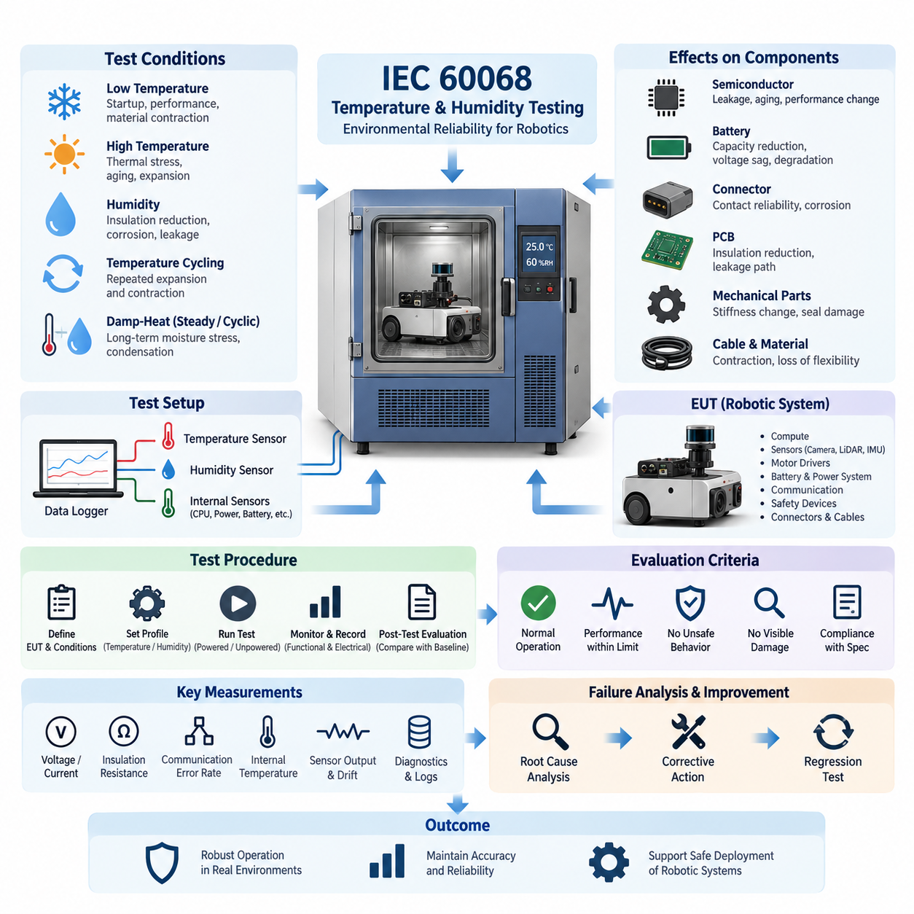
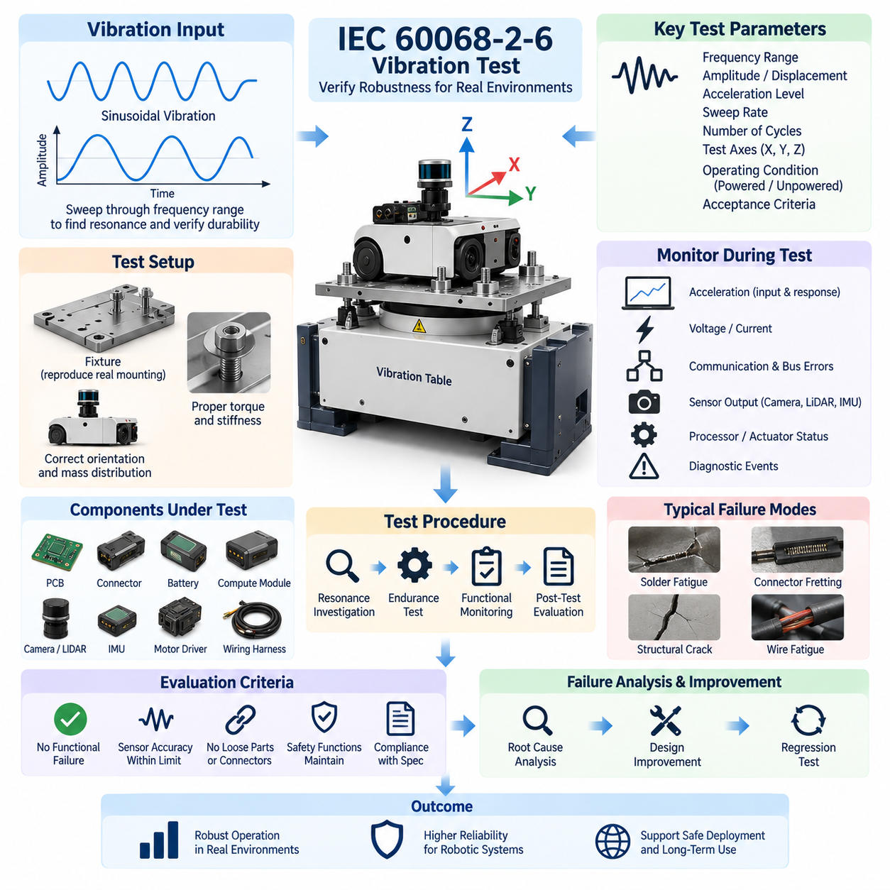
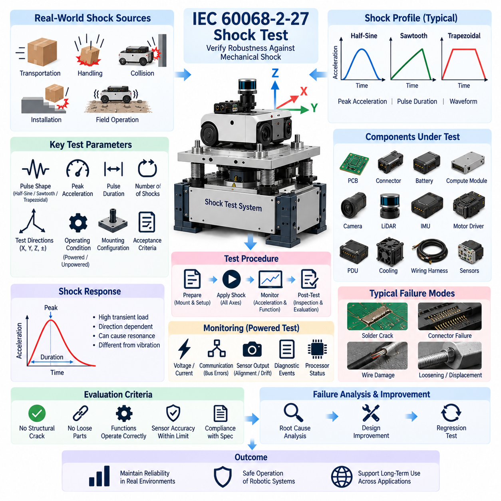
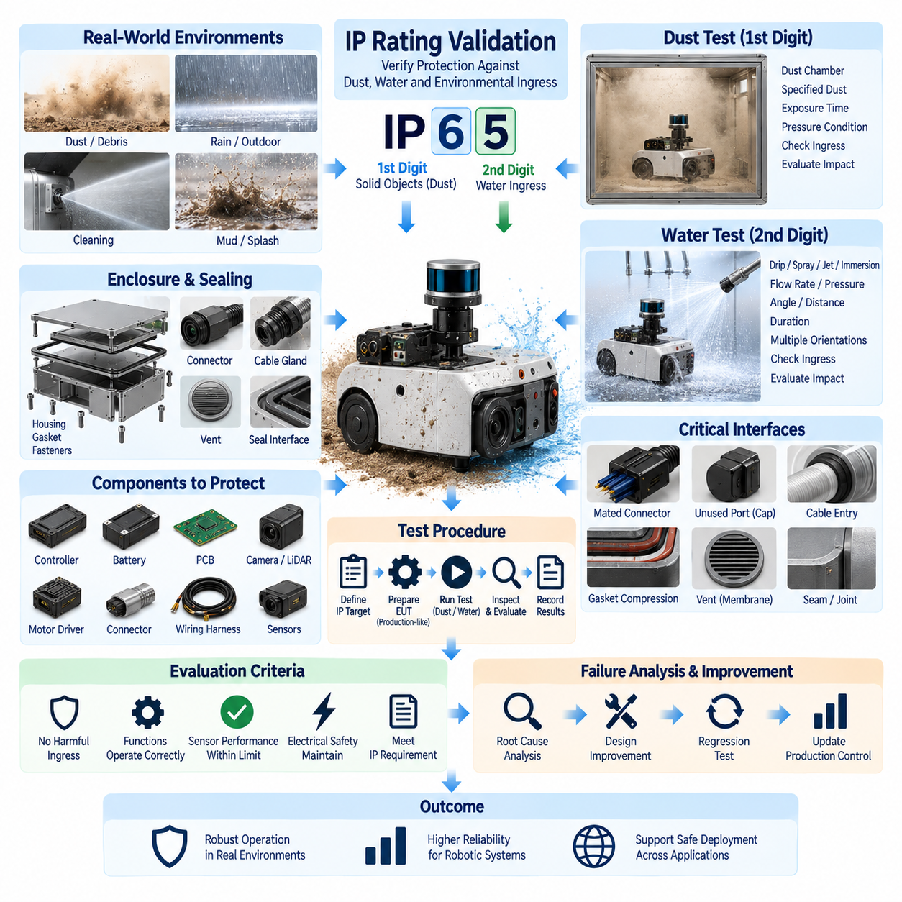
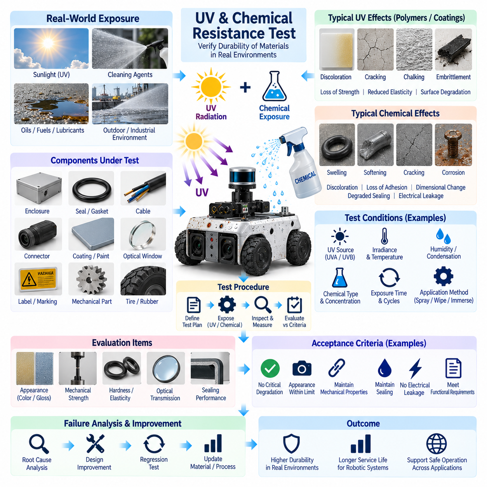

**Volume 19. Testing and Validation**

# Chapter 07. Environmental Test

## 07.01. IEC 60068 Temperature/Humidity

{width="7.268055555555556in" height="7.268055555555556in"}

Environmental testing of robotic electrical and electronic systems must demonstrate that the equipment can maintain required performance when exposed to temperature and humidity conditions representative of storage, transportation, startup, operation, and shutdown. Within the environmental validation structure, IEC 60068 provides a systematic framework for applying controlled climatic stresses and evaluating whether assemblies remain electrically, mechanically, and functionally acceptable.

Temperature testing is intended to reveal weaknesses that may not appear under normal laboratory conditions. Low temperature can increase material stiffness, reduce battery capability, change lubricant behavior, alter oscillator characteristics, and affect connector contact performance. High temperature accelerates semiconductor leakage, insulation aging, battery degradation, and thermal expansion. The test therefore evaluates both immediate functional behavior and the possibility of permanent degradation after exposure.

A representative test begins by defining the equipment under test, its operational state, allowable temperature range, stabilization criteria, dwell duration, transition conditions, and required measurements. The specimen may be tested while powered, unpowered, or through a combination of operating modes depending on its intended use. Sensors should monitor chamber temperature together with critical internal locations such as processors, power converters, motor drivers, batteries, connectors, and sealed electronic enclosures.

Cold testing commonly examines startup capability, communication stability, sensor initialization, actuator response, display or indicator behavior, and power-supply margins after the specimen has reached the specified low-temperature condition. Particular attention is required for batteries and DC power systems because voltage sag and available discharge power may change significantly. Cables, seals, connector housings, and mechanically loaded polymer components should also be inspected for contraction-related damage or loss of flexibility.

Dry-heat testing evaluates whether internal temperatures remain within component limits when the surrounding environment is hot. Heat generated by processors, GPUs, motor controllers, DC/DC converters, charging electronics, and other high-power devices can combine with elevated ambient temperature to create localized thermal stress. Validation should therefore correlate chamber conditions with internal temperature measurements rather than assuming that ambient temperature alone represents the stress experienced by electronic components.

Humidity introduces a different class of failure mechanisms. Moisture can reduce surface insulation resistance, promote corrosion, penetrate imperfect seals, alter dielectric characteristics, and create leakage paths across contaminated circuit-board surfaces. Connectors, exposed conductors, conformal coatings, cable entries, vents, and enclosure interfaces are particularly important inspection areas. Humidity testing is consequently valuable for detecting weaknesses in material selection, sealing design, cleanliness, and manufacturing quality.

Damp-heat testing can use steady or cyclic environmental conditions depending on the intended validation objective. Steady exposure is useful for evaluating prolonged moisture stress, while cyclic conditions can repeatedly drive temperature and humidity changes that encourage moisture migration and condensation-related effects. The selected profile should be documented together with chamber tolerances, specimen configuration, operating mode, stabilization periods, exposure duration, and recovery conditions so that results remain reproducible.

Temperature cycling is particularly important when a robot contains materials with different coefficients of thermal expansion. Printed circuit boards, solder joints, semiconductor packages, connectors, aluminum structures, plastic housings, optical assemblies, adhesives, and sealing materials expand and contract differently. Repeated cycling can expose marginal solder joints, loosen interfaces, alter sensor alignment, damage seals, or create intermittent electrical faults that would remain hidden during a simple constant-temperature test.

For robotic platforms, environmental testing should extend beyond confirmation that electronics remain powered. Navigation sensors, IMUs, cameras, LiDAR units, encoders, safety devices, communication networks, compute modules, and actuator controllers can exhibit temperature-dependent drift or timing changes without producing obvious hardware failures. Functional measurements should therefore be recorded throughout the environmental profile whenever practical, allowing degradation in accuracy, latency, synchronization, and control behavior to be identified.

Electrical monitoring should include parameters appropriate to the system architecture, such as supply voltage, current consumption, insulation resistance, communication error rate, reset events, diagnostic trouble information, sensor outputs, and thermal protection status. Sudden current changes may indicate condensation-related leakage or component instability, while increasing communication errors can reveal marginal transceivers, connectors, or timing behavior. Continuous logging makes transient environmental failures significantly easier to diagnose.

The chamber setup itself must not unintentionally invalidate the test. Cable penetrations, external power supplies, communication interfaces, fixtures, and support equipment should be arranged so that they do not provide unrealistic cooling, heating, moisture paths, or mechanical restraint. Temperature and humidity sensors should be positioned to characterize the actual environment around the specimen, while additional instrumentation may be installed internally when knowledge of component-level thermal response is required.

Preconditioning and baseline measurements provide the reference against which environmental effects are evaluated. Before exposure, the specimen should undergo visual inspection and relevant electrical and functional checks. After the specified environmental sequence, it should be allowed to recover under controlled conditions when required and then undergo equivalent examinations. Comparing pre-test, in-test, and post-test data helps distinguish reversible environmental behavior from permanent damage or accumulated degradation.

Pass and fail criteria should be established before testing rather than interpreted after results are observed. Acceptance may include uninterrupted operation, successful restart, maintained communication, bounded sensor drift, absence of unsafe behavior, compliance with thermal limits, acceptable insulation performance, and no visible corrosion, cracking, deformation, seal damage, or condensation-related deterioration. Temporary anomalies should also be classified because recoverable faults can still represent unacceptable field behavior.

Failures discovered during temperature or humidity testing should be analyzed as engineering evidence rather than treated only as test exceptions. Root-cause investigation may identify insufficient thermal margins, inadequate ventilation, poor conformal coating, unsuitable connector sealing, material incompatibility, weak solder joints, incorrect component derating, or software protection thresholds. Corrective actions should be followed by regression testing under the same environmental profile to demonstrate that the weakness has actually been removed.

Environmental validation becomes most valuable when its results are connected to the broader testing program. Temperature and humidity can influence calibration stability, EMC behavior, insulation performance, communication reliability, battery characteristics, and functional safety mechanisms. The environmental chapter therefore complements the electrical, communication, calibration, functional, reliability, and field-validation activities defined elsewhere in the testing structure, rather than operating as an isolated qualification exercise.

For production-oriented robotics, the final test record should preserve specimen identification, hardware and software configuration, chamber identification, calibration status of instrumentation, environmental profile, stabilization criteria, measured data, anomalies, diagnostic logs, photographs when applicable, and final disposition. This traceability allows later field failures to be compared with qualification evidence and supports configuration-controlled decisions when components, suppliers, firmware, materials, or enclosure designs change.

A well-designed IEC 60068 temperature and humidity validation program ultimately demonstrates environmental robustness at system level. The objective is not merely to prove survival at extreme chamber conditions, but to verify that electrical integrity, sensing accuracy, communication, computation, actuation, diagnostics, and safety-related functions remain predictable throughout realistic climatic stress. This evidence provides a foundation for reliable deployment of AMRs, manipulators, outdoor robots, and other Physical AI platforms.

## 07.02. Vibration Test (IEC 60068-2-6)

{width="7.268055555555556in" height="7.268055555555556in"}

IEC 60068-2-6 vibration testing is used to determine whether electrical, electronic, and mechanical equipment can withstand sinusoidal vibration that may occur during transportation, installation, and normal operation. Within the environmental validation structure, it follows temperature and humidity testing and provides a controlled method for identifying vibration-sensitive weaknesses in robotic hardware before field deployment.

The fundamental test stimulus is sinusoidal vibration applied over a specified frequency range. Unlike random vibration, which simultaneously contains energy across many frequencies, a sine test excites the specimen at controlled frequencies that change according to a defined sweep. This approach is particularly effective for identifying resonances, structural amplification, loose interfaces, and frequency-dependent functional disturbances within an equipment assembly.

A vibration test specification should define the frequency range, vibration amplitude, acceleration level, sweep rate, number of sweep cycles, test axes, operating condition, and acceptance criteria. At lower frequencies, displacement is often an important control parameter, while acceleration becomes increasingly important as frequency rises. These parameters must be selected to represent the intended environmental severity without introducing unrealistic structural loads.

The equipment under test should be mounted to the vibration table using fixtures that reproduce the mechanical boundary conditions of the actual installation as closely as practical. Fixture stiffness, mounting orientation, bolt torque, interface geometry, and mass distribution can significantly influence the measured response. A poorly designed fixture may introduce artificial resonances or attenuate important vibration energy, producing results that do not represent the installed robotic system.

Before endurance testing begins, a resonance investigation can be performed by sweeping through the specified frequency range while monitoring structural response. Accelerometers positioned on the fixture and critical locations of the specimen allow engineers to compare input vibration with local response. Frequencies at which the response becomes significantly amplified can indicate resonant modes requiring additional investigation, monitoring, or endurance exposure.

Robotic platforms contain many components that are sensitive to vibration. Printed circuit boards, connectors, relays, power distribution units, batteries, compute modules, cameras, LiDAR units, IMUs, motor controllers, encoders, cooling assemblies, and wiring harnesses may respond differently to the same excitation. Mechanical vibration can therefore produce electrical or sensing failures even when the main chassis remains structurally undamaged.

Harnesses and connectors require particular attention because vibration can produce relative movement at electrical interfaces. Repeated motion may cause connector fretting, terminal wear, intermittent contact, wire fatigue, insulation abrasion, or loosening of retention mechanisms. Harness branches located near motors, suspension elements, manipulators, or other dynamic assemblies should be instrumented or inspected carefully when their vibration exposure is expected to be significant.

Electronic assemblies may experience solder-joint fatigue, component lead stress, PCB flexure, connector movement, and loosening of mechanically mounted components. Large capacitors, inductors, transformers, heat sinks, and other components with relatively high mass can generate substantial local loads when the board is excited. Mechanical support and component placement should therefore be evaluated together with electrical functionality during vibration qualification.

Sensors require both mechanical and functional evaluation. Cameras and LiDAR units may remain electrically operational while their mounting structures experience displacement or alignment changes. IMUs are especially sensitive because externally applied vibration can directly influence measured acceleration and angular-rate signals. A successful vibration test should therefore verify not only hardware survival but also whether sensing accuracy and calibration remain within required limits.

The vibration test should normally be performed along the principal mechanical axes relevant to the installed equipment. Testing in multiple orthogonal directions helps expose structural modes that may not be excited from a single direction. The orientation and sequence should be documented because a robot chassis, electronic enclosure, battery pack, sensor mast, or manipulator assembly can exhibit substantially different dynamic behavior depending on the direction of excitation.

During powered vibration testing, electrical and functional parameters should be monitored continuously whenever practical. Supply voltage, current, communication status, packet or bus errors, sensor output, processor resets, diagnostic events, actuator feedback, and safety signals can reveal transient failures that disappear immediately after vibration stops. Continuous logging is therefore essential for detecting intermittent problems that cannot be identified by post-test inspection alone.

Acceleration measurements provide an important link between commanded shaker input and the vibration actually experienced by the specimen. A control accelerometer is typically associated with the vibration control system, while response accelerometers can be installed at critical structural locations. Comparing these signals helps identify amplification, attenuation, resonance, and fixture interaction and prevents conclusions from being based solely on the shaker command.

Resonance behavior deserves particular attention because a relatively moderate input can generate substantially higher local vibration when it coincides with a structural natural frequency. Resonance may affect sensor brackets, PCB assemblies, battery mounts, covers, cooling fans, cable supports, or complete structural frames. Changes in resonant frequency observed before and after endurance exposure can also indicate changes in stiffness, fastening, structural integrity, or mounting conditions.

Functional monitoring should be coordinated with the robotic system architecture. For an AMR or mobile manipulator, this may include communication between controllers, sensor synchronization, localization inputs, safety circuits, motor-driver status, compute-module operation, and diagnostic communication. The objective is to determine whether vibration introduces degraded behavior that could affect autonomous operation even when no permanent physical damage is visible.

Pre-test inspection establishes the baseline condition of the specimen. Mounting torque, connector engagement, harness routing, visible damage, sensor alignment, electrical performance, and functional operation should be documented before exposure. After testing, equivalent inspections and measurements should be repeated. Differences between pre-test and post-test conditions provide evidence of loosening, displacement, wear, cracking, deformation, calibration change, or other vibration-induced degradation.

Acceptance criteria should be established before the test begins. Typical requirements may include continuous or specified functional operation, absence of unintended resets, acceptable communication performance, maintained sensor accuracy, no loose fasteners or connectors, no damaged wiring, and no structural cracking or deformation. Safety-related functions must remain within their specified behavior because intermittent vibration-induced faults can represent significant operational hazards.

When a failure occurs, the vibration frequency, axis, acceleration level, operating state, and associated electrical or diagnostic data should be preserved for root-cause analysis. The investigation may identify inadequate mounting stiffness, insufficient fastener retention, harness resonance, connector fretting, PCB flexure, weak solder joints, sensor-bracket resonance, or component mass-loading problems. Corrective actions should address the physical mechanism rather than merely suppressing the observed symptom.

Design improvements can include structural reinforcement, modified bracket geometry, improved fastening methods, vibration isolation, additional PCB support, connector locking features, harness clamps, strain relief, or changes in component placement. Any modification that changes the dynamic characteristics of the assembly should be verified through repeated testing because shifting a resonance away from one frequency may unintentionally create another problematic mode elsewhere in the operating range.

The final vibration validation record should preserve the specimen configuration, hardware and software revisions, fixture design, mounting conditions, test axes, frequency range, amplitude or acceleration profile, sweep parameters, instrumentation locations, resonance observations, functional logs, anomalies, and final acceptance decision. Such traceability becomes essential when later design revisions, supplier changes, field failures, or reliability investigations must be compared with qualification evidence.

IEC 60068-2-6 vibration validation therefore provides more than a mechanical durability check. For robotics and Physical AI systems, it connects structural dynamics with electrical integrity, sensor stability, communication reliability, computation, actuation, and safety behavior. Applied together with the temperature, humidity, shock, ingress-protection, reliability, and field tests defined in the broader validation structure, it helps demonstrate that the robotic platform can maintain predictable operation under realistic environmental stress.

## 07.03. Shock Test (IEC 60068-2-27)

{width="7.268055555555556in" height="7.268055555555556in"}

IEC 60068-2-27 shock testing evaluates whether electrical, electronic, and mechanical equipment can withstand non-repetitive or repeated mechanical shocks that may occur during transportation, handling, installation, collision events, or normal service. Within the environmental validation structure, it complements temperature, humidity, and vibration testing by examining transient mechanical loads that act over much shorter durations.

Mechanical shock differs fundamentally from continuous vibration because a large acceleration can be applied within a very short time interval. The resulting transient load propagates through the equipment structure and can generate high forces at components, mounting interfaces, connectors, sensors, batteries, and printed circuit boards. Equipment that performs reliably during vibration testing may therefore still contain weaknesses that become visible only under shock loading.

A shock test specification should define the pulse shape, peak acceleration, pulse duration, number of shocks, test directions, operating condition, mounting configuration, and acceptance criteria. These parameters determine the mechanical severity applied to the equipment under test. The selected conditions should represent credible environmental loads while remaining consistent with the intended product application, installation method, transportation conditions, and qualification objectives.

Common shock profiles use controlled pulse shapes such as half-sine, sawtooth, or trapezoidal forms depending on the required test condition. Pulse shape is important because two shocks with the same peak acceleration can transfer different amounts of energy and excite different structural responses. Peak acceleration alone is therefore insufficient to describe shock severity; pulse duration and waveform characteristics must also be controlled and documented.

The equipment under test should be mounted using a fixture that reproduces the actual mechanical interface as closely as practical. Fixture stiffness, attachment points, bolt torque, orientation, and mass distribution influence how shock energy enters the specimen. Excessive fixture flexibility may distort the commanded pulse, while an unrealistically rigid installation can produce responses that differ from those experienced by the equipment in its real robotic platform.

Testing should consider the principal mechanical axes of the equipment because shock response is strongly directional. A robotic controller, battery module, sensor assembly, or complete AMR may tolerate vertical impact while responding very differently to longitudinal or lateral shock. Positive and negative directions can also load mounts and internal structures differently, so the required test directions should reflect the mechanical architecture and expected service environment.

Acceleration instrumentation is essential for verifying that the required shock pulse has actually reached the specimen. A control accelerometer can characterize the applied input, while response accelerometers located at critical points can measure structural amplification and local dynamic behavior. Recorded acceleration-time histories allow engineers to confirm pulse magnitude, duration, waveform quality, and unexpected responses that might indicate structural resonance or fixture interaction.

Shock loading can generate substantial inertial forces on components with relatively high mass. Batteries, heat sinks, transformers, inductors, compute modules, power distribution units, cooling assemblies, and large connectors may place significant loads on brackets, fasteners, solder joints, or PCB structures. Mechanical retention should therefore be evaluated according to both component mass and the acceleration transmitted through the surrounding structure.

Printed circuit boards can experience rapid bending during impact, creating stress in solder joints, component leads, board-to-board connectors, and mechanically mounted devices. Heavy components can amplify these effects because inertial force increases with mass and acceleration. Post-test inspection should therefore examine cracked solder joints, displaced components, PCB damage, loosened fasteners, and subtle deformation even when the electronic assembly continues to operate normally.

Connectors and wiring harnesses are another important shock-sensitive area. A short-duration impact can momentarily separate marginal contacts, pull against terminal retention systems, or create high strain near harness clamps and branch points. Continuous monitoring of communication and power circuits during powered testing can reveal intermittent open circuits, voltage interruptions, bus errors, or connector disturbances that may disappear before post-test inspection begins.

Sensors require special attention because mechanical survival does not guarantee measurement integrity. Cameras, LiDAR units, IMUs, encoders, and other perception devices can remain operational after a shock while experiencing mounting displacement, optical misalignment, bias change, or calibration drift. Pre-test and post-test sensor measurements should therefore be compared to determine whether the impact has changed accuracy, alignment, synchronization, or calibration parameters.

For an autonomous mobile robot or mobile manipulator, functional monitoring should extend across the complete electrical architecture. Power rails, controller communication, safety circuits, sensor interfaces, processor status, motor-driver diagnostics, encoder feedback, and emergency-stop related signals may be monitored where appropriate. This system-level approach helps identify transient failures that could interrupt autonomous behavior or create an unsafe state during real operation.

Powered and unpowered shock testing serve different purposes. Unpowered testing primarily evaluates physical integrity and the ability to operate correctly after exposure, while powered testing can reveal momentary functional interruptions during the shock event itself. The appropriate operating state should be selected from the intended application and safety requirements, and the test record should clearly identify the state used during each exposure.

Pre-test inspection establishes a controlled baseline for evaluating shock-induced changes. Hardware configuration, mounting torque, connector engagement, harness routing, sensor alignment, electrical characteristics, diagnostic status, and functional performance should be documented before testing. Equivalent checks after exposure allow engineers to distinguish existing conditions from damage, displacement, loosening, calibration changes, or functional degradation produced by the applied shock.

Acceptance criteria should be defined before testing. Typical requirements include no structural cracking, no detached components, no loosened safety-critical fasteners, no damaged connectors or wiring, maintained electrical continuity, acceptable sensor accuracy, successful communication, and correct operation of required functions. Safety-related systems should not enter an uncontrolled hazardous state as a consequence of the specified mechanical shock exposure.

A specimen that appears physically undamaged may still have experienced a significant transient failure. High-speed data acquisition and synchronized logging are therefore valuable during shock testing. Voltage interruptions, current transients, processor resets, communication errors, diagnostic events, sensor spikes, and safety-state transitions can be correlated with the acceleration waveform to determine precisely when a functional disturbance occurred relative to the mechanical impact.

When a failure occurs, root-cause analysis should consider both the observed damage and the path through which shock energy propagated. Potential causes include insufficient bracket strength, inadequate fastener retention, excessive PCB flexure, weak solder joints, connector disengagement, poor harness strain relief, battery movement, sensor mount deformation, or unsuitable component placement. Understanding the physical load path is essential for developing an effective corrective action.

Design improvements may include stronger mounting structures, revised bracket geometry, improved fastener locking, additional PCB support, mechanical stops, connector retention features, enhanced harness strain relief, isolation elements, or redistribution of component mass. Changes should be evaluated carefully because increasing stiffness or adding isolation can alter how shock energy is transmitted to other parts of the system rather than simply eliminating it.

Corrective actions should be followed by regression testing under equivalent conditions. Repeating the same pulse shape, acceleration, duration, direction, mounting configuration, and functional monitoring provides evidence that the original failure mechanism has been removed. Where a structural change significantly alters the dynamic response, additional measurements may be necessary to confirm that the modification has not transferred excessive shock loading to another component.

The final shock validation record should preserve specimen identification, hardware and software revisions, fixture configuration, mounting torque, test directions, pulse shape, peak acceleration, pulse duration, number of shocks, instrumentation locations, acceleration records, functional logs, observed anomalies, inspection results, corrective actions, and final disposition. This traceability supports later design changes, reliability investigations, and comparison with field failures.

IEC 60068-2-27 shock validation therefore connects mechanical impact resistance with electrical integrity, sensing stability, communication reliability, computation, actuation, and functional safety. Combined with the temperature and humidity, vibration, ingress-protection, reliability, and field tests defined in the broader testing structure, it provides evidence that robotic and Physical AI systems can maintain predictable and safe behavior when exposed to realistic transient mechanical loads.

## 07.04. IP Rating Validation

{width="7.268055555555556in" height="7.268055555555556in"}

Ingress Protection rating validation evaluates whether an enclosure provides the required degree of protection against access to hazardous parts, ingress of solid foreign objects, and penetration of water. For robotic systems, this validation is especially important because controllers, batteries, sensors, connectors, power electronics, and communication hardware may operate near dust, debris, cleaning water, rain, or other environmental exposure.

The IP classification is commonly expressed by two characteristic numerals following the letters IP. The first numeral represents protection associated with access to hazardous parts and ingress of solid foreign objects, while the second represents protection against water ingress. The required rating must be selected from the actual installation environment rather than treated simply as a higher-number-is-better specification.

Validation begins by defining the enclosure boundary and identifying every feature that can influence environmental sealing. Covers, doors, connector interfaces, cable glands, ventilation structures, service openings, displays, buttons, shafts, gaskets, fasteners, and removable panels may form part of the protective boundary. A single poorly controlled interface can compromise the effective protection of an otherwise well-designed enclosure.

The equipment under test should represent the production configuration as closely as practical. Production-intent housings, seals, connectors, fasteners, coatings, cable entries, vents, and assembly processes should be used because apparently minor differences can significantly affect ingress performance. Prototype enclosures with temporary sealing materials or manually improved interfaces may produce results that cannot be reproduced in manufacturing.

Solid-object and dust validation examines whether the enclosure prevents unacceptable penetration according to the required protection level. Dust can enter through small gaps around covers, connectors, cable interfaces, shafts, pressure-equalization devices, or imperfect seals. In robotic electronics, deposited particles may contaminate optical surfaces, cooling systems, electrical contacts, circuit boards, and moving mechanisms even when they do not immediately cause a functional failure.

Dust testing requires careful control of specimen condition, chamber configuration, exposure duration, and any pressure-related conditions required by the applicable procedure. The objective is not simply to determine whether visible dust is present inside the enclosure, but whether the degree of ingress violates the defined protection requirement or creates a condition capable of interfering with safe and reliable operation.

Water protection validation applies controlled water exposure appropriate to the target IP classification. Depending on the required level, the test may represent dripping water, spraying, splashing, water jets, or immersion conditions. Water flow, pressure, distance, angle, duration, enclosure orientation, and immersion depth where applicable must be controlled so that the environmental severity is repeatable and traceable.

Robotic platforms often contain surfaces and interfaces exposed from multiple directions, making test orientation particularly important. A sensor enclosure mounted high on an AMR may receive water differently from a controller installed inside the chassis. Rotating joints, inclined covers, horizontal seams, upward-facing connectors, wheel-splash zones, and service panels should therefore be considered when determining representative exposure conditions.

Connector interfaces are frequent ingress paths and should be tested in the configuration expected during actual operation. Mated connectors, protective caps, unused ports, cable glands, strain-relief structures, and service connectors can have different sealing behavior. The enclosure-level IP rating should therefore not be assumed solely from the individual rating of a connector, gland, or other component.

Gaskets and sealing interfaces require controlled compression to perform consistently. Fastener torque, gasket thickness, surface flatness, groove geometry, material hardness, assembly sequence, and contamination can all influence sealing pressure. Excessive compression may permanently deform a gasket, while insufficient compression can leave leakage paths. Validation should therefore consider the complete mechanical sealing system rather than the gasket material alone.

Pressure differences can also influence ingress behavior. Temperature changes during operation or cleaning may cause internal air to expand and contract, drawing moisture through weak interfaces. Pressure-equalization vents can reduce this effect, but the vent itself becomes part of the protective boundary. Its location, membrane condition, installation method, and compatibility with dust and water exposure must therefore be included in validation.

Water ingress may produce immediate electrical failure, but smaller quantities can create delayed degradation. Moisture trapped inside an enclosure can promote corrosion, reduce insulation resistance, contaminate connectors, damage coatings, or condense on sensitive surfaces after temperature changes. Post-exposure evaluation should therefore include internal inspection and relevant electrical or functional checks rather than relying only on operation during the test.

For powered equipment, monitoring during exposure can provide valuable evidence of transient failures. Supply voltage, current, communication status, insulation behavior, sensor output, processor resets, diagnostic events, and safety signals may reveal disturbances associated with water or conductive contamination. Where powered testing is appropriate, instrumentation should be arranged so that external cables and measurement equipment do not create unrealistic leakage paths.

Sensors require application-specific evaluation because environmental contamination can degrade perception before electronics fail. Water droplets, dust deposits, or condensation on camera windows, LiDAR covers, optical filters, and other sensing surfaces may reduce detection quality or introduce measurement errors. Validation should therefore distinguish enclosure leakage from external contamination that affects the functional performance of the sensing system.

Battery and high-current power systems require particular attention because moisture or conductive contamination can create leakage currents, corrosion, tracking, or short-circuit hazards. High-voltage systems, where present, require appropriately defined electrical safety checks after exposure. Low-voltage robotic systems also require careful evaluation because contamination around terminals and power distribution structures can progressively reduce reliability.

Pre-test inspection establishes the baseline condition of the specimen. Enclosure surfaces, gasket installation, connector engagement, cable glands, fastener torque, covers, vents, drain structures, and existing damage should be documented. Relevant electrical and functional measurements should also be recorded. This baseline allows post-test observations to be attributed more confidently to the environmental exposure.

After the specified dust or water exposure, the specimen should be inspected according to the applicable acceptance procedure. External water should be handled carefully so that opening the enclosure does not introduce contamination that was not present during testing. Internal surfaces, seals, connectors, electronic assemblies, drainage paths, and accumulation points should then be examined for evidence of penetration and its potential consequences.

Acceptance criteria should be established before testing and linked directly to the required protection level and product function. A test result should consider not only whether material entered the enclosure, but whether the observed ingress is permitted by the applicable requirement and whether it affects safety or satisfactory operation. Functional criteria may additionally include communication, sensing, computation, actuation, and diagnostic performance.

When ingress occurs, root-cause analysis should identify the actual penetration path rather than simply adding sealing material around the suspected area. Water traces, dust patterns, gasket witness marks, connector interfaces, fastener locations, enclosure deformation, and assembly records can help locate the source. Controlled local testing may then be used to distinguish between design weakness, component failure, or manufacturing variation.

Corrective actions may involve changes to gasket geometry, sealing compression, connector selection, cable-gland installation, enclosure overlap, drainage, vent placement, fastener distribution, surface flatness, or manufacturing controls. The modification should address the physical ingress mechanism while preserving thermal management, serviceability, pressure equalization, cable routing, and other system requirements that can conflict with sealing performance.

Regression testing is necessary after significant corrective action because improved sealing at one interface may change pressure, drainage, condensation, or thermal behavior elsewhere. The revised specimen should be exposed using equivalent test conditions and inspected with the same acceptance criteria. Production controls should also be reviewed so that the validated sealing performance can be reproduced consistently across manufactured units.

The final IP validation record should preserve specimen identification, hardware configuration, target protection level, enclosure and sealing configuration, connector state, mounting orientation, test equipment, exposure parameters, duration, inspection findings, functional measurements, anomalies, corrective actions, and final disposition. Photographic evidence and traceable assembly information are particularly useful for later design and manufacturing investigations.

IP rating validation therefore connects enclosure engineering with electrical integrity, sensing reliability, mechanical design, connector engineering, manufacturing quality, and functional safety. Combined with the temperature and humidity, vibration, shock, reliability, and field tests defined within the broader validation structure, it provides evidence that robotic and Physical AI systems can maintain required protection and predictable operation under realistic environmental exposure.

## 07.05. UV/Chemical Resistance Test

{width="7.268055555555556in" height="7.268055555555556in"}

UV and chemical resistance testing evaluates whether materials, enclosures, seals, cables, connectors, coatings, optical surfaces, and exposed mechanical components can maintain required properties after environmental exposure. Within the environmental validation structure, this test complements temperature, humidity, vibration, shock, and ingress-protection testing by addressing degradation mechanisms associated with sunlight and chemical contact.

Ultraviolet radiation can progressively change the physical and chemical properties of polymeric materials. Long-term exposure may cause discoloration, fading, chalking, embrittlement, cracking, loss of elasticity, or reduced mechanical strength. Outdoor robots are particularly vulnerable because housings, sensor covers, cable jackets, seals, tires, labels, and protective coatings may remain exposed to sunlight for extended periods during normal operation.

UV degradation is generally cumulative rather than an immediate functional failure. A component may initially appear acceptable while molecular changes gradually reduce its durability and environmental sealing capability. Accelerated exposure testing is therefore used to reproduce long-term weathering effects within a controlled laboratory period, allowing material weaknesses to be identified before they develop into field failures during the intended product lifetime.

A UV test specification should define the radiation source, spectral characteristics, irradiance, exposure duration, specimen temperature, humidity or condensation conditions where applicable, and the sequence of exposure cycles. These parameters influence degradation rate and must be selected according to the intended environment and qualification objective. Test conditions should be documented sufficiently to permit comparison between material revisions and repeated validation programs.

The equipment under test may consist of complete assemblies, representative subassemblies, or material coupons depending on the validation objective. Material-level testing is useful for screening candidate plastics, elastomers, coatings, and optical materials, while assembly-level testing verifies interactions between materials, interfaces, fasteners, seals, and actual geometry. Production-intent materials and manufacturing processes should be used whenever qualification evidence is required.

Visual inspection is an important part of UV validation but should not be the only evaluation method. Changes in color, gloss, surface texture, cracking, deformation, and coating condition can provide early evidence of degradation. Where relevant, mechanical strength, hardness, elasticity, adhesion, optical transmission, dimensional stability, and sealing performance should also be measured before and after exposure to determine whether functional properties remain acceptable.

Optical sensors require particular attention because relatively small changes in transparent or coated surfaces can affect perception performance. Camera windows, LiDAR covers, protective lenses, filters, and transparent polymers may become yellowed, hazy, scratched, or chemically altered after UV exposure. Optical degradation can reduce transmission or change scattering characteristics even when the enclosure remains mechanically intact and electrically functional.

Chemical resistance testing addresses exposure to substances that may contact robotic systems during operation, maintenance, cleaning, storage, or accidental spills. Depending on the application, relevant substances may include cleaning agents, detergents, disinfectants, lubricants, hydraulic fluids, fuels, oils, coolants, salt-containing solutions, or other process chemicals. The test set should be selected from credible field exposure rather than an arbitrary universal chemical list.

Chemical interaction with polymers and elastomers can produce swelling, softening, shrinkage, hardening, cracking, discoloration, loss of adhesion, or extraction of material constituents. These effects may alter dimensional tolerances and compromise sealing interfaces even when no obvious surface damage appears. Gaskets, O-rings, cable jackets, connector seals, adhesives, protective boots, and flexible covers should therefore receive particular attention during validation.

Metallic surfaces and electrical interfaces can also be affected by chemical exposure. Corrosive residues may attack fasteners, connector contacts, shielding structures, terminals, chassis surfaces, or protective finishes. Conductive contamination can reduce insulation resistance or create leakage paths across electrical interfaces. Chemical validation should therefore consider electrical integrity and corrosion behavior in addition to visible material compatibility.

Coatings and surface treatments form an important protective barrier on many robotic components. Paint, powder coating, conformal coating, anodized surfaces, plating, labels, markings, and adhesives may react differently to the same chemical. Validation should examine blistering, peeling, delamination, staining, loss of adhesion, or reduced protective performance because damage to a coating can expose the underlying material to subsequent environmental degradation.

The chemical application method should represent the expected exposure mechanism as closely as practical. Depending on the use case, chemicals may be applied by wiping, spraying, dripping, immersion, localized contact, or repeated cleaning cycles. Concentration, temperature, contact duration, quantity, drying time, and number of exposure cycles should be controlled because these variables can significantly change the resulting material response.

Repeated exposure is particularly important for service and cleaning chemicals. A robot used in hospitals, factories, warehouses, food-processing areas, or public environments may be cleaned many times during its service life. A material that tolerates a single short exposure may degrade after repeated contact. Cyclic chemical testing can therefore provide more representative evidence of long-term compatibility than a one-time application.

Combined environmental effects should also be considered because UV radiation, temperature, humidity, and chemicals can interact. UV exposure may embrittle a polymer and make it more susceptible to cracking during later chemical contact, while elevated temperature can accelerate chemical reactions. Environmental validation should therefore consider whether sequential or combined exposures better represent the expected degradation mechanisms of the intended operating environment.

Pre-test characterization establishes the baseline condition of each specimen. Material identification, surface condition, dimensions, color, gloss, hardness, optical characteristics, sealing condition, electrical properties, and functional performance should be documented as applicable. Photographic records under controlled lighting can provide useful comparison evidence, especially when evaluating discoloration, cracking, coating damage, or other progressive surface changes.

After exposure, specimens should be allowed to recover according to the defined procedure before final evaluation where appropriate. Immediate inspection can reveal temporary swelling or softening, while measurements after recovery can determine whether the change is permanent. Both conditions may be relevant because temporary material deformation can still cause leakage, interference, optical distortion, or mechanical malfunction during actual exposure.

For complete robotic assemblies, functional testing should accompany material inspection. Cameras, LiDAR units, buttons, displays, connectors, charging interfaces, safety devices, doors, covers, and service mechanisms should continue to operate correctly after exposure. Seals and enclosure interfaces may also require follow-up ingress testing if UV or chemical degradation could have reduced the protection originally demonstrated during IP rating validation.

Acceptance criteria should be defined before testing and linked to functional requirements rather than appearance alone. Minor discoloration may be acceptable for an internal component but unacceptable for an optical window or safety marking. Cracking, excessive swelling, loss of sealing force, coating delamination, reduced optical transmission, electrical leakage, or mechanical weakening may represent failures when they compromise safety, reliability, serviceability, or required performance.

When degradation is identified, root-cause analysis should determine whether the problem originates from base material selection, additives, coating compatibility, seal composition, adhesive chemistry, surface preparation, manufacturing variation, or an unrealistic exposure assumption. Comparing affected and unaffected materials under controlled conditions can help isolate the mechanism and prevent unnecessary changes to components that are not responsible for the observed failure.

Corrective actions may include selecting UV-stabilized polymers, changing elastomer compounds, improving protective coatings, modifying optical materials, adding shielding, relocating sensitive components, revising cleaning-agent requirements, or improving material compatibility controls. Any change should be evaluated against other requirements because improvements in chemical resistance may affect flexibility, sealing, optical properties, flammability, cost, or manufacturability.

Regression testing should repeat the relevant exposure conditions after corrective action and use equivalent measurements and acceptance criteria. When materials or coatings are changed, related environmental tests may also need to be repeated because the modification can influence sealing, thermal behavior, electrical insulation, mechanical durability, or appearance. Configuration control is therefore essential for maintaining valid qualification evidence across design revisions.

The final validation record should preserve specimen identification, material and coating specifications, manufacturing condition, exposure source, UV parameters, chemical type and concentration, application method, duration, cycle count, environmental conditions, pre-test and post-test measurements, photographs, functional results, observed degradation, corrective actions, and final disposition. This information supports future material selection, supplier changes, and field-failure investigations.

UV and chemical resistance validation therefore connects material engineering with enclosure durability, optical performance, electrical integrity, sealing, manufacturing quality, reliability, and serviceability. Together with the other environmental tests defined in the broader Testing and Validation structure, it provides evidence that robotic and Physical AI systems can preserve their required performance throughout realistic outdoor, industrial, maintenance, and cleaning exposure.
