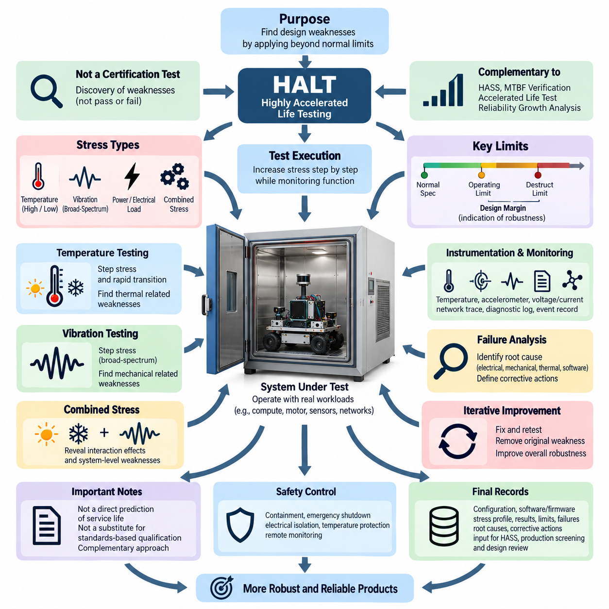
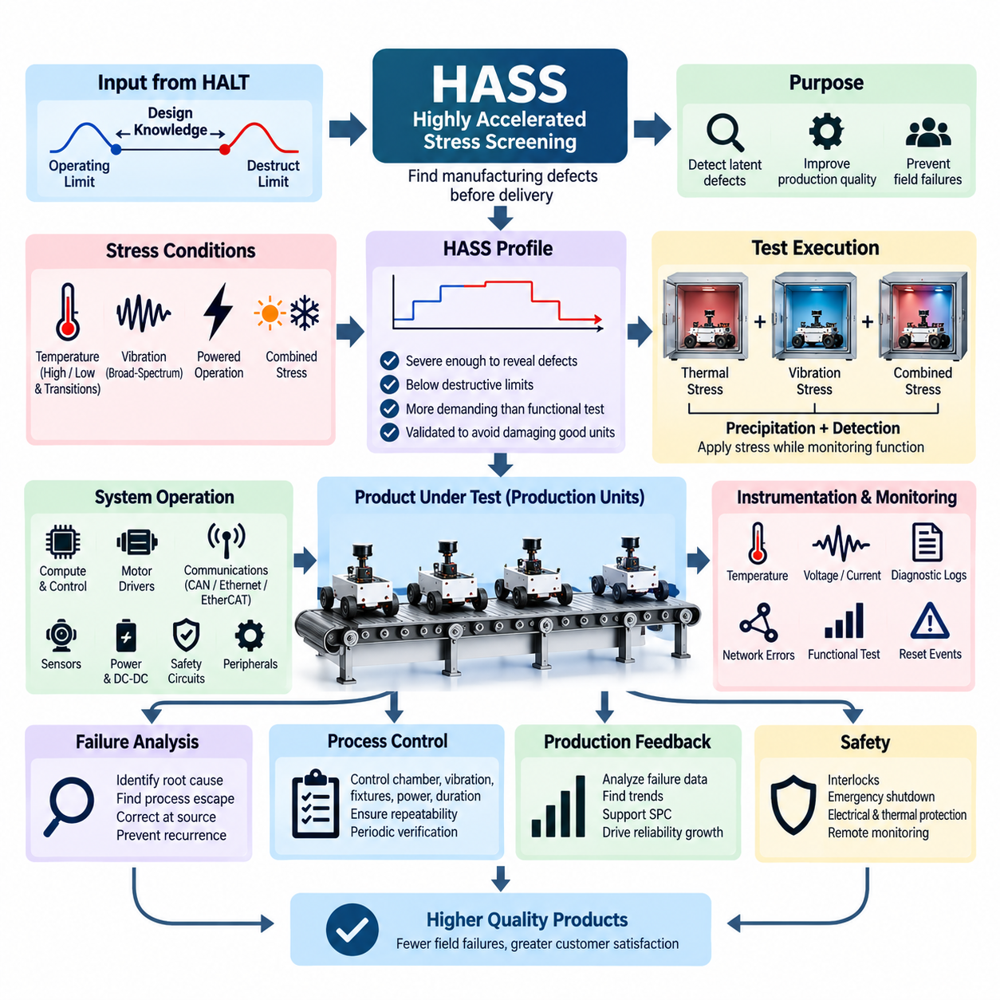
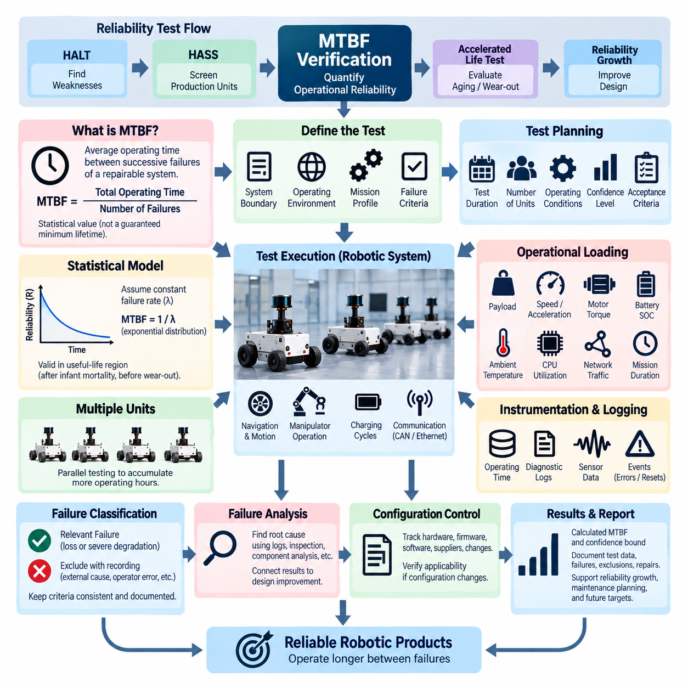
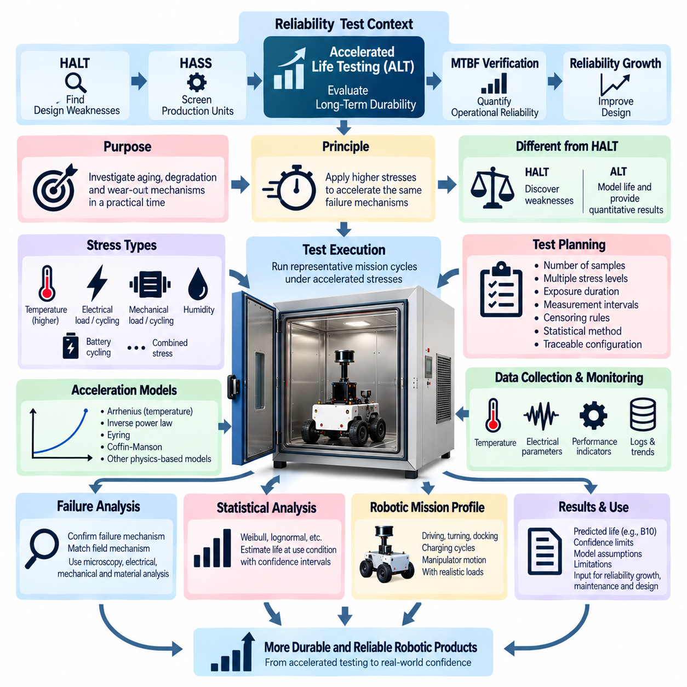
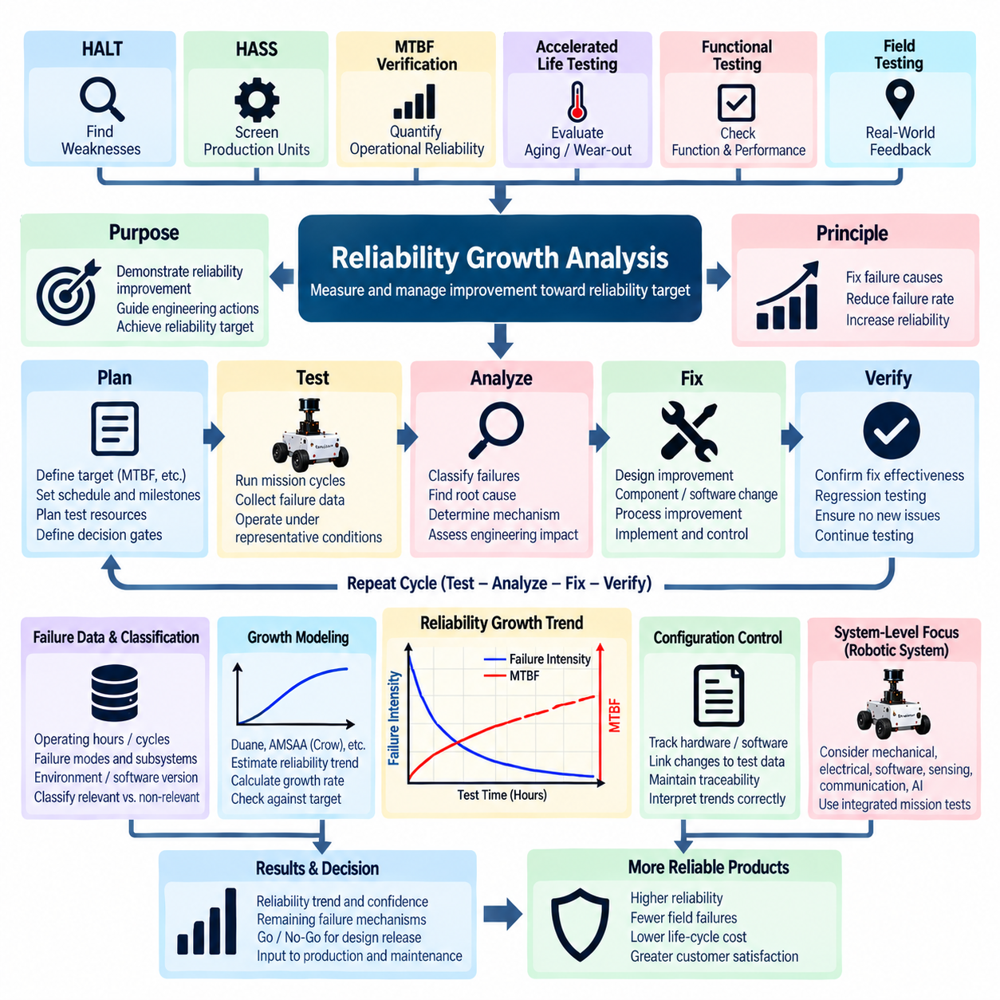

**Volume 19. Testing and Validation**


# Chapter 08. Reliability Test

##  

## 08.01. HALT (Highly Accelerated Life Test)

{width="7.268055555555556in" height="7.268055555555556in"}

Highly Accelerated Life Testing (HALT) is an engineering reliability method used to expose latent design weaknesses by operating a product beyond its normal qualification and expected service limits. Unlike conventional environmental qualification, HALT is primarily a discovery process rather than a pass-or-fail certification test. Within the reliability test structure, it complements HASS, MTBF verification, accelerated life testing, and reliability growth analysis by identifying weaknesses early enough for corrective design action.

The fundamental objective of HALT is to determine how a system behaves as environmental and operational stresses progressively increase. Testing typically begins near benign conditions and moves toward increasingly severe temperature, vibration, power, electrical load, or combined stresses. Functional performance is continuously monitored while the stress level changes. The resulting limits provide valuable information about design margin, failure mechanisms, recovery behavior, and the robustness of the complete product architecture.

A HALT program should distinguish between the normal operating specification, operating limit, destruct limit, and practical design margin. The operating limit is the stress boundary beyond which the unit no longer performs its required function but may recover when the stress is reduced. The destruct limit represents a higher stress level at which permanent physical damage occurs. The difference between specified operating conditions and discovered limits provides an engineering indication of available robustness rather than a formal reliability prediction.

Temperature step stressing is commonly used to reveal weaknesses associated with semiconductor behavior, solder joints, connectors, batteries, sensors, power conversion, oscillators, and mechanical interfaces. The test article is exposed progressively to higher and lower temperatures while critical functions remain active. Engineers observe boot behavior, communication stability, sensor accuracy, power consumption, protection responses, processor operation, actuator control, and diagnostic information to identify temperature-dependent degradation before catastrophic failure occurs.

Rapid thermal transitions can reveal failure mechanisms that steady-temperature testing may not expose efficiently. Repeated expansion and contraction create differential strain among printed circuit boards, packages, connectors, fasteners, adhesives, enclosures, and harness interfaces. Thermal transition testing is therefore valuable for detecting intermittent contacts, marginal solder connections, mechanical movement, seal degradation, and calibration instability. Temperature measurements should be taken at representative internal locations because chamber air temperature alone may not represent component stress.

Vibration step stressing applies progressively increasing mechanical excitation while the system remains powered and operational whenever practical. HALT equipment often uses broad-spectrum excitation intended to stimulate many structural resonances simultaneously rather than reproduce one specific field vibration profile. Functional monitoring can reveal intermittent connectors, loose fasteners, PCB resonance, cable movement, cracked solder joints, sensor disturbances, and mechanically induced communication faults that may remain invisible during static inspection or conventional functional testing.

Combined thermal and vibration stressing is particularly powerful because real products contain interacting failure mechanisms. A connector that operates correctly at room temperature may become intermittent when thermal contraction changes contact force while vibration simultaneously excites the harness. Similarly, a marginal solder joint may remain functional under either temperature or vibration alone but fail under their combination. Combined stressing therefore helps identify nonlinear interactions and system-level weaknesses that isolated environmental tests can miss.

For robotic systems, HALT should be performed with representative operating modes rather than treating the controller as an inactive electronic assembly. Compute modules, motor drivers, communication networks, sensors, safety circuits, power distribution units, DC-DC converters, and embedded controllers should execute realistic workloads whenever possible. Representative traffic on CAN, Ethernet, EtherCAT, or other internal networks can expose timing, power, thermal, and mechanical interactions that would not appear when subsystems are evaluated independently.

Instrumentation is essential because HALT is valuable only when engineers can identify what failed, when it failed, and under which stress conditions. Temperature sensors, accelerometers, voltage and current measurements, network traces, diagnostic logs, processor telemetry, error counters, reset histories, and synchronized event records should be collected throughout the test. Automated monitoring is especially useful for detecting short-duration intermittent faults that may disappear before an operator can observe or reproduce them manually.

When a functional failure occurs, the immediate objective is not simply to terminate testing. Engineers should document the stress level, symptoms, affected functions, diagnostic information, and recovery behavior, then determine whether the event represents a reversible operating limit or permanent damage. Controlled reduction of stress can establish whether functionality returns. Repeated exposure near the discovered boundary may then help reproduce the mechanism and provide evidence for root-cause analysis before corrective action is selected.

Failure analysis connects HALT observations to engineering improvement. The investigation may include electrical measurement, connector inspection, PCB examination, mechanical disassembly, log analysis, thermal review, vibration response analysis, and component-level testing. The important result is not merely the identification of a failed component but an understanding of why the architecture allowed the weakness. Corrective actions may involve component derating, mechanical reinforcement, improved cooling, connector changes, PCB redesign, filtering, mounting changes, or software protection.

After a weakness has been corrected, the modified design should be retested to verify that the original failure mechanism has been removed and that the corrective action has not introduced another vulnerability. This iterative process of stress, discovery, analysis, correction, and retest converts HALT into a reliability growth activity. Multiple cycles may be required because eliminating the weakest mechanism can expose the next limiting mechanism, gradually increasing the overall robustness of the system.

HALT results should not be interpreted as direct evidence of service life or as a substitute for standards-based environmental qualification. The intentionally extreme stresses may not reproduce actual field distributions, and the relationship between HALT exposure and calendar life is generally not suitable for simple conversion into operating hours. Qualification testing verifies compliance against defined requirements, while HALT explores design margin and failure behavior. Both approaches are therefore complementary rather than interchangeable.

HALT planning should also consider whether particular stresses could create unrealistic failure mechanisms. Excessive vibration may damage a structure in a manner impossible during service, while extreme temperatures may exceed the physical range of batteries, displays, lubricants, adhesives, or sensors for reasons unrelated to useful design margin. Engineering judgment is required to distinguish meaningful weaknesses from artifacts produced by inappropriate stress application, especially when heterogeneous robotic subsystems have very different physical limits.

Safety controls become increasingly important as stress levels exceed normal design conditions. High-energy batteries, high-voltage circuits, rotating actuators, capacitors, thermal surfaces, and mechanically excited assemblies can create hazards during destructive exploration. Test fixtures should provide containment, emergency shutdown, electrical isolation, temperature protection, remote monitoring, and controlled access where appropriate. Safety limits must remain independent from the experimental limits being explored so that reliability discovery never depends on unsafe laboratory operation.

The final HALT record should preserve the configuration of the test article, software and firmware versions, instrumentation, stress sequence, measured response, operating and destruct limits, observed failures, root causes, corrective actions, and retest results. This information becomes part of the engineering reliability knowledge base and can guide subsequent HASS development, accelerated life testing, production screening, design reviews, supplier requirements, and reliability growth activities within the broader testing and validation process.

고가속 수명 시험(HALT, Highly Accelerated Life Testing)은 제품을 정상적인 인증 조건과 예상 사용 한계를 넘어서는 환경 및 운용 스트레스에 노출하여 잠재적인 설계 취약점을 찾아내는 공학적 신뢰성 기법이다. 일반적인 환경 적합성 시험(Environmental Qualification)과 달리 HALT는 주로 합격 또는 불합격을 판정하는 인증 시험이 아니라 취약점을 발견하기 위한 과정이다. 신뢰성 시험(Reliability Test) 체계에서는 HASS, MTBF 검증, 가속 수명 시험(Accelerated Life Test), 신뢰성 성장 분석(Reliability Growth Analysis)과 연계되어 설계 개선이 가능한 초기 단계에서 문제를 식별하는 역할을 한다.

HALT의 기본 목적은 환경 및 운용 스트레스가 점진적으로 증가할 때 시스템이 어떻게 동작하는지를 확인하는 것이다. 시험은 일반적으로 비교적 안정적인 조건에서 시작하여 온도, 진동, 전원, 전기적 부하 또는 복합 스트레스(Combined Stress)를 단계적으로 증가시키는 방식으로 진행한다. 스트레스 수준이 변화하는 동안 기능 성능(Functional Performance)을 지속적으로 감시하며, 이를 통해 설계 여유도(Design Margin), 고장 메커니즘(Failure Mechanism), 복구 특성(Recovery Behavior), 전체 제품 아키텍처의 강건성(Robustness)을 평가할 수 있다.

HALT 프로그램에서는 정상 운용 사양(Normal Operating Specification), 운용 한계(Operating Limit), 파괴 한계(Destruct Limit), 그리고 실질적인 설계 여유도(Design Margin)를 구분해야 한다. 운용 한계는 제품이 요구 기능을 더 이상 정상적으로 수행하지 못하지만 스트레스를 낮추면 다시 회복될 수 있는 경계를 의미한다. 파괴 한계는 그보다 높은 스트레스 수준에서 영구적인 물리적 손상이 발생하는 경계를 의미한다. 규정된 운용 조건과 시험에서 확인된 한계의 차이는 공식적인 신뢰성 예측값이 아니라 제품 강건성의 공학적 지표로 활용된다.

온도 단계 스트레스 시험(Temperature Step Stress Testing)은 반도체 동작, 솔더 접합부(Solder Joint), 커넥터(Connector), 배터리(Battery), 센서(Sensor), 전력 변환 장치(Power Conversion), 발진기(Oscillator), 기계적 인터페이스(Mechanical Interface)와 관련된 취약점을 발견하는 데 주로 사용된다. 시험품은 점진적으로 높은 온도와 낮은 온도에 노출되며 핵심 기능은 계속 동작한다. 엔지니어는 부팅 동작, 통신 안정성, 센서 정확도, 소비 전력, 보호 기능, 프로세서 동작, 액추에이터 제어 및 진단 정보를 관찰하여 치명적 고장이 발생하기 전에 온도 의존적인 성능 저하를 식별한다.

급격한 열 천이(Rapid Thermal Transition)는 일정한 온도 조건의 시험에서는 효율적으로 발견하기 어려운 고장 메커니즘을 드러낼 수 있다. 반복적인 팽창과 수축은 인쇄회로기판(PCB), 패키지(Package), 커넥터, 체결부(Fastener), 접착제(Adhesive), 인클로저(Enclosure), 하네스 인터페이스(Harness Interface) 사이에 차등 변형을 발생시킨다. 따라서 열 천이 시험은 간헐적 접촉 불량, 불완전한 솔더 접합, 기계적 이동, 실링(Seal) 열화, 교정 불안정성을 탐지하는 데 유용하다. 챔버 공기 온도만으로는 실제 부품의 스트레스를 나타내지 못할 수 있으므로 대표적인 내부 위치에서 온도를 측정해야 한다.

진동 단계 스트레스 시험(Vibration Step Stress Testing)은 시스템이 가능한 한 전원이 공급되고 동작하는 상태에서 기계적 가진(Mechanical Excitation)을 점진적으로 증가시키는 방식으로 수행한다. HALT 장비는 특정 현장 진동 프로파일 하나를 재현하기보다는 다양한 구조적 공진(Structural Resonance)을 동시에 자극하기 위한 광대역 가진(Broad-Spectrum Excitation)을 사용하는 경우가 많다. 기능 감시를 통해 간헐적인 커넥터 접촉, 느슨한 체결부, PCB 공진, 케이블 이동, 솔더 접합 균열, 센서 교란 및 기계적 원인에 의한 통신 오류를 발견할 수 있다.

복합 열·진동 스트레스(Combined Thermal and Vibration Stress)는 실제 제품에서 여러 고장 메커니즘이 서로 상호작용하기 때문에 특히 효과적이다. 실온에서는 정상적으로 동작하는 커넥터도 열 수축으로 접촉력이 변화하면서 동시에 하네스에 진동이 가해지면 간헐적인 접촉 불량을 일으킬 수 있다. 마찬가지로 한계 상태의 솔더 접합부는 온도 또는 진동이 개별적으로 가해질 때는 정상적으로 동작하지만 두 스트레스가 결합되면 고장날 수 있다. 따라서 복합 스트레스 시험은 개별 환경 시험에서 놓칠 수 있는 비선형 상호작용(Nonlinear Interaction)과 시스템 수준 취약점을 식별하는 데 도움이 된다.

로봇 시스템(Robotic System)의 HALT에서는 제어기를 비활성 전자 조립품으로 취급하기보다 대표적인 운용 모드(Representative Operating Mode)를 적용해야 한다. 컴퓨트 모듈(Compute Module), 모터 드라이버(Motor Driver), 통신 네트워크(Communication Network), 센서, 안전 회로(Safety Circuit), 전력 분배 장치(PDU), DC-DC 컨버터(DC-DC Converter), 임베디드 제어기(Embedded Controller)는 가능한 경우 실제와 유사한 워크로드를 수행해야 한다. CAN, Ethernet, EtherCAT 등의 내부 네트워크에 대표적인 통신 트래픽을 발생시키면 하위 시스템을 독립적으로 평가할 때 나타나지 않는 타이밍, 전력, 열 및 기계적 상호작용을 확인할 수 있다.

계측(Instrumentation)은 어떤 장치가 언제, 어떤 스트레스 조건에서 고장났는지를 식별해야 하는 HALT에서 핵심적인 요소이다. 시험 과정에서 온도 센서, 가속도계(Accelerometer), 전압 및 전류 측정값, 네트워크 트레이스(Network Trace), 진단 로그(Diagnostic Log), 프로세서 텔레메트리(Processor Telemetry), 오류 카운터(Error Counter), 리셋 이력(Reset History), 동기화된 이벤트 기록(Synchronized Event Record)을 지속적으로 수집해야 한다. 특히 자동 감시(Automated Monitoring)는 작업자가 직접 관찰하거나 재현하기 전에 사라질 수 있는 짧은 시간의 간헐적 고장을 탐지하는 데 효과적이다.

기능 고장(Functional Failure)이 발생했을 때의 즉각적인 목적은 단순히 시험을 종료하는 것이 아니다. 엔지니어는 해당 스트레스 수준, 고장 증상, 영향을 받은 기능, 진단 정보 및 복구 동작을 기록한 후, 해당 현상이 회복 가능한 운용 한계인지 영구적인 손상인지를 판단해야 한다. 스트레스를 통제된 방식으로 감소시켜 기능이 다시 회복되는지를 확인할 수 있다. 이후 발견된 경계 부근에서 반복적으로 시험하여 고장 메커니즘을 재현하고 시정 조치(Corrective Action)를 결정하기 전에 근본 원인 분석(Root-Cause Analysis)을 위한 증거를 확보한다.

고장 분석(Failure Analysis)은 HALT에서 관찰된 현상을 실제 공학적 개선으로 연결한다. 조사에는 전기적 측정, 커넥터 검사, PCB 검사, 기계적 분해, 로그 분석, 열 분석, 진동 응답 분석 및 부품 수준 시험(Component-Level Testing)이 포함될 수 있다. 중요한 결과는 단순히 고장난 부품을 식별하는 것이 아니라 아키텍처가 왜 해당 취약점을 허용했는지를 이해하는 것이다. 시정 조치에는 부품 디레이팅(Component Derating), 기계적 보강, 냉각 개선, 커넥터 변경, PCB 재설계, 필터링, 장착 구조 변경 또는 소프트웨어 보호 기능 개선 등이 포함될 수 있다.

취약점이 수정된 후에는 변경된 설계를 다시 시험하여 기존 고장 메커니즘이 제거되었는지, 그리고 시정 조치로 인해 새로운 취약점이 발생하지 않았는지를 검증해야 한다. 이러한 스트레스 적용, 취약점 발견, 분석, 수정 및 재시험의 반복 과정은 HALT를 신뢰성 성장 활동(Reliability Growth Activity)으로 발전시킨다. 가장 취약한 고장 메커니즘을 제거하면 그다음으로 취약한 메커니즘이 새롭게 나타날 수 있기 때문에 여러 번의 반복 주기가 필요할 수 있으며, 이를 통해 시스템 전체의 강건성을 단계적으로 향상시킬 수 있다.

HALT 결과는 실제 사용 수명(Service Life)을 직접적으로 증명하는 자료로 해석해서는 안 되며, 표준 기반 환경 적합성 시험(Standards-Based Environmental Qualification)을 대체하는 수단으로 사용해서도 안 된다. 의도적으로 적용되는 극한 스트레스는 실제 현장의 스트레스 분포를 그대로 재현하지 않을 수 있으며, HALT 노출 시간과 실제 사용 수명 사이의 관계를 단순히 운용 시간으로 환산하는 것은 일반적으로 적절하지 않다. 적합성 시험은 정의된 요구사항에 대한 준수 여부를 검증하는 반면, HALT는 설계 여유도와 고장 거동을 탐색하므로 두 접근법은 상호 대체가 아니라 상호 보완 관계에 있다.

HALT 계획에서는 특정 스트레스가 비현실적인 고장 메커니즘(Unrealistic Failure Mechanism)을 만들어낼 가능성도 고려해야 한다. 지나치게 높은 진동은 실제 사용 환경에서는 발생할 수 없는 방식으로 구조물을 손상시킬 수 있으며, 극단적인 온도는 유용한 설계 여유도와 관계없이 배터리, 디스플레이(Display), 윤활제(Lubricant), 접착제 또는 센서의 물리적 허용 범위를 초과할 수 있다. 특히 서로 다른 물리적 한계를 가진 이종 로봇 하위 시스템(Heterogeneous Robotic Subsystem)을 시험할 때는 의미 있는 설계 취약점과 부적절한 스트레스 적용으로 발생한 시험 인공물(Test Artifact)을 구분하기 위한 공학적 판단이 필요하다.

스트레스 수준이 정상 설계 조건을 넘어설수록 안전 제어(Safety Control)의 중요성도 증가한다. 고에너지 배터리(High-Energy Battery), 고전압 회로(High-Voltage Circuit), 회전 액추에이터(Rotating Actuator), 커패시터(Capacitor), 고온 표면 및 기계적으로 가진되는 조립품은 파괴 한계를 탐색하는 과정에서 위험을 발생시킬 수 있다. 시험 설비에는 필요에 따라 격리 구조(Containment), 비상 정지(Emergency Shutdown), 전기적 절연(Electrical Isolation), 온도 보호, 원격 감시(Remote Monitoring), 통제된 접근 기능을 적용해야 한다. 안전 한계는 실험적으로 탐색하는 한계와 독립적으로 유지되어야 하며, 신뢰성 취약점 발견을 위해 실험실 안전을 희생해서는 안 된다.

최종 HALT 기록에는 시험품의 구성(Configuration), 소프트웨어 및 펌웨어(Firmware) 버전, 계측 구성, 스트레스 적용 순서, 측정된 시스템 응답, 운용 한계와 파괴 한계, 관찰된 고장, 근본 원인, 시정 조치 및 재시험 결과를 보존해야 한다. 이러한 정보는 공학적 신뢰성 지식 기반(Engineering Reliability Knowledge Base)의 일부가 되며, 이후의 고가속 스트레스 선별(HASS), 가속 수명 시험, 생산 선별(Production Screening), 설계 검토(Design Review), 공급업체 요구사항(Supplier Requirement), 신뢰성 성장 활동을 수립하는 데 활용될 수 있다.

##  

## 08.02. HASS Screening

{width="7.268055555555556in" height="7.268055555555556in"}

Highly Accelerated Stress Screening (HASS) is a production reliability screening method used to detect manufacturing defects, workmanship problems, and process variations before products reach customers. It is typically developed after Highly Accelerated Life Testing (HALT) has identified the product's operating and destruct limits. Within the reliability test structure, HASS complements HALT, MTBF verification, accelerated life testing, and reliability growth analysis by transferring design knowledge into production quality control.

The fundamental purpose of HASS is different from that of HALT. HALT intentionally explores design limits and discovers weaknesses during development, whereas HASS applies controlled stresses to production units to reveal latent defects without consuming an unacceptable portion of product life. The screening profile is therefore designed to be severe enough to precipitate manufacturing-related weaknesses but sufficiently controlled to avoid damaging correctly manufactured products or reducing their intended field reliability.

Development of a HASS profile begins with knowledge obtained from HALT and subsequent design verification. Engineers consider the normal operating specification, discovered operating limits, destruct limits, component capabilities, and known failure mechanisms. Screening stresses are selected inside a safe region relative to destructive boundaries while remaining significantly more demanding than ordinary production functional testing. This relationship between HALT characterization and HASS screening is essential for establishing an effective and defensible production process.

Temperature stress is commonly incorporated into HASS because manufacturing defects can become visible when materials expand, contract, or change electrical characteristics. Rapid transitions between elevated and reduced temperatures may reveal marginal solder joints, connector problems, PCB defects, component mounting weaknesses, intermittent contacts, and assembly variation. Temperature limits and transition rates must be selected carefully so that the screening process stimulates defects without creating unrealistic damage in otherwise conforming products.

Vibration stress can be combined with thermal stress to expose mechanical and electrical workmanship problems. Broad-spectrum vibration may stimulate loose fasteners, poorly seated connectors, inadequate cable retention, cracked solder joints, marginal mechanical assemblies, and intermittent electrical connections. The purpose is not to reproduce a specific transportation or operating vibration environment. Instead, vibration acts as an efficient stimulus for revealing defects that might otherwise remain dormant until the product experiences extended field operation.

Combined thermal and vibration screening can be more effective than either stress applied independently because manufacturing defects frequently respond to interacting conditions. Thermal expansion may reduce connector contact margin while vibration introduces relative motion, or temperature variation may change solder-joint strain while mechanical excitation stimulates an intermittent connection. Carefully controlled combined stresses therefore increase screening sensitivity while reducing the time required to reveal defects that could escape conventional end-of-line testing.

A typical HASS process includes a precipitation phase and a detection phase. During precipitation, environmental stresses encourage latent manufacturing defects to develop into observable conditions. During detection, the product is operated and monitored so that the resulting functional abnormality can be identified. Effective screening requires both mechanisms: stressing without adequate functional monitoring may create an observable defect that remains undetected, while extensive monitoring without sufficient stress may fail to activate the latent weakness.

For robotic products, functional operation during HASS should represent the critical behavior of the integrated system. Compute modules, embedded controllers, power distribution, DC-DC converters, communication interfaces, sensors, motor controllers, safety circuits, and relevant peripheral devices should remain active whenever practical. Representative CAN, Ethernet, EtherCAT, or other network traffic can help reveal intermittent communication problems, timing instability, power disturbances, resets, and integration defects associated with production variation.

Instrumentation and automated monitoring are particularly important because many HASS failures are intermittent and may exist only during a specific combination of temperature, vibration, electrical load, and system activity. Voltage, current, internal temperature, communication errors, processor status, diagnostic messages, reset events, sensor outputs, and functional test results can be recorded automatically. Time-correlated data allows engineers to connect observed abnormalities with the exact screening condition under which they occurred.

The screening profile must be validated before routine production deployment. Representative conforming units should undergo repeated HASS cycles to demonstrate that the selected stresses do not produce unacceptable degradation or consume excessive useful life. Engineers may inspect units before and after repeated screening, compare functional parameters, and perform additional reliability evaluation where necessary. A profile that damages good products is not an effective screen, even if it successfully detects defective units.

HASS effectiveness depends strongly on process control and repeatability. Chamber temperature, transition rate, vibration level, fixture configuration, product loading, power conditions, test duration, software configuration, and functional monitoring criteria should be controlled consistently. Changes in fixtures, chamber characteristics, product mass, mounting method, or production configuration can alter the stresses actually transferred to the unit. Periodic verification is therefore required to maintain screening sensitivity and prevent unintended overstress.

When a production unit fails HASS, the failure should not be treated merely as an isolated unit requiring repair. The defect may indicate a broader manufacturing process issue involving soldering, crimping, connector assembly, component handling, fastening, adhesive application, PCB fabrication, harness routing, calibration, or supplier quality. Failure analysis should identify both the physical failure mechanism and the process escape that allowed the defect to occur, enabling corrective action at its manufacturing source.

HASS data can provide valuable feedback for statistical process control and reliability growth. Failure rates, defect categories, stress conditions, production lots, suppliers, repair histories, and recurring mechanisms can be analyzed to identify trends. A sudden increase in a specific failure mode may indicate process drift or material variation, while a sustained reduction following corrective action provides evidence of manufacturing improvement. Screening therefore becomes both a defect-detection mechanism and a source of production intelligence.

HASS should not be confused with qualification testing or conventional environmental acceptance testing. Qualification demonstrates that a design satisfies specified environmental requirements, while HASS deliberately uses accelerated stresses derived from knowledge of the product's margins to identify production defects efficiently. The screening profile is product-specific and process-specific, so a profile developed for one design should not automatically be transferred to another product without engineering evaluation and appropriate validation.

Safety considerations remain essential because HASS may involve rapid thermal transitions, substantial vibration, powered electronics, batteries, high-current circuits, actuators, and automated equipment. Test systems should incorporate appropriate interlocks, emergency shutdown, electrical protection, thermal protection, fixture integrity checks, and remote monitoring. Screening stresses must remain within validated boundaries, and abnormal conditions should trigger controlled responses that protect personnel, equipment, and the product under test.

The final HASS process should be maintained as a controlled production procedure containing the approved stress profile, equipment configuration, fixture requirements, functional monitoring criteria, acceptance limits, failure handling rules, traceability information, and periodic verification requirements. Screening results should remain linked to product serial numbers and manufacturing history where practical. This disciplined feedback loop allows HASS to support production screening, process improvement, supplier control, and continuing reliability growth throughout the product lifecycle.

고가속 스트레스 선별(HASS, Highly Accelerated Stress Screening)은 제품이 고객에게 전달되기 전에 제조 결함(Manufacturing Defect), 작업 품질 문제(Workmanship Problem), 공정 편차(Process Variation)를 검출하기 위해 사용하는 생산 신뢰성 선별 방법(Production Reliability Screening Method)이다. 일반적으로 고가속 수명 시험(HALT, Highly Accelerated Life Testing)을 통해 제품의 운용 한계(Operating Limit)와 파괴 한계(Destruct Limit)를 파악한 이후 개발한다. 신뢰성 시험 체계에서 HASS는 HALT, MTBF 검증(MTBF Verification), 가속 수명 시험(Accelerated Life Testing), 신뢰성 성장 분석(Reliability Growth Analysis)을 보완하며 설계 단계에서 확보한 지식을 생산 품질 관리(Production Quality Control)로 이전하는 역할을 한다.

HASS의 기본 목적은 HALT와 다르다. HALT는 개발 과정에서 의도적으로 설계 한계(Design Limit)를 탐색하고 취약점을 발견하는 반면, HASS는 제품 수명을 허용할 수 없는 수준으로 소모하지 않으면서 생산 제품에 통제된 스트레스(Controlled Stress)를 가하여 잠재 결함(Latent Defect)을 찾아낸다. 따라서 선별 프로파일(Screening Profile)은 제조 관련 취약점을 충분히 드러낼 만큼 강하면서도 정상적으로 제조된 제품을 손상시키거나 의도된 현장 신뢰성(Field Reliability)을 감소시키지 않도록 통제되어야 한다.

HASS 프로파일의 개발은 HALT와 이후의 설계 검증(Design Verification)에서 확보한 지식을 기반으로 시작한다. 엔지니어는 정상 운용 사양(Normal Operating Specification), 확인된 운용 한계, 파괴 한계, 부품 성능 한계(Component Capability), 알려진 고장 메커니즘(Failure Mechanism)을 고려한다. 선별 스트레스(Screening Stress)는 파괴 경계에 대해 안전한 영역 내에서 선정하되 일반적인 생산 기능 시험보다 충분히 가혹하게 설정한다. HALT 특성 평가와 HASS 선별 사이의 이러한 관계는 효과적이고 공학적 근거가 있는 생산 공정을 구축하는 데 필수적이다.

온도 스트레스(Temperature Stress)는 재료가 팽창하거나 수축하고 전기적 특성이 변화할 때 제조 결함이 드러날 수 있기 때문에 HASS에 일반적으로 포함된다. 높은 온도와 낮은 온도 사이의 급격한 천이(Rapid Transition)는 불완전한 솔더 접합부(Solder Joint), 커넥터 문제, PCB 결함, 부품 장착 취약점, 간헐적 접촉 불량, 조립 편차(Assembly Variation)를 드러낼 수 있다. 온도 한계와 변화율(Transition Rate)은 정상 제품에 비현실적인 손상을 발생시키지 않으면서 결함을 자극할 수 있도록 신중하게 선정해야 한다.

진동 스트레스(Vibration Stress)는 열 스트레스(Thermal Stress)와 결합하여 기계적 및 전기적 작업 품질 문제를 찾아낼 수 있다. 광대역 진동(Broad-Spectrum Vibration)은 느슨한 체결부, 불완전하게 결합된 커넥터, 부적절한 케이블 고정, 균열된 솔더 접합부, 불완전한 기계 조립부 및 간헐적 전기 연결을 자극할 수 있다. 그 목적은 특정 운송 또는 운용 환경의 진동을 그대로 재현하는 것이 아니라, 장기간 현장 운용이 이루어질 때까지 잠재되어 있을 수 있는 결함을 효율적으로 드러내는 것이다.

복합 열·진동 선별(Combined Thermal and Vibration Screening)은 제조 결함이 여러 조건의 상호작용에 의해 나타나는 경우가 많기 때문에 각 스트레스를 독립적으로 적용하는 것보다 효과적일 수 있다. 열팽창(Thermal Expansion)이 커넥터의 접촉 여유도를 감소시키는 동시에 진동이 상대 운동을 발생시킬 수 있으며, 온도 변화가 솔더 접합부의 변형을 변화시키는 동안 기계적 가진(Mechanical Excitation)이 간헐적인 접속 불량을 유발할 수도 있다. 따라서 세심하게 통제된 복합 스트레스는 선별 민감도(Screening Sensitivity)를 높이고 기존 생산라인 종단 시험(End-of-Line Testing)에서 놓칠 수 있는 결함을 발견하는 시간을 단축한다.

일반적인 HASS 과정에는 결함 촉진 단계(Precipitation Phase)와 검출 단계(Detection Phase)가 포함된다. 결함 촉진 과정에서는 환경 스트레스를 이용하여 잠재적인 제조 결함이 관찰 가능한 상태로 발전하도록 유도한다. 검출 과정에서는 제품을 실제로 동작시키고 감시하여 그 결과로 발생하는 기능 이상(Functional Abnormality)을 식별한다. 효과적인 선별을 위해서는 두 메커니즘이 모두 필요하다. 충분한 기능 감시 없이 스트레스만 가하면 발생한 결함을 놓칠 수 있으며, 충분한 스트레스 없이 감시만 수행하면 잠재적인 취약점 자체가 활성화되지 않을 수 있다.

로봇 제품(Robotic Product)의 HASS에서는 통합 시스템의 핵심 동작을 대표할 수 있는 기능 운용(Functional Operation)을 수행해야 한다. 컴퓨트 모듈(Compute Module), 임베디드 제어기(Embedded Controller), 전력 분배(Power Distribution), DC-DC 컨버터(DC-DC Converter), 통신 인터페이스(Communication Interface), 센서, 모터 제어기(Motor Controller), 안전 회로(Safety Circuit), 관련 주변 장치는 가능한 경우 활성 상태를 유지해야 한다. CAN, Ethernet, EtherCAT 등의 대표적인 네트워크 트래픽을 적용하면 생산 편차와 관련된 간헐적 통신 문제, 타이밍 불안정, 전원 교란, 리셋 및 통합 결함을 발견하는 데 도움이 된다.

계측(Instrumentation)과 자동 감시(Automated Monitoring)는 많은 HASS 고장이 간헐적으로 발생하며 특정 온도, 진동, 전기 부하(Electrical Load), 시스템 동작의 조합에서만 나타날 수 있기 때문에 특히 중요하다. 전압, 전류, 내부 온도, 통신 오류, 프로세서 상태, 진단 메시지(Diagnostic Message), 리셋 이벤트(Reset Event), 센서 출력, 기능 시험 결과 등을 자동으로 기록할 수 있다. 시간 상관 데이터(Time-Correlated Data)를 사용하면 관찰된 이상 현상을 해당 문제가 발생한 정확한 선별 조건과 연결할 수 있다.

선별 프로파일은 일상적인 생산 공정에 적용하기 전에 검증되어야 한다. 대표적인 정상 제품을 대상으로 HASS 사이클을 반복 수행하여 선정된 스트레스가 허용할 수 없는 성능 저하를 발생시키거나 유효 수명(Useful Life)을 과도하게 소모하지 않는다는 것을 입증해야 한다. 엔지니어는 반복 선별 전후의 제품을 검사하고 기능 파라미터(Functional Parameter)를 비교하며 필요하면 추가적인 신뢰성 평가를 수행할 수 있다. 정상 제품을 손상시키는 프로파일은 결함 제품을 성공적으로 검출하더라도 효과적인 선별 방법이라고 할 수 없다.

HASS의 효과는 공정 관리(Process Control)와 반복성(Repeatability)에 크게 좌우된다. 챔버 온도, 온도 변화율, 진동 수준, 치구 구성(Fixture Configuration), 제품 적재 조건(Product Loading), 전원 조건, 시험 시간, 소프트웨어 구성 및 기능 감시 기준을 일관되게 관리해야 한다. 치구, 챔버 특성, 제품 질량, 장착 방법 또는 생산 구성의 변화는 실제 제품에 전달되는 스트레스를 변화시킬 수 있다. 따라서 선별 민감도를 유지하고 의도하지 않은 과도 스트레스(Overstress)를 방지하기 위해 주기적인 검증이 필요하다.

생산 제품이 HASS에서 고장났을 때 해당 고장을 단순히 수리가 필요한 개별 제품의 문제로 처리해서는 안 된다. 결함은 솔더링(Soldering), 크림핑(Crimping), 커넥터 조립, 부품 취급(Component Handling), 체결, 접착제 도포, PCB 제조, 하네스 배선(Harness Routing), 교정(Calibration), 공급업체 품질(Supplier Quality)과 관련된 더 광범위한 제조 공정 문제를 나타낼 수 있다. 고장 분석(Failure Analysis)은 물리적 고장 메커니즘뿐 아니라 해당 결함이 생산 공정을 빠져나갈 수 있었던 공정 유출 원인(Process Escape)을 식별하여 제조 원천에서 시정 조치(Corrective Action)가 이루어지도록 해야 한다.

HASS 데이터는 통계적 공정 관리(SPC, Statistical Process Control)와 신뢰성 성장(Reliability Growth)에 유용한 피드백을 제공할 수 있다. 고장률, 결함 유형, 스트레스 조건, 생산 로트(Production Lot), 공급업체, 수리 이력 및 반복되는 고장 메커니즘을 분석하여 추세를 파악할 수 있다. 특정 고장 모드(Failure Mode)가 갑자기 증가하면 공정 드리프트(Process Drift) 또는 재료 편차(Material Variation)를 의미할 수 있으며, 시정 조치 이후 지속적으로 감소한다면 제조 공정 개선의 근거가 될 수 있다. 따라서 선별은 결함 검출 수단인 동시에 생산 지능(Production Intelligence)을 확보하는 수단이 된다.

HASS를 적합성 시험(Qualification Testing)이나 일반적인 환경 수락 시험(Environmental Acceptance Testing)과 혼동해서는 안 된다. 적합성 시험은 설계가 규정된 환경 요구사항을 만족하는지를 입증하는 반면, HASS는 제품의 설계 여유도에 대한 지식을 기반으로 가속 스트레스를 의도적으로 사용하여 생산 결함을 효율적으로 찾아낸다. 선별 프로파일은 제품별(Product-Specific), 공정별(Process-Specific) 특성을 가지므로 특정 설계를 위해 개발한 프로파일을 공학적 평가와 적절한 검증 없이 다른 제품에 그대로 적용해서는 안 된다.

HASS에는 급격한 열 천이, 상당한 수준의 진동, 전원이 공급된 전자 장치, 배터리, 대전류 회로(High-Current Circuit), 액추에이터(Actuator), 자동화 장비 등이 포함될 수 있으므로 안전 고려사항(Safety Consideration)이 필수적이다. 시험 시스템에는 적절한 인터록(Interlock), 비상 정지(Emergency Shutdown), 전기적 보호(Electrical Protection), 열 보호(Thermal Protection), 치구 건전성 검사(Fixture Integrity Check), 원격 감시(Remote Monitoring)를 적용해야 한다. 선별 스트레스는 검증된 경계 내에서 유지되어야 하며 이상 상태가 발생하면 작업자, 장비 및 시험 대상 제품을 보호하기 위한 통제된 대응이 실행되어야 한다.

최종 HASS 공정은 승인된 스트레스 프로파일, 장비 구성, 치구 요구사항, 기능 감시 기준, 합격 기준(Acceptance Limit), 고장 처리 규칙(Failure Handling Rule), 추적성 정보(Traceability Information), 주기적 검증 요구사항을 포함하는 관리된 생산 절차(Controlled Production Procedure)로 유지되어야 한다. 가능한 경우 선별 결과를 제품 일련번호(Serial Number) 및 제조 이력(Manufacturing History)과 연결하여 관리해야 한다. 이러한 체계적인 피드백 루프(Feedback Loop)를 통해 HASS는 제품 수명주기(Product Lifecycle) 전반에 걸쳐 생산 선별, 공정 개선, 공급업체 관리 및 지속적인 신뢰성 성장을 지원할 수 있다.

##  

## 08.03. MTBF Verification

{width="7.268055555555556in" height="7.268055555555556in"}

Mean Time Between Failures (MTBF) verification is a reliability evaluation process used to determine whether a repairable system can achieve a specified level of operational reliability. Within the reliability testing structure, MTBF verification follows the discovery-oriented HALT and production-oriented HASS activities and complements accelerated life testing and reliability growth analysis. Its purpose is to provide quantitative evidence that the system can operate for an acceptable duration between inherent failures.

MTBF represents the average operating time expected between successive failures of a repairable item under defined conditions. Conceptually, it is calculated by dividing accumulated operating time by the number of relevant failures observed during a test or operational period. This value must be interpreted carefully because MTBF is a statistical reliability parameter rather than a guaranteed minimum lifetime, warranty period, or prediction that every individual product will operate for exactly the stated number of hours.

A meaningful MTBF requirement begins with a precise definition of the system boundary, operating environment, mission profile, and failure criteria. Engineers must establish which hardware and software elements belong to the system under test and what constitutes a reliability failure. A temporary communication interruption, automatic recovery event, degraded sensor, controller reset, or complete loss of operation may require different classifications depending on the intended function and reliability specification.

Verification planning defines the required test duration, number of test units, operating conditions, confidence objective, and statistical acceptance criteria before testing begins. Simply operating one product for a convenient period and dividing the hours by observed failures does not provide strong verification evidence. The test plan should provide enough accumulated exposure to distinguish a system that satisfies the reliability objective from one whose true failure rate is unacceptably high.

MTBF analysis commonly assumes that failures can be represented by a statistical model over the evaluation interval. Under a constant failure-rate assumption, reliability behavior is often modeled using an exponential distribution, with failure rate λ related approximately to MTBF by MTBF = 1/λ. This assumption is most appropriate during the useful-life region where early manufacturing defects have been controlled and wear-out mechanisms have not yet become dominant.

Confidence level is critical because a measured MTBF is based on finite test evidence. Even when no failures occur during a test, the true MTBF cannot be considered infinite. Statistical confidence bounds are therefore used to express what reliability level is supported by the accumulated operating time and observed failures. Higher confidence requirements generally demand more test exposure, making the relationship among target MTBF, test duration, allowable failures, and confidence level an important planning consideration.

Multiple units can be operated simultaneously to accumulate test time more efficiently. For example, ten representative systems operating for hundreds of hours each can contribute thousands of unit-hours of exposure, provided their conditions and operating records are properly controlled. Parallel testing reduces calendar time but does not eliminate the need for representative workloads, configuration control, accurate time accounting, and consistent failure classification across all units participating in the verification.

For robotic systems, accumulated operating hours should represent meaningful operational activity rather than powered idle time alone. Mobile robots may execute repeated navigation, acceleration, braking, turning, docking, charging, sensing, computation, and communication cycles. Manipulators may perform repeated joint motions and payload operations. Representative duty cycles help ensure that motors, bearings, power electronics, connectors, networks, sensors, compute modules, and thermal systems receive realistic functional exposure.

Operational loading should include conditions that materially influence reliability. Payload, speed, acceleration, motor torque, battery state of charge, charging cycles, processor utilization, network traffic, ambient temperature, and mission duration can affect failure occurrence. A verification test performed under unrealistically light conditions may accumulate many operating hours while providing little evidence about actual service reliability. Test severity should therefore remain traceable to the intended field mission profile.

Instrumentation and automated logging provide the evidence required for credible MTBF verification. Each unit should record operating time, mission cycles, power events, resets, communication errors, diagnostic trouble information, temperatures, voltage and current behavior, sensor status, software exceptions, and relevant functional events. Synchronized logs make it possible to reconstruct failures and determine whether an event is an inherent product failure, an external disturbance, an operator error, or a test-equipment problem.

Failure classification must remain consistent throughout the verification program. Relevant failures generally include events attributable to the system that prevent or significantly degrade its required function and require corrective intervention. Events caused by external power loss, inappropriate test operation, unrelated laboratory equipment, or explicitly excluded maintenance activities may be treated differently. Every exclusion should nevertheless be documented so that reliability results cannot be improved artificially by removing unfavorable observations after testing.

When a failure occurs, engineers should preserve the failed condition whenever practical and perform structured failure analysis. Diagnostic logs, electrical measurements, mechanical inspection, component examination, software traces, environmental conditions, and operating history can help identify the root cause. Repairing the unit without understanding the mechanism may restore testing quickly but loses important reliability information. Failure analysis connects quantitative MTBF results with specific opportunities for engineering improvement.

Configuration control is essential because reliability evidence is meaningful only for the configuration that was actually tested. Hardware revisions, firmware versions, software releases, suppliers, component substitutions, calibration data, manufacturing processes, and corrective modifications should be traceable. If a significant design change is introduced during testing, engineers must determine whether previous accumulated hours remain statistically applicable or whether additional verification is necessary for the modified configuration.

MTBF verification should also distinguish random useful-life failures from infant mortality and wear-out behavior. Early failures may indicate manufacturing or workmanship problems better addressed through process improvement and HASS, while failures occurring after extensive usage may indicate aging or wear mechanisms requiring accelerated life testing. Separating these mechanisms prevents a single MTBF number from hiding fundamentally different reliability problems that require different engineering responses.

The final verification report should document the reliability requirement, system configuration, mission profile, test population, accumulated operating hours, failure definitions, observed failures, exclusions, repairs, statistical method, confidence level, calculated MTBF or confidence bound, and acceptance conclusion. Supporting logs and failure-analysis records should remain traceable to individual test units. These results provide quantitative input for reliability growth, maintenance planning, design improvement, field validation, and future product reliability targets.

평균 고장 간격(MTBF, Mean Time Between Failures) 검증은 수리 가능한 시스템(Repairable System)이 규정된 수준의 운용 신뢰성(Operational Reliability)을 달성할 수 있는지를 판단하기 위한 신뢰성 평가 과정(Reliability Evaluation Process)이다. 신뢰성 시험 체계에서 MTBF 검증은 취약점 발견 중심의 HALT와 생산 선별 중심의 HASS 이후에 수행되며, 가속 수명 시험(Accelerated Life Testing) 및 신뢰성 성장 분석(Reliability Growth Analysis)을 보완한다. 그 목적은 시스템이 고유 고장(Inherent Failure) 사이에서 허용 가능한 시간 동안 운용될 수 있음을 정량적인 증거로 입증하는 것이다.

MTBF는 정의된 조건에서 수리 가능한 장치에 연속적으로 발생하는 고장 사이의 평균 운용 시간을 나타낸다. 개념적으로는 시험 또는 운용 기간 동안 누적된 총 운용 시간(Accumulated Operating Time)을 관찰된 관련 고장 횟수로 나누어 계산한다. 그러나 MTBF는 통계적 신뢰성 파라미터(Statistical Reliability Parameter)이므로 보장된 최소 수명, 보증 기간(Warranty Period), 또는 모든 개별 제품이 명시된 시간만큼 정확하게 동작한다는 예측값으로 해석해서는 안 된다.

의미 있는 MTBF 요구사항을 설정하려면 시스템 경계(System Boundary), 운용 환경(Operating Environment), 임무 프로파일(Mission Profile), 고장 기준(Failure Criteria)을 명확하게 정의해야 한다. 엔지니어는 어떤 하드웨어와 소프트웨어 요소가 시험 대상 시스템(System Under Test)에 포함되는지와 어떤 상태를 신뢰성 고장으로 판단할지를 결정해야 한다. 일시적인 통신 중단, 자동 복구 이벤트, 센서 성능 저하, 제어기 리셋 또는 완전한 동작 상실은 요구 기능과 신뢰성 사양에 따라 서로 다른 고장 분류가 필요할 수 있다.

검증 계획(Verification Planning)에서는 시험을 시작하기 전에 필요한 시험 시간, 시험 제품 수, 운용 조건, 신뢰 수준 목표(Confidence Objective), 통계적 합격 기준(Statistical Acceptance Criteria)을 정의한다. 단순히 한 제품을 편의상 정해진 기간 동안 운용한 후 관찰된 고장 횟수로 운용 시간을 나누는 것만으로는 충분한 검증 근거를 제공할 수 없다. 시험 계획은 신뢰성 목표를 충족하는 시스템과 실제 고장률이 허용할 수 없을 정도로 높은 시스템을 구분할 수 있도록 충분한 누적 시험 노출(Accumulated Test Exposure)을 확보해야 한다.

MTBF 분석에서는 일반적으로 평가 기간 동안 발생하는 고장을 통계 모델(Statistical Model)로 표현할 수 있다고 가정한다. 일정 고장률(Constant Failure Rate)을 가정하는 경우 신뢰성 거동은 흔히 지수 분포(Exponential Distribution)를 사용하여 모델링하며, 고장률 λ(Failure Rate)는 대략적으로 MTBF = 1/λ의 관계를 가진다. 이러한 가정은 초기 제조 결함이 통제되고 마모 고장 메커니즘(Wear-Out Mechanism)이 아직 지배적이지 않은 유효 수명 구간(Useful-Life Region)에 가장 적합하다.

신뢰 수준(Confidence Level)은 측정된 MTBF가 유한한 시험 증거를 기반으로 하기 때문에 매우 중요하다. 시험 중 고장이 한 번도 발생하지 않더라도 실제 MTBF가 무한하다고 판단할 수는 없다. 따라서 통계적 신뢰 구간(Statistical Confidence Bound)을 사용하여 누적 운용 시간과 관찰된 고장으로 어느 수준의 신뢰성을 뒷받침할 수 있는지를 표현한다. 높은 신뢰 수준을 요구할수록 일반적으로 더 많은 시험 노출이 필요하므로 목표 MTBF, 시험 시간, 허용 고장 수, 신뢰 수준 사이의 관계는 시험 계획에서 중요한 고려사항이다.

여러 대의 제품을 동시에 운용하면 시험 시간을 보다 효율적으로 누적할 수 있다. 예를 들어 대표성을 가진 10대의 시스템을 각각 수백 시간씩 운용하면 시험 조건과 운용 기록이 적절하게 관리된다는 전제하에 수천 단위·시간(Unit-Hours)의 시험 노출을 확보할 수 있다. 병렬 시험(Parallel Testing)은 전체 달력 기준 시험 기간(Calendar Time)을 줄일 수 있지만 대표적인 워크로드(Representative Workload), 구성 관리(Configuration Control), 정확한 시간 집계 및 모든 시험 제품에 대한 일관된 고장 분류의 필요성을 제거하지는 않는다.

로봇 시스템(Robotic System)의 경우 누적 운용 시간은 단순한 전원 인가 대기 시간(Powered Idle Time)이 아니라 의미 있는 실제 운용 활동을 반영해야 한다. 이동 로봇(Mobile Robot)은 반복적인 주행, 가속, 제동, 회전, 도킹(Docking), 충전, 센싱(Sensing), 연산 및 통신 사이클을 수행할 수 있다. 매니퓰레이터(Manipulator)는 반복적인 관절 운동과 페이로드 작업(Payload Operation)을 수행할 수 있다. 대표적인 듀티 사이클(Duty Cycle)을 적용하면 모터, 베어링, 전력전자 장치, 커넥터, 네트워크, 센서, 컴퓨트 모듈 및 열 관리 시스템이 실제 운용에 가까운 기능적 노출을 받도록 할 수 있다.

운용 부하(Operational Loading)에는 신뢰성에 실질적으로 영향을 미치는 조건이 포함되어야 한다. 페이로드, 속도, 가속도, 모터 토크, 배터리 충전 상태(State of Charge), 충전 사이클, 프로세서 사용률, 네트워크 트래픽, 주변 온도 및 임무 지속 시간은 고장 발생에 영향을 줄 수 있다. 비현실적으로 가벼운 조건에서 수행된 검증 시험은 많은 운용 시간을 누적하더라도 실제 사용 환경의 신뢰성에 대한 충분한 근거를 제공하지 못할 수 있다. 따라서 시험 가혹도(Test Severity)는 목표 현장 임무 프로파일과 추적 가능하게 연결되어야 한다.

계측(Instrumentation)과 자동 로그 기록(Automated Logging)은 신뢰할 수 있는 MTBF 검증에 필요한 증거를 제공한다. 각 시험 제품에서는 운용 시간, 임무 사이클, 전원 이벤트, 리셋, 통신 오류, 진단 고장 정보, 온도, 전압 및 전류 특성, 센서 상태, 소프트웨어 예외(Software Exception), 관련 기능 이벤트를 기록해야 한다. 동기화된 로그(Synchronized Log)를 사용하면 고장 발생 과정을 재구성하고 해당 이벤트가 제품 자체의 고유 고장인지, 외부 교란(External Disturbance), 작업자 오류 또는 시험 장비 문제인지를 판단할 수 있다.

고장 분류(Failure Classification)는 전체 검증 프로그램에서 일관되게 유지되어야 한다. 일반적으로 관련 고장(Relevant Failure)은 시스템 자체에 기인하여 요구 기능을 수행하지 못하게 하거나 성능을 심각하게 저하시키고 시정 개입(Corrective Intervention)을 필요로 하는 이벤트를 포함한다. 외부 전원 상실, 부적절한 시험 조작, 관련 없는 실험실 장비 또는 명시적으로 제외된 유지보수 활동으로 인한 이벤트는 다르게 처리할 수 있다. 그러나 시험 이후 불리한 관측값을 제거하여 신뢰성 결과를 인위적으로 향상시키는 것을 방지하기 위해 모든 제외 사항은 반드시 문서화해야 한다.

고장이 발생하면 가능한 경우 고장 상태를 그대로 보존하고 체계적인 고장 분석(Failure Analysis)을 수행해야 한다. 진단 로그, 전기적 측정, 기계적 검사, 부품 분석, 소프트웨어 트레이스(Software Trace), 환경 조건 및 운용 이력을 이용하여 근본 원인(Root Cause)을 식별할 수 있다. 고장 메커니즘을 이해하지 않고 제품을 수리하면 시험을 빠르게 재개할 수는 있지만 중요한 신뢰성 정보를 잃게 된다. 고장 분석은 정량적인 MTBF 결과를 구체적인 공학적 개선 기회와 연결하는 역할을 한다.

구성 관리(Configuration Control)는 신뢰성 증거가 실제로 시험된 구성에 대해서만 의미를 가지기 때문에 필수적이다. 하드웨어 개정판(Hardware Revision), 펌웨어 버전, 소프트웨어 릴리스, 공급업체, 부품 대체(Component Substitution), 교정 데이터, 제조 공정 및 시정 변경 사항을 추적할 수 있어야 한다. 시험 중 중요한 설계 변경이 적용되는 경우 엔지니어는 이전에 누적된 운용 시간이 통계적으로 계속 유효한지 또는 변경된 구성에 대해 추가적인 검증이 필요한지를 판단해야 한다.

MTBF 검증에서는 무작위 유효 수명 고장(Random Useful-Life Failure), 초기 고장(Infant Mortality), 마모 고장(Wear-Out Failure)을 구분해야 한다. 초기 고장은 제조 또는 작업 품질 문제를 나타낼 수 있으므로 공정 개선과 HASS를 통해 해결하는 것이 적절할 수 있으며, 장시간 사용 후 발생하는 고장은 가속 수명 시험을 통해 평가해야 하는 노화 또는 마모 메커니즘(Aging or Wear Mechanism)을 의미할 수 있다. 이러한 메커니즘을 구분하면 하나의 MTBF 수치가 서로 다른 공학적 대응을 요구하는 근본적으로 다른 신뢰성 문제를 가리는 것을 방지할 수 있다.

최종 검증 보고서(Final Verification Report)에는 신뢰성 요구사항, 시스템 구성, 임무 프로파일, 시험 모집단(Test Population), 누적 운용 시간, 고장 정의, 관찰된 고장, 제외 사항, 수리 내역, 통계적 방법, 신뢰 수준, 계산된 MTBF 또는 신뢰 하한(Confidence Bound), 최종 합격 판단을 기록해야 한다. 관련 로그와 고장 분석 기록은 개별 시험 제품까지 추적할 수 있도록 유지해야 한다. 이러한 결과는 신뢰성 성장, 유지보수 계획(Maintenance Planning), 설계 개선, 현장 검증(Field Validation), 향후 제품의 신뢰성 목표를 수립하기 위한 정량적 입력 자료로 활용된다.

##  

## 08.04. Accelerated Life Test

{width="7.268055555555556in" height="7.268055555555556in"}

Accelerated Life Testing (ALT) is a reliability evaluation method used to investigate aging, degradation, and wear-out mechanisms within a practical laboratory period. Instead of waiting for products to accumulate years of normal service, ALT applies controlled stresses above typical operating conditions to accelerate relevant physical processes. Within the reliability test structure, it complements HALT, HASS, MTBF verification, and reliability growth analysis by providing evidence about long-term durability and life-limiting mechanisms.

The fundamental principle of ALT is that many failure mechanisms progress faster when temperature, electrical load, mechanical load, humidity, cycling frequency, or other influential stresses are increased. The applied stress must accelerate the same mechanism expected during normal service rather than create an unrelated failure mode. A successful ALT therefore depends not simply on making the test severe, but on understanding the physics connecting stress, degradation rate, and eventual failure.

ALT differs fundamentally from HALT even though both use stresses beyond ordinary operating conditions. HALT is primarily a discovery process that explores design margins and exposes weaknesses, while ALT attempts to establish a quantitative relationship between accelerated stress and expected life under normal conditions. The stress levels used for ALT should therefore remain within a region where the target failure mechanism is physically meaningful and can be modeled using an appropriate acceleration relationship.

Life testing begins by defining the product, mission profile, expected service conditions, reliability target, and failure criteria. Engineers should identify which components and functions are expected to limit useful life and determine measurable indicators of degradation. For robotic systems, these may include motor performance, bearing wear, battery capacity, connector resistance, actuator backlash, sensor drift, cooling performance, insulation degradation, power-electronic characteristics, or repeated mechanical-cycle performance.

A test plan normally defines the number of samples, stress levels, exposure duration, measurement intervals, censoring rules, and statistical analysis method. Multiple stress levels are particularly valuable because they allow engineers to observe how lifetime changes as stress changes. Test specimens should represent the intended production configuration, and their hardware, firmware, software, component sources, manufacturing history, and calibration state should remain traceable throughout the evaluation.

Temperature acceleration is widely used when the dominant degradation mechanism is thermally activated. Reaction rates associated with chemical aging, insulation degradation, semiconductor mechanisms, adhesives, polymers, and some electronic components can increase significantly with temperature. Arrhenius-type relationships are commonly used when physically appropriate, relating the acceleration factor to absolute temperature and an activation-energy parameter representing the temperature sensitivity of the mechanism.

Mechanical accelerated testing is important for products containing moving structures. Motors, gears, bearings, joints, wheels, suspension components, cable chains, connectors, and robotic manipulators can accumulate wear through repeated motion and load cycles. Increasing cycle frequency, torque, payload, force, speed, or motion count may reduce the calendar time required to accumulate representative damage, provided the increased stress does not introduce dynamics, heating, lubrication behavior, or structural loads that are absent during actual operation.

Electrical and power cycling can accelerate degradation in power electronics, converters, motor drives, relays, contactors, connectors, and electronic assemblies. Repeated changes in voltage, current, power dissipation, and junction temperature can produce thermal-mechanical fatigue and contact deterioration. For high-power robotic systems, realistic interactions among electrical loading, cooling, switching operation, motor demand, and battery behavior should be considered because component temperature may depend strongly on the complete operating cycle.

Battery life evaluation requires particular attention because degradation depends on multiple interacting variables such as temperature, state of charge, depth of discharge, charge and discharge current, storage duration, and cycle count. Accelerated cycling can provide useful information about capacity fade and internal resistance growth, but excessive stress may activate failure mechanisms that are not representative of normal service. Battery ALT should therefore preserve traceability between accelerated conditions and the intended charging and operating strategy.

Combined-stress ALT may be required when field degradation is governed by interactions among temperature, humidity, vibration, electrical load, and mechanical cycling. Applying several stresses simultaneously can better represent the physics of the actual failure mechanism, but it also makes modeling more difficult. Engineers should understand which variables are causal, how they interact, and whether the resulting acceleration model remains valid before extrapolating laboratory results to expected field life.

Acceleration factor is the relationship between the degradation rate or lifetime under accelerated conditions and that under the intended use condition. Depending on the mechanism, engineers may use Arrhenius, inverse power law, Eyring, Coffin-Manson, or other physics-based and empirical relationships. Selection of the model should be justified by the dominant failure mechanism and supporting data rather than chosen merely because a mathematical equation provides a convenient fit to limited observations.

Data collection should capture both complete failures and progressive degradation. Measurements may include operating hours, cycle counts, temperatures, electrical parameters, vibration, motor current, battery capacity, internal resistance, sensor accuracy, mechanical clearance, communication errors, resets, and performance indicators. Periodic measurements allow degradation trends to be modeled before catastrophic failure occurs and can provide more information than a simple record of whether each specimen survived or failed.

Statistical analysis converts accelerated observations into reliability information for the intended use condition. Depending on the available data, lifetime distributions such as Weibull or lognormal models may be evaluated together with the selected acceleration relationship. Confidence intervals are important because limited sample populations and extrapolation introduce uncertainty. A predicted characteristic life or percentile life should therefore be reported together with assumptions, confidence information, and the range over which the model has supporting evidence.

Failure analysis remains essential whenever a specimen reaches a defined failure criterion. Engineers should determine whether the observed mechanism matches the mechanism expected in service and whether it remains consistent across different acceleration levels. If higher stress produces a different physical failure mode, combining those observations into one life model can generate misleading predictions. Microscopy, electrical analysis, mechanical inspection, material examination, diagnostic logs, and teardown evidence can support this mechanism verification.

For robotic systems, ALT should represent actual mission usage as closely as practical. Mobile robots may repeat driving, turning, braking, docking, charging, and payload cycles, while manipulators may execute repeated trajectories, gripping operations, and joint reversals. Combining mission cycles with thermal, electrical, and mechanical measurements helps relate laboratory exposure to field usage and supports maintenance intervals, component replacement policies, warranty planning, and durability requirements.

The final ALT report should document the test configuration, mission assumptions, samples, stress levels, exposure times, measured degradation, failures, failure mechanisms, acceleration model, statistical method, confidence limits, predicted life, and limitations of extrapolation. Results should feed reliability growth and future design decisions rather than remain only as a lifetime number. Properly executed ALT provides a quantitative bridge between controlled laboratory testing and the long-term durability expected from robotic products in real service.

가속 수명 시험(ALT, Accelerated Life Testing)은 실용적인 실험실 시험 기간 내에서 노화(Aging), 성능 열화(Degradation), 마모(Wear-Out) 메커니즘을 조사하기 위해 사용하는 신뢰성 평가 방법(Reliability Evaluation Method)이다. 제품이 정상적인 사용 환경에서 수년 동안 운용되기를 기다리는 대신, ALT는 일반적인 운용 조건보다 높은 통제된 스트레스(Controlled Stress)를 적용하여 관련 물리적 열화 과정을 가속한다. 신뢰성 시험 체계에서 ALT는 HALT, HASS, MTBF 검증(MTBF Verification), 신뢰성 성장 분석(Reliability Growth Analysis)을 보완하며 장기 내구성(Long-Term Durability)과 수명을 제한하는 메커니즘에 대한 근거를 제공한다.

ALT의 기본 원리는 온도, 전기 부하(Electrical Load), 기계 부하(Mechanical Load), 습도, 반복 주기(Cycling Frequency) 또는 기타 영향 스트레스가 증가하면 많은 고장 메커니즘(Failure Mechanism)의 진행 속도가 빨라진다는 것이다. 적용되는 스트레스는 정상 사용 환경에서 예상되는 것과 동일한 메커니즘을 가속해야 하며 관련 없는 새로운 고장 모드(Failure Mode)를 만들어서는 안 된다. 따라서 성공적인 ALT는 단순히 시험을 가혹하게 만드는 것이 아니라 스트레스, 열화 속도, 최종 고장 사이의 물리적 관계를 이해하는 데 기반해야 한다.

ALT와 HALT는 모두 일반적인 운용 조건을 넘어서는 스트레스를 사용하지만 근본적인 목적은 서로 다르다. HALT는 주로 설계 여유도(Design Margin)를 탐색하고 취약점을 발견하기 위한 과정인 반면, ALT는 가속 스트레스와 정상 조건에서 예상되는 수명 사이의 정량적인 관계를 확립하려는 시험이다. 따라서 ALT에 적용하는 스트레스 수준은 목표 고장 메커니즘이 물리적으로 유효하고 적절한 가속 관계(Acceleration Relationship)를 이용하여 모델링할 수 있는 영역 내에서 유지되어야 한다.

수명 시험(Life Testing)은 제품, 임무 프로파일(Mission Profile), 예상 사용 조건, 신뢰성 목표(Reliability Target), 고장 기준(Failure Criteria)을 정의하는 것에서 시작한다. 엔지니어는 어떤 부품과 기능이 유효 수명(Useful Life)을 제한할 가능성이 있는지를 식별하고 측정 가능한 열화 지표(Degradation Indicator)를 결정해야 한다. 로봇 시스템에서는 모터 성능, 베어링 마모, 배터리 용량, 커넥터 저항, 액추에이터 백래시(Actuator Backlash), 센서 드리프트(Sensor Drift), 냉각 성능, 절연 열화, 전력전자 특성 또는 반복적인 기계 사이클 성능 등이 이에 포함될 수 있다.

시험 계획(Test Plan)에서는 일반적으로 시험 샘플 수, 스트레스 수준, 노출 시간(Exposure Duration), 측정 간격, 중도절단 규칙(Censoring Rule), 통계 분석 방법을 정의한다. 여러 스트레스 수준을 적용하면 스트레스 변화에 따라 수명이 어떻게 달라지는지를 관찰할 수 있으므로 특히 유용하다. 시험품(Test Specimen)은 목표 생산 구성을 대표해야 하며, 하드웨어, 펌웨어(Firmware), 소프트웨어, 부품 공급원, 제조 이력 및 교정 상태(Calibration State)를 평가 과정 전체에서 추적할 수 있어야 한다.

온도 가속(Temperature Acceleration)은 지배적인 열화 메커니즘이 열에 의해 활성화되는 경우 널리 사용된다. 화학적 노화, 절연 열화, 반도체 메커니즘, 접착제(Adhesive), 고분자 재료(Polymer), 일부 전자 부품과 관련된 반응 속도는 온도 상승에 따라 크게 증가할 수 있다. 물리적으로 적절한 경우 아레니우스형 관계(Arrhenius-Type Relationship)를 일반적으로 사용하며, 가속 계수(Acceleration Factor)를 절대 온도(Absolute Temperature)와 해당 메커니즘의 온도 민감도를 나타내는 활성화 에너지(Activation Energy) 파라미터와 연관시킨다.

기계적 가속 시험(Mechanical Accelerated Testing)은 움직이는 구조를 포함하는 제품에서 중요하다. 모터, 기어, 베어링, 관절, 휠, 서스펜션 부품, 케이블 체인, 커넥터 및 로봇 매니퓰레이터(Manipulator)는 반복적인 운동과 부하 사이클을 통해 마모가 누적될 수 있다. 반복 주파수, 토크, 페이로드(Payload), 힘, 속도 또는 동작 횟수를 증가시키면 대표적인 손상을 누적하는 데 필요한 실제 시험 기간을 단축할 수 있다. 단, 증가된 스트레스가 실제 운용에서는 존재하지 않는 동역학, 발열, 윤활 거동 또는 구조적 부하를 발생시키지 않아야 한다.

전기 및 전력 사이클링(Electrical and Power Cycling)은 전력전자 장치, 컨버터(Converter), 모터 드라이브(Motor Drive), 릴레이, 컨택터(Contactor), 커넥터 및 전자 조립품의 열화를 가속할 수 있다. 전압, 전류, 전력 손실 및 접합부 온도(Junction Temperature)의 반복적인 변화는 열·기계 피로(Thermal-Mechanical Fatigue)와 접점 열화를 발생시킬 수 있다. 고출력 로봇 시스템에서는 부품 온도가 전체 운용 사이클에 크게 영향을 받을 수 있으므로 전기 부하, 냉각, 스위칭 동작, 모터 요구 부하 및 배터리 거동 사이의 실제적인 상호작용을 고려해야 한다.

배터리 수명 평가(Battery Life Evaluation)는 열화가 온도, 충전 상태(SOC, State of Charge), 방전 깊이(DOD, Depth of Discharge), 충·방전 전류, 저장 기간, 사이클 횟수 등 여러 상호작용 변수에 영향을 받기 때문에 특별한 주의가 필요하다. 가속 사이클링(Accelerated Cycling)은 용량 감소(Capacity Fade)와 내부 저항 증가(Internal Resistance Growth)에 대한 유용한 정보를 제공할 수 있지만 과도한 스트레스는 정상 사용 환경을 대표하지 않는 고장 메커니즘을 활성화할 수 있다. 따라서 배터리 ALT는 가속 조건과 목표 충전 및 운용 전략 사이의 추적성을 유지해야 한다.

현장 열화(Field Degradation)가 온도, 습도, 진동, 전기 부하 및 기계적 사이클링의 상호작용에 의해 결정되는 경우 복합 스트레스 가속 수명 시험(Combined-Stress ALT)이 필요할 수 있다. 여러 스트레스를 동시에 적용하면 실제 고장 메커니즘의 물리적 특성을 보다 잘 표현할 수 있지만 모델링은 더욱 어려워진다. 실험실 결과를 예상 현장 수명으로 외삽(Extrapolation)하기 전에 어떤 변수가 원인 변수인지, 서로 어떻게 상호작용하는지, 그리고 적용한 가속 모델(Acceleration Model)이 계속 유효한지를 이해해야 한다.

가속 계수(Acceleration Factor)는 가속 조건에서의 열화 속도 또는 수명과 목표 사용 조건에서의 열화 속도 또는 수명 사이의 관계를 나타낸다. 고장 메커니즘에 따라 아레니우스(Arrhenius), 역거듭제곱 법칙(Inverse Power Law), 아이링(Eyring), 코핀-맨슨(Coffin-Manson) 또는 기타 물리 기반 및 경험적 관계를 사용할 수 있다. 모델은 제한된 관측 데이터에 편리하게 적합되는 수학식을 선택하는 것이 아니라 지배적인 고장 메커니즘과 이를 뒷받침하는 데이터를 근거로 선정해야 한다.

데이터 수집(Data Collection)에서는 완전한 고장뿐 아니라 점진적인 열화도 함께 기록해야 한다. 측정 항목에는 운용 시간, 사이클 횟수, 온도, 전기적 파라미터, 진동, 모터 전류, 배터리 용량, 내부 저항, 센서 정확도, 기계적 간극(Mechanical Clearance), 통신 오류, 리셋 및 성능 지표(Performance Indicator)가 포함될 수 있다. 주기적인 측정을 수행하면 치명적인 고장이 발생하기 전에도 열화 추세를 모델링할 수 있으며, 단순히 각 시험품의 생존 또는 고장 여부만 기록하는 것보다 더 많은 정보를 확보할 수 있다.

통계 분석(Statistical Analysis)은 가속 조건에서 관찰된 결과를 목표 사용 조건에서의 신뢰성 정보로 변환한다. 확보된 데이터에 따라 와이블 분포(Weibull Distribution), 로그정규 분포(Lognormal Distribution) 등의 수명 분포를 선택된 가속 관계와 함께 평가할 수 있다. 제한된 샘플 수와 외삽에는 불확실성이 존재하기 때문에 신뢰 구간(Confidence Interval)이 중요하다. 따라서 예측된 특성 수명(Characteristic Life)이나 백분위 수명(Percentile Life)은 적용 가정, 신뢰 정보 및 모델을 뒷받침하는 데이터 범위와 함께 제시해야 한다.

시험품이 정의된 고장 기준에 도달할 때마다 고장 분석(Failure Analysis)을 수행해야 한다. 엔지니어는 관찰된 메커니즘이 실제 사용 환경에서 예상되는 메커니즘과 일치하는지, 그리고 서로 다른 가속 수준에서도 동일한 메커니즘이 유지되는지를 확인해야 한다. 높은 스트레스에서 다른 물리적 고장 모드가 발생한다면 이러한 데이터를 하나의 수명 모델로 결합할 경우 잘못된 예측이 만들어질 수 있다. 현미경 분석(Microscopy), 전기적 분석, 기계적 검사, 재료 분석, 진단 로그 및 분해 분석(Teardown Analysis)을 이용하여 고장 메커니즘의 유효성을 검증할 수 있다.

로봇 시스템의 ALT에서는 가능한 한 실제 임무 사용 조건(Actual Mission Usage)을 대표해야 한다. 이동 로봇(Mobile Robot)은 주행, 회전, 제동, 도킹, 충전 및 페이로드 사이클을 반복할 수 있으며, 매니퓰레이터는 반복적인 궤적(Trajectory), 그리핑(Gripping), 관절 방향 전환을 수행할 수 있다. 임무 사이클을 열적, 전기적, 기계적 측정 데이터와 결합하면 실험실 시험 노출과 실제 현장 사용을 연결할 수 있으며 유지보수 주기, 부품 교체 정책, 보증 계획(Warranty Planning), 내구성 요구사항(Durability Requirement)을 수립하는 데 활용할 수 있다.

최종 가속 수명 시험 보고서(ALT Report)에는 시험 구성, 임무 가정, 시험 샘플, 스트레스 수준, 노출 시간, 측정된 열화, 발생한 고장, 고장 메커니즘, 가속 모델, 통계 분석 방법, 신뢰 한계(Confidence Limit), 예측 수명 및 외삽의 한계(Limitation of Extrapolation)를 기록해야 한다. 결과는 단순한 수명 수치로만 남겨두지 않고 신뢰성 성장과 향후 설계 의사결정에 반영해야 한다. 적절하게 수행된 ALT는 통제된 실험실 시험과 실제 운용 환경에서 로봇 제품에 요구되는 장기 내구성 사이를 연결하는 정량적인 가교 역할을 한다.

##  

## 08.05. Reliability Growth Analysis

{width="7.268055555555556in" height="7.268055555555556in"}

Reliability Growth Analysis is an engineering process used to measure and manage how system reliability improves as failures are discovered, analyzed, corrected, and verified through repeated development cycles. Within the reliability testing structure, it integrates evidence from HALT, HASS, MTBF verification, accelerated life testing, functional testing, and field testing. Its objective is not merely to report failures, but to demonstrate quantitatively that corrective engineering actions are moving the product toward its required reliability target.

The fundamental concept of reliability growth is that the reliability of a developing product is not necessarily constant. Early prototypes may contain design weaknesses, integration problems, manufacturing sensitivities, software defects, or insufficient protection against environmental stresses. When these problems are systematically removed, the underlying failure rate should decrease and reliability should increase. Reliability growth analysis provides a structured method for observing this improvement rather than treating each test failure as an isolated event.

A typical reliability growth process follows a test-analyze-fix-test cycle. The system is operated under representative conditions until failures or significant degradation events occur. Each event is investigated to determine its root cause and engineering significance. Corrective actions are then implemented and verified before testing continues. Repetition of this cycle progressively removes important failure mechanisms and creates measurable evidence that the system is becoming more robust throughout development.

Reliability growth planning begins with a clearly defined reliability objective and development schedule. Engineers establish the target MTBF, failure rate, mission reliability, or other relevant reliability metric and determine intermediate goals for major development stages. The plan should also define available test time, number of units, expected corrective-action periods, configuration changes, and decision gates. Without a planned growth path, reliability improvement may occur too late to influence architecture or production readiness.

Failure data forms the foundation of reliability growth analysis. Operating hours, mission cycles, failure times, failure modes, affected subsystems, environmental conditions, software versions, repair actions, and configuration changes should be recorded consistently. For robotic systems, additional information may include navigation cycles, docking operations, actuator movements, charging cycles, payload conditions, processor utilization, network errors, sensor status, motor loads, and thermal conditions associated with each reliability event.

Failure classification is important because not every observed event contributes equally to reliability growth. Engineers should distinguish inherent product failures from test-equipment problems, operator errors, external disturbances, maintenance events, and other non-product causes. Relevant failures may also be grouped by subsystem, severity, recurrence, or failure mechanism. Consistent classification prevents the apparent reliability trend from being distorted by arbitrary inclusion or exclusion of events during different development phases.

Root-cause analysis converts failure observations into actionable engineering knowledge. Hardware failures may originate from thermal design, electrical overstress, vibration, connector interfaces, mechanical fatigue, component selection, or power distribution. Software and system failures may involve timing, resource exhaustion, communication loss, state transitions, recovery logic, or subsystem interactions. The analysis should identify the mechanism that created the failure rather than stopping at the component or module where the symptom first appeared.

Corrective action is the mechanism that actually produces reliability growth. Depending on the root cause, improvement may require component derating, PCB modification, improved cooling, mechanical reinforcement, connector changes, harness redesign, software correction, diagnostic enhancement, protection logic, supplier process improvement, or manufacturing control. Each corrective action should be traceable to the failure it addresses, and its implementation status should be controlled across the tested product population.

Verification of corrective action is essential because a proposed fix does not automatically represent reliability improvement. The modified system should be exposed again to conditions capable of reproducing the original failure mechanism. Regression testing should confirm that the correction eliminates the targeted weakness without creating new functional or reliability problems. Only verified corrective actions should be credited when interpreting reliability growth, particularly when important architecture or software changes are introduced.

Reliability growth can be visualized by plotting accumulated test exposure against cumulative failures, failure intensity, or estimated MTBF. A successful development program should generally show decreasing failure intensity or increasing MTBF as effective corrective actions are incorporated. However, temporary deterioration may occur when new functions, hardware revisions, or more demanding operating conditions are introduced. Reliability trends must therefore be interpreted together with configuration and test-condition history.

Statistical reliability growth models can provide a quantitative description of the observed improvement process. Models such as Duane-type growth relationships or AMSAA/Crow approaches may relate cumulative test time to cumulative failures and estimate the rate at which reliability is changing. These models can help evaluate whether growth is occurring rapidly enough to meet a target, but their results depend on assumptions, data quality, test strategy, and the effectiveness of corrective actions.

Growth rate is an important management indicator because it reflects how effectively testing and corrective engineering convert discovered failures into improved reliability. A program may accumulate many test hours without meaningful growth if failures recur or corrective actions are delayed. Conversely, focused root-cause analysis and effective fixes can produce substantial improvement with less exposure. Reliability growth therefore measures engineering learning and correction effectiveness, not simply the quantity of testing performed.

For robotic systems, reliability growth should be evaluated at the integrated system level because failures often emerge from interactions among mechanical, electrical, software, sensing, communication, and AI-related functions. A mobile robot may fail because of an interaction between battery voltage, compute load, network timing, sensor availability, and motion control rather than a single defective component. Integrated mission testing is therefore essential for discovering system-level mechanisms that subsystem tests may not reveal.

Configuration control becomes particularly important during reliability growth because the product is intentionally changing throughout development. Hardware revisions, firmware versions, software releases, calibration updates, suppliers, manufacturing processes, and corrective modifications should be linked to the corresponding test exposure and failure records. Mixing data from substantially different configurations without traceability can create misleading reliability trends and make it difficult to determine which design changes actually produced improvement.

Reliability growth analysis should connect development testing with production and field information. HALT may identify design weaknesses, HASS may expose manufacturing defects, MTBF verification may quantify operational reliability, and accelerated life testing may reveal aging or wear-out mechanisms. Field testing can then identify conditions that laboratory programs did not fully represent. Combining these sources creates a closed reliability feedback loop from design discovery through production and real-world operation.

The final reliability growth assessment should document the original reliability objective, accumulated test exposure, failure history, classification rules, root causes, corrective actions, configuration changes, statistical model, estimated reliability trend, remaining failure mechanisms, and confidence in achieving the target. The result should support engineering and management decisions about additional testing, design release, production readiness, maintenance strategy, and future improvements, transforming reliability testing into a continuous evidence-based process of product maturation.

신뢰성 성장 분석(Reliability Growth Analysis)은 반복적인 개발 주기를 통해 고장을 발견하고 분석하며 수정하고 검증하는 과정에서 시스템 신뢰성이 어떻게 향상되는지를 측정하고 관리하기 위한 공학적 과정이다. 신뢰성 시험 체계에서는 HALT, HASS, MTBF 검증(MTBF Verification), 가속 수명 시험(Accelerated Life Testing), 기능 시험(Functional Testing), 현장 시험(Field Testing)에서 확보한 근거를 통합한다. 그 목적은 단순히 고장을 보고하는 것이 아니라 시정 공학 활동(Corrective Engineering Action)이 제품을 요구 신뢰성 목표(Reliability Target) 방향으로 개선하고 있음을 정량적으로 입증하는 것이다.

신뢰성 성장(Reliability Growth)의 기본 개념은 개발 중인 제품의 신뢰성이 반드시 일정하게 유지되는 것은 아니라는 것이다. 초기 프로토타입(Prototype)에는 설계 취약점, 통합 문제, 제조 민감성, 소프트웨어 결함 또는 환경 스트레스에 대한 불충분한 보호가 존재할 수 있다. 이러한 문제를 체계적으로 제거하면 근본적인 고장률(Failure Rate)은 감소하고 신뢰성은 증가해야 한다. 신뢰성 성장 분석은 각각의 시험 고장을 독립적인 사건으로 처리하는 대신 이러한 개선 과정을 체계적으로 관찰할 수 있는 방법을 제공한다.

일반적인 신뢰성 성장 과정은 시험-분석-수정-재시험(Test-Analyze-Fix-Test) 사이클을 따른다. 시스템은 고장 또는 중요한 성능 열화 이벤트가 발생할 때까지 대표적인 조건에서 운용된다. 각 이벤트에 대해 근본 원인(Root Cause)과 공학적 중요성을 조사하고, 이후 시정 조치(Corrective Action)를 적용하여 검증한 다음 시험을 계속한다. 이러한 사이클을 반복하면 중요한 고장 메커니즘(Failure Mechanism)을 점진적으로 제거할 수 있으며 개발 과정에서 시스템의 강건성(Robustness)이 향상되고 있다는 측정 가능한 근거를 확보할 수 있다.

신뢰성 성장 계획(Reliability Growth Planning)은 명확하게 정의된 신뢰성 목표와 개발 일정에서 시작한다. 엔지니어는 목표 MTBF, 고장률, 임무 신뢰성(Mission Reliability) 또는 기타 관련 신뢰성 지표를 설정하고 주요 개발 단계별 중간 목표를 결정한다. 또한 시험 가능 시간, 시험 제품 수, 예상 시정 조치 기간, 구성 변경(Configuration Change), 의사결정 게이트(Decision Gate)를 계획에 포함해야 한다. 계획된 성장 경로(Growth Path)가 없다면 신뢰성 개선이 너무 늦게 이루어져 시스템 아키텍처나 생산 준비도(Production Readiness)에 영향을 미치지 못할 수 있다.

고장 데이터(Failure Data)는 신뢰성 성장 분석의 기반을 형성한다. 운용 시간, 임무 사이클, 고장 발생 시점, 고장 모드(Failure Mode), 영향을 받은 하위 시스템, 환경 조건, 소프트웨어 버전, 수리 조치 및 구성 변경을 일관되게 기록해야 한다. 로봇 시스템에서는 주행 사이클, 도킹 동작, 액추에이터 움직임, 충전 사이클, 페이로드 조건, 프로세서 사용률, 네트워크 오류, 센서 상태, 모터 부하 및 각 신뢰성 이벤트와 관련된 열적 조건 등의 추가 정보도 포함될 수 있다.

모든 관찰 이벤트가 신뢰성 성장에 동일하게 기여하는 것은 아니므로 고장 분류(Failure Classification)가 중요하다. 엔지니어는 제품 자체의 고유 고장(Inherent Product Failure)을 시험 장비 문제, 작업자 오류, 외부 교란(External Disturbance), 유지보수 이벤트 및 기타 제품 외부 원인과 구분해야 한다. 관련 고장은 하위 시스템, 심각도(Severity), 재발 여부 또는 고장 메커니즘에 따라 추가로 분류할 수 있다. 일관된 분류 기준을 적용하면 개발 단계마다 이벤트를 임의로 포함하거나 제외함으로써 신뢰성 추세가 왜곡되는 것을 방지할 수 있다.

근본 원인 분석(Root-Cause Analysis)은 관찰된 고장을 실제 공학적 조치가 가능한 지식으로 변환한다. 하드웨어 고장은 열 설계, 전기적 과도 스트레스(Electrical Overstress), 진동, 커넥터 인터페이스, 기계적 피로(Mechanical Fatigue), 부품 선정 또는 전력 분배 문제에서 발생할 수 있다. 소프트웨어 및 시스템 고장은 타이밍, 자원 고갈(Resource Exhaustion), 통신 손실, 상태 전이(State Transition), 복구 로직(Recovery Logic), 하위 시스템 간 상호작용과 관련될 수 있다. 분석은 증상이 처음 나타난 부품이나 모듈을 확인하는 데 그치지 않고 실제 고장을 발생시킨 메커니즘을 식별해야 한다.

시정 조치(Corrective Action)는 실제로 신뢰성 성장을 발생시키는 핵심 메커니즘이다. 근본 원인에 따라 부품 디레이팅(Component Derating), PCB 수정, 냉각 개선, 기계적 보강, 커넥터 변경, 하네스 재설계, 소프트웨어 수정, 진단 기능 향상, 보호 로직(Protection Logic), 공급업체 공정 개선 또는 제조 관리 강화가 필요할 수 있다. 각각의 시정 조치는 해결하려는 고장과 추적 가능하게 연결되어야 하며 시험 대상 제품 전체에서 해당 조치의 적용 상태를 통제해야 한다.

제안된 수정 조치가 자동으로 신뢰성 향상을 의미하는 것은 아니므로 시정 조치 검증(Corrective Action Verification)이 필수적이다. 수정된 시스템은 기존 고장 메커니즘을 재현할 수 있는 조건에 다시 노출되어야 한다. 회귀 시험(Regression Testing)을 통해 수정 조치가 목표 취약점을 제거하면서 새로운 기능적 문제나 신뢰성 문제를 발생시키지 않았는지 확인해야 한다. 특히 중요한 아키텍처 또는 소프트웨어 변경이 적용된 경우 검증된 시정 조치만을 신뢰성 성장 해석에 반영해야 한다.

신뢰성 성장은 누적 시험 노출(Accumulated Test Exposure)에 대해 누적 고장(Cumulative Failure), 고장 강도(Failure Intensity) 또는 추정 MTBF를 표시하여 시각화할 수 있다. 성공적인 개발 프로그램에서는 효과적인 시정 조치가 적용됨에 따라 일반적으로 고장 강도가 감소하거나 MTBF가 증가하는 추세를 보여야 한다. 그러나 새로운 기능, 하드웨어 개정판(Hardware Revision) 또는 더 가혹한 운용 조건이 도입되면 일시적으로 신뢰성이 저하될 수도 있다. 따라서 신뢰성 추세는 구성 이력(Configuration History) 및 시험 조건 이력과 함께 해석해야 한다.

통계적 신뢰성 성장 모델(Statistical Reliability Growth Model)은 관찰된 개선 과정을 정량적으로 설명하는 데 사용할 수 있다. 듀안형 성장 관계(Duane-Type Growth Relationship) 또는 AMSAA/Crow 접근법과 같은 모델은 누적 시험 시간과 누적 고장의 관계를 이용하여 신뢰성이 변화하는 속도를 추정할 수 있다. 이러한 모델은 신뢰성 성장이 목표 달성에 충분한 속도로 진행되고 있는지를 평가하는 데 도움을 주지만, 결과는 적용된 가정, 데이터 품질, 시험 전략 및 시정 조치의 효과에 영향을 받는다.

성장률(Growth Rate)은 시험과 시정 공학 활동이 발견된 고장을 얼마나 효과적으로 신뢰성 향상으로 전환하는지를 나타내기 때문에 중요한 관리 지표이다. 고장이 반복되거나 시정 조치가 지연된다면 많은 시험 시간을 누적하더라도 의미 있는 신뢰성 성장이 이루어지지 않을 수 있다. 반대로 집중적인 근본 원인 분석과 효과적인 수정 조치는 상대적으로 적은 시험 노출에서도 상당한 개선을 만들어낼 수 있다. 따라서 신뢰성 성장은 단순한 시험량이 아니라 공학적 학습(Engineering Learning)과 수정 효과성을 측정한다.

로봇 시스템의 신뢰성 성장은 기계, 전기, 소프트웨어, 센싱(Sensing), 통신 및 AI 관련 기능 사이의 상호작용에서 고장이 발생하는 경우가 많기 때문에 통합 시스템 수준(Integrated System Level)에서 평가해야 한다. 이동 로봇은 단일 부품의 결함이 아니라 배터리 전압, 컴퓨트 부하(Compute Load), 네트워크 타이밍, 센서 가용성 및 모션 제어(Motion Control)의 상호작용으로 인해 고장날 수 있다. 따라서 하위 시스템 시험에서 발견하기 어려운 시스템 수준 고장 메커니즘을 식별하려면 통합 임무 시험(Integrated Mission Testing)이 필수적이다.

신뢰성 성장 과정에서는 개발 중 제품이 의도적으로 지속해서 변경되므로 구성 관리(Configuration Control)가 특히 중요하다. 하드웨어 개정판, 펌웨어 버전, 소프트웨어 릴리스, 교정 업데이트(Calibration Update), 공급업체, 제조 공정 및 시정 변경 사항을 해당 시험 노출과 고장 기록에 연결해야 한다. 추적성 없이 상당히 다른 구성의 데이터를 혼합하면 잘못된 신뢰성 추세가 만들어질 수 있으며 어떤 설계 변경이 실제 개선을 발생시켰는지를 판단하기 어려워질 수 있다.

신뢰성 성장 분석은 개발 시험을 생산 및 현장 정보와 연결해야 한다. HALT는 설계 취약점을 식별하고, HASS는 제조 결함을 발견하며, MTBF 검증은 운용 신뢰성을 정량화하고, 가속 수명 시험은 노화 또는 마모 메커니즘을 확인할 수 있다. 이후 현장 시험(Field Testing)을 통해 실험실 시험 프로그램에서 충분히 재현하지 못한 조건을 식별할 수 있다. 이러한 정보원을 결합하면 설계 취약점 발견부터 생산과 실제 현장 운용까지 이어지는 폐쇄형 신뢰성 피드백 루프(Closed Reliability Feedback Loop)를 구축할 수 있다.

최종 신뢰성 성장 평가(Final Reliability Growth Assessment)에는 초기 신뢰성 목표, 누적 시험 노출, 고장 이력, 분류 규칙, 근본 원인, 시정 조치, 구성 변경, 통계 모델, 추정 신뢰성 추세, 잔여 고장 메커니즘(Remaining Failure Mechanism), 목표 달성에 대한 신뢰도를 기록해야 한다. 결과는 추가 시험, 설계 릴리스(Design Release), 생산 준비도, 유지보수 전략(Maintenance Strategy), 향후 개선에 관한 공학적 및 경영적 의사결정을 지원해야 하며, 이를 통해 신뢰성 시험을 제품 성숙도(Product Maturation)를 지속적으로 향상시키는 근거 기반 과정(Evidence-Based Process)으로 전환할 수 있다.
