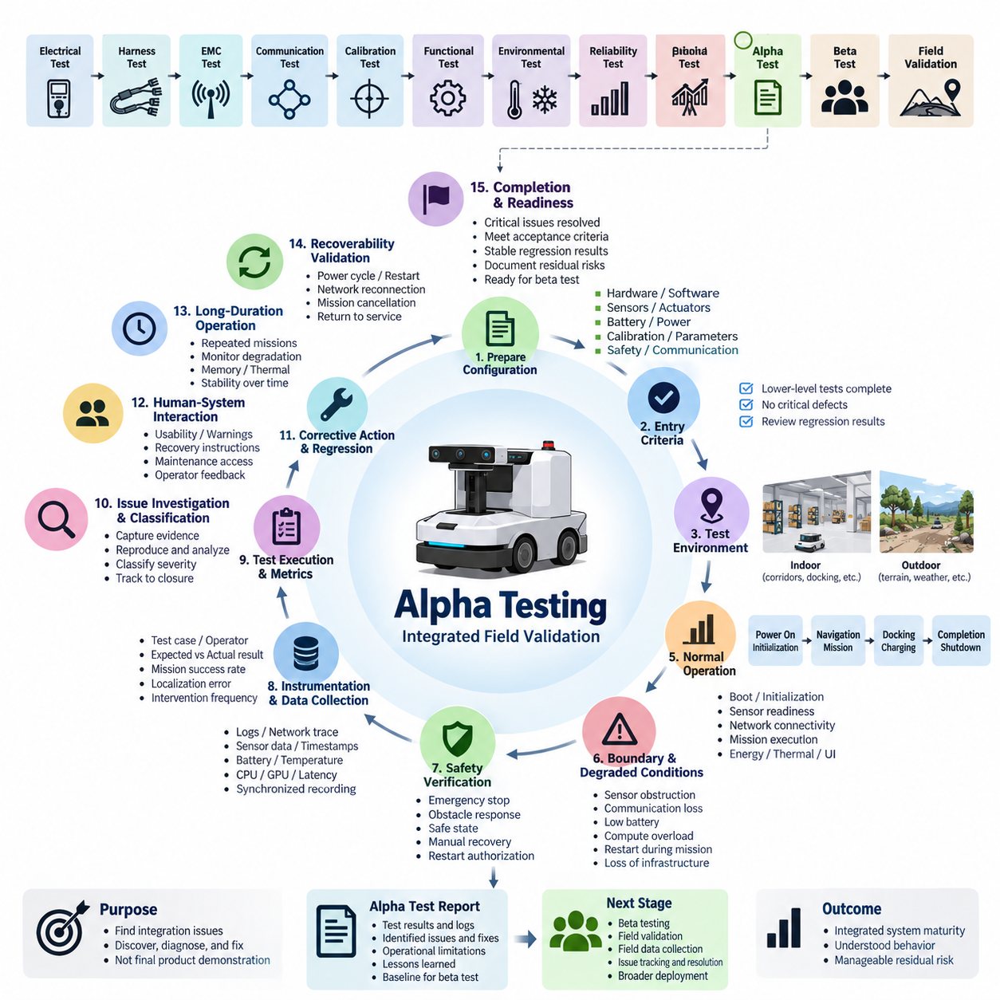
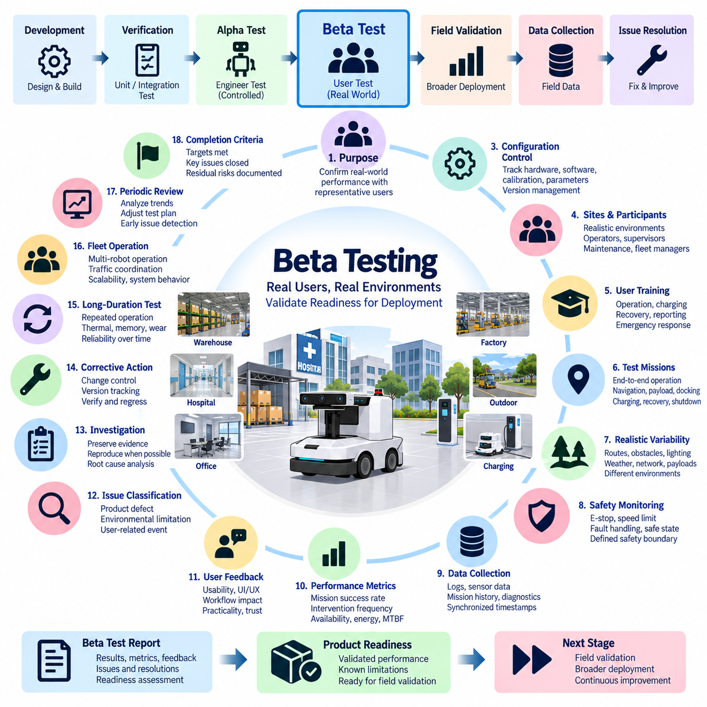
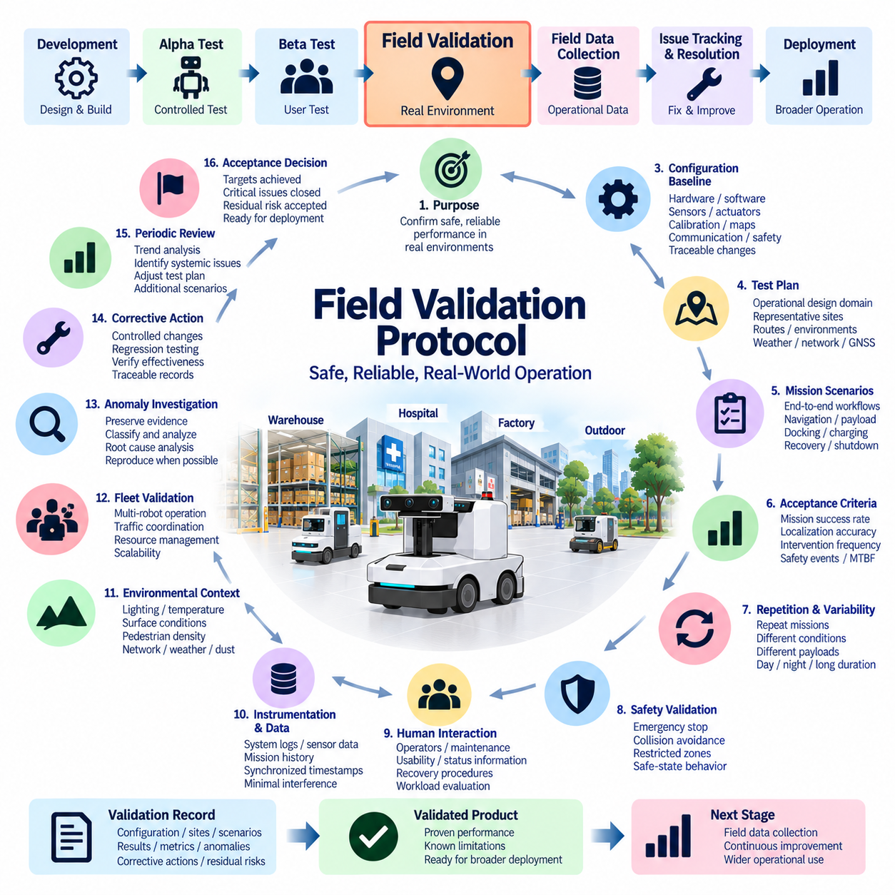
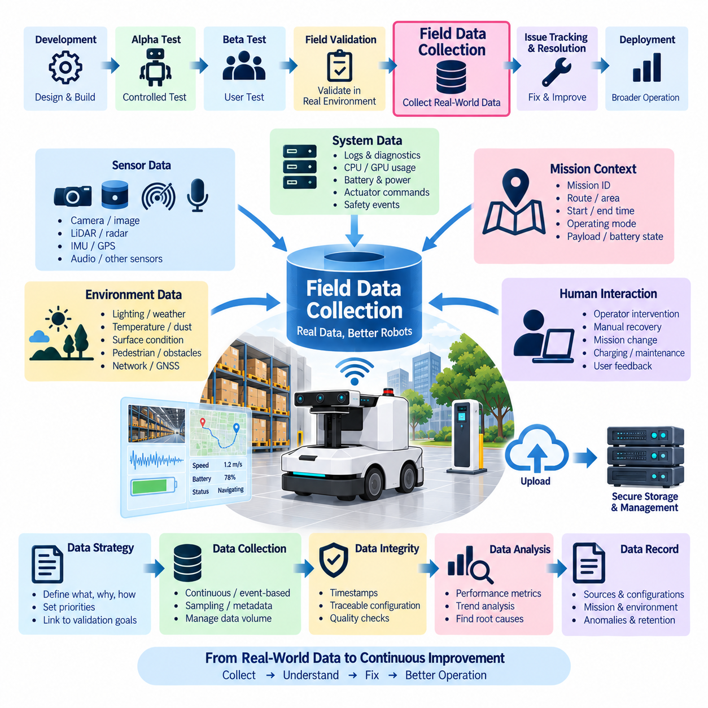
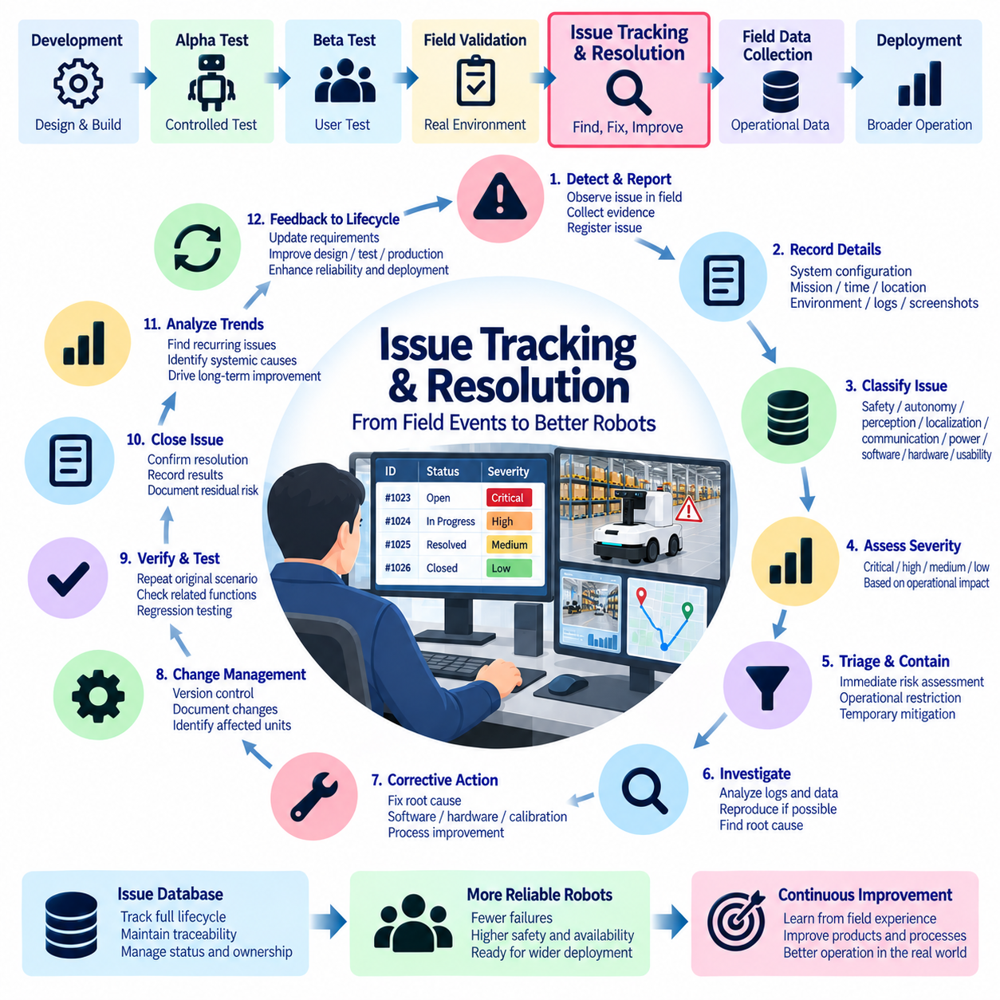

**Volume 19. Testing and Validation**

# Chapter 09. Field Test

## 09.01. Alpha Test Procedure

{width="7.268055555555556in" height="7.268055555555556in"}

알파 시험(Alpha Testing)은 로봇 또는 자율 시스템(Autonomous System)을 개별적으로 검증된 하위 시스템(Subsystem)의 집합이 아니라 하나의 통합 제품(Integrated Product)으로 운용하면서 검증하는 최초의 체계적인 현장 지향 검증(Field-Oriented Validation) 단계이다. 시험 및 검증(Testing and Validation) 절차에서 전기, 하네스, 전자파 적합성(EMC), 통신, 교정, 기능, 환경 및 신뢰성 시험 이후에 수행되며, 베타 시험(Beta Testing)과 보다 광범위한 현장 검증(Field Validation)에 앞서 수행된다.

알파 시험(Alpha Test)의 주요 목적은 실험실 검증(Laboratory Verification) 과정에서는 발견되지 않을 수 있는 통합 문제(Integration Problem)를 찾아내는 것이다. 시스템은 실제 운용 조건과 유사한 통제 또는 반통제 환경(Controlled or Semi-Controlled Environment)에서 운용되며, 엔지니어는 하드웨어, 소프트웨어, 진단 인터페이스(Diagnostic Interface), 로그(Log), 비상 제어(Emergency Control)에 직접 접근할 수 있어야 한다. 따라서 최종 제품 성숙도를 입증하기보다는 문제의 발견, 진단, 수정 및 반복 검증에 중점을 둔다.

알파 시험을 시작하기 전에 시험 구성(Test Configuration)을 공식적으로 식별해야 한다. 하드웨어 리비전(Hardware Revision), 배선 및 하네스 구성, 센서 설치 상태, 액추에이터(Actuator) 버전, 배터리 및 전원 아키텍처(Power Architecture), 펌웨어(Firmware), 운영체제, 미들웨어(Middleware), 응용 소프트웨어, 인공지능 모델(AI Model), 교정 데이터(Calibration Data), 파라미터 세트(Parameter Set), 안전 설정 및 통신 설정을 기록해야 한다. 이러한 구성 기준선(Configuration Baseline)을 통해 관찰된 모든 동작을 재현 가능한 시스템 상태와 연결할 수 있다.

진입 기준(Entry Criteria)은 통합 운용을 수행할 수 있을 정도로 하위 수준 검증(Lower-Level Verification)이 충분한 성숙도에 도달했음을 확인해야 한다. 중대한 전기적 결함, 통신 불안정, 해결되지 않은 안전 결함, 교정 오류 및 현장 시험 결과를 무효화할 수 있는 알려진 고장은 해결되거나 명시적으로 승인되어야 한다. 또한 알파 시험이 미완료된 부품, 하위 시스템, HIL(Hardware-in-the-Loop), SIL(Software-in-the-Loop), 환경 또는 신뢰성 검증을 대신하지 않도록 기능 회귀 시험(Functional Regression Test) 결과를 검토해야 한다.

알파 시험 환경(Alpha Environment)은 엔지니어링 분석이 가능하도록 충분히 통제하면서도 대표적인 운용 조건을 재현해야 한다. 자율이동로봇(AMR)의 경우 복도, 교차로, 도킹 스테이션(Docking Station), 충전 위치, 경사로, 바닥 상태 변화, 장애물, 보행자, 제한 구역 및 통신 음영 변화 등이 포함될 수 있다. 실외 자율 플랫폼(Outdoor Autonomous Platform)의 경우 불규칙한 지형, 위성항법시스템(GNSS) 변화, 조명 변화, 기상 노출, 경사, 식생, 먼지 및 실제 운용에 가까운 임무 거리까지 추가할 수 있다.

시험 시나리오(Test Scenario)는 서로 분리된 개별 기능보다 실제 시스템 임무(System Mission)를 기반으로 구성해야 한다. 완전한 시나리오는 전원 인가와 초기화에서 시작하여 위치 추정(Localization), 임무 수신, 자율주행(Autonomous Navigation), 장애물 회피, 화물 처리 또는 검사, 도킹, 충전 및 임무 완료까지 진행하고 종료 또는 재시작으로 마무리할 수 있다. 이러한 기능을 연속적인 운용 체인(Operational Chain)으로 시험하면 독립적인 하위 시스템 시험에서는 재현하기 어려운 인터페이스 고장(Interface Failure)을 발견할 수 있다.

비정상 조건을 적용하기 전에 정상 운용(Normal Operation)을 통해 안정적인 기준선(Baseline)을 먼저 확보해야 한다. 엔지니어는 부팅 동작, 초기화 시간, 센서 준비 상태, 네트워크 연결성, 위치 추정 수렴(Localization Convergence), 액추에이터 응답, 임무 수행, 에너지 소비, 열적 거동(Thermal Behavior) 및 사용자 인터페이스(User Interface) 동작을 검증해야 한다. 간헐적 고장, 자원 누수(Resource Leak), 타이밍 문제 및 점진적인 성능 저하는 단일 임무 성공만으로 나타나지 않을 수 있으므로 반복 수행이 중요하다.

알파 시험에서는 통제되지 않은 위험을 발생시키지 않는 범위에서 경계 조건(Boundary Condition)과 성능 저하 조건(Degraded Condition)을 의도적으로 검증해야 한다. 대표적인 사례로 일시적인 센서 가림, 통신 단절, 메시지 지연, 배터리 충전 상태 저하, 위치 추정 불확실성, 액추에이터 성능 저하, 충전 중단, 컴퓨팅 과부하, 임무 수행 중 재시작 및 외부 인프라의 일시적 상실 등이 있다. 안전한 성능 저하(Safe Degradation)와 예상하지 못한 고장을 구분할 수 있도록 기대되는 시스템 응답을 사전에 정의해야 한다.

시험 절차 전반에서 안전 동작(Safety Behavior)을 지속적으로 확인해야 한다. 비상 정지(Emergency Stop), 보호 영역(Protective Field), 속도 제한, 장애물 대응, 제동 동작, 고장 상태 전환(Fault Transition), 수동 복구, 재시작 승인 및 안전 상태(Safe State) 진입 기능은 실제 통합 운용 조건에서도 정상적으로 유지되어야 한다. 허용할 수 없는 위험이 발생하는 조건에서는 해당 시험 시나리오를 즉시 중단하고 가능한 증거를 보존한 후, 시험을 재개하기 전에 엔지니어링 검토(Engineering Review)를 수행해야 한다.

계측 시스템(Instrumentation)은 모든 주요 영역에서 시간적으로 동기화된 증거를 수집해야 한다. 시스템 로그, CAN 또는 산업용 네트워크 트레이스(Network Trace), 이더넷 통계, ROS 2 또는 미들웨어 메시지, 위치 추정 상태, 센서 타임스탬프(Timestamp), 액추에이터 명령, 안전 이벤트, 배터리 전압과 전류, 온도, CPU 및 GPU 사용률, 메모리 사용량, 네트워크 지연시간(Network Latency), 임무 상태 및 작업자 조작 기록 등이 유용하다. 분산 제어기(Distributed Controller) 사이의 인과관계를 재구성하기 위해 정확한 시간 동기화(Time Synchronization)가 필수적이다.

각 시험 수행(Test Run)에는 식별 가능한 시험 사례(Test Case), 시스템 구성, 작업자, 시험 환경, 시작 및 종료 시간, 예상 결과, 실제 결과 및 처리 결과(Disposition)가 포함되어야 한다. 가능한 경우 주관적인 관찰에만 의존하지 않고 정량적 지표(Quantitative Metric)를 수집해야 한다. 임무 완료율, 작업자 개입 빈도, 위치 추정 오차, 도킹 정확도, 장애물 대응, 통신 가용성, 복구 시간, 에너지 소비, 열적 여유(Thermal Margin), 고장 빈도 및 소프트웨어 안정성은 알파 성숙도(Alpha Maturity)를 평가할 수 있는 측정 가능한 증거가 된다.

예상하지 못한 이벤트(Unexpected Event)가 발생하면 시스템을 즉시 재시작하여 정보를 삭제하기보다 엔지니어링 증거(Engineering Evidence)로 보존해야 한다. 가능한 경우 복구 전에 로그, 트레이스, 센서 기록, 화면 캡처, 고장 코드, 환경 조건, 작업자 조작 및 최근의 구성 변경 사항을 확보해야 한다. 이후 동일한 기준선과 시나리오를 사용하여 재현을 시도해야 한다. 재현 가능한 고장(Reproducible Failure)은 단순한 구두 설명보다 근본 원인 분석(Root Cause Analysis)에 훨씬 강력한 정보를 제공한다.

문제 분류(Issue Classification)는 기술적 심각도와 운용 영향(Operational Impact)을 모두 반영해야 한다. 불안전한 움직임, 제어 상실, 핵심 임무 실패, 하드웨어 손상 또는 복구 불가능한 시스템 정지를 유발할 수 있는 결함은 일반적으로 즉각적인 억제 조치(Containment)가 필요하다. 상대적으로 낮은 심각도의 문제에는 성능 저하, 간헐적 통신, 과도한 복구 시간, 혼란을 유발하는 작업자 인터페이스 동작 또는 진단 기능 부족 등이 포함될 수 있다. 모든 문제는 발견부터 분석, 수정, 회귀 시험 및 종료까지 추적 가능해야 한다.

알파 시험 중 적용되는 수정 조치(Corrective Change)는 신중하게 통제해야 한다. 소프트웨어 패치(Software Patch), 교정 변경, 기계적 조정, 배선 수정, 센서 위치 변경, 파라미터 튜닝(Parameter Tuning) 또는 하드웨어 교체는 기존에 검증된 동작을 변경할 수 있다. 수정 후에는 먼저 고장이 발생했던 시나리오를 다시 수행하고, 이어서 관련 회귀 시나리오(Regression Scenario)를 수행하여 원래 문제가 해결되었으며 통합 시스템의 다른 영역에 새로운 고장이 발생하지 않았음을 확인해야 한다.

사람과 시스템의 상호작용(Human-System Interaction) 역시 알파 검증(Alpha Validation)의 중요한 부분이다. 엔지니어와 선정된 내부 작업자는 시작 절차, 임무 할당, 상태 표시, 경고 메시지, 복구 지침, 충전 작업, 유지보수 접근성, 진단 인터페이스 및 비상 절차를 평가해야 한다. 하드웨어나 소프트웨어 고장으로 분류되지 않는 혼란스러운 동작도 사용자가 시간적 압박을 받으면서 시스템을 운용하거나 복구해야 하는 실제 현장에서는 심각한 문제가 될 수 있다.

개별 임무 시험과 함께 장시간 운용(Long-Duration Operation)도 수행해야 한다. 연속 또는 반복 임무는 메모리 증가, 열 누적, 배터리 상태 추정 편차, 통신 성능 저하, 위치 추정 성능 악화, 저장 공간 고갈, 타이밍 불안정 및 기계적 풀림과 같은 문제를 발견할 수 있다. 이러한 시험은 통합 성능이 실제 운용에 의미 있는 시간 동안 안정적으로 유지되는지를 확인함으로써 일반적인 기능 검증과 이후의 신뢰성 또는 현장 검증 사이의 간극을 연결한다.

실제 현장 시스템에서는 운용 중단이 불가피하게 발생하므로 알파 시험에서는 복구 가능성(Recoverability)도 평가해야 한다. 전원 재인가, 제어기 재시작, 네트워크 재연결, 임무 취소, 충전 중단, 위치 추정 복구, 안전한 수동 이동 및 자율 운용 복귀 등을 정의된 조건에서 시험해야 한다. 견고한 시스템(Robust System)은 단순히 고장을 감지하는 것에 그치지 않고 예측 가능한 상태 전환을 제공하고 필요한 상태 정보를 보존하며 안전한 서비스 복구를 지원해야 한다.

알파 시험 완료(Alpha Test Completion)는 시험에 소비한 시간이 아니라 객관적인 증거를 기준으로 판단해야 한다. 중대한 안전 및 임무 차단 결함(Mission-Blocking Defect)이 해결되고, 필수 시나리오가 승인 기준(Acceptance Criteria)을 충족하며, 회귀 시험 결과가 안정적으로 유지되어야 한다. 또한 주요 고장의 원인이 파악되고 잔여 문제가 문서화된 위험 및 처리 방안을 가져야 한다. 구성 기록, 시험 결과, 로그, 결함 상태 및 알려진 제한 사항을 통해 다음 현장 검증 단계로 진행할 준비가 되었음을 종합적으로 입증해야 한다.

최종 알파 시험 기록(Final Alpha Test Record)은 이후 수행되는 베타 시험 절차(Beta Test Procedure), 현장 검증 프로토콜(Field Validation Protocol), 현장 데이터 수집(Field Data Collection) 및 문제 추적과 해결(Issue Tracking and Resolution)을 위한 엔지니어링 기준선(Engineering Baseline)이 된다. 따라서 단순한 합격 또는 불합격 결과뿐만 아니라 시스템 구성 식별 정보, 운용 제한 사항, 미해결 관찰 사항, 수정 조치, 회귀 시험 증거 및 후속 배포를 위한 교훈(Lessons Learned)을 함께 보존해야 한다.

성공적인 알파 시험 프로그램(Alpha Test Program)이 제품의 제한 없는 고객 운용 준비 완료를 의미하는 것은 아니다. 이는 통합 시스템이 실험실 검증 단계에서 통제된 운용 성숙도(Controlled Operational Maturity) 단계로 발전했으며, 시스템 동작이 충분히 이해되고 잔여 위험(Residual Risk)을 관리할 수 있는 수준에 도달했음을 의미한다. 이러한 구분을 통해 후속 베타 시험에서는 기본적인 통합 결함을 반복적으로 발견하기보다 더 다양한 사용자, 환경, 작업 부하 및 실제 운용 변동성(Operational Variability)을 검증하는 데 집중할 수 있다.

## 09.02. Beta Test Procedure

{width="7.268055555555556in" height="7.268055555555556in"}

베타 시험(Beta Testing)은 알파 시험(Alpha Testing) 과정에서 주요 통합 문제가 해결된 이후, 로봇 또는 자율 시스템(Autonomous System)을 실제 운용 조건에서 대표 사용자(Representative User)가 운용하면서 수행하는 통제된 현장 검증(Controlled Field Validation) 단계이다. 현장 시험(Field Test) 절차에서 베타 시험은 알파 시험 절차(Alpha Test Procedure)에 이어 수행되며, 공식적인 현장 검증(Field Validation), 체계적인 현장 데이터 수집(Field Data Collection), 문제 추적 및 해결(Issue Tracking and Resolution) 단계로 전환하기 위한 기반을 제공한다.

베타 시험의 주요 목적은 통합 제품(Integrated Product)이 실제 운용에서 발생하는 다양성과 불확실성에 노출되었을 때 신뢰성 있게 동작하는지를 확인하는 것이다. 엔지니어가 환경과 시스템을 긴밀하게 통제하는 알파 시험과 달리, 베타 시험에서는 정의된 안전 경계(Safety Boundary)를 유지하면서 사용자, 임무, 장소, 운용 시간, 환경 조건, 네트워크 품질, 페이로드(Payload) 및 상호작용 패턴의 변화를 의도적으로 확대한다.

베타 시험 진입(Entry into Beta Testing)을 위해서는 알파 시험이 허용 가능한 성숙도(Maturity)에 도달했다는 증거가 필요하다. 중대한 안전 결함과 임무를 차단하는 통합 고장은 해결되어야 하며, 필수 회귀 시험(Regression Test)은 통과해야 하고, 주요 고장 메커니즘(Failure Mechanism)은 충분히 이해되어야 하며, 잔여 제한 사항(Residual Limitation)은 문서화되어야 한다. 또한 현장 관찰 결과가 통제되지 않은 소프트웨어, 하드웨어 또는 교정 변경으로 무효화되지 않도록 베타 배포 구성(Beta Configuration)이 충분히 안정적이어야 한다.

각 베타 시험 장비(Beta Unit)는 추적 가능한 구성 기준선(Configuration Baseline)을 가져야 한다. 하드웨어 리비전(Hardware Revision), 센서 및 액추에이터 구성, 배터리와 전원 아키텍처(Power Architecture), 펌웨어(Firmware), 운영체제, 미들웨어(Middleware), 응용 소프트웨어, 인공지능 모델(AI Model), 교정 파일(Calibration File), 통신 파라미터, 안전 설정 및 관련 기계적 구성을 기록해야 한다. 베타 프로그램 중 적용되는 구성 변경은 버전 관리(Version Control)되고 해당 현장 결과와 연계되어야 한다.

베타 시험 장소(Beta Site)와 참가자(Participant)는 가능한 한 실제 목표 운용 환경을 대표해야 한다. 자율이동로봇(AMR)의 경우 대표적인 환경에는 창고, 병원, 상업용 건물, 공장, 물류 시설 또는 실외 운용 구역 등이 포함될 수 있다. 참가자에는 개발 엔지니어와 다른 방식으로 제품과 상호작용하는 작업자, 감독자, 유지보수 담당자, 플릿 관리자(Fleet Manager) 및 기타 실제 사용자가 포함될 수 있다.

현장 운용을 시작하기 전에 참가자는 정상 운용, 임무 할당, 상태 정보 해석, 충전, 일상적인 복구, 보고 절차 및 비상 대응에 관한 적절한 교육을 받아야 한다. 교육은 안전한 운용을 보장할 수 있을 정도로 충분해야 하지만 제품의 낮은 사용성(Usability)을 보완하는 수단이 되어서는 안 된다. 사용자가 일반적인 기능을 이해하기 위해 반복적으로 엔지니어의 지원을 필요로 한다면, 과도한 교육으로 문제를 숨기지 말고 베타 시험 결과로 기록해야 한다.

베타 시험 계획(Beta Test Plan)은 개별 기능만을 검증하기보다 대표적인 임무(Representative Mission)를 정의해야 한다. 임무에는 시스템 시작, 위치 추정(Localization), 작업 할당, 자율주행(Autonomous Navigation), 장애물 상호작용, 페이로드 운송, 검사, 도킹(Docking), 충전, 임무 중단, 복구 및 종료 등이 포함될 수 있다. 반복적인 종단간 운용(End-to-End Operation)을 통해 실험실 시험에서는 발견하기 어려운 하위 시스템 상호작용, 운용 순서, 상태 관리 및 사용자 행동 관련 문제를 확인할 수 있다.

현실적인 변동성(Realistic Variability)은 베타 시험의 중요한 가치 중 하나이다. 시스템은 승인된 안전 한계 내에서 다양한 경로, 장애물 배치, 보행자 밀도, 조명 조건, 바닥 표면, 온도, 통신 범위, 배터리 상태, 페이로드 조건 및 운용 일정에 노출되어야 한다. 실외 시스템의 경우 지형 변화, 위성항법시스템(GNSS) 품질 변화, 날씨, 먼지, 경사, 식생 및 장거리 임무 조건까지 추가로 포함할 수 있다.

이전 검증 단계에서 확립된 안전 제어(Safety Control)는 베타 시험 전체 기간 동안 활성 상태로 유지되어야 한다. 비상 정지(Emergency Stop), 보호 감지(Protective Sensing), 속도 제한, 제동 동작, 고장 처리(Fault Handling), 수동 복구, 재시작 승인, 제한 운용 구역 및 에스컬레이션 절차(Escalation Procedure)를 명확하게 정의해야 한다. 허용할 수 없는 위험이 발생하는 이벤트는 즉시 억제 조치(Containment)를 수행하고, 해당 구성이나 시나리오를 다시 운용하기 전에 엔지니어링 검토(Engineering Review)를 실시해야 한다.

현장 계측(Field Instrumentation)은 현실적인 운용을 방해하지 않으면서 충분한 정보를 수집해야 한다. 시스템 로그, 임무 이력, 위치 추정 상태, 센서 상태, 통신 품질, 배터리 정보, 열 데이터(Thermal Data), 프로세서 사용률, 고장 코드, 안전 이벤트, 복구 조치 및 작업자 개입 기록은 중요한 데이터가 된다. 가능한 경우 동기화된 타임스탬프(Synchronized Timestamp)를 사용하여 분산 제어기, 센서, 네트워크 및 애플리케이션에서 발생한 이벤트를 정확하게 재구성할 수 있어야 한다.

정량적 성능 지표(Quantitative Performance Indicator)는 정성적인 사용자 관찰(Qualitative User Observation)을 보완해야 한다. 유용한 측정 항목에는 임무 완료율, 자율 운용 시간, 작업자 개입 빈도, 위치 추정 실패, 도킹 성공률, 통신 가용성, 복구 시간, 충전 성공률, 에너지 소비, 소프트웨어 재시작 빈도, 안전 이벤트 및 관련 고장 사이의 평균 운용 시간 등이 있다. 이러한 지표는 실제 임무 및 환경 조건을 함께 고려하여 해석해야 한다.

사용자 피드백(User Feedback)은 베타 시험을 다른 검증 단계와 구별하는 핵심 요소이다. 작업자는 이해하기 어려운 인터페이스, 불명확한 경고, 예상하지 못한 로봇 동작, 어려운 복구 절차, 과도한 유지보수 작업, 불편한 충전 상호작용, 부족한 상태 가시성(Status Visibility) 및 작업 흐름 방해 등을 보고해야 한다. 이러한 문제는 일반적인 공학적 고장으로 나타나지 않을 수 있지만 시스템의 실용성, 신뢰성 및 지원 가능성(Supportability)에 큰 영향을 줄 수 있다.

베타 시험에서는 제품 결함(Product Defect), 환경적 제한(Environmental Limitation) 및 사용자 관련 이벤트(User-Related Event)를 구분해야 한다. 임무 실패는 소프트웨어, 하드웨어, 교정, 통신 인프라, 부적절한 운용 조건, 잘못된 사용자 조작 또는 여러 요인의 상호작용에서 발생할 수 있다. 따라서 모든 현장 이상을 자동으로 제품 고장으로 판단하거나 사용자가 관련되었다는 이유만으로 제품의 책임 가능성을 배제하지 않고 증거에 기반하여 분류해야 한다.

이상이 발생하면 가능한 경우 시스템을 재설정하거나 변경하기 전에 이용 가능한 증거를 보존해야 한다. 로그, 타임스탬프, 임무 상태, 센서 상태, 환경 조건, 작업자 행동, 화면 캡처, 네트워크 정보 및 구성 식별자를 확보해야 한다. 심각도가 높거나 반복적으로 발생하는 이벤트는 가능한 경우 통제된 환경에서 재현하여 근본 원인(Root Cause)을 우발적인 현장 조건과 구분해야 한다.

베타 시험에서 발견된 문제는 심각도(Severity), 발생 빈도(Frequency), 운용 영향, 재현 가능성(Reproducibility), 담당자, 상태 및 해결 증거를 포함하는 구조화된 추적 프로세스(Structured Tracking Process)에 등록해야 한다. 안전에 중대한 이벤트와 필수 임무를 수행하지 못하게 하는 고장은 즉시 상위 단계로 보고해야 한다. 상대적으로 낮은 심각도의 문제는 가용성, 사용성, 유지보수성, 고객 작업 흐름 및 광범위한 배포 시 재발 가능성에 따라 우선순위를 결정할 수 있다.

베타 시험 중 수정 조치(Corrective Action)를 적용할 때는 엄격한 변경 관리(Change Control)가 필요하다. 소프트웨어 패치, 파라미터 변경, 인공지능 모델 업데이트, 교정 변경, 센서 조정, 배선 변경 또는 기계적 개선은 기존에 검증된 동작에 영향을 미칠 수 있다. 따라서 각 변경에는 명확한 변경 사유, 버전 식별자, 적용 장비, 회귀 시험 범위, 배포 기록 및 검증 결과가 포함되어야 하며, 개선 효과와 의도하지 않은 부작용을 모두 추적할 수 있어야 한다.

수정된 문제는 먼저 해당 문제를 발견한 시나리오에서 검증한 후 관련 회귀 시나리오(Regression Scenario)를 통해 다시 검증해야 한다. 실험실에서의 재현만으로는 최초 문제를 발생시킨 환경, 작업 부하, 네트워크 동작 및 사람과 시스템의 상호작용 조합을 완전히 구현하지 못할 수 있으므로 현장 검증(Field Verification)이 추가로 필요할 수 있다. 문제 종료(Closure)는 단순히 즉각적인 고장이 다시 발생하지 않았다는 사실이 아니라 수정 조치의 효과를 입증하는 객관적인 증거를 기반으로 해야 한다.

현장 신뢰성(Field Reliability)은 누적된 운용 동작에 영향을 받으므로 베타 시험에서는 장시간 및 반복 운용(Long-Duration and Repeated Operation)이 특히 중요하다. 장시간 임무를 통해 메모리 증가, 열 누적, 저장 공간 고갈, 배터리 상태 추정 편차, 위치 추정 성능 저하, 통신 불안정, 기계적 마모, 교정 변화 및 복구 문제 등을 발견할 수 있다. 이러한 관찰은 통제된 신뢰성 시험과 실제 운용 신뢰성(Operational Dependability) 사이를 연결하는 역할을 한다.

여러 로봇이 함께 운용되는 시스템이라면 플릿 수준 동작(Fleet-Level Behavior)을 평가해야 한다. 임무 할당, 교통 조정, 공유 충전 자원, 통신 혼잡, 지도 일관성(Map Consistency), 소프트웨어 버전 호환성, 복구 조정 및 작업자 업무 부하는 단일 로봇 시험에서는 나타나지 않는 문제를 발생시킬 수 있다. 따라서 베타 운용은 현실적인 작업 부하에서 확장성(Scalability)과 시스템 수준 상호작용을 평가할 수 있는 중요한 증거를 제공한다.

베타 프로그램(Beta Program)은 계획된 모든 운용이 완료될 때까지 기다리지 않고 누적된 결과를 주기적으로 검토해야 한다. 임무 실패, 작업자 개입, 고장 유형, 환경 민감도, 사용자 불만 및 수정 조치 효과의 추세를 분석하면 새롭게 나타나는 시스템적 문제(Systemic Problem)를 조기에 발견할 수 있다. 조기 추세 분석(Early Trend Analysis)을 통해 베타 시험이 종료되기 전에 시험 우선순위를 변경하고 필요한 추가 증거를 확보할 수 있다.

완료 기준(Completion Criteria)은 베타 프로그램을 시작하기 전에 정의해야 한다. 요구되는 운용 노출(Operational Exposure)을 달성하고, 중대한 결함이 해결되며, 반복적으로 발생하는 주요 고장의 원인이 파악되고, 성능 지표가 합의된 목표를 충족하며, 잔여 위험(Residual Risk)에 대한 처리 방안이 문서화되어야 한다. 허용 가능한 상태로 남아 있는 알려진 제한 사항은 후속 현장 검증에서 예상하지 못한 동작으로 잘못 판단되지 않도록 명확하게 전달해야 한다.

최종 베타 시험 기록(Final Beta Test Record)은 배포된 시스템 구성, 시험 장소, 참가자 특성, 운용 노출, 임무 결과, 성능 지표, 현장 이상, 사용자 피드백, 수정 조치, 회귀 시험 증거, 미해결 제한 사항 및 최종 준비 상태 평가(Readiness Assessment)를 통합해야 한다. 이 기록은 현장 시험(Field Test) 장에서 이후 수행되는 현장 검증 프로토콜(Field Validation Protocol), 현장 데이터 수집(Field Data Collection), 문제 추적 및 해결(Issue Tracking and Resolution)을 위한 추적 가능한 엔지니어링 기준선(Engineering Baseline)을 제공한다.

성공적인 베타 시험이 가능한 모든 현장 조건에서 시스템의 동작이 검증되었다는 것을 의미하지는 않는다. 베타 시험은 대표 사용자와 현실적인 환경 변동성 아래에서 시스템이 허용 가능한 안전성, 신뢰성, 사용성 및 복구 가능성(Recoverability)을 유지하면서 운용될 수 있다는 증거를 제공한다. 이를 통해 광범위한 배포 이전의 불확실성을 줄이고, 실제 현장 경험을 최종 제품 검증(Final Product Validation)과 지속적인 개선(Continuous Improvement)을 위한 측정 가능한 공학적 증거로 전환할 수 있다.

## 09.03. Field Validation Protocol

{width="7.268055555555556in" height="7.268055555555556in"}

현장 검증(Field Validation)은 로봇 또는 자율 시스템(Autonomous System)이 대표적인 실제 운용 환경에서 의도된 임무를 안전하고 신뢰성 있으며 일관되게 수행할 수 있음을 입증하는 체계적인 과정이다. 현장 시험(Field Test) 절차에서는 알파 시험(Alpha Testing)과 베타 시험(Beta Testing) 이후에 수행되며, 통제된 제품 검증(Product Verification)에서 보다 광범위한 실제 운용 배포(Operational Deployment)로 전환하기 위한 공식적인 연결 단계가 된다. 이 프로토콜은 현장 운용을 단순한 시연이 아니라 반복 가능한 공학적 증거(Engineering Evidence)로 전환한다.

주요 목적은 하드웨어, 소프트웨어, 센싱(Sensing), 통신, 전원, 자율 기능(Autonomy), 사람과 시스템의 상호작용(Human Interaction) 및 환경 조건이 함께 작동할 때 시스템 수준 성능(System-Level Performance)이 허용 가능한 수준으로 유지되는지를 확인하는 것이다. 따라서 현장 검증은 개별 하위 시스템 기능이 아니라 완전한 임무 동작(Complete Mission Behavior)을 평가한다. 결과는 성공적인 운용뿐만 아니라 조건이 변화하거나 시스템 성능이 저하될 때에도 예측 가능한 동작을 보여주어야 한다.

검증은 공식적으로 배포된 구성 기준선(Configuration Baseline)을 기반으로 시작해야 한다. 하드웨어 리비전(Hardware Revision), 센서, 액추에이터(Actuator), 전기 아키텍처(Electrical Architecture), 배터리 시스템, 펌웨어(Firmware), 운영체제, 미들웨어(Middleware), 응용 소프트웨어, 인공지능 모델(AI Model), 지도, 교정 파일(Calibration File), 통신 파라미터, 안전 설정 및 임무 구성을 식별해야 한다. 검증 중 적용되는 모든 변경은 결과가 정확히 어떤 구성에서 생성되었는지를 확인할 수 있도록 추적 가능해야 한다.

진입 기준(Entry Criteria)은 이전의 알파 및 베타 시험 활동이 충분한 성숙도(Maturity)에 도달했음을 확인해야 한다. 중대한 안전 결함은 종료되어야 하고, 주요 통합 고장은 해결되어야 하며, 회귀 시험(Regression Testing)은 안정적인 상태를 유지해야 한다. 또한 알려진 제한 사항(Known Limitation)이 문서화되고 대표 사용자의 운용을 통해 허용 가능한 동작이 입증되어야 한다. 미해결 문제는 운용 영향, 완화 방안(Mitigation) 및 승인 근거가 명확하게 이해된 경우에만 남겨둘 수 있다.

검증 계획(Validation Plan)은 의도된 운용 설계 영역(Operational Design Domain)과 대표적인 현장 조건을 정의해야 한다. 이동 로봇(Mobile Robot)의 경우 창고, 공장, 병원, 상업 시설, 실외 도로, 야드(Yard), 검사 구역 또는 실내외 혼합 환경 등이 포함될 수 있다. 경로, 노면, 경사, 장애물, 보행자 활동, 조명, 온도, 날씨, 먼지, 통신 범위, 위성항법시스템(GNSS) 가용성 및 기반 시설 조건은 실제 운용을 대표해야 한다.

임무 시나리오(Mission Scenario)는 초기화부터 완료까지 실제 작업 흐름을 대표해야 한다. 일반적인 절차에는 전원 인가, 자가 진단(Self-Diagnostics), 위치 추정(Localization), 임무 수신, 자율주행(Autonomous Navigation), 장애물 상호작용, 페이로드 운송 또는 검사, 도킹(Docking), 충전, 복구 및 종료가 포함될 수 있다. 개별적으로 검증된 기능 간 상호작용에서 시스템 수준 고장이 발생하는 경우가 많으므로 완전한 임무 체인(Complete Mission Chain)을 검증하는 것이 중요하다.

각 시나리오는 실행 전에 기대 동작(Expected Behavior)과 측정 가능한 승인 기준(Acceptance Criteria)을 정의해야 한다. 적절한 측정 항목에는 임무 성공률, 위치 추정 정확도, 도킹 성공률, 장애물 대응, 작업자 개입 빈도, 통신 가용성, 복구 시간, 충전 성능, 에너지 소비, 열적 여유(Thermal Margin), 안전 이벤트 및 관련 고장 사이의 운용 시간이 포함될 수 있다. 기준은 결과를 관찰한 후 선택하는 것이 아니라 실제 운용 요구사항(Operational Requirement)과 연결되어야 한다.

현장 검증은 한 번의 성공적인 수행을 보여주는 것이 아니라 일관성(Consistency)을 평가할 수 있도록 충분히 반복해야 한다. 대표적인 경로, 운용 시간대, 환경 조건, 페이로드 상태 및 시스템 상태에서 임무를 반복해야 한다. 이러한 반복은 견고한 성능(Robust Performance)과 우연한 성공을 구분하는 데 도움이 되며, 간헐적 문제, 누적 성능 저하, 타이밍 민감성 및 불안정한 동작을 유발할 수 있는 조건의 조합을 발견할 수 있게 한다.

정상 운용(Normal Operation)은 안전하고 적절한 범위에서 통제된 경계 조건(Boundary Condition) 및 성능 저하 조건(Degraded Condition)의 평가로 보완해야 한다. 예를 들어 낮은 배터리 상태, 부분적인 통신 손실, 위치 추정 불확실성, 일시적인 센서 성능 저하, 교통량 증가, 조명 변화, 기반 시설 응답 지연 또는 충전 중단 등이 포함될 수 있다. 목적은 시스템이 성능 저하 운용, 복구 또는 정의된 안전 상태(Safe State)로 예측 가능하게 전환하는지를 확인하는 것이다.

안전 검증(Safety Validation)은 모든 현장 활동에서 지속적으로 수행되어야 한다. 비상 정지(Emergency Stop), 보호 감지(Protective Sensing), 속도 제한, 제동, 충돌 회피, 제한 구역, 고장 처리(Fault Handling), 수동 개입, 복구 승인 및 안전 상태 동작을 실제 임무 조건에서 모니터링해야 한다. 현장 검증 프로토콜은 증거 수집이 사람, 장비 또는 주변 환경의 안전보다 우선되지 않도록 시험 중단 기준(Stop Criteria)과 에스컬레이션 규칙(Escalation Rule)을 명확하게 규정해야 한다.

계측 시스템(Instrumentation)은 정상 운용을 가능한 한 방해하지 않으면서 동기화된 증거를 제공해야 한다. 시스템 로그, 센서 상태, 위치 추정 상태, 액추에이터 명령, 안전 이벤트, 네트워크 성능, 배터리 전압과 전류, 온도, 프로세서 및 GPU 사용률, 임무 상태, 진단 코드, 작업자 개입 및 복구 조치 등을 수집할 수 있다. 여러 제어기에 걸쳐 고장이 전파될 수 있는 분산형 로봇 아키텍처(Distributed Robotic Architecture)에서는 정확한 타임스탬프(Timestamp)가 특히 중요하다.

현장 성능은 운용 조건과 분리하여 해석할 수 없으므로 환경 정보(Environmental Context)를 시스템 데이터와 함께 기록해야 한다. 조명, 온도, 노면 상태, 강수, 먼지, 보행자 밀도, 장애물 배치, 무선 통신 범위, GNSS 품질, 페이로드, 경로 및 임무 시간이 결과에 영향을 미칠 수 있다. 이러한 변수를 기록하면 엔지니어가 성능 저하와 특정 환경 요인 사이의 상관관계(Correlation)를 식별할 수 있다.

사람과 시스템의 상호작용(Human Interaction)도 검증 증거의 일부로 포함해야 한다. 작업자, 감독자, 유지보수 담당자 및 플릿 관리자(Fleet Manager)는 임무 할당, 상태 모니터링, 충전, 복구, 유지보수 및 비상 절차를 통해 시스템과 상호작용할 수 있다. 프로토콜에서는 필요한 조작이 이해하기 쉽고 반복 가능하며, 실제 운용 과정에서 시스템이 충분한 상태 정보, 경고, 진단 및 복구 지침을 제공하는지를 평가해야 한다.

플릿 운용(Fleet Operation)을 목적으로 하는 시스템은 개별 로봇의 성능을 넘어 검증 범위를 확장해야 한다. 여러 로봇을 동시에 운용하면 임무 할당 충돌, 교통 혼잡, 공유 자원 경쟁, 충전 대기, 네트워크 부하, 지도 불일치, 소프트웨어 버전 간 상호작용 및 작업자 업무 부하 증가가 발생할 수 있다. 따라서 플릿 검증(Fleet Validation)은 대표적인 다중 로봇 작업 부하에서 협조 제어, 확장성(Scalability), 복구, 통신 및 자원 관리를 평가해야 한다.

짧은 임무를 통해 확인할 수 없는 동작을 평가하기 위해 장시간 운용(Long-Duration Operation)이 필요하다. 반복적이거나 연속적인 현장 운용에서는 메모리 증가, 열 누적, 배터리 상태 추정 편차, 저장 공간 고갈, 통신 성능 저하, 위치 추정 성능 악화, 교정 변화, 기계적 마모 또는 작업자 개입 빈도의 증가가 나타날 수 있다. 이러한 현상은 운용 신뢰성(Operational Reliability)과 유지보수성(Maintainability)을 평가하는 중요한 지표가 된다.

이상이 발생하면 불필요한 시스템 재설정이나 구성 변경을 수행하기 전에 관련 증거를 보존해야 한다. 가능한 경우 로그, 타임스탬프, 센서 상태, 임무 상황, 환경 조건, 네트워크 정보, 작업자 행동, 고장 코드 및 구성 식별자를 확보해야 한다. 이후 이벤트를 심각도(Severity), 운용 영향, 재현 가능성(Reproducibility), 안전 관련성 및 실제 배포 준비 상태(Deployment Readiness)에 미치는 잠재적 영향에 따라 분류해야 한다.

고장 조사(Failure Investigation)는 제품 결함, 기반 시설 문제, 환경적 제한, 사용자 상호작용, 구성 오류 및 이러한 요인의 조합을 구분해야 한다. 근본 원인 분석(Root-Cause Analysis)은 동기화된 증거와 가능한 경우 통제된 재현 시험을 기반으로 수행해야 한다. 특히 안전, 임무 가용성 또는 핵심 자율 동작에 영향을 주는 현장 이벤트는 즉시 재현되지 않는다는 이유만으로 무시해서는 안 된다.

검증 중 적용되는 수정 조치(Corrective Action)는 통제된 엔지니어링 변경 절차(Engineering Change Procedure)를 따라야 한다. 소프트웨어 패치, 인공지능 모델 업데이트, 교정 변경, 센서 조정, 전기적 변경, 파라미터 튜닝(Parameter Tuning) 또는 기계적 개선에는 구성 식별자와 정의된 회귀 시험 범위가 부여되어야 한다. 수정 후에는 원래 고장이 발생한 시나리오를 반복하고 관련 시험을 수행하여 기존에 검증된 동작이 저하되지 않았음을 확인해야 한다.

현장 검증 결과는 프로그램이 완전히 종료된 이후에만 검토하는 것이 아니라 주기적으로 평가해야 한다. 임무 성공률, 작업자 개입, 안전 이벤트, 위치 추정 실패, 통신 문제, 충전 고장, 환경 민감도 및 반복 결함 유형의 추세를 분석하면 시스템적인 취약성(Systemic Weakness)을 발견할 수 있다. 추세 분석(Trend Analysis)을 통해 충분한 검증 신뢰도(Validation Confidence)를 확보하기 전에 추가적인 운용 노출이나 특정 시험 시나리오가 필요한지를 판단할 수 있다.

승인 결정(Acceptance Decision)은 정량적인 결과와 잔여 위험에 대한 공학적 평가를 함께 고려해야 한다. 일반적으로 계획된 운용 노출 달성, 정의된 성능 목표 충족, 중대한 결함 종료, 허용 가능한 회귀 시험 결과, 반복되는 주요 고장의 원인 파악 및 남아 있는 제한 사항에 대한 문서화된 처리 방안이 완료 조건이 된다. 따라서 성공적인 검증 결정은 주관적인 확신이 아니라 추적 가능한 증거(Traceable Evidence)를 기반으로 해야 한다.

최종 현장 검증 기록(Final Field Validation Record)은 구성 기준선, 시험 장소, 환경, 시나리오, 운용 노출, 승인 기준, 임무 결과, 성능 지표, 안전 관찰 결과, 이상 현상, 수정 조치, 회귀 시험 증거, 잔여 위험 및 최종 준비 상태 평가(Readiness Assessment)를 통합해야 한다. 이 기록은 현장 시험 구조에서 이후 수행되는 현장 데이터 수집(Field Data Collection)과 문제 추적 및 해결(Issue Tracking and Resolution)을 위한 중요한 정보 기반이 된다.

현장 검증은 현실에서 발생할 수 있는 모든 조건을 시험했다는 것을 입증하는 과정이 아니다. 그 목적은 통합 시스템(Integrated System)이 의도된 운용 범위의 대표적인 조건에서 안전하고 예측 가능하게 동작한다는 충분한 증거를 확보하는 것이다. 현실적인 임무, 환경 변동성, 정량적 지표, 동기화된 증거, 고장 조사 및 통제된 수정 조치를 연결함으로써 현장 경험을 실제 배포를 뒷받침할 수 있는 객관적이고 방어 가능한 공학적 검증(Defensible Engineering Validation)으로 전환한다.

## 09.04. Field Data Collection

{width="7.268055555555556in" height="7.268055555555556in"}

현장 데이터 수집(Field Data Collection)은 대표적인 현장 운용 조건에서 로봇과 자율 시스템(Autonomous System)이 운용되는 동안 실제 운용 증거(Operational Evidence)를 체계적으로 획득하고, 구성하고, 보존하는 과정이다. 현장 시험(Field Test) 구조에서는 현장 검증(Field Validation)에 이어 수행되며, 실제 환경에서의 성능, 신뢰성, 환경 민감도, 사용자 상호작용 및 반복적으로 발생하는 고장을 이해하기 위한 경험적 기반을 제공한다. 목적은 단순히 대량의 데이터를 축적하는 것이 아니라, 엔지니어링 의사결정과 이후의 문제 해결(Issue Resolution)을 지원할 수 있는 추적 가능하고 해석 가능한 증거를 확보하는 것이다.

수집 과정은 어떤 정보가 필요한지, 왜 필요한지, 어떻게 수집할 것인지, 그리고 해당 정보가 특정 임무 및 시스템 구성과 어떻게 연결될 것인지를 정의하는 명확한 데이터 전략(Data Strategy)에서 시작해야 한다. 데이터에는 해당되는 범위에서 운용 동작, 시스템 상태, 인지(Perception), 위치 추정(Localization), 통신, 전원, 컴퓨팅 자원, 안전 이벤트, 사용자 개입 및 환경 조건 등이 포함되어야 한다. 수집 우선순위는 검증 목적과 이해해야 할 운용 위험을 반영해야 한다.

모든 데이터 기록은 통제된 시스템 구성(System Configuration)과 연결된 상태로 유지되어야 한다. 하드웨어 리비전(Hardware Revision), 센서 및 액추에이터 구성, 펌웨어(Firmware), 운영체제, 미들웨어(Middleware), 응용 소프트웨어, 인공지능 모델(AI Model) 버전, 교정 파일(Calibration File), 지도(Map), 통신 파라미터 및 관련 임무 설정을 수집된 데이터와 함께 기록해야 한다. 이러한 구성 추적성(Configuration Traceability)은 시험 기간이나 배포 장비 사이에서 시스템 구성이 변경되었을 때 동일한 현상에 서로 다른 원인이 존재할 수 있기 때문에 필수적이다.

기술적 측정값과 함께 임무 상황(Mission Context)도 수집해야 한다. 각 기록에는 임무, 경로 또는 운용 영역, 시작 및 종료 시간, 운용 모드, 페이로드(Payload) 상태, 배터리 상태, 환경 상황 및 관련 작업자 조작을 식별할 수 있어야 한다. 이러한 상황 정보가 없으면 대량으로 축적된 센서 데이터나 시스템 로그를 해석하기 어려워질 수 있다. 상황 정보는 원시 측정값(Raw Measurement)을 임무, 위치, 시스템 구성 및 시간에 따라 비교할 수 있는 운용 증거로 전환한다.

분산형 로봇 시스템(Distributed Robotic System)에서는 시간 동기화(Time Synchronization)가 특히 중요하다. 센서, 제어기, 컴퓨터, 통신 네트워크, 안전 시스템 및 애플리케이션은 서로 다른 주기로 독립적인 기록을 생성할 수 있다. 정확하고 일관된 타임스탬프(Timestamp)는 엔지니어가 이벤트의 순서를 재구성하고 인지, 위치 추정, 계획(Planning), 제어(Control), 통신 및 실제 물리적 동작 사이의 관계를 파악할 수 있도록 한다. 따라서 타임스탬프 품질은 단순한 로깅 세부사항이 아니라 데이터 품질(Data Quality)의 일부로 취급해야 한다.

운용 데이터(Operational Data)는 시스템 수준 정보와 하위 시스템 수준 정보를 모두 포함해야 한다. 유용한 데이터 소스에는 임무 상태, 센서 상태, 위치 추정 상태, 액추에이터 명령, 네트워크 트래픽, 진단 코드, 배터리 전압과 전류, 온도, CPU 및 GPU 사용률, 메모리 사용량, 저장장치 상태, 안전 이벤트 및 작업자 개입 등이 포함될 수 있다. 적절한 데이터 구성은 검증 목적에 따라 달라지지만, 중요한 성공, 실패 및 예상하지 못한 동작을 임무 종료 후에도 설명할 수 있을 정도로 충분한 데이터를 수집해야 한다.

시스템 성능에 영향을 줄 수 있는 경우 환경 정보(Environmental Information)도 수집해야 한다. 온도, 조명, 강수, 먼지, 노면 상태, 지형, 보행자 밀도, 장애물 구성, 무선 통신 범위, GNSS 품질 및 기타 관련 환경 요인을 기록하거나 해당 임무와 연결해야 한다. 환경 상황(Environmental Context)을 확보하면 엔지니어가 인지, 위치 추정, 통신, 열 성능 또는 기계적 동작에 영향을 준 조건과 제품 자체의 고유한 동작을 구분할 수 있다.

실제 사용자는 시스템 동작에 상당한 영향을 줄 수 있으므로 현장 데이터에는 사람과의 상호작용(Human Interaction)에 관한 정보도 포함해야 한다. 작업자 개입, 수동 복구, 임무 변경, 비상 조작, 충전 절차, 유지보수 활동, 경고 및 사용자 피드백(User Feedback)은 사용성(Usability)과 운용 작업 부하(Operational Workload)에 관한 중요한 증거를 제공할 수 있다. 이러한 정보는 일관된 방식으로 기록하여 반복적인 개입이 단순한 개별 작업자 이벤트가 아니라 제품의 잠재적 한계를 나타내는 지표인지 분석할 수 있어야 한다.

데이터 수집은 정상 운용과 비정상 운용을 모두 보존해야 한다. 성공적인 임무는 예상되는 정상 동작의 기준선(Baseline)을 제공하며, 이상 현상(Anomaly)은 추가적인 조사가 필요한 취약성을 드러낸다. 고장 이벤트, 통신 중단, 위치 추정 상실, 예상하지 못한 정지, 복구 조치, 안전 이벤트, 성능 저하 및 임무 취소 등은 충분한 전후 상황과 함께 기록해야 한다. 고장 순간만 기록하는 것은 충분하지 않으며 실제 원인을 판단하기 위해 고장 이전과 이후의 시스템 상태가 필요할 수 있다.

현장 데이터의 양은 엔지니어링 가치(Engineering Value)를 기준으로 관리해야 한다. 카메라, LiDAR, 레이더 및 비디오와 같은 고대역폭 센서 스트림(High-Bandwidth Sensor Stream)은 저장장치와 네트워크 자원을 빠르게 소모할 수 있다. 따라서 데이터 수집 전략에서는 연속 데이터, 이벤트 기반 기록(Event-Triggered Recording), 샘플링 데이터, 메타데이터(Metadata) 및 요약 지표(Summarized Metric)를 구분해야 한다. 중요한 증거에는 높은 보존 우선순위를 부여하고, 중복 정보는 통제된 샘플링 또는 보존 정책(Retention Policy)을 통해 줄일 수 있다.

데이터 무결성(Data Integrity)과 데이터 출처(Provenance)는 수집, 전송, 저장 및 분석의 전체 과정에서 유지되어야 한다. 파일에는 식별 가능한 출처, 타임스탬프, 구성 참조 정보 및 적절한 무결성 검사(Integrity Check)가 포함되어야 한다. 누락된 구간, 손상된 기록, 불완전한 전송, 중복 파일 또는 불확실한 타임스탬프는 조용히 분석에 포함시키지 말고 식별해야 한다. 신뢰할 수 있는 현장 데이터셋(Field Dataset)은 어떤 정보가 존재하는지뿐만 아니라 해당 정보의 한계도 엔지니어가 이해할 수 있도록 해야 한다.

현장 데이터에 사람, 시설, 네트워크 정보 또는 기타 운용상 민감한 내용이 포함되는 경우 개인정보(Privacy), 보안(Security) 및 접근 제어(Access Control)를 고려해야 한다. 데이터 수집 절차는 해당 조직의 요구사항과 정의된 데이터 처리 규칙(Data-Handling Rule)을 따라야 한다. 필요한 경우 개인정보 또는 민감 정보는 광범위한 분석에 사용하기 전에 적절하게 보호하거나 처리해야 한다. 데이터의 유용성을 확보하기 위해 필요한 운용 보안이나 개인정보 보호 통제를 약화시켜서는 안 된다.

수집된 데이터는 분석과 비교를 지원할 수 있는 구조화된 데이터셋(Structured Dataset)으로 변환해야 한다. 임무 식별자, 시스템 식별자, 구성 버전, 타임스탬프, 환경 조건, 성능 지표, 이상 현상 라벨 및 문제 참조 정보는 일관된 명명 규칙과 메타데이터 규칙을 사용해야 한다. 표준화된 데이터 구조는 여러 로봇, 위치, 소프트웨어 버전, 환경 조건 및 운용 기간을 쉽게 비교할 수 있도록 하며, 더 큰 규모에서 자동화된 분석을 수행할 수 있도록 지원한다.

현장 데이터 분석(Field Data Analysis)은 정량적 측정값과 실제 운용 이벤트를 연결해야 한다. 임무 성공률, 개입 빈도, 위치 추정 오차, 통신 가용성, 에너지 소비, 열적 거동(Thermal Behavior), 복구 시간, 고장 빈도 및 기타 지표는 개별 로그에서는 명확하게 보이지 않는 추세를 드러낼 수 있다. 이러한 지표를 환경 정보 및 시스템 구성 정보와 연결하면 엔지니어는 상관관계(Correlation), 반복적으로 발생하는 조건 및 추가적인 조사가 필요한 잠재적인 근본 원인(Root Cause)을 식별할 수 있다.

최종 현장 데이터 수집 기록(Final Field Data Collection Record)에는 데이터 수집 전략, 데이터 소스, 시스템 구성, 임무 상황, 환경 정보, 타임스탬프, 데이터 품질 상태, 저장 위치, 무결성 검사 결과, 이상 현상 기록 및 보존 결정을 포함해야 한다. 이렇게 구축된 데이터셋은 문제 추적 및 해결(Issue Tracking and Resolution), 신뢰성 개선(Reliability Improvement), 소프트웨어 및 인공지능 업데이트, 교정 정밀화(Calibration Refinement), 운용 최적화(Operational Optimization) 및 향후 검증 활동을 위한 신뢰할 수 있는 엔지니어링 기반을 제공해야 한다. 효과적인 현장 데이터 수집은 실제 로봇 운용을 시스템 성능과 배포 신뢰도(Deployment Confidence)를 지속적으로 향상시킬 수 있는 구조화된 증거로 전환한다.

## 09.05. Issue Tracking and Resolution

{width="7.268055555555556in" height="7.268055555555556in"}

문제 추적 및 해결(Issue Tracking and Resolution)은 현장 운용 중 발견된 문제를 기록하고, 분석하고, 우선순위를 결정하고, 수정하고, 검증하고, 종료하는 체계적인 과정이다. 현장 시험(Field Test) 구조에서는 현장 데이터 수집(Field Data Collection)에 이어 수행되며, 실제 운용에서 관찰된 현상을 통제된 엔지니어링 조치(Engineering Action)로 전환한다. 목적은 단순히 고장 목록을 관리하는 것이 아니라, 최초 현장 이벤트(Field Event)부터 근본 원인 분석(Root-Cause Analysis), 수정 조치(Corrective Action), 회귀 검증(Regression Verification) 및 최종 처리 결과(Final Disposition)까지의 추적성을 보존하는 것이다.

모든 현장 문제(Field Issue)는 무엇이 발생했는지를 재구성할 수 있을 정도의 충분한 정보를 포함하여 등록해야 한다. 시스템, 하드웨어 및 소프트웨어 구성, 임무, 위치, 날짜와 시간, 운용 조건, 관찰된 동작, 예상 동작 및 이용 가능한 증거(Evidence)를 식별해야 한다. 가능한 경우 로그, 센서 기록, 화면 캡처, 진단 코드, 네트워크 트레이스(Network Trace), 환경 정보 및 작업자 관찰 결과를 문제와 연결해야 하며, 이를 통해 이후 분석이 기억에 의존하지 않고 증거에 기반하여 수행되도록 해야 한다.

구성 추적성(Configuration Traceability)은 동일한 증상이 서로 다른 시스템 버전에서 서로 다른 원인을 가질 수 있기 때문에 필수적이다. 하드웨어 리비전(Hardware Revision), 센서 및 액추에이터 구성, 펌웨어(Firmware), 운영체제, 미들웨어(Middleware), 응용 소프트웨어, 인공지능 모델(AI Model) 버전, 교정 데이터(Calibration Data), 지도(Map), 파라미터 및 통신 설정을 각 문제와 연결해야 한다. 수정된 구성이 배포될 경우 원래 고장이 발생한 구성과 수정된 구성을 모두 문제 기록에 보존하여 고장과 수정 조치 사이의 관계가 명확하게 유지되도록 해야 한다.

문제 분류(Issue Classification)는 각 이벤트의 기술적 특성과 운용 영향을 구분해야 한다. 문제는 안전, 임무 가용성, 자율 기능, 인지(Perception), 위치 추정(Localization), 통신, 전원, 열적 거동(Thermal Behavior), 기계적 무결성(Mechanical Integrity), 소프트웨어 안정성, 사용성, 유지보수성 또는 제조 품질과 관련될 수 있다. 분류는 증거에 기반해야 하며 관련 이벤트를 하나의 그룹으로 묶을 수 있어야 한다. 이를 통해 반복되는 증상이 서로 관계없는 개별 사건이 아니라 공통적인 고장 메커니즘(Failure Mechanism)의 가능성이 있음을 인식할 수 있다.

심각도(Severity)는 문제를 수정하기 어려운 정도가 아니라 문제로 인해 발생하는 결과를 기준으로 판단해야 한다. 안전에 중대한 이벤트, 제어 상실, 충돌 위험, 통제되지 않은 움직임, 핵심 임무 실패 또는 하드웨어를 손상시킬 수 있는 조건은 사소한 사용자 인터페이스 불편보다 본질적으로 다른 대응을 요구한다. 따라서 대규모 현장 운용을 시작하기 전에 심각도 기준을 일관되게 정의하여 서로 다른 팀이나 시험 장소에서 유사한 문제에 현저하게 다른 우선순위를 부여하지 않도록 해야 한다.

심각도와 함께 발생 빈도(Frequency)와 재현 가능성(Reproducibility)을 함께 고려해야 한다. 겉보기에는 사소한 문제가 대부분의 임무에서 발생한다면 매우 드물게 발생하는 심각한 문제보다 운용상 중요성이 더 클 수 있다. 반면 매우 드문 안전 관련 이벤트는 여전히 즉각적인 에스컬레이션(Escalation)이 필요할 수 있다. 통제된 조건에서의 재현은 시스템적 결함(Systematic Defect)과 환경, 구성 또는 우발적인 조건을 구분하는 데 유용하지만, 이벤트를 재현하지 못했다는 사실만으로 문제를 자동으로 종료해서는 안 된다.

초기 분류(Triage)는 해당 문제가 즉각적인 억제 조치(Containment)를 필요로 하는지를 판단해야 한다. 계속 운용할 경우 허용할 수 없는 안전 위험, 장비 손상, 데이터 손상 또는 핵심 임무의 저하가 발생할 수 있다면 적절한 의사결정이 이루어질 때까지 해당 시스템이나 시나리오를 운용에서 제외해야 한다. 근본 원인을 조사하는 동안에는 운용 구역 축소, 소프트웨어 롤백(Software Rollback), 부품 교체 또는 추가 감독과 같은 임시 제한 조치를 통제된 억제 수단으로 사용할 수 있다.

불필요한 재설정, 소프트웨어 업데이트, 구성 변경 또는 하드웨어 교체를 수행하기 전에 가능한 한 증거를 보존해야 한다. 목적은 이벤트 전후의 시스템 상태를 유지하는 것이며, 여기에는 최근 로그, 타임스탬프(Timestamp), 센서 상태, 임무 상태, 네트워크 조건, 배터리 상태, 열적 조건, 작업자 조작 및 고장 코드가 포함될 수 있다. 이벤트 발생 시점에 증거를 보존하면 실제 이벤트 순서를 파악할 가능성이 크게 높아지며 복구 과정에서 중요한 정보가 사라지는 것을 방지할 수 있다.

근본 원인 분석(Root-Cause Analysis)은 관찰 가능한 증거에서 출발하여 실제 고장 메커니즘(Failure Mechanism)으로 접근해야 한다. 엔지니어는 문제가 하드웨어, 소프트웨어, 교정, 구성, 제조, 환경 조건, 통신 인프라, 사용자 상호작용 또는 여러 요인의 상호작용에서 발생했는지를 검토해야 한다. 분석은 최초로 보이는 증상에서 중단되어서는 안 된다. 예를 들어 간헐적인 통신 고장은 커넥터, 전원 불안정, 전자파 간섭, 소프트웨어 타이밍, 네트워크 혼잡 또는 이러한 조건의 상호작용으로 발생할 수 있다.

가능한 경우 통제된 재현(Controlled Reproduction)을 사용하여 추정된 원인을 확인해야 한다. 원래의 구성, 환경 조건, 작업 부하, 임무 순서 및 관련 스트레스 요인을 가능한 한 유사하게 재현해야 한다. 여러 변수를 동시에 변경하면 결과를 해석하기 어려워질 수 있으므로 재현 시험은 신중하게 수행해야 한다. 성공적인 재현은 제안된 고장 메커니즘이 실제 문제와 관련되어 있다는 강력한 증거가 되며, 재현에 실패한 경우에는 성급하게 종료하기보다 추가적인 증거를 수집해야 한다.

수정 조치(Corrective Action)는 눈에 보이는 증상을 억제하는 것이 아니라 근본 원인을 해결해야 한다. 고장 메커니즘에 따라 소프트웨어 수정, 인공지능 모델 변경, 교정 업데이트, 파라미터 조정, 센서 교체, 하네스 개선, 커넥터 재설계, 기계적 보강, 열적 개선, 통신 변경, 제조 공정 관리 또는 작업자 인터페이스 개선 등이 해결책이 될 수 있다. 선택된 조치는 위험 수준에 비례해야 하며 문서화된 엔지니어링 판단을 통해 뒷받침되어야 한다.

모든 수정 조치는 구성 관리(Configuration Management)와 변경 관리(Change Management)를 통해 통제해야 한다. 영향을 받는 하드웨어, 소프트웨어, 모델, 교정 데이터, 파라미터 세트 또는 제조 공정에는 명확한 리비전 식별자(Revision Identifier)를 부여해야 한다. 변경 기록에는 수정이 적용된 이유, 해결하려는 문제, 영향을 받는 장비, 필요한 회귀 시험 범위 및 효과 검증 방법을 설명해야 한다. 이를 통해 통제되지 않은 수정이 추가적인 현장 문제를 발생시키거나 과거 시험 결과의 해석을 어렵게 만드는 것을 방지할 수 있다.

수정 조치 이후의 검증(Verification)은 최초 고장이 발생했던 시나리오부터 시작해야 한다. 목적은 문제를 발생시켰던 조건에서 실제로 해당 문제가 해결되었는지를 확인하는 것이다. 이후 관련 시나리오를 시험하여 수정 조치가 연결된 기능에 부작용(Side Effect)을 발생시키지 않았는지를 확인해야 한다. 자율 로봇(Autonomous Robot)의 경우 변경으로 영향을 받을 수 있는 인지, 위치 추정, 계획(Planning), 제어(Control), 통신, 안전, 전원 및 사용자 상호작용뿐만 아니라 문제가 발생했던 임무 자체도 반복해서 검증해야 할 수 있다.

공유 소프트웨어, 통신 인터페이스, 공통 하드웨어 또는 인공지능 모델에 영향을 주는 수정에서는 회귀 시험(Regression Testing)이 특히 중요하다. 하나의 임무에 대한 수정이 다른 임무의 동작을 변경할 수 있으며, 공통 부품의 변경이 여러 로봇 구성에 영향을 줄 수도 있다. 따라서 회귀 시험 범위는 최초에 실패한 정확한 시험 사례에만 한정하지 않고 영향을 받은 인터페이스와 고장 메커니즘을 기준으로 결정해야 한다.

문제 종료(Issue Closure)는 객관적인 증거와 명시적인 처리 결과(Disposition)를 요구해야 한다. 수정 후 시스템이 한 번 정상적으로 운용되었다는 사실만으로 문제를 종료해서는 안 된다. 문제 기록에는 수정 조치, 변경된 구성, 검증 결과, 관련 회귀 시험 증거 및 잔여 위험(Residual Risk)이 허용 가능하다는 엔지니어링 판단이 포함되어야 한다. 문제가 아직 완전히 제거되지 않은 경우에는 문서화된 완화 조치(Mitigation), 모니터링, 운용 제한 또는 지속적인 조사가 필요할 수 있다.

반복적으로 발생하는 문제는 시스템적 취약성(Systemic Weakness)을 식별하기 위해 통합적으로 분석해야 한다. 서로 다른 로봇이나 시험 장소에서 유사한 통신 고장, 센서 단절, 충전 중단, 커넥터 고장, 열 이벤트 또는 소프트웨어 재시작이 발생한다면 공통 원인을 가지고 있을 수 있다. 따라서 문제 기록 전체에 대한 추세 분석(Trend Analysis)은 설계, 공급업체, 제조 공정, 소프트웨어 아키텍처, 유지보수 절차 또는 현장 운용 방식의 취약성을 발견하는 데 도움이 된다.

문제 관리(Issue Management)는 제품 결함(Product Defect)과 제품의 의도된 운용 영역(Operational Design Domain) 외부에서 발생하는 조건도 구분해야 한다. 환경 조건, 기반 시설의 한계, 잘못된 구성, 승인되지 않은 변경, 사용자 절차 또는 외부 네트워크 문제가 현장 이벤트에 영향을 줄 수 있다. 이러한 요인은 자동으로 제품 결함으로 분류하지 않고 기록해야 한다. 동시에 현실적인 외부 조건과의 반복적인 상호작용을 통해 운용 설계 영역이나 시스템 견고성(System Robustness)을 재검토해야 할 필요성이 발견될 수도 있다.

문제 데이터베이스(Issue Database)는 전체 수명주기(Lifecycle)에 걸친 상태 관리를 지원해야 한다. 문제는 신규 보고(Newly Reported), 분류(Triaged), 억제(Contained), 조사 중(Under Investigation), 근본 원인 확인(Root Cause Identified), 수정 조치 계획(Corrective Action Planned), 수정 조치 적용(Corrective Action Implemented), 회귀 검증 완료(Regression Verified), 승인(Accepted) 및 종료(Closed) 등의 상태를 거칠 수 있다. 조직에 따라 정확한 상태 명칭은 달라질 수 있지만, 상태 전환은 통제되고 증거에 의해 뒷받침되어야 한다. 또한 책임자와 담당 조직을 명확하게 지정하여 책임 불명확으로 인해 문제가 해결되지 않은 상태로 남지 않도록 해야 한다.

정기적인 문제 검토(Periodic Issue Review)에서는 개별적인 고심각도 이벤트와 전체적인 추세를 함께 검토해야 한다. 엔지니어링 팀은 미해결 문제, 경과 기간(Aging), 재발 여부, 심각도 분포, 영향을 받는 구성, 고장 범주, 수정 조치의 효과 및 해결되지 않은 잔여 위험을 검토해야 한다. 이러한 검토를 통해 광범위한 배포 전에 추가적인 현장 노출, 실험실 재현, 설계 변경, 공급업체 조사 또는 신뢰성 시험이 필요한 영역을 식별할 수 있다.

현장 문제 정보(Field Issue Information)는 전체 엔지니어링 수명주기(Engineering Lifecycle)로 피드백되어야 한다. 반복되는 고장은 요구사항, 설계 규칙, 시험 절차, 교정 방법, 제조 관리, 진단 기능, 안전 분석, 신뢰성 모델 또는 유지보수 지침의 업데이트를 필요로 할 수 있다. 이러한 피드백 루프(Feedback Loop)는 문제 추적을 단순한 행정 업무로 만드는 것을 방지하고 실제 운용에서 발생한 고장을 향후 발생 가능성을 줄이는 개선 활동으로 전환한다.

최종 문제 추적 기록(Final Issue-Tracking Record)에는 최초 관찰, 시스템 구성, 증거, 심각도, 억제 조치, 조사 결과, 근본 원인, 수정 조치, 변경된 구성, 회귀 시험 결과, 잔여 위험, 책임자 및 최종 처리 결과를 보존해야 한다. 전체 이력은 현장에서의 문제 발견부터 엔지니어링 해결까지의 추적성을 제공하며 감사(Audit), 신뢰성 분석(Reliability Analysis), 차기 제품 개발, 교훈(Lessons Learned)에 활용할 수 있다. 성숙한 문제 관리 프로세스(Mature Issue-Management Process)는 현장 고장을 통제된 지식으로 전환하고 로봇 시스템의 안전성, 신뢰성, 유지보수성 및 배포 준비도(Deployment Readiness)를 지속적으로 향상시킨다.
