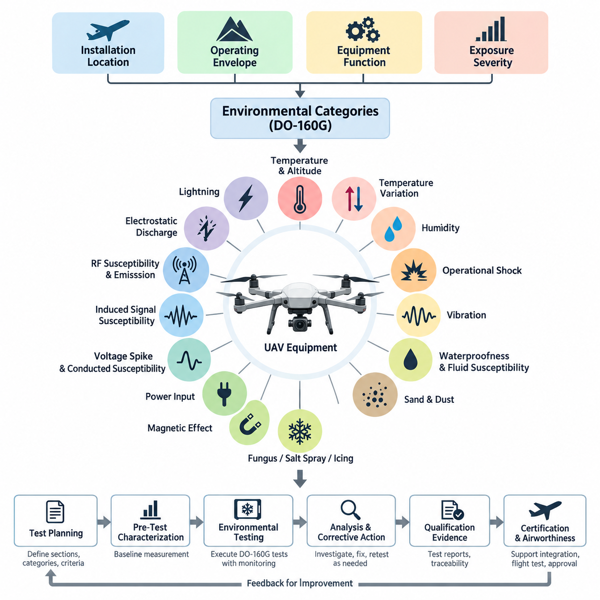
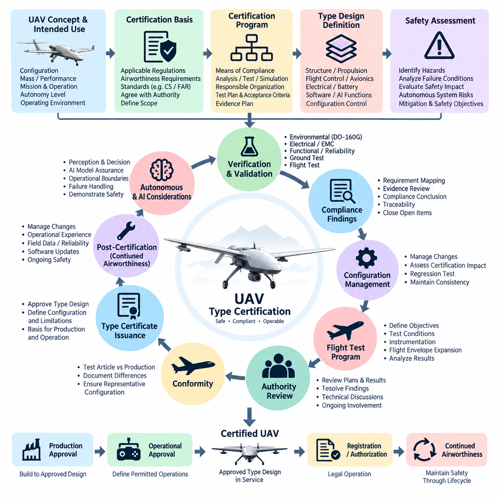
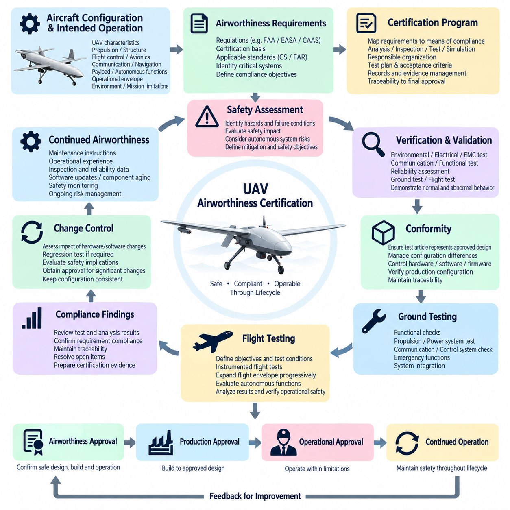
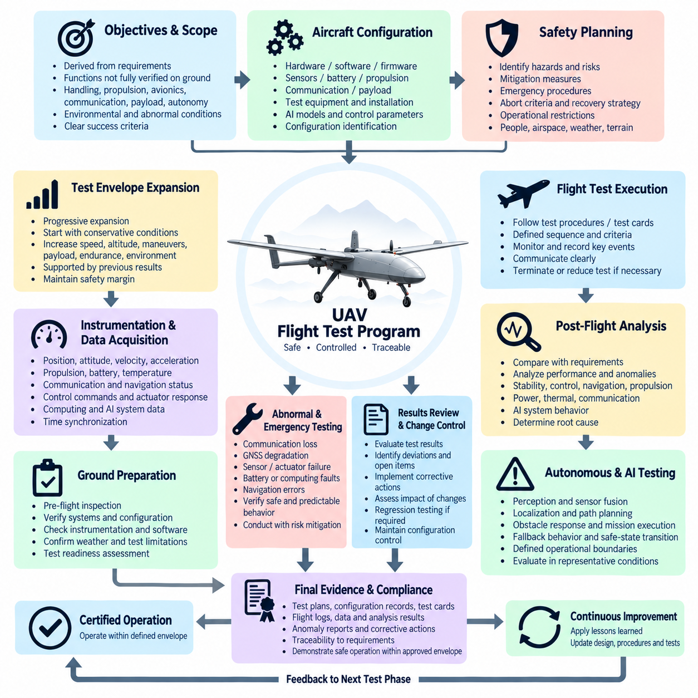
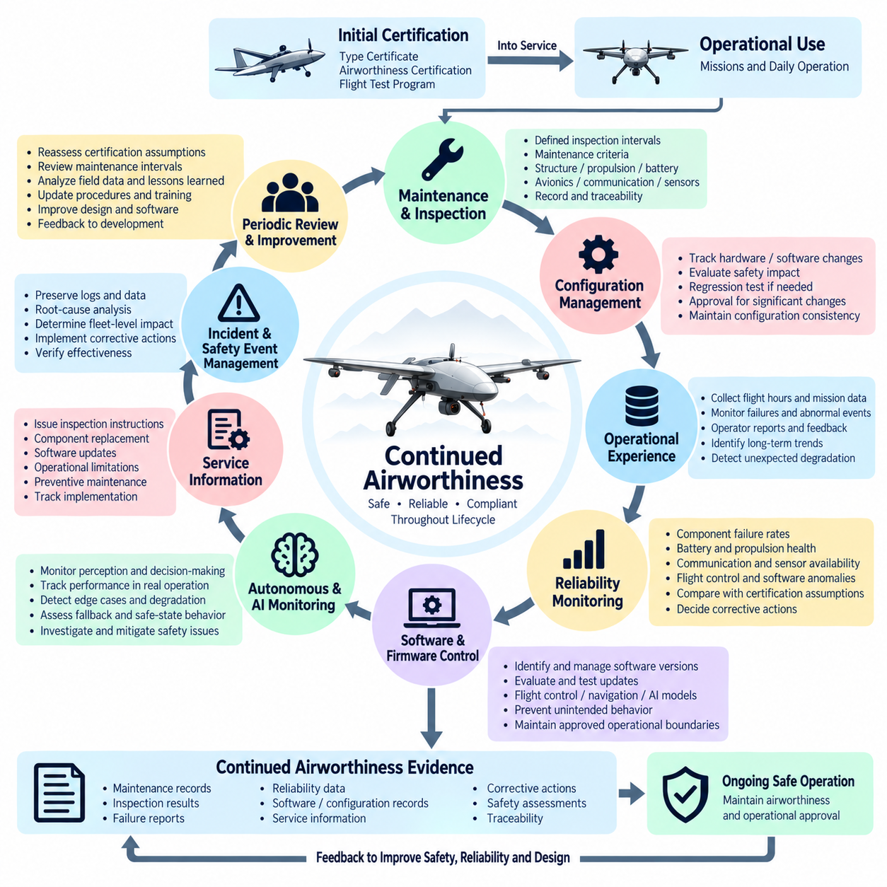

**Volume 19. Testing and Validation**

# Chapter 10. UAV Certification Test

## 10.01. DO-160G Environmental Test

{width="7.268055555555556in" height="7.268055555555556in"}

DO-160G 환경 시험(Environmental Testing)은 항공기 및 무인항공기(UAV) 운용 중 예상되는 환경 조건에서 탑재 전기·전자 장비가 안전하고 신뢰성 있게 작동할 수 있음을 입증하기 위한 체계적인 방법을 제공한다. 시험 프로그램은 장착 위치(Installation Location), 항공기 운용 범위(Aircraft Operating Envelope), 장비 기능(Equipment Function), 환경 노출 심각도(Exposure Severity)를 정의된 환경 범주(Environmental Category)와 적합성 입증 자료(Qualification Evidence)로 변환한다.

무인항공기 인증(UAV Certification)에서 DO-160G는 모든 구성품에 동일하게 적용되는 하나의 고정된 시험 절차(Test Sequence)로 취급해서는 안 된다. 적용할 시험 절(Section)과 범주(Category)는 장비의 설치 환경(Installation Environment)과 의도된 운용(Intended Operation)에 따라 선정된다. 따라서 보호된 동체 내부의 항공전자장비(Avionics), 외부 센서(External Sensor), 추진 전자장치(Propulsion Electronics), 배터리(Battery), 안테나(Antenna), 비행제어장비(Flight-Control Equipment)는 서로 다른 적합성 시험 프로파일(Qualification Profile)이 요구될 수 있다.

온도 및 고도 시험(Temperature and Altitude Testing)은 저장, 지상 운용, 상승, 순항, 하강 및 고고도 노출과 관련된 열적·압력 조건에서 장비의 거동을 평가한다. 시험에서는 규정된 온도 한계에서의 정상 작동, 극한 저장 조건에서의 생존성(Survival), 온도 변화 중의 성능을 검증해야 하며, 동시에 전기적 파라미터(Electrical Parameters), 통신 무결성(Communication Integrity), 센서 출력(Sensor Outputs), 프로세서 상태(Processor Status), 고장 대응(Fault Responses)을 감시해야 한다.

온도 변화 시험(Temperature Variation Testing)은 급격한 열적 변화로 인해 발생할 수 있는 기계적 응력(Mechanical Stress), 결로 관련 영향(Condensation-Related Effects), 치수 변화(Dimensional Changes), 전기적 불안정성(Electrical Instability)을 다룬다. 저온과 고온 사이의 반복적인 변화는 납땜 접합부(Solder Joints), 커넥터(Connectors), 인쇄회로기판(Printed Circuit Boards), 실링(Seals), 광학 어셈블리(Optical Assemblies), 센서 인터페이스(Sensor Interfaces)의 취약점을 드러낼 수 있다. 노출 중과 노출 후의 기능 감시(Functional Monitoring)를 통해 일시적인 드리프트(Temporary Drift)와 영구적인 성능 저하(Permanent Degradation)를 구분할 수 있다.

습도 시험(Humidity Testing)은 장시간의 수분 노출이 절연(Insulation), 커넥터, 회로기판, 코팅(Coatings), 센서 또는 기계적 인터페이스(Mechanical Interfaces)를 저하시킬 수 있는지를 평가한다. 무인항공기 장비는 야외 보관 및 공조 시설과 외부 환경 사이의 반복적인 이동 과정에서 큰 습도 변화를 경험할 수 있다. 따라서 노출 후 검사(Post-Exposure Inspection)에는 부식(Corrosion), 누설 전류(Leakage Current), 절연 성능 저하(Insulation Degradation), 통신 오류(Communication Faults), 비정상적인 센서 동작을 포함해야 한다.

운용 충격 및 충돌 안전 관련 평가(Operational Shock and Crash-Safety-Related Evaluation)는 취급, 착륙, 난기류, 비상 상황 또는 급격한 기체 운동 중 발생할 수 있는 기계적 하중(Mechanical Loads)을 다룬다. 시험 심각도(Test Severity)는 장비 범주와 설치 특성에 따라 결정해야 한다. 단순한 기계적 건전성(Mechanical Integrity)만으로는 충분하지 않으며, 중요 항공전자장비(Critical Avionics)는 순간적인 전원 손실, 커넥터 접촉 이상, 메모리 손상, 센서 신호 단절 및 의도하지 않은 재부팅(Unintended Reset)에 대해서도 평가해야 한다.

진동 시험(Vibration Testing)은 추진장치, 로터(Rotor), 모터, 기어 메커니즘, 공기역학적 가진(Aerodynamic Excitation), 구조 모드(Structural Modes)가 연속적인 광대역 진동(Broadband Vibration)과 특정 주파수 진동(Discrete-Frequency Vibration)을 발생시킬 수 있기 때문에 무인항공기 시스템에서 특히 중요하다. 적합성 시험 프로파일은 가능한 한 실제 장착 위치를 대표해야 한다. 기능 감시를 통해 간헐적 접촉 불량, 공진 민감성 고장(Resonance-Sensitive Failures), 광학계 정렬 불량, 관성측정장치(IMU) 교란 및 피로 관련 열화(Fatigue-Related Degradation)를 확인할 수 있다.

방수성 및 유체 민감성(Waterproofness and Fluid Susceptibility)은 장비가 비, 결로, 세척액, 유압 관련 물질, 연료 관련 유체, 윤활유 또는 기타 운용 화학물질에 노출될 수 있는 위치에 설치되는 경우 중요해진다. 적합성 시험에서는 즉각적인 기능 고장뿐만 아니라 환경 노출 이후 실링, 하우징(Housing), 케이블 외피(Cable Jacket), 라벨(Label), 접착제(Adhesive), 코팅, 커넥터 인터페이스 및 노출된 센싱 표면(Sensing Surface)의 지연성 열화(Delayed Deterioration)도 고려해야 한다.

모래 및 먼지 시험(Sand and Dust Testing)은 비포장 지역, 건설 현장, 사막, 항만, 산업 시설 또는 군사 환경에서 운용되는 무인항공기에 필요할 수 있다. 미세 입자는 인클로저(Enclosure) 내부로 침투하고 냉각 경로(Cooling Path)를 막으며, 광학 표면을 오염시키고 커넥터 마모를 증가시키며 기계적 메커니즘의 동작을 방해할 수 있다. 시험 계획은 단순히 최대 심각도를 적용하는 것이 아니라 선택된 노출 범주를 실제 배치 시나리오(Deployment Scenario)와 연결해야 한다.

곰팡이(Fungus), 염수 분무(Salt Spray), 결빙(Icing) 관련 고려사항은 무인항공기의 임무와 설치 환경에 크게 의존한다. 해양 운용(Maritime Operation)은 장비를 부식성 염분 환경에 노출시킬 수 있으며, 고온다습한 지역에서의 장기 운용은 생물학적 오염(Biological Contamination)의 위험을 증가시킬 수 있다. 차가운 구름, 강수 또는 결빙 조건에 노출되는 장비는 센서, 안테나, 환기구 및 움직이는 구성품에 대한 얼음 형성(Ice Formation)의 영향을 추가로 평가해야 할 수 있다.

자기 영향 시험(Magnetic Effect Testing)은 장비가 주변의 자기 나침반(Magnetic Compass) 또는 기타 자기 민감 장치(Magnetically Sensitive Device)를 방해할 수 있는 자기장을 발생시키는지 평가한다. 이러한 고려사항은 무인항공기 항법 아키텍처(Navigation Architecture)가 통합 GNSS, 관성측정장치(IMU), 방위 추정(Heading Solution)의 일부로 자력계(Magnetometer)를 사용하는 경우에도 중요하다. 따라서 대전류 전력 분배, 모터, 컨버터(Converter), 접촉기(Contactor), 자기 부품(Magnetic Components)을 고려하여 설치 이격거리(Installation Separation)와 적합성 조건을 정의해야 한다.

전원 입력 시험(Power Input Testing)은 항공기 전기 공급원을 대표하는 전압 및 주파수 조건에서 장비의 동작을 검증한다. 무인항공기 전력망(Power Network)은 기동 과도현상(Startup Transients), 배터리 전압 변화, 컨버터 스위칭, 회생 효과(Regenerative Effects), 추진 부하 변화 및 전원 전환(Source Transition)을 경험할 수 있다. 적합성 시험은 항공전자장비가 정의된 운용 상태를 유지하거나 데이터 손상 또는 제어되지 않은 출력 없이 예측 가능한 안전 상태(Safe State)로 전환되는지를 확인해야 한다.

전압 스파이크 및 가청 주파수 전도성 감응 시험(Voltage Spike and Audio-Frequency Conducted Susceptibility Testing)은 전원 인터페이스를 통해 결합되는 전기적 교란(Electrical Disturbances)을 평가한다. 스위칭 컨버터, 모터 드라이브, 액추에이터(Actuator), 펌프, 릴레이 및 대전류 추진 시스템은 소형 무인항공기 플랫폼에서 까다로운 전기적 환경을 만들 수 있다. 시험에서는 이러한 교란이 프로세서 재부팅, 잘못된 센서 정보, 통신 오류, 비정상 액추에이터 명령 또는 안전 중요 기능(Safety-Critical Function)의 성능 저하를 발생시키지 않는지 검증해야 한다.

유도 신호 감응 시험(Induced Signal Susceptibility Testing)은 장비 및 연결 배선이 인접 회로로부터 결합되는 전자기 신호(Electromagnetic Signal)를 견딜 수 있는 능력을 평가한다. 하네스 라우팅(Harness Routing), 차폐(Shielding), 접지(Grounding), 케이블 분리(Cable Separation), 인터페이스 설계가 감응성에 직접적인 영향을 미친다. 따라서 가능한 경우 실제 항공기 수준의 동작을 대표할 수 있도록 실제와 유사한 케이블 어셈블리와 접지 구성을 사용하여 시험해야 한다.

무선주파수 감응 및 방출 시험(Radio-Frequency Susceptibility and Emission Testing)은 무선장치, 텔레메트리 링크(Telemetry Link), GNSS 수신기, 페이로드 송신기(Payload Transmitter), 프로세서, 고속 네트워크 및 전력전자장치가 만드는 복잡한 전자기 환경과 항공전자장비 사이의 상호작용을 다룬다. 적합성 시험은 예상되는 무선주파수장(RF Field)에 대한 내성과 함께 항법, 통신, 지휘·통제(Command-and-Control) 또는 다른 항공기 시스템을 방해할 수 있는 방출(Emission)이 적절하게 제어됨을 입증해야 한다.

정전기 방전 시험(Electrostatic Discharge Testing)은 작업자 취급, 정비, 공기 흐름, 재료 및 노출 인터페이스에서 발생하는 전하 축적과 방전 사건에 대한 장비의 반응을 평가한다. 시험에서는 일시적인 교란뿐만 아니라 영구적인 손상도 확인해야 한다. 비행 중요 전자장비(Flight-Critical Electronics)의 합격 기준(Acceptance Criteria)은 의도하지 않은 재부팅, 설정 정보 손상, 통신 손실, 잘못된 명령 생성 및 방전 이후의 복구 동작(Recovery Behavior)을 명확히 다루어야 한다.

낙뢰 관련 시험(Lightning-Related Testing)은 무인항공기 플랫폼의 크기, 재질, 운용 고도, 임무 프로파일, 설치 위치 및 인증 기준(Certification Basis)에 따라 노출 특성이 달라지므로 적용성 분석(Applicability Analysis)이 중요하다. 적용되는 경우 간접 낙뢰 영향 시험(Indirect Lightning Effects Testing)은 장비 배선에 유도되는 과도 전압과 전류를 평가한다. 보호 아키텍처(Protection Architecture)는 차폐, 본딩(Bonding), 과도전압 억제(Transient Suppression), 접지, 절연(Isolation), 제어된 케이블 라우팅을 조합하여 구성할 수 있다.

결빙 및 기타 특수 DO-160G 시험 항목은 모든 장비에 일률적으로 적용한다고 가정하기보다 문서화된 환경 적합성 분석(Environmental Qualification Analysis)을 통해 선정해야 한다. 분석에서는 각 장비를 설치 구역(Installation Zone), 환경 노출(Environmental Exposure), 안전 중요도(Safety Significance), 요구 범주(Required Category)에 연결해야 한다. 이를 통해 무인항공기 운용 요구사항, 항공기 아키텍처, 장비 적합성 수준 및 최종 인증 증거(Certification Evidence) 사이에 추적 가능한 관계를 구축할 수 있다.

실질적인 적합성 시험 프로그램(Qualification Program)은 환경 적합성 양식(Environmental Qualification Form) 또는 이에 상응하는 적합성 매트릭스(Compliance Matrix)를 작성하는 것에서 시작하며, 여기에는 적용되는 DO-160G 절과 범주, 장비 구성, 시험 순서, 합격 기준 및 필요한 기록이 정의된다. 인클로저 설계, PCB 레이아웃, 커넥터, 전원 아키텍처, 펌웨어(Firmware), 냉각 및 하네스 인터페이스의 변경은 기존에 입증된 적합성에 영향을 줄 수 있으므로 시험 대상 하드웨어 및 소프트웨어 구성은 엄격하게 관리해야 한다.

시험 전 특성화(Pre-Test Characterization)는 이후 비교를 위한 기준선(Baseline)을 설정한다. 환경 노출 전에 전력 소비, 통신 성능, 센서 정확도, 프로세싱 상태, 열적 거동, 절연 특성, 진단 정보 및 안전 관련 기능을 기록해야 한다. 시험 중 환경 조건과 장비 텔레메트리(Telemetry)를 동기화하여 수집하면 특정 스트레스 수준과 환경 변화에 이상 현상(Anomaly)을 연계하여 분석할 수 있다.

적합성 시험에서 발견된 고장은 단순히 실패한 시험을 반복하기보다 체계적인 근본 원인 분석(Root-Cause Analysis)을 통해 조사해야 한다. 시정 조치(Corrective Action)는 기계적 보강, 실링 개선, 부품 교체, PCB 수정, 필터링(Filtering), 차폐, 접지, 소프트웨어 복구 로직(Software Recovery Logic), 열관리(Thermal Management), 하네스 재설계 등을 포함할 수 있다. 각각의 변경이 미치는 영향에 따라 제한적인 회귀 시험(Regression Testing) 또는 보다 광범위한 재적합성 시험(Requalification)이 필요한지를 결정해야 한다.

자율 무인항공기(Autonomous UAV)의 경우 환경 적합성 시험은 기존 항공전자장비와 피지컬 AI(Physical AI) 기능 사이의 상호작용도 고려해야 한다. 환경 스트레스는 카메라 영상, 라이다(LiDAR) 측정, IMU 바이어스(Bias), GNSS 수신, 컴퓨팅 성능, 네트워크 타이밍(Network Timing), AI 가속기 온도에 영향을 줄 수 있다. 구성품이 전기적으로 정상 작동하더라도 인지(Perception) 또는 타이밍 성능 저하가 시스템 수준에서 허용할 수 없는 동작을 발생시킬 수 있으므로 기능 감시가 필수적이다.

최종 적합성 입증 자료(Qualification Evidence)는 승인된 시험 절차, 교정된 계측기 기록(Calibrated Instrumentation Records), 구성 식별(Configuration Identification), 환경 프로파일, 측정된 응답, 이상 보고서(Anomaly Reports), 시정 조치, 필요한 경우 사진 자료 및 공식 시험 결과를 통합해야 한다. 추적성(Traceability)은 각 적합성 시험 결과를 해당 장비 요구사항과 인증 목표(Certification Objective)에 연결하여 검토자가 어떤 구성이 어떠한 조건에서 시험되었는지를 정확하게 확인할 수 있도록 해야 한다.

DO-160G 적합성 시험(DO-160G Qualification)은 그 자체만으로 항공기 전체의 감항성(Airworthiness)을 입증하는 것이 아니라 보다 광범위한 무인항공기 검증 및 인증 체계(UAV Verification and Certification Framework) 내에서 환경 적합성 증거를 제공한다. 가장 중요한 가치는 체계적인 범주 선정, 실제 설치 환경을 대표하는 시험 조건, 통제된 구성, 측정 가능한 합격 기준 및 추적 가능한 증거에 있으며, 이러한 원칙을 통해 환경 시험 결과를 후속 항공기 통합, 비행 시험(Flight Testing), 인증(Certification) 및 지속 감항성(Continued Airworthiness) 활동으로 연결할 수 있다.

## 10.02. Type Certificate Process

{width="7.268055555555556in" height="7.268055555555556in"}

형식증명(Type Certificate, TC) 절차는 완성된 항공기 설계가 적용 가능한 감항성(airworthiness) 요구사항을 충족하며, 승인된 설계 정의(approved design definition)에 따라 생산되고 운용될 수 있음을 확립하는 과정이다. 무인항공기(UAV)의 경우 이 과정은 항공기 개념, 의도된 임무, 운용 범위, 시스템 아키텍처, 안전 목표, 검증 활동 및 인증 증거를 하나의 통제된 체계로 연결한다. 목적은 단순히 개별 시험을 통과하는 것이 아니라, 전체 형식 설계(type design)가 적용 가능한 인증 기준을 일관되게 충족한다는 것을 입증하는 것이다.

이 과정은 항공기와 의도된 사용 목적을 정의하는 것에서 시작한다. 신청자는 UAV 구성, 최대 중량, 추진 시스템, 비행 영역, 운용 고도, 속도, 환경 조건, 임무 기능, 자율화 수준, 제어 아키텍처 및 의도된 운용 제한을 설정한다. 이러한 특성은 어떤 규제 요구사항과 인증 표준이 적용되는지를 결정한다. 인증 범위는 초기 단계에서 설정해야 하며, 항공기 개념의 늦은 변경은 필요한 분석, 시험, 문서화 및 인증 일정에 상당한 영향을 줄 수 있다.

인증 기준(Certification Basis)은 항공기를 평가하기 위한 기술적 요구사항을 정의한다. 이는 적합성 입증(Compliance Demonstration)을 위한 기준 체계를 제공하며, 해당 인증기관 또는 관련 규제기관과 합의되어야 한다. 인증 기준에는 구조 요구사항, 비행 특성, 추진 시스템, 전기 시스템, 항공전자장비, 소프트웨어, 환경 적합성, 전자기 적합성(EMC), 장비 안전성, 통신, 항법 및 운용 관련 사항 등이 포함될 수 있다. 최종 인증 기준은 항공기 구성 및 의도된 운용 조건과 추적 가능하도록 유지되어야 한다.

이후 신청자는 각 요구사항을 적절한 적합성 입증 방법(Means of Compliance)에 연결하는 인증 프로그램(Certification Program)을 수립한다. 요구사항의 특성에 따라 분석(Analysis), 검사(Inspection), 실험실 시험(Laboratory Testing), 지상 시험(Ground Testing), 시뮬레이션(Simulation), 비행 시험(Flight Testing), 유사성(Similarity) 또는 이들의 조합으로 적합성을 입증할 수 있다. 인증 프로그램에는 담당 조직, 시험 구성, 필요한 계측 장비, 합격 기준, 증거 자료 형식 및 승인 상태가 정의되어야 한다. 이를 통해 각 규제 요구사항에서 객관적인 인증 증거로 이어지는 통제된 경로를 구축할 수 있다.

최종 적합성 입증을 수행하기 전에 형식 설계(Type Design)가 충분히 정의되어야 한다. 주요 구조 부품, 추진 시스템, 비행제어 시스템, 전력 분배, 배터리, 항공전자장비, 통신 시스템, 항법 장비, 센서, 컴퓨팅 플랫폼, 소프트웨어 및 안전 관련 기능은 관리되는 사양과 구성 식별(Configuration Identification)을 가져야 한다. 자율 UAV의 경우 이러한 구성 관리는 관련 소프트웨어, AI 모델, 파라미터, 펌웨어, 필요한 경우 데이터셋 및 인증된 항공기 동작에 영향을 미치는 운용 로직까지 포함해야 한다.

안전성 평가(Safety Assessment)는 인증 과정의 중요한 기반을 제공한다. 항공기 수준의 위험요소(Hazard)를 식별하고 비행 및 운용 안전에 미칠 수 있는 잠재적 영향을 평가한다. 추진, 비행제어, 전원, 통신, 항법, 센싱, 컴퓨팅 및 인간 상호작용 기능 전반에 걸쳐 고장 조건(Failure Condition)을 분석한다. 자율 시스템에서는 하드웨어 고장뿐만 아니라 인지 성능 저하(Degraded Perception), 잘못된 의사결정 로직, 통신 손실, 타이밍 오류, 센서 불일치 또는 소프트웨어 기능 간 예기치 않은 상호작용으로 인해 문제가 발생할 수 있으므로 특별한 주의가 필요하다.

이후 검증 및 확인 활동(Verification and Validation Activities)을 통해 형식 설계가 요구사항을 충족한다는 객관적인 증거를 확보한다. 환경 적합성 시험에는 DO-160G 시험이 포함될 수 있으며, 전기, 통신, 기능, 신뢰성 및 안전성 시험도 추가적인 증거를 제공한다. 지상 시험은 비행 전에 시스템 동작을 검증하고, 비행 시험은 대표적인 운용 조건에서 통합 항공기의 성능을 평가한다. 시험 대상, 계측 장비, 소프트웨어 버전, 절차, 결과, 이상 현상(Anomaly) 및 시정 조치(Corrective Action)는 인증 프로그램 전체에서 구성 관리(Configuration Control)되어야 한다.

적합성 판정(Compliance Finding)은 수집된 증거를 기반으로 작성된다. 각 판정에는 관련 요구사항, 선택된 적합성 입증 방법, 시험 또는 분석 대상 구성, 확보된 증거 및 적합성에 대한 결론이 명확하게 식별되어야 한다. 추적성(Traceability)은 필수적이다. 인증기관은 각 적용 요구사항이 어떻게 처리되었는지 확인할 수 있어야 하기 때문이다. 충분한 증거가 없는 요구사항은 항공기가 성공적으로 운용되는 것처럼 보이더라도 여전히 미해결 인증 항목(Open Certification Item)으로 남는다.

인증이 진행될수록 구성 관리(Configuration Management)는 더욱 중요해진다. 하드웨어, 소프트웨어, 펌웨어, 배선, 센서, 추진 구성품, 구조 부품 및 AI 관련 기능은 개발 과정에서 변경될 수 있다. 각 변경사항은 인증에 미치는 영향을 평가해야 한다. 경미한 엔지니어링 변경은 제한적인 회귀 시험(Regression Testing)만 필요할 수 있지만, 안전성, 성능, 구조 건전성, 비행제어 또는 인증 대상 소프트웨어에 영향을 주는 변경은 추가 분석이나 공식적인 재적합성 시험(Requalification)을 요구할 수 있다. 목적은 인증된 구성이 실제 생산되고 운용되는 구성과 일치하도록 유지하는 것이다.

비행 시험 준비(Flight-Test Preparation)는 필요한 지상 검증과 안전성 활동이 성공적으로 완료된 후 진행된다. 비행 시험 프로그램은 시험 목적, 항공기 구성, 계측 장비, 시험 조건, 시험 카드(Test Card), 운용 제한, 비상 절차 및 데이터 수집 요구사항을 정의한다. 초기 비행은 일반적으로 통제되고 보수적인 조건에서 수행한 후 점진적으로 운용 범위를 확대해야 한다. 비행 시험 결과는 실험실이나 지상 시험만으로 완전히 입증할 수 없는 특성과 기능에 대한 증거를 제공한다.

인증기관(Certification Authority)의 참여는 최종 제출 단계에만 한정되지 않고 전체 과정에서 유지된다. 검토 대상에는 인증 기준, 인증 프로그램, 시험 계획, 안전성 평가, 엔지니어링 분석, 적합성(Conformity), 시험 결과 및 미해결 판정 등이 포함될 수 있다. 따라서 신청자는 인증기관이 각 요구사항의 상태를 검토하고 각각의 적합성 결론을 뒷받침하는 기술적 근거를 이해할 수 있도록 명확한 증거 구조(Evidence Structure)를 유지해야 한다.

적합성(Conformity)은 형식증명 과정의 또 다른 핵심 요소이다. 인증 시험에 사용되는 하드웨어는 승인된 형식 설계(Approved Type Design)를 대표해야 하며, 시험 대상과 생산 구성 사이의 관계가 통제되어야 한다. 프로토타입(Prototype), 엔지니어링 시험품(Engineering Test Article), 인증 시험품(Certification Article) 및 생산 항공기 사이의 차이는 문서화하고 평가해야 한다. 적절한 적합성이 확보되지 않으면 시험 자체가 성공적으로 완료되었더라도 최종 인증 구성에 충분한 증거를 제공하지 못할 수 있다.

적용 가능한 모든 적합성 활동이 완료되고 미해결 판정이 해결되며 인증기관이 제출된 증거를 수용하면 신청자는 형식증명서(Type Certificate) 발급 단계로 진행할 수 있다. 이 승인은 승인된 형식 설계(Approved Type Design)를 확립하고 항공기가 적합한 것으로 간주되는 구성과 운용 제한을 정의한다. UAV의 경우 이는 이후 생산 승인(Production Approval), 운용 승인(Operational Approval), 항공기 등록 또는 운용 허가 절차 및 해당되는 지속 감항성(Continued Airworthiness) 활동을 위한 기술적 기반을 제공한다.

형식증명은 증서가 발급되는 순간 종료되지 않는다. 항공기 형식 설계에 대한 변경은 변경의 중요도에 따라 승인된 설계 변경(Approved Design Change), 보충 승인(Supplemental Approval), 수정된 인증 증거 또는 추가 시험을 요구할 수 있다. 운용 경험, 현장 고장, 신뢰성 데이터, 소프트웨어 업데이트, 사이버보안(Cybersecurity) 고려사항 및 안전 사건(Safety Event) 역시 조사 또는 시정 조치를 위한 새로운 요구사항을 발생시킬 수 있다. 따라서 인증된 제품의 전체 수명주기(Product Lifecycle) 동안 지속적인 구성 관리가 필수적이다.

자율 및 피지컬 AI(Physical AI) UAV의 경우 형식증명 과정은 기존 항공우주 인증과 소프트웨어 중심 시스템 보증(Software-Intensive System Assurance)을 점점 더 긴밀하게 연결해야 한다. 인지 모델(Perception Model), AI 지원 의사결정 기능, 적응형 알고리즘(Adaptive Algorithm), 고성능 컴퓨팅 플랫폼, 센서 융합(Sensor Fusion), 자율 임무 관리(Autonomous Mission Management)는 전통적인 하드웨어 중심 검증 방법만으로는 명확하게 다루기 어려운 방식으로 항공기 동작에 영향을 줄 수 있다. 따라서 이러한 기능에는 명확하게 정의된 운용 경계(Operational Boundary), 통제된 구성, 측정 가능한 성능 기준, 강건한 고장 처리(Failure Handling) 및 통합 항공기에 대한 안전성 주장을 뒷받침할 수 있는 증거가 필요하다.

전체 형식증명 과정은 항공기 정의(Aircraft Definition)에서 인증 기준, 적합성 계획, 통제된 형식 설계, 안전성 평가, 검증, 적합성, 지상 시험, 비행 시험, 적합성 판정, 인증기관 검토 및 최종 승인으로 이어지는 연속적인 체계로 볼 수 있다. 인증 사례(Certification Case)의 강도는 이 연결 관계가 얼마나 일관되게 유지되는가에 달려 있다. 따라서 성공적인 UAV 인증 프로그램은 단순히 시험을 통과한 결과의 집합이 아니라, 정의된 항공기 형식이 의도된 운용 범위 전체에서 적용 가능한 요구사항을 충족한다는 것을 입증하는 추적 가능한 엔지니어링 논증(Traceable Engineering Argument)이라고 할 수 있다.

## 10.03. Airworthiness Certification

{width="7.268055555555556in" height="7.268055555555556in"}

감항성 인증(Airworthiness Certification)은 항공기가 승인된 운용 제한 범위 내에서 안전하게 운용될 수 있도록 설계되고, 제작되며, 시험되고, 유지관리된다는 것을 확립하는 과정이다. UAV의 경우 이 과정은 승인된 형식 설계(Approved Type Design)를 실제 항공기 구성, 운용 조건, 안전 요구사항, 검증 증거 및 규제 감독(Regulatory Oversight)과 연결한다. 따라서 감항성은 개별 시험을 통과하는 것보다 더 광범위한 개념이며, 전체 항공기가 의도된 기능을 수행하면서 허용할 수 없는 안전 위험을 발생시키지 않는다는 일관된 증거를 요구한다.

이 과정은 항공기 구성과 의도된 운용 범위(Operational Envelope)를 정의하는 것에서 시작한다. UAV의 특성, 추진 시스템, 구조, 비행제어 아키텍처, 전기 전원 시스템, 항공전자장비, 통신 및 항법 기능, 페이로드, 자율 기능, 운용 고도, 속도, 환경 조건 및 임무 제한사항을 명확하게 설정해야 한다. 이러한 정의는 적용 가능한 감항성 요구사항을 결정하고 안전 비행에 중요한 시스템과 기능을 식별하기 위한 기반을 제공한다.

감항성 인증 프로그램(Airworthiness Certification Program)은 적합성을 어떻게 입증하고 유지할 것인지를 수립한다. 요구사항은 분석(Analysis), 검사(Inspection), 실험실 시험(Laboratory Testing), 지상 시험(Ground Testing), 시뮬레이션(Simulation), 비행 시험(Flight Testing)과 같은 적절한 방법에 연결된다. 프로그램에는 담당 조직, 시험 구성, 합격 기준, 필요한 기록 및 증거 상태가 정의되어야 한다. 이러한 구조는 규제 요구사항에서 엔지니어링 활동을 거쳐 최종 감항성 판단을 뒷받침하는 객관적인 증거까지 추적성(Traceability)을 제공한다.

항공기 안전성 평가(Aircraft Safety Assessment)는 감항성 인증의 핵심 요소이다. 추진, 비행제어, 전력 분배, 배터리, 통신, 항법, 센서, 컴퓨팅 및 운용 인터페이스 전반에서 발생할 수 있는 잠재적 위험(Hazard)과 고장 조건(Failure Condition)을 식별한다. 각각의 고장 및 복합적인 고장이 안전 비행에 미치는 영향을 평가한다. 자율 UAV의 경우 인지 성능 저하(Degraded Perception), 센서 불일치(Sensor Disagreement), 항법 상실, 소프트웨어 고장, 타이밍 오류, 통신 중단 및 예기치 않은 자율 동작도 함께 고려해야 한다.

검증 및 확인(Verification and Validation)은 항공기가 대표적인 조건에서 정의된 요구사항을 충족한다는 것을 입증한다. 환경 시험(Environmental Testing), 전기 시험(Electrical Testing), EMC 평가, 통신 시험, 기능 시험, 신뢰성 평가, 지상 시험 및 비행 시험은 서로 보완적인 증거를 제공한다. 시험 절차와 구성은 통제되어야 하며, 측정 결과, 이상 현상(Anomaly), 시정 조치(Corrective Action) 및 최종 결론은 해당 요구사항과 추적 가능해야 한다. 시험은 정상적인 동작뿐만 아니라 정의된 비정상 조건에서 적절하게 동작하는 것도 입증해야 한다.

적합성(Conformity)은 인증 증거를 생성하는 데 사용된 항공기 또는 장비가 실제 승인 대상 운용 구성(Approved Operational Configuration)을 대표한다는 것을 보장한다. 개발 하드웨어, 시험품(Test Article), 인증 시험품(Certification Article) 및 생산 항공기 사이의 차이를 식별하고 평가해야 한다. 구성 관리(Configuration Control)는 기계 부품, 전기 시스템, 배선, 센서, 항공전자장비, 소프트웨어, 펌웨어 및 관련 자율 기능까지 포함해야 한다. 적절한 적합성이 확보되지 않으면 성공적인 시험 결과라도 최종 항공기 구성에 유효한 증거로 사용되지 못할 수 있다.

지상 시험(Ground Testing)은 엔지니어링 개발과 비행 검증 사이를 연결하는 중요한 단계이다. 기능 점검, 추진 시스템 시험, 전원 시스템 검증, 통신 시험, 제어 시스템 점검, 비상 기능 및 시스템 통합 활동은 비행 범위를 확대하기 전에 완료되어야 한다. 지상 시험은 비행 중에 나타날 수 있는 통합 문제를 사전에 발견하여 위험을 줄이고, 통제된 비행 시험 활동을 시작할 준비가 되었음을 보여주는 객관적인 증거를 제공한다.

비행 시험(Flight Testing)은 실제 또는 대표적인 운용 조건에서 항공기의 동작을 평가한다. 비행 시험 프로그램에는 시험 목적, 항공기 구성, 계측 장비, 시험 조건, 운용 제한, 비상 절차, 데이터 수집 및 비행 영역 확대 기준이 정의되어야 한다. 초기 비행은 보수적인 조건에서 수행한 후 속도, 고도, 기동, 페이로드, 환경 노출, 자율 기능 및 비정상 조건에 대한 평가를 단계적으로 확대해야 한다. 비행 시험 증거는 항공기 특성과 운용 안전성에 대한 최종 평가를 뒷받침한다.

자율 및 피지컬 AI(Physical AI) 기능을 포함하는 UAV의 경우 감항성 평가는 기존의 기계 및 항공전자장비 고려사항을 넘어 확장되어야 한다. 인지 시스템(Perception System), 센서 융합(Sensor Fusion), AI 지원 의사결정, 임무 계획, 자율 항법, 고성능 컴퓨팅 및 적응형 소프트웨어(Adaptive Software)는 항공기의 동작에 직접적인 영향을 줄 수 있다. 따라서 이러한 기능의 운용 경계(Operational Boundary), 성능 제한, 고장 대응(Failure Response), 업데이트 제어(Update Control) 및 안전 중요 시스템(Safety-Critical System)과의 상호작용을 명확하게 정의하고 전체 감항성 사례(Airworthiness Case)의 일부로 검증해야 한다.

감항성은 지속적인 변경 관리(Continuing Change Control)도 요구한다. 하드웨어 교체, 소프트웨어 업데이트, 펌웨어 변경, 센서 교체, 배터리 변경, 구조 수정 및 알고리즘 업데이트는 기존에 입증된 적합성에 영향을 줄 수 있다. 각각의 변경사항은 안전성과 인증 상태에 미치는 잠재적 영향을 평가해야 한다. 변경의 중요도에 따라 추가 분석, 회귀 시험(Regression Testing), 적합성 검사 또는 공식적인 승인이 필요할 수 있으며, 수정된 구성이 다시 운용에 투입되기 전에 이러한 절차가 완료되어야 한다.

최종 감항성 증거(Airworthiness Evidence)는 승인된 설계 정보, 적합성 기록, 안전성 평가, 적합성 결과, 시험 보고서, 비행 시험 데이터, 운용 제한사항, 정비 요구사항 및 미해결 항목 상태를 통합한다. 이러한 증거를 통해 담당 기관 또는 조직은 항공기가 적용 가능한 요구사항을 충족하고 승인된 운용 범위 내에서 안전하게 운용될 수 있는지를 판단할 수 있어야 한다. 명확한 추적성은 필수적이며, 감항성은 궁극적으로 개별 시험 결과가 아니라 방어 가능한 엔지니어링 및 안전성 논증(Engineering and Safety Case)에 기반하기 때문이다.

승인 이후에는 지속 감항성(Continued Airworthiness)을 통해 인증 과정에서 입증된 안전 상태를 항공기 수명주기 전체에 걸쳐 유지한다. 운용 경험, 검사 결과, 신뢰성 데이터, 사고 및 사건(Incident), 소프트웨어 변경, 구성품 노화(Component Aging), 환경 노출 및 새롭게 발견된 위험은 시정 조치 또는 추가 평가를 요구할 수 있다. 따라서 정비 지침(Maintenance Instructions), 구성 기록, 서비스 정보(Service Information), 소프트웨어 관리 절차 및 안전성 모니터링은 지속 감항성 체계의 일부가 된다.

UAV의 감항성 인증(Airworthiness Certification)은 항공기 정의, 요구사항, 안전성 평가, 통제된 설계, 적합성, 검증, 지상 시험, 비행 시험, 인증 증거, 운용 제한 및 지속적인 모니터링을 연결하는 지속적인 수명주기 프로세스(Lifecycle Process)로 이해할 수 있다. 최종 목표는 단순히 승인 문서를 획득하는 것이 아니라, UAV가 명확하게 정의된 운용 경계 내에서 의도된 임무를 안전하게 수행할 수 있다는 정당화된 신뢰(Justified Confidence)를 확립하고 유지하는 것이다. 이러한 수명주기 접근법은 UAV가 고도의 자율화 및 피지컬 AI 기반 항공기로 발전할수록 더욱 중요해진다.

## 10.04. Flight Test Program

{width="7.268055555555556in" height="7.268055555555556in"}

UAV 비행 시험 프로그램(Flight Test Program)은 항공기가 승인된 비행 영역(Flight Envelope) 전체에서 의도된 기능을 안전하게 수행할 수 있음을 입증하기 위한 통제된 프로세스를 제공한다. 이 프로그램은 항공기 구성, 인증 요구사항, 안전성 평가, 시험 목적, 계측 장비, 운용 제한, 비행 절차, 데이터 수집 및 최종 적합성 증거를 서로 연결한다. 비행 시험은 단순한 시범 비행의 연속이 아니라 엔지니어링 및 인증 활동으로 다루어야 하며, 각각의 비행은 명확한 기술적 질문에 답하고 추적 가능한 증거를 생성하도록 설계되어야 한다.

프로그램은 비행 시험의 목적과 범위를 설정하는 것에서 시작한다. 시험 목적은 항공기 요구사항, 인증 기준, 안전성 평가, 시스템 사양 및 실험실이나 지상 시험만으로 완전히 검증할 수 없는 기능에서 도출되어야 한다. 범위에는 기본적인 항공기 조종성, 추진 성능, 전기적 거동, 항법, 통신, 제어 응답, 페이로드 운용, 자율 기능, 환경 성능 및 비정상 또는 비상 조건이 포함될 수 있다. 각각의 목적에는 명확하게 정의된 성공 기준(Success Criteria)이 있어야 한다.

비행 시험을 시작하기 전에 항공기 구성 관리(Configuration Control)가 필수적으로 이루어져야 한다. 시험 항공기는 하드웨어, 소프트웨어, 펌웨어, 센서, 배터리, 추진 시스템, 통신 시스템 및 페이로드 구성이 명확하게 식별되어야 한다. 임시 계측 장비나 시험 장비 역시 문서화해야 한다. 자율 UAV의 경우 소프트웨어 버전, AI 모델, 파라미터, 임무 로직, 인지 모듈 및 제어 알고리즘이 비행 거동에 영향을 줄 수 있으므로 구성 식별(Configuration Identification)이 필요하다. 비행 시험 결과는 시험된 구성을 명확하게 알고 통제할 수 있을 때만 의미 있는 결과가 된다.

안전 계획(Safety Planning)은 비행 시험을 수행할 수 있는 조건을 설정한다. 추진 시스템, 비행제어, 배터리 시스템, 통신 손실, 항법 고장, 센서 성능 저하, 소프트웨어 고장, 자율 의사결정 오류, 기상, 지형, 사람 및 주변 공역과 관련된 위험요소(Hazard)를 각 시험 단계 전에 평가해야 한다. 적절한 위험 저감 조치, 비상 절차, 중단 기준(Abort Criteria), 회수 전략 및 운용 제한을 설정해야 한다. 목적은 엔지니어링 시험이 통제되지 않은 비행 또는 지상 안전사고를 발생시키는 것을 방지하는 것이다.

비행 시험 영역(Flight-Test Envelope)은 초기 비행에서 최대 조건을 바로 탐색하기보다는 일반적으로 단계적으로 확대해야 한다. 초기 시험에서는 보수적인 조건에서 기본 조종성, 추진 응답, 안정성, 통신 무결성 및 항법 성능을 확인할 수 있다. 이후 시험에서는 속도, 고도, 기동 범위, 페이로드, 비행 지속시간, 환경 노출 및 자율 기능을 점진적으로 증가시킬 수 있다. 각각의 확대는 이전 시험에서 확보된 증거를 기반으로 이루어져야 하며, 항공기가 더 까다로운 조건에 진입하기 전에 충분한 안전 여유(Safety Margin)가 확보되어야 한다.

계측 및 데이터 수집(Instrumentation and Data Acquisition)은 비행 시험 분석의 정량적 기반을 제공한다. 센서와 측정 시스템은 각 시험 목적에 적합한 위치, 자세, 속도, 가속도, 추진 변수, 배터리 전압과 전류, 온도, 통신 상태, 항법 품질, 제어 명령, 액추에이터 응답 및 컴퓨팅 성능 등의 파라미터를 수집해야 한다. 자율 UAV에서는 시간 동기화(Time Synchronization)가 특히 중요하다. 이상적인 과도 응답이나 비정상 이벤트를 분석하기 위해서는 센서, 제어, 통신 및 AI 이벤트 사이의 시간 관계를 정확하게 연계해야 하기 때문이다.

각 비행 시퀀스 전에 지상 준비(Ground Preparation)가 완료되어야 한다. 비행 전 점검(Pre-Flight Inspection)은 구조 상태, 추진 구성품, 배터리, 배선, 커넥터, 항공전자장비, 센서, 통신 링크, 소프트웨어 구성, 임무 파라미터 및 안전 기능을 확인해야 한다. 계측 장비는 점검하고 동기화해야 하며, 기상 및 운용 조건이 승인된 시험 제한사항에 부합하는지도 확인해야 한다. 공식적인 시험 준비 상태 평가(Test Readiness Assessment)를 통해 이전 비행에서 해결되지 않은 문제가 다음 시험 단계에 의도하지 않게 포함되지 않도록 해야 한다.

비행 시험 수행(Flight-Test Execution)은 의도된 순서, 예상 동작, 측정 요구사항 및 판단 기준을 정의한 승인된 시험 절차 또는 시험 카드(Test Card)에 따라 진행되어야 한다. 시험 인력은 명확한 의사소통을 유지하고 주요 이벤트, 구성 변경, 환경 조건, 이상 현상(Anomaly) 및 계획된 절차에서의 이탈을 기록해야 한다. 항공기의 동작이 예상과 크게 다를 경우 안전 계획에서 요구하는 상황에 따라 비행을 중단하거나 시험 목적의 범위를 축소해야 하며, 단순히 계획된 시험 순서를 완료하기 위해 계속 비행해서는 안 된다.

비행 후 분석(Post-Flight Analysis)은 기록된 비행 데이터를 엔지니어링 증거로 변환한다. 분석에서는 측정된 성능을 요구사항, 예측된 거동, 시뮬레이션 결과 및 기존에 설정된 기준선(Baseline)과 비교해야 한다. 안정성, 제어 응답, 항법 정확도, 추진 성능, 전력 소비, 열적 거동, 통신 무결성, 센서 일관성 및 자율 시스템의 동작을 특히 주의 깊게 평가해야 한다. 이상 현상은 시간 동기화된 데이터를 기반으로 분석하여 하드웨어, 소프트웨어, 환경 조건, 운용자 조작 또는 여러 시스템 간 상호작용 중 어떤 원인에 의해 발생했는지를 확인해야 한다.

자율 및 피지컬 AI(Physical AI) 기능은 센서 입력, 환경 조건, 컴퓨팅 자원 및 의사결정 로직에 따라 동작이 달라질 수 있으므로 추가적인 비행 시험 고려사항이 필요하다. 시험에서는 인지 신뢰성(Perception Reliability), 센서 융합(Sensor Fusion), 위치 추정(Localization), 경로 계획(Path Planning), 장애물 대응, 임무 수행, 대체 동작(Fallback Behavior), 통신 손실, 감지 성능 저하 및 안전 상태 전환(Safe-State Transition)을 평가해야 한다. AI 관련 기능은 명확하게 정의된 운용 경계(Operational Boundary) 내에서 평가해야 하며, 해당 경계를 벗어난 성능이 검증된 동작과 동일하다고 가정해서는 안 된다.

비정상 및 비상 비행 시험(Abnormal and Emergency Flight Testing)은 중요한 기능이 저하되거나 상실되었을 때 항공기가 적절하게 대응할 수 있는지를 검증한다. 승인된 시험 범위에 따라 통신 중단, GNSS 성능 저하, 센서 고장, 액추에이터 이상, 배터리 제한, 컴퓨팅 고장, 항법 오류, 추진 성능 저하 또는 자율 시스템 복구와 같은 시나리오가 포함될 수 있다. 이러한 시험은 적절한 위험 저감 조치를 적용한 통제된 조건에서만 수행해야 한다. 목적은 항공기를 불필요한 위험에 노출시키는 것이 아니라 예측 가능하고 안전한 동작을 입증하는 것이다.

비행 시험 결과는 완료된 시험 목적, 성공적인 입증, 편차, 이상 현상, 미해결 문제 및 필요한 시정 조치를 식별하는 체계적인 검토 절차를 통해 평가해야 한다. 비행 시험에서 발생한 문제를 해결하기 위해 변경사항이 적용된 경우에는 추가 시험 전에 해당 변경의 영향을 평가해야 한다. 하드웨어, 소프트웨어, 펌웨어, 보정(Calibration), 제어 파라미터 또는 AI 모델의 변경은 집중적인 회귀 시험(Focused Regression Testing) 또는 이미 완료된 시험 항목의 반복을 요구할 수 있으며, 이를 통해 수정사항이 새로운 문제를 발생시키지 않았음을 확인해야 한다.

최종 비행 시험 프로그램 증거(Final Flight Test Program Evidence)는 승인된 시험 계획, 항공기 구성 기록, 시험 카드, 계측 정보, 비행 로그, 환경 조건, 측정 데이터, 분석 결과, 이상 현상 보고서, 시정 조치 및 최종 적합성 결론을 포함해야 한다. 이러한 증거는 적용 가능한 요구사항 및 인증 목표와 추적 가능하게 유지되어야 한다. 따라서 완전한 비행 시험 프로그램은 단순한 운용 경험을 제공하는 것을 넘어, UAV가 단계적으로 평가되었고 식별된 위험이 해결되었으며 항공기가 정의되고 승인된 비행 영역 내에서 안전하게 운용될 수 있음을 입증하는 통제된 엔지니어링 기록을 제공한다.

## 10.05. Continued Airworthiness

{width="7.268055555555556in" height="7.268055555555556in"}

지속 감항성(Continued Airworthiness)은 최초 인증 이후 항공기의 전체 운용 수명 동안 항공기를 안전하고 적합한 상태로 유지하기 위해 필요한 프로세스를 수립한다. UAV의 경우 형식증명(Type Certificate)이나 운용 승인(Operational Approval)을 획득했다고 해서 감항성이 종료되는 것은 아니다. 항공기는 비행 시간을 누적하고, 환경에 노출되며, 정비를 받고, 구성품을 교체하고, 승인된 하드웨어 또는 소프트웨어 변경을 적용하는 동안에도 승인된 구성(Approved Configuration)에 계속 부합해야 한다.

지속 감항성 체계(Continued Airworthiness System)는 통제된 정비 및 검사 요구사항(Controlled Maintenance and Inspection Requirements)에서 시작한다. 구조 구성품, 추진 시스템, 배터리, 비행제어 장비, 항공전자장비, 통신 시스템, 센서, 배선, 커넥터 및 안전 관련 장비에는 정의된 검사 주기(Inspection Interval)와 정비 기준(Maintenance Criteria)이 있어야 한다. 이러한 요구사항은 항공기에 대해 입증된 신뢰성과 환경 노출 조건을 반영해야 한다. 정비 활동은 각 항공기의 상태와 구성이 운용 수명 전체에 걸쳐 추적 가능하도록 문서화되어야 한다.

인증 이후에도 항공기는 정상적인 운용 과정에서 변경될 수 있으므로 구성 관리(Configuration Management)는 여전히 필수적이다. 교체 구성품, 수정된 배선, 새로운 센서, 펌웨어 변경, 소프트웨어 업데이트, 배터리 교체 및 승인된 설계 변경은 기존에 입증된 적합성에 영향을 줄 수 있다. 따라서 각각의 변경은 기술적 및 안전성 영향을 평가해야 한다. 중요한 변경은 수정된 구성을 운용에 투입하기 전에 추가 분석, 회귀 시험(Regression Testing), 적합성 검사(Conformity Inspection) 또는 공식 승인을 요구할 수 있다.

운용 경험(Operational Experience)은 지속 감항성 정보를 제공하는 중요한 원천이다. 비행 시간, 임무 사이클, 환경 노출, 구성품 고장, 비정상 사건, 정비 결과 및 조종사 또는 운용자의 보고를 체계적으로 수집하고 분석해야 한다. 최초 인증 시험에서는 나타나지 않았던 추세가 장기간 운용 이후 나타날 수 있다. 이러한 데이터는 예상하지 못한 열화, 반복적인 고장, 정비상의 문제 또는 예측된 신뢰성과 실제 현장 성능 사이의 차이를 발견할 수 있게 한다.

신뢰성 모니터링(Reliability Monitoring)은 운용 데이터를 정비 및 안전성 의사결정과 연결한다. 중요한 파라미터에는 구성품 고장률, 배터리 열화, 추진 성능, 통신 신뢰성, 센서 가용성, 비행제어 이상, 소프트웨어 고장 및 임무 중단 빈도 등이 포함될 수 있다. 신뢰성 추세는 기존의 가정 및 인증 증거와 비교해야 한다. 중요한 차이가 발견되면 추가 검사, 예방 정비(Preventive Maintenance), 구성품 교체, 설계 개선 또는 추가 조사가 필요한지를 결정해야 한다.

자율 UAV에서는 소프트웨어 및 펌웨어 관리(Software and Firmware Control)가 특히 중요해진다. 비행제어 소프트웨어, 항법 기능, 인지 시스템(Perception System), 센서 융합 알고리즘, 임무 관리, AI 모델 및 통신 모듈의 업데이트는 물리적 하드웨어가 변경되지 않더라도 항공기의 동작을 변화시킬 수 있다. 따라서 소프트웨어 변경은 고유하게 식별하고, 평가하고, 시험하고, 통제된 절차를 통해 배포해야 한다. 업데이트가 기존에 입증된 안전 기능을 무효화하거나 승인된 운용 경계(Approved Operational Boundary)를 벗어나는 동작을 발생시키지 않도록 해야 한다.

자율 및 피지컬 AI(Physical AI) 기능을 사용하는 UAV의 경우 지속 감항성은 실제 운용 중 인지(Perception), 의사결정(Decision-Making), 계획(Planning) 및 대체 동작(Fallback) 기능의 거동도 모니터링해야 한다. 센서, 조명, 기상, 지형, 컴퓨팅 자원 또는 소프트웨어 버전의 변화는 시스템 성능에 영향을 줄 수 있다. 운용 데이터는 성능 저하, 예기치 않은 동작, 반복적으로 발생하는 예외 상황(Edge Case) 및 자율 기능이 정의된 성능 한계에 접근하는 상황을 식별하는 데 활용해야 한다. 안전 관련 발견사항은 통제된 조사와 시정 조치(Corrective Action)를 시작하도록 해야 한다.

정비 및 검사 결과는 항공기의 구성 및 운용 이력과 연결되어야 한다. 추적 가능한 기록(Traceable Record)은 설치된 구성품, 소프트웨어 버전, 주요 수리, 교체, 검사, 누적 비행 시간, 임무 사이클 및 관련 환경 노출을 식별할 수 있어야 한다. 이러한 정보는 고장을 조사하거나 지속적인 운용 가능성(Serviceability)을 평가할 때 엔지니어가 해당 항공기의 이력을 이해할 수 있도록 한다. 또한 정비 활동으로 인해 동일한 승인 형식(Approved Type)을 가진 항공기 사이에 문서화되지 않은 구성 차이가 발생하는 것을 방지한다.

서비스 정보(Service Information)는 기술적 발견사항과 필요한 조치를 운용자 및 정비 조직에 전달하기 위한 통제된 수단을 제공한다. 문제의 성격에 따라 대응에는 검사 지침, 구성품 교체, 소프트웨어 업데이트, 운용 제한, 예방 정비 또는 설계 변경이 포함될 수 있다. 안전 중요 발견사항(Safety-Critical Finding)은 잠재적인 결과에 따라 우선순위를 설정해야 하며, 필요한 시정 조치가 완료되고 검증될 때까지 추적해야 한다.

지속 감항성은 사고(Incident), 고장(Failure) 및 안전 사건(Safety Event)을 체계적으로 관리하는 것도 요구한다. 비정상 사건이 발생하면 가능한 경우 항공기를 변경하기 전에 관련 비행 로그, 진단 정보, 구성 데이터, 환경 조건 및 정비 이력을 보존해야 한다. 이후 근본 원인 분석(Root-Cause Analysis)을 통해 해당 사건이 개별적인 문제인지 또는 전체 운용 기체에 영향을 미칠 수 있는 위험인지 판단할 수 있다. 시정 조치의 효과를 평가하고 적절한 정비, 설계, 소프트웨어 또는 운용 프로세스에 반영해야 한다.

정기적인 검토(Periodic Review)는 운용 지식이 증가함에 따라 항공기를 재평가할 수 있는 수단을 제공한다. 인증 가정, 신뢰성 모델, 정비 주기, 구성품 가용성, 소프트웨어 의존성 및 환경 노출은 축적된 운용 데이터를 활용하여 검토할 필요가 있다. 현장에서 얻은 교훈(Lessons Learned)은 검사 절차 개선, 정비 주기 수정, 교육 업데이트, 하드웨어 개선, 소프트웨어 수정 또는 추가 검증 시험으로 이어질 수 있다. 이를 통해 운용과 엔지니어링 개발 사이에 피드백 루프(Feedback Loop)가 형성된다.

지속 감항성 증거(Continued Airworthiness Evidence)는 항공기 수명주기 전체에서 추적 가능하게 유지되어야 한다. 정비 기록, 검사 결과, 고장 보고서, 신뢰성 데이터, 소프트웨어 및 구성 기록, 서비스 정보, 시정 조치 및 안전성 평가를 해당 관리 절차에 따라 보존해야 한다. 목적은 항공기가 승인된 설계와 일관성을 유지하고 있으며 새롭게 발생하는 안전 위험이 적시에 식별되고 관리되고 있음을 입증하는 것이다.

따라서 UAV의 지속 감항성(Continued Airworthiness)은 인증된 설계, 생산 구성, 정비, 검사, 운용 데이터, 신뢰성 모니터링, 소프트웨어 및 하드웨어 변경 관리, 사건 조사, 시정 조치 및 지속적인 안전성 평가를 연결하는 연속적인 수명주기 프로세스(Lifecycle Process)로 이해할 수 있다. 최종 목표는 단순히 최초의 인증 상태를 보존하는 것이 아니라, 각각의 항공기가 운용 수명 전체에 걸쳐 승인된 제한 범위 내에서 안전하게 운용되고 있다는 정당화된 신뢰(Justified Confidence)를 유지하는 것이다. 이는 자율 및 피지컬 AI(Physical AI) 시스템이 통제된 소프트웨어, 모델, 센서 및 컴퓨팅 업데이트를 통해 지속적으로 발전할수록 더욱 중요해진다.
